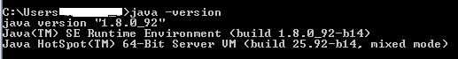
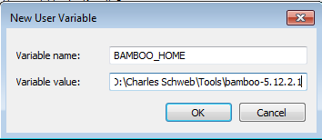
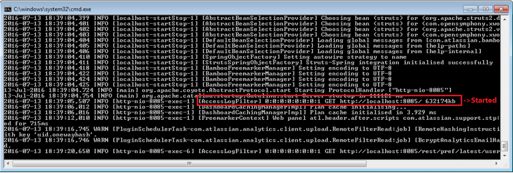
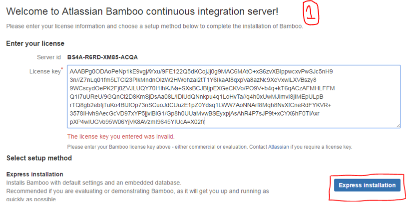
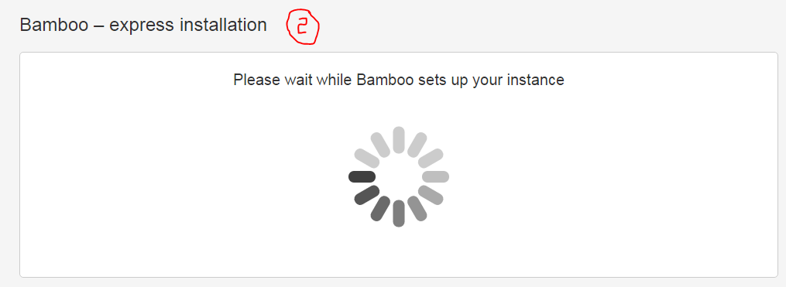
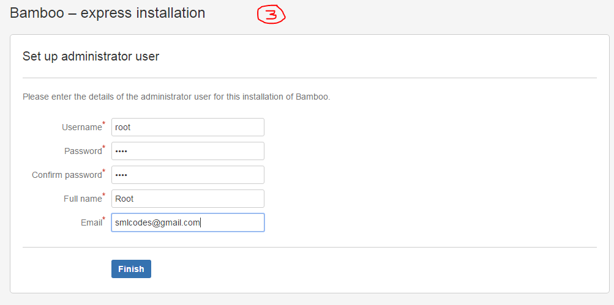

# DevOps -How to Install Bamboo atlassian on windows

In this article we will see "How to Install Bamboo atlassian on windows"

 

**Bamboo**  
Bamboo Server is the choice of *professional teams* for **continuous
integration, deployment, and delivery**

## **Features**

**Build**  
Focus on coding and count on Bamboo as your CI and build server! Create
multi-stage build plans, set up triggers to start builds upon commits, and
assign agents to your critical builds and deployments.

 

**Test**  
Testing is a key part of continuous integration. Run automated tests in Bamboo
to regress your products thoroughly with each change. Parallel automated tests
unleash the power of Agile Development and make catching bugs easier and faster.

 

**Deploy**  
Bamboo offers first-class support for the "delivery" aspect of continuous
delivery. Deployment projects automate the tedium right out of releasing into
each environment, while letting you control the flow with per-environment
permissions

<https://store.office.com/purchase.aspx?pm=US&pv=0&lc=en-001&ai=WA104315019&pt=MoeEndNode>


## **Installing Bamboo on Windows**


**1.Check your version of Java**
```dos
java -version
```


 

**2.Check JAVA_HOME is set or not**
```dos
echo %JAVA_HOME%
```


 

3.Download Bamboo from <https://www.atlassian.com/software/bamboo/download>

 

4.Extract and go to **bamboo-5.12.2.1\\atlassian-bamboo\\WEB-INF\\classes** and
edit **bamboo-init.properties**

 

5.Insert **bamboo.home**=**D:\\Tools\\bamboo-5.12.2.1** and save

 

6.Also we can **add bamboo Home environment variables**



 

7.Go to Root folder and start bamboo using **BambooConsole.bat**



 

**8.Open Bamboo using browser** 
<http://localhost:8085/>

 

**9.Get Licence from Bamboo**  







 

**10.Finally it shows the Dashboard !!!**


