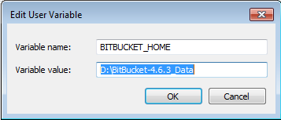
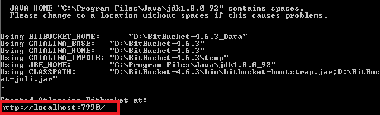
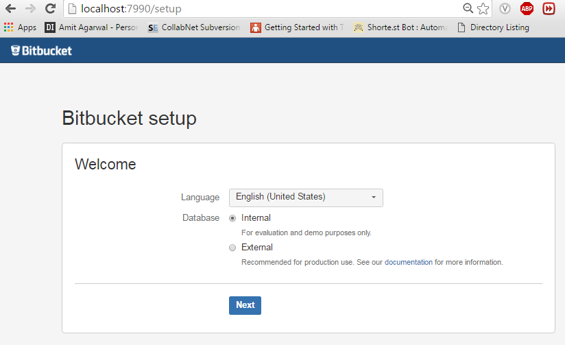
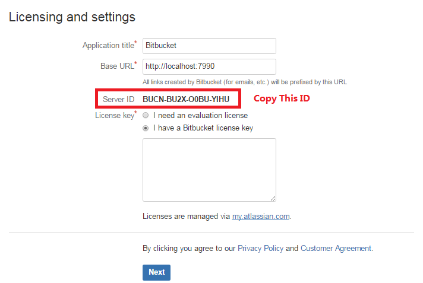
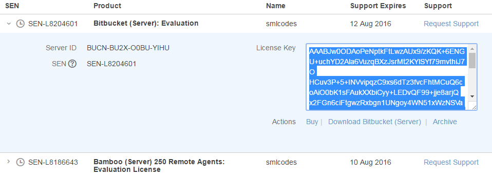
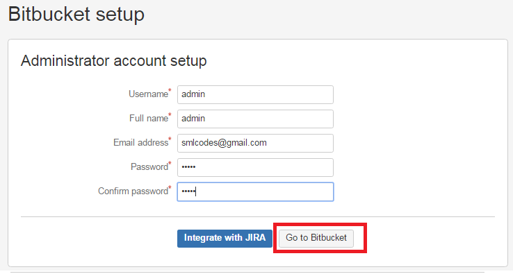
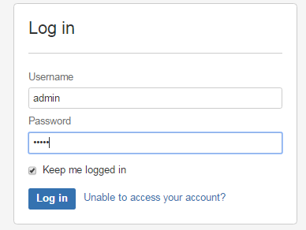

# DevOps -How to Install BitBucket on Windows

**Bit Bucket**  
The Repository solution for professional teams

 

## **Features**

**Pull requests**  
Pull requests facilitate code reviews, resulting in higher quality code and an
opportunity to share knowledge amongst your team.

 

**Branch permissions**  
Branch permissions provide granular access control for your team, ensuring the
right people can make the right changes to your code

 

**Inline discussions**  
Collaborate right in your code with inline comments, threaded conversations and
mentions

 

## **Install BitBucket on Windows**


**1.Check Java Version**
```dos
java –version
```
 

**2.Check GIT Version**
```dos
git –version
```


 

**3.Check Perl Version (strawberry-perl Recommended)**
```dos
perl --version
```


 

**4.Download BitBucket ZIP** from
<https://www.atlassian.com/software/bitbucket/download-archives>

 

**5.Extract ZIP**. Make sure you only extracting & you only using the server.

 

**6.Create a new Empty Directory** for storing Bit Bucket Data (Ex:
**D:\\BitBucket-4.6.3_Data**). **This path MUST NOT be in the Bitbucket Server
application directory.**

 

**7.Add Created Directory** as **BITBUCKET_HOME** in Environment variables
.Don’t put **semicolon;** at the end



 

**8**.Go to **bitbucket-4.6.3\\bin** and create new Folder called “**shared**”
(all small)

 

**9**.Go to **bitbucket-4.6.3\\conf** copy **server.xml** to **bin\\shared**
folder(**from 5.x. on-words this is not required** )

 

**10.Run D:\\BitBucket-4.6.3\\bin\>start-bitbucket.bat** from command prompt.



**Port 7990**: Bitbucket runs on port 7990 by default. If this port is already
in use, see [Changing the port that Bitbucket Server listens
on](https://confluence.atlassian.com/bitbucketserver/changing-the-port-that-bitbucket-server-listens-on-776640049.html)
for more guidance on changing this.

**Ports 7992 and 7993**: Bitbucket Server's bundled Elasticsearch instance,
which is required for search functionality, requires ports 7992 and 7993 be
available. This is not configurable, so ensure these ports are available.

 

**11.Server will start**. Go to <http://localhost:7990/>** **from Browser

 

**12.It will start the Setup**



 


13.It will show the **Server Id** Copy this  


 

14.Go to <https://my.atlassian.com/product> login to your account, New
Evolution License on the top and choose BitBucket Sever as Product



 

**15.Paste the Server id** and **Get License** and paste it in our setup .Click
next Provide credentials 



 

**16.BitBucket Installation Completed, Please Login!!**  




 
