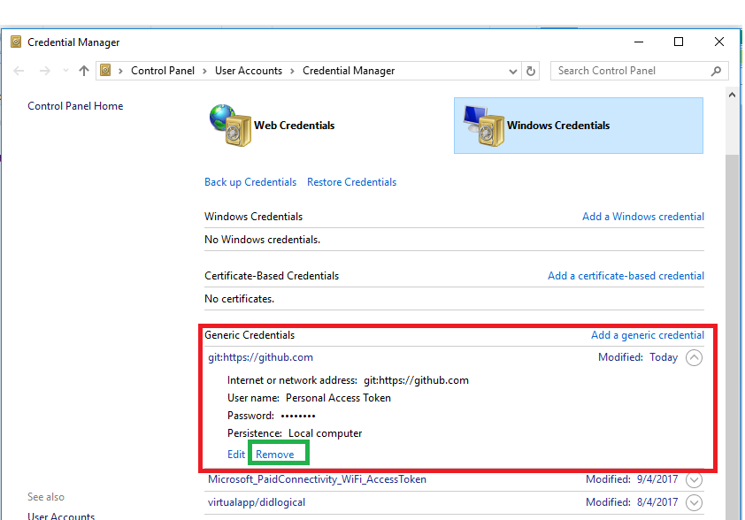
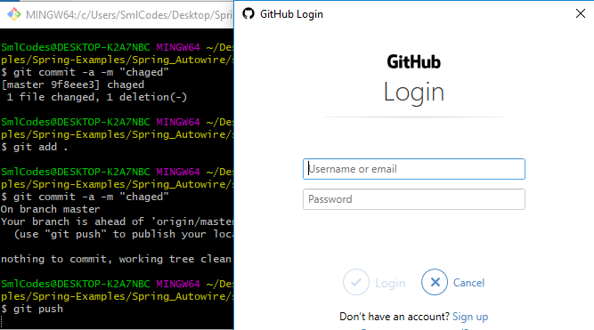

# Github -How to remove github credentials from git

Now, We will see **How to remove github credentials from git**


If we are committing our changes & push into github, we may face this type of
issue like,
```dos
$ git push
remote: Permission to SomeRepo.git denied to Username.
fatal: unable to access 'https://github.com/smlcodes/SomeRepo.git/': 
The requested URL returned error: 403
```

This is because of some other credentials already stored. git is trying access
the repository with those credencials.

<br>

so we are getting above error. To resolve this follow below steps.
-   Go to **Control Panel -\> Credential Manager -\> Generic
    Credentials.** or Go to Credential Manager


-   Go to Windows Credentials

-   Remove the Github entries under Generic Credentials  
    


-   Try connecting again. This time, it should prompt you for the correct
    username and password.

    

