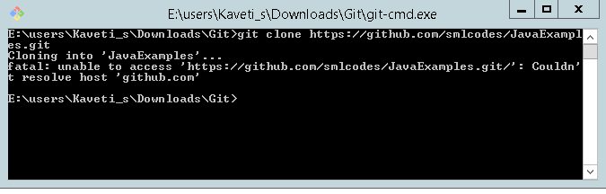

# Git -How to solve Git “could not resolve proxy” Error


Some times When we try to clone from git url , for example I want to clone this
url <https://github.com/smlcodes/JSPMaven.git>


It shows below error

```dos
Cloning into 'd:/smlcodes/repo
error: Couldn't resolve proxy '(null)' while accessing https://github.com/smlcodes/JSPMaven.git
fatal: HTTP request failed
```


 

## To solve this type of issue

1.Open GIT Bash & Run below command
```dos
git config --global --unset http.proxy
```
 

2.Check the environment variables with :
```dos
$echo $http_proxy
$echo $https_proxy
$echo $HTTPS_PROXY
$echo $HTTP_PROXY
```


If any of these environment variables are set then unset them by just using
**`http_proxy=`** then enter will unset those using below command
```dos
git config --global --unset http.proxy
git config --global --unset https.proxy
```

 
