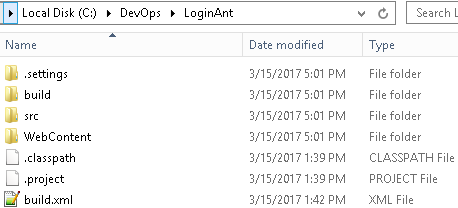
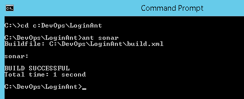

# **SonarQube Ant Project Configuration**


1.Install & Configure [apache ant](http://ant.apache.org/bindownload.cgi) on
your local system


2.[Download](https://mvnrepository.com/artifact/org.codehaus.sonar-plugins/sonar-ant-task/2.1)
**Sonar-ant-task.jar** and place the jar file in **apache-ant-1.10.0\\lib**
folder


3.Chose the Java ant Project for Analyzing Source Code. Ex: **LoginAnt** as
below




4.Open **Build.xml** & Configure sonar details as below
```xml
<target name="sonar">
    <taskdef uri="antlib:org.sonar.ant" resource="org/sonar/ant/antlib.xml">        
        <!-- Update the following line, or put the "sonar-ant-task-*.jar" file in your "$HOME/.ant/lib" folder -->        
        <classpath  path="<Path of sonar-ant-task-1.3.jar>" />    
    </taskdef>    
    <property name="sonar.jdbc.username" value="sonar" />
    <property name="sonar.jdbc.password" value="sonar" />
    <property name="sonar.host.url" value="http://localhost:9000" />
<!-- Define the SonarQube project properties -->
    <property name="sonar.projectKey" value="<PackageName>" /> 
    <property name="sonar.projectName" value="<ProjectName>" />
    <property name="sonar.projectVersion" value="1.0" />
    <property name="sonar.language" value="java" />   
    <property name="sonar.binaries" value="<Path of sonar-3.7.1/lib" /> 
    <property name="sonar.sources" value="<Path of Java Source file>" />
    <property name="sonar.projectBaseDir" value="<Path of Project Directory>" />
<!-- Define the SonarQube target -->
<!-- Execute Sonar -->    
<sonar:sonar />
</target>
```


5.Run SonarQube by Starting
**C:\\DevOps\\sonarqube\\bin\\windows-x86-64\\StartSonar.bat**


6.Open SonarQube Dashboard on [http://localhost:9000](http://localhost:9000/)


7.Navigate to Project root directory/build directory & run below command

**ant sonar**




8.Now the complete SONAR Report will be displayed on
[http://localhost:9000](http://localhost:9000/)


