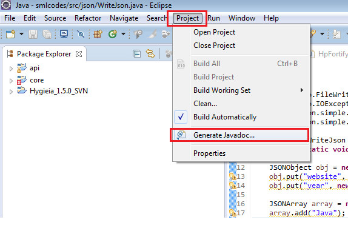
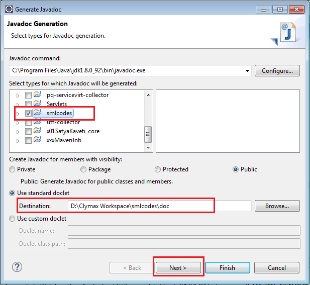
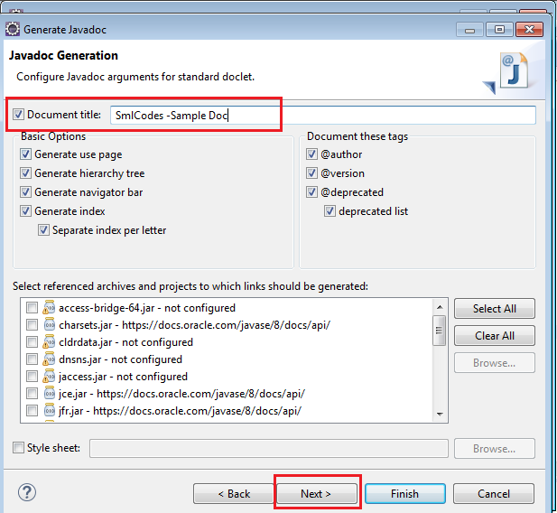
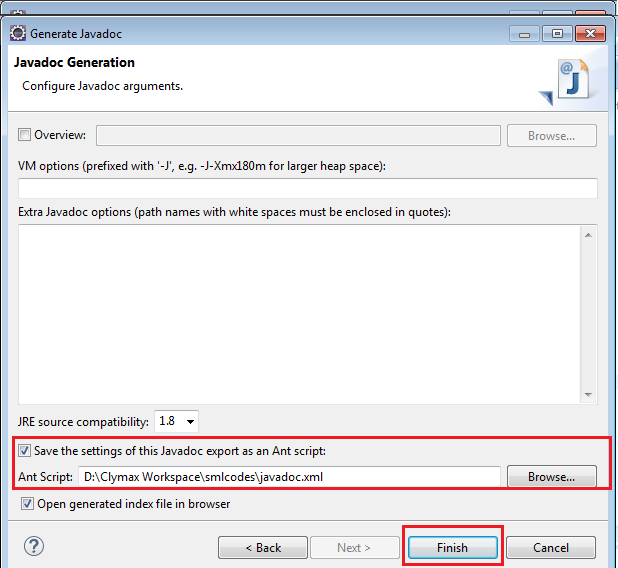
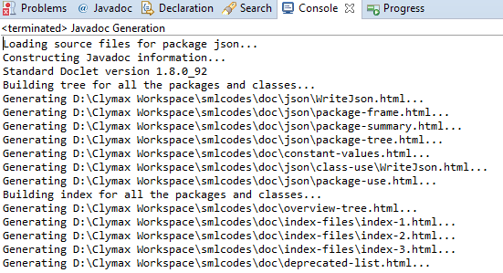
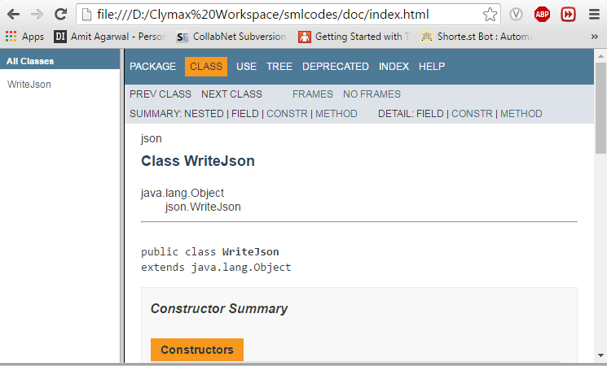

# Java -How to Generate javadoc in Eclipse IDE

In Java programming, we can utilize the **javadoc** tool for producing API
documentation from comments in the source code (Javadoc comments). **Eclipse IDE
can make document using Javadoc Generator wizard**. below are the steps to
generate JavaDoc using eclipse

 

**1.go to Top Menu --\> Project --\> Generate Javadoc**

 

2.Select the **Project** and Choose the **Location** where you want to save the
document

 

3.Give the **Title** of the document

 

4.  **Pick Location** of exported javadoc in the form of **Ant script
XML(Optional)** 

 

5.Eclipse will run the Javadoc generator on clicking Finish

 

**6.go to the location of the javadoc which you gave before.**

