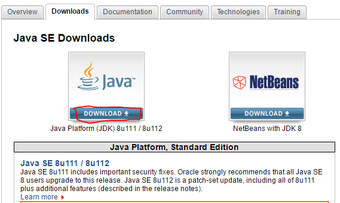
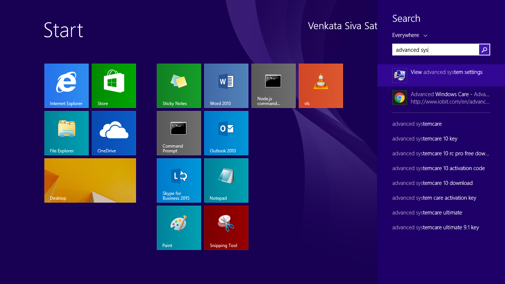
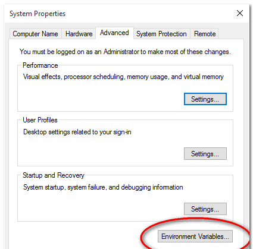
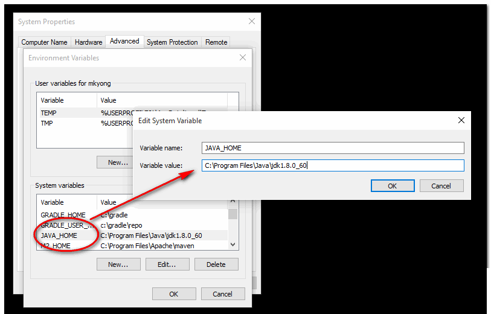
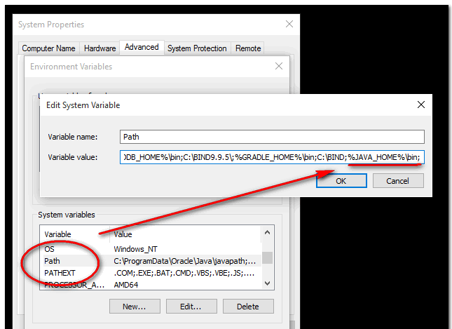
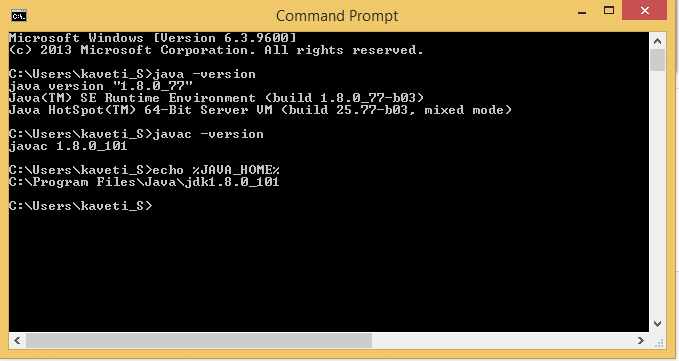

# Java -How to install java and set java PATH variable in windows 7/8/10

**Downloading the Java Software Development Kit**

[](http://localhost:6666/sml/wp-content/uploads/2016/12/Install_java_inwindows_smlcodes-1.png)1.Go
to Oracle official website choose the version by following link
<http://www.oracle.com/technetwork/java/javase/downloads/index.html>



 

2.Double-click the installer file you downloaded

3.it will ask for PATH to be install. Give the location it will completes the
Installation

 

## **How to set java_home on Windows 7/8/10?**

1.Go to advanced system settings



[](http://localhost:6666/sml/wp-content/uploads/2016/12/Install_java_inwindows_smlcodes-2.png)

 

2.Go to advanced tab & then environment variables


 

3.In System variables, add a new **JAVA_HOME** variable and point it to the JDK
installed folder.



 
Don’t include the \\bin folder, just the JDK path. For example
```dos
Correct – C:\Program Files\Java\jdk1.8.0_60
Wrong – C:\Program Files\Java\jdk1.8.0_60\bin
```


 

4.In System variables, find **`PATH`**, clicks edit and append this
**`%JAVA_HOME%\bin`** to the end.



`JAVA_HOME\bin` in PATH make the Java’s commands are accessible from everywhere.

 

5.Open Command prompt test PATH is set correctly or not by giving `java –version`
command


