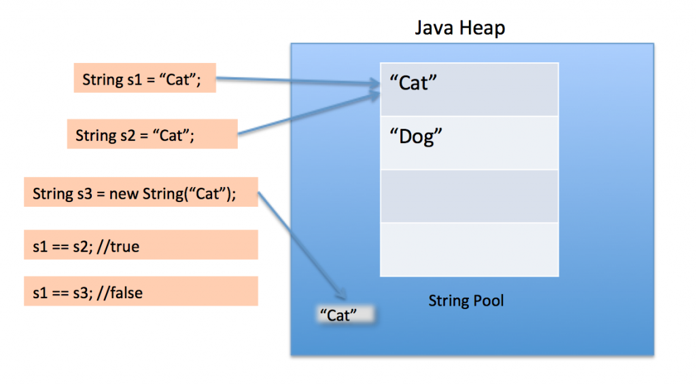
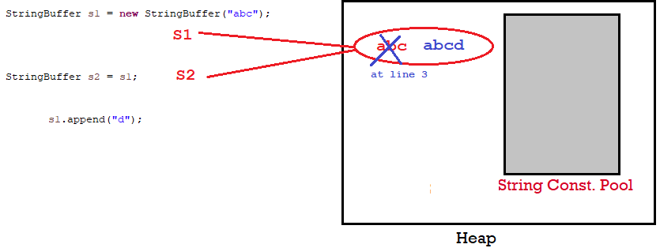
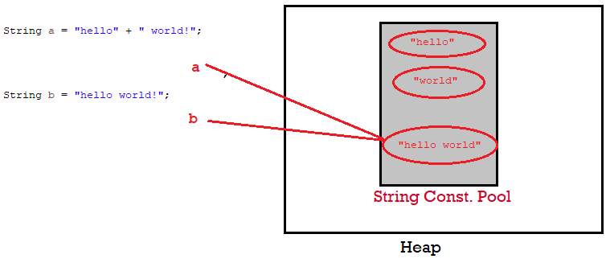

### Case 1 : literal VS Object
```java
public class StringDemo {
public static void main(String[] args) {
	String s1 = "Cat";
	String s2 = "Cat";
	
	String s3 = new String("Cat");
	
	System.out.println(s1==s2); //true
	System.out.println(s1==s3); //false
}
}
```




To be clear what this code is making is on the first line of code it will create
the String s1 = "Cat"and store this on the String pool, and on the second line
of code it will create the String s2 and reference to "Cat" because this already
exist on the String pool. But line 3 will create a new reference of this string
no matter if this already exist.

 

### Case 2:
```java
String s1 = "abc";
	String s2 = s1;
	       s1 += "d";
	System.out.println(s1+", "+s2+", "+(s1==s2));
-------------------------------
abcd, abc, false
```


### Case 3 :
```java
StringBuffer s1 = new StringBuffer("abc");
StringBuffer s2 = s1;
       s1.append("d");
System.out.println(s1+", "+s2+", "+(s1==s2));
-----------------------------------------
 abcd, abcd, true
```




StringBuffer operates on Same Object .

 

### Case 4:
```java
String a = "hello" + " world!";
String b = "hello world!";
System.out.println(a==b); //TRUE
```




When concatenating two string literals "a" + "b" the jvm joins the two values
and then check the string pool, then it realizes the value already exists in the
pool so it just simply assign this reference to the String.

 

### Case 5: (+= uses StringBuilder Inside to Create & Append String)
```java
String a = "Bye";
       a += " bye!";
String b = "Bye bye!";
System.out.println(a == b);//FALSE
```


Your example C is kind of different tho, because you're using the += operator
which when compiled to bytecode it uses StringBuilder to concatenate the
strings, so this creates a new instance of StringBuilder Object thus pointing to
a different reference. (string pool vs Object)

Oracle Says, To improve performance, instead of using string concatenation,
use StringBuffer.append().String objects are immutable

 

### Performance

It's better to use StringBuilder (it's an unsynchronized version; when do you
build strings in parallel?) these days, in almost every case, but here's what
happens:

When you use + with two strings, it compiles code like this:
```java
String third = first + second;
```

 

To something like this
```java
StringBuilder builder = new StringBuilder( first );
builder.append( second );
third = builder.toString();
```


 

for example, you might be using many different appending statements, or a loop
like this:
```java
for( String str : strings ) {
  out += str;
}
```


In this case, a new StringBuilder instance, and a new String (the new value
of out - Strings are immutable) is required in each iteration. This is very
wasteful. Replacing this with a single StringBuilder means you can just produce
a single String and not fill up the heap with Strings you don't care about

 

References 

<https://stackoverflow.com/questions/44037516/how-java-string-pool-works-when-string-concatenation>

<https://stackoverflow.com/questions/65668/why-to-use-stringbuffer-in-java-instead-of-the-string-concatenation-operator>

 

 
