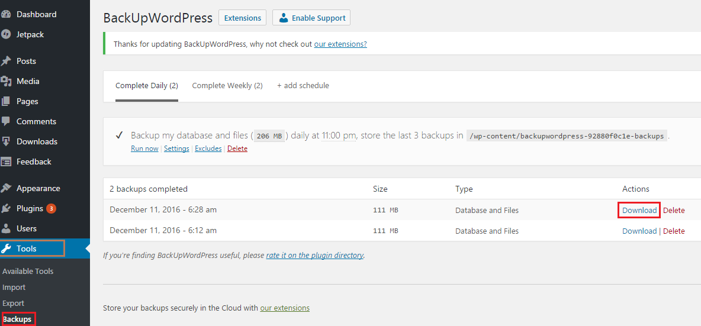
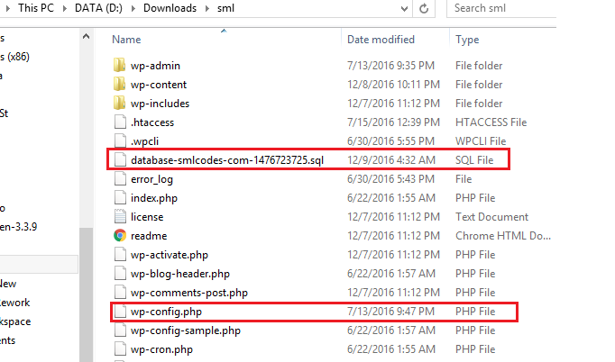
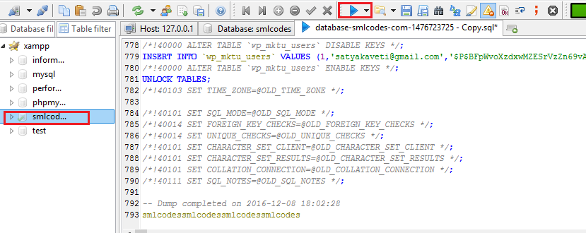

Restore backupwordpress -How to restore from backupwordpress plugin

**How to restore from backupwordpress plugin**

 

1.  Go to your WordPress page download latest backup

    

 

1.  It will downloads a Zip file Extract it. We have to edit wp-config.php &
    .sql files

    

 

1.  Open wp-config.php , change the mysql configurations like dbname, username ,
    password etc

define('DB_NAME', 'smlcodes');

/\*\* MySQL database username \*/

define('DB_USER', 'root');

/\*\* MySQL database password \*/

define('DB_PASSWORD', 'root');

/\*\* MySQL hostname \*/

define('DB_HOST', 'localhost:3336');

/\*\* Database Charset to use in creating database tables. \*/

define('DB_CHARSET', 'utf8');

/\*\* The Database Collate type. Don't change this if in doubt. \*/

define('DB_COLLATE', '');

\*make sure that new database must be exist

 

1.  Open database-xxx.sql file and **find & replace old domain name to new
    domain name** in case if your changing domain name

 

Load the .sql file using any MySQL tool like phpmyAdmin/HeildSql execute all
    sql quires to mentioned data base

 

1.Open domainname.com/wp-admin/install.php in your browser. It will take you
    through the process to set up a **wp-config.php** file with your database
    connection details.

If for some reason this doesn’t work, don’t worry. It doesn’t work on all web
hosts. Open up **wp-config-sample.php** with a text editor like WordPad or
similar and fill in your database connection details.

Save the file as **wp-config.php and upload it.**
