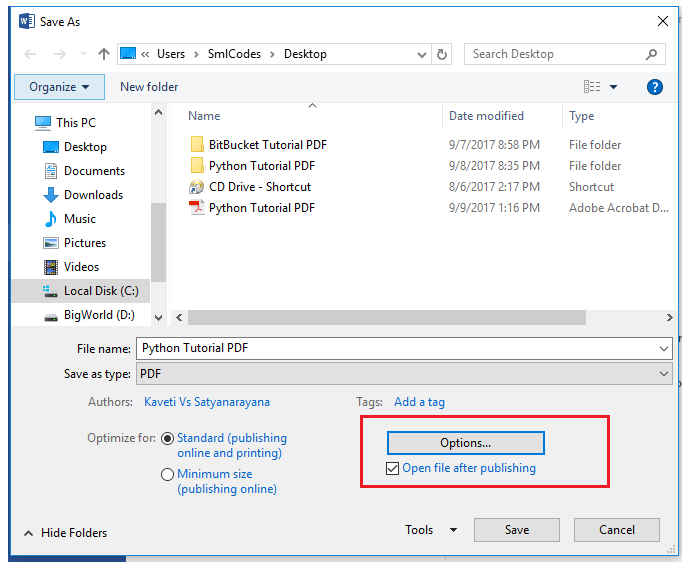
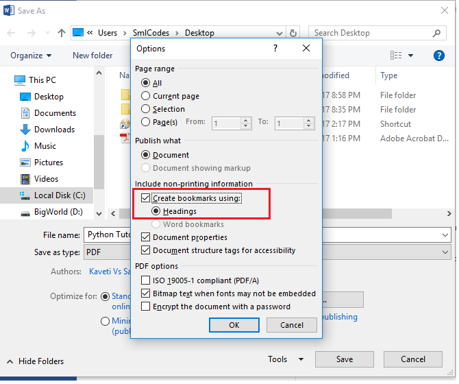

How to create book from Word to PDF including bookmarks

This is easy to do in Word 2007 and 2010. You don't need any third party tools.

In Word 2007, you need the Microsoft PDF Add-In to allow you to save as PDF.
Download it
from[here](http://www.microsoft.com/downloads/details.aspx?FamilyID=f1fc413c-6d89-4f15-991b-63b07ba5f2e5&displaylang=en).
In Word 2010 the Add-In is unnecessary.

1.Open your document

2.Mark the headings you want using the standard Heading 1, Heading 2, etc.
styles.

3.Select **Save As \> PDF**

4.The first time you do this you have to set an option **\>ClickOptions**

5.Check the**Create Bookmarks using headings**check box.

6.Click OK & Publish
