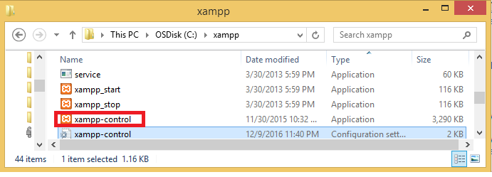
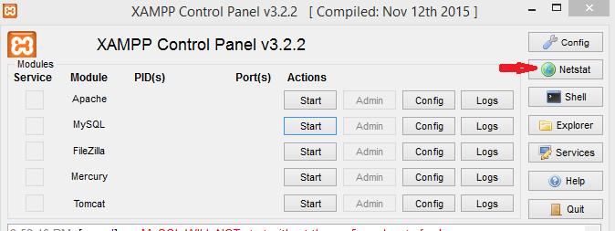
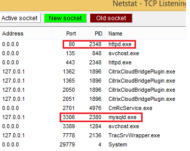

# XAMPP -How to Change Apache port number in XAMPP


Follow below steps to Change Apache port number

 

### **1. Choose a free port number**

-   **goto xampp root folder , run xampp-control application**




-   Click on **Netstat button** it will shows the port numbers which are
    currently in use by some other applications






### **2. Edit "http.conf"file**

-   To change port numbers we have to edit **"http.conf" file.**

-   This file should be found in **C:\\xampp\\apache\\conf** on Windows or in
    **bin/apache** for Linux**.**

-   Open file and search for below lines

    ```dos
                      Listen 80
                      ServerName localhost:80
    ```


-   Replace the port no 80 by a free port number, for example 8888
    ```dos
                     Listen 8888
                     ServerName localhost:8888
    ```


### **3. Port 443 in use by xampp error edit “http-ssl.conf” file**

-   This file should be found in **C:\\xampp\\apache\\conf\\extra**

-   Locate the following lines:

    ```dos
    Listen 443
    
    <VirtualHost _default_:443>
    
    ServerName localhost:443
    ```


-   Replace them by with a other port number (4433 for this example) :
    ```dos
    Listen 4433
    
    <VirtualHost _default_:4433>
    
    ServerName localhost:4433
    ```


-   **Sava the file & Restart Xampp Apache server**
