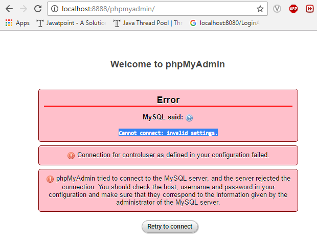
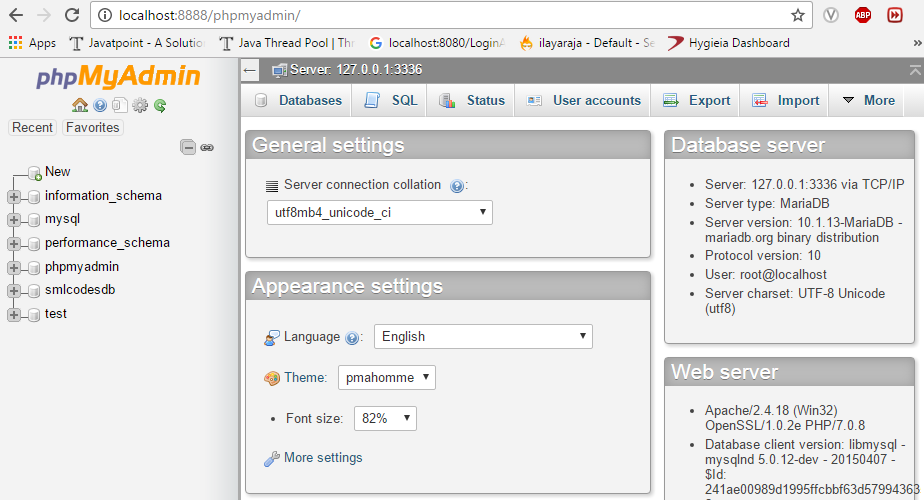

# XAMPP -How to Solve XAMPP phpMyAdmin -Cannot connect: invalid settings Error

if we trying to connect with phpMyAdmin some times it will throws `Access Denied
: Cannot connect: invalid settings` Error as below




## **To Solve this issue follow below steps**

1.Go to Xampp phhpMyAdmin root folder. for 
`ex :C:\xampp\phpMyAdmin`

 

2.Change following lines in config.inc.php file
```dos
/* Authentication type and info */
$cfg['Servers'][$i]['auth_type'] = 'config';
$cfg['Servers'][$i]['user'] = 'root';
$cfg['Servers'][$i]['password'] = '';
$cfg['Servers'][$i]['extension'] = 'mysqli';
$cfg['Servers'][$i]['AllowNoPassword'] = true;
$cfg['Lang'] = '';
```

 

3.Change ['user'] = 'root', ['password'] = ''; as per your mysql username &
password values. In my case i changed as below
```dos
/* Authentication type and info */
$cfg['Servers'][$i]['auth_type'] = 'config';
$cfg['Servers'][$i]['user'] = 'root';
$cfg['Servers'][$i]['password'] = 'root';
$cfg['Servers'][$i]['extension'] = 'mysqli';
$cfg['Servers'][$i]['AllowNoPassword'] = true;
$cfg['Lang'] = '';
```


 

4.Change new MySQL port number, if you changed MySQL port number from
default(3306) to other for example 3336 in  config.inc.php
```dos
/* Bind to the localhost ipv4 address and tcp */
$cfg['Servers'][$i]['host'] = '127.0.0.1:3336';
$cfg['Servers'][$i]['connect_type'] = 'tcp';
```

 

5.Restart XAMPP Apache server once. open Url 
```dos
http://localhost:8888/phpmyadmin/
```



