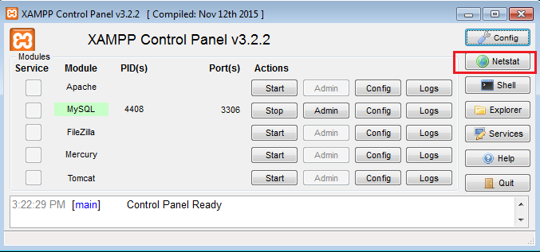
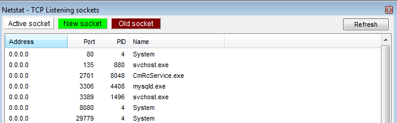
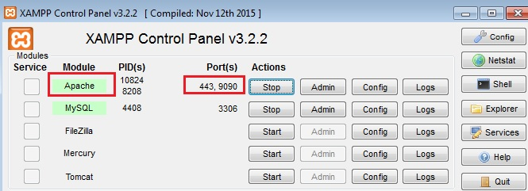

# XAMPP -How to change XAMPP apache server port number

**What :  change XAMPP port number**  
So many people find difficult while changing the port numbers for servers. Here
we learn about How change port number of XAMPP apache server

 

**Why**  
Why we need to Change? Because if your may contains number of servers, **each
server will RUN on unique Port number. Sometimes PORT numbers may conflict with
other server’s port number**.in that situation we have to change port numbers of
conflicted server.

 

## **How**

**Step1:  Check the Port number you want to use is Free or Not**

a.Open **xampp** Control panel, on the right side to click on Net stat



 

b.It will shows the No.of Port are in Use




 

**Step 2. Edit Port Number in “http.config” file (for some versions it is
“httpd.conf”)**


1.Go to XAMPP Root directory, then apache folder , open **http.conf** file.for
mine File location is  
```dos
C:\xampp\apache\conf\http.conf
```


 

2 . Open **http.conf** file and **search for below two terms and replace 80 to
new port number.**

*for me it is 9090*


| **Search**              | **Replace**               |
|-------------------------|---------------------------|
| Listen 80               | Listen 9090               |
| ServerName localhost:80 | ServerName localhost:9090 |

Save the file and Check the URL (<http://localhost:9090/>)

If your problem is not yet resolved !!??, then follow Step 3 it will work for
sure’

 

**Step 3. Edit Port Number in “http-ssl.conf”**


1 . Go to **C:\\xampp\\apache\\conf\\extra**, open **httpd-ssl.conf** with any
text editor like notepad

2 . Find and replace below terms by changing new port number Ex.9091 in that
file

| **Find**                                                     | **Replace**                                                     |
|--------------------------------------------------------------|-----------------------------------------------------------------|
| Listen 443                                                   | Listen 9090                                                     |
| \<VirtualHost \_default_:443\>                               | \<VirtualHost \_default_:9091\>                                 |
| ServerName www.example.com:443 (or) ServerName localhost:433 | ServerName www.example.com:9091 (or)  ServerName localhost:9091 |


3.Save the file.

4.Restart the Apache Server. Check the URL <http://localhost:9091/>


