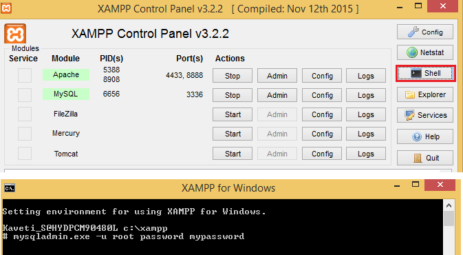

# XAMPP -How to change the root password for MySQL in XAMPP?


In Older versions of XAMPP we can change root password by using
<http://localhost/security/ >**(**<http://localhost:8888/security/>**)
directly.**

For newer versions the above given url is not working.

For newer versions open XAMPP Shell & run below command to change root password



```dos
mysqladmin.exe -u root password mypassword
```
This sets the root password to **‘mypassword’**

 

To connect with **MySQL Command-line** from **windows Command-line**

Go to **xampp\\mysql\\bin** & run below command, it will asks for account
password enter it
```dos
mysql -u root --password
```


 
