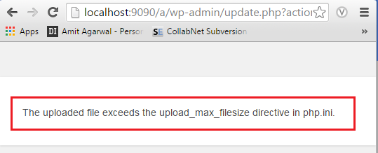

# The uploaded file exceeds the upload_max_filesize directive in php.ini


**What**

The uploaded file exceeds the **upload_max_filesize** directive in php.ini.




**Why?**

If you are uploading WordPress theme in locally hosted WordPress site you may
face this problem


**How?**

-   Go to XAMPP PHP location for
    ```xml
    C:\\xampp\\php
    ```

-   Open php.ini file in any text editor

-   Find “upload_max_filesize” in that file

-   Change upload file size to 100MB or based on your requirement.
    ```xml
    upload_max_filesize=100M
    ```


-   Save the File. Restart Apache server


