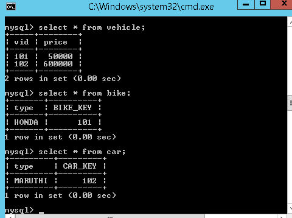
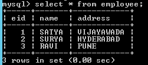
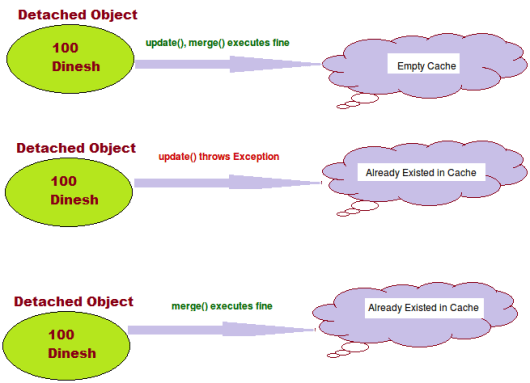

Hibernate
=========
```java
EmployeeBo.java
public class EmployeeBo {
	 private int eid;
	 private String name;
	 private String address;	 
 	//setters / getters
}
```

```xml
//Example: EmployeeBo.hbm.xml
<hibernate-mapping>
	<class name="bo.EmployeeBo" table="employee">
 <id name="eid" column="eid">
 	<generator class="assigned" />
 </id>
 <property name="name" column="name" />
 <property name="address" column="address" />
	</class>
</hibernate-mapping>

//hibernate.cfg.xml
  <? xml version='1.0' encoding='utf-8'?>
<! DOCTYPE hibernate-configuration PUBLIC
        "-//Hibernate/Hibernate Configuration DTD 3.0//EN"
        "http://hibernate.sourceforge.net/hibernate-configuration-3.0.dtd">

<hibernate-configuration>
    <session-factory>
        <! -- Database connection settings -->
        <property name="connection.driver_class">com.mysql.jdbc.Driver</property>
        <property name="connection.url">jdbc:mysql://localhost:3306/mydb</property>
        <property name="connection.username">root</property>
        <property name="connection.password">root</property>        
        <property name="connection.pool_size">1</property>
        
        <!-- Hibernate Properties -->
        <property name="dialect">org.hibernate.dialect.MySQLDialect</property>
        <property name="show_sql">true</property>
            <property name="hbm2ddl.auto">validate</property>  
      
<!-- Mapping file name(s)-->
        <mapping resource="res/employee.hbm.xml"/>
    </session-factory>
</hibernate-configuration>
```

```java
public class EmployeeSave {
	public static void main(String[] args) {
 Configuration cfg = new Configuration();
 cfg.configure("hibernate.cfg.xml");
 
 SessionFactory factory = cfg.buildSessionFactory();
 Session session = factory.openSession();
 
 EmployeeBo bo = new EmployeeBo();
 bo.setEid(5);
 bo.setName("DILEEP");
 bo.setAddress("BANGLORE");

 Transaction tx = session.beginTransaction();
 session.save(bo);
 System.out.println("Employee Data saved successfully.....!!");
 tx.commit();
 session.close();
 factory.close();
	}
}
```


## Session class methods
```java
Select
    Object	get(Class , Serializable id)
    Object	load(Class, Serializable id)

Insert
    Serializable	save(Object object) 
    void persist(Object object) 
    void saveOrUpdate(Object object) 

Update
    Object	merge(Object object) 
    void	update(Object object) 

Delete
    void	delete(Object object) 


Clear
    void	evict(Object object) :   Remove this instance from the session cache.
    void	clear()   :   Completely clear the session.


Other
boolean	isDirty() :          Does this session contain any changes which must be synchronized with the database? In other words, would any DML operations be executed if we flushed this session?

void	refresh(Object object) 
Re-read the state of the given instance from the underlying database.
```

### 1.Table per class hierarchy

```xml
Vehicle.hbm.xml
<hibernate-mapping>
  <class name="inheritance.Vehicle" table="vehicle">
	<id name="vid" column="vid"></id>
	<discriminator column="DISC" type="string"/>
	<property name="price" column="price"></property>
	
	<subclass name="inheritance.Bike" discriminator-value="BIKE_DISC">
 <property name="biketype" column="biketype"></property>	
	</subclass> 
	
<subclass name="inheritance.Car" discriminator-value="CAR_DISC">
 <property name="cartype" column="cartype"></property>	
	</subclass>  
  </class>
</hibernate-mapping>
```


### 2. Table per sub-class hierarchy

**Vehicle.hbm.xml**

```xml
<hibernate-mapping>
	<class name="inheritance.Vehicle" table="vehicle">
	<id name="vid" column="vid"></id> 
	<property name="price" column="price"></property>
	
	<joined-subclass name="inheritance.Bike" table="bike">
 <key column="BIKE_KEY" />
 <property name="biketype" column="type"></property>	
	</joined-subclass>
 
	 <joined-subclass name="inheritance.Car" table="car">
 <key column="CAR_KEY" />
 <property name="cartype" column="type"></property>	
	</joined-subclass>	 	 
	</class>
</hibernate-mapping>
```




### 3.Table per concrete class hierarchy

**Vehicle.hbm.xml**

```xml
<hibernate-mapping>
	<class name="inheritance.Vehicle" table="vehicle">
	<id name="vid" column="vid"></id> 
	<property name="price" column="price"></property>
	
	<union-subclass name="inheritance.Bike" table="bike"> 
 <property name="biketype" column="type"></property>	
	</union-subclass>
 
	 <union-subclass name="inheritance.Car" table="car">  
 <property name="cartype" column="type"></property>	
	</union-subclass>	 	 
	</class>
</hibernate-mapping>
```


If we want to select a **Complete Object** from the database, we use POJO class
reference in place of `*` while constructing the query
```java
// In SQL
sql> select * from Employee
Note: Employee is the table name.

// In HQL
hql> select s from EmployeeBo s
[ or ]
from EmployeeBo s
Note: here s is the reference of EmployeeBo
```


If we want to load the **Partial Object** from the database that is only
selective properties of an objects, then we need to replace column names with
POJO class variable names
```java
// In SQL
sql> select eid,name,address from Employee
Note: eid,name,address are the columns of Employee the table.

// In HQL
hql> select s.eid,s.name,s.address from EmployeeBo s
```


## What are advantages of Hibernate?

-   Lazy Loading

-   Caching

-   You do not need to maintain JDBC code , Hibernate takes care of it.

-   You need to write less code

-   It provides high level object oriented API

## What is caching?

Anything you can do to minimize traffic between a database and an application
server is probably a good thing. In theory, an application ought to be able to
maintain a cache containing data already loaded from the database, and only hit
the database when information has to be updated. When the database is hit, the
changes may invalidate the cache

## First Level Cache & Second Level Cache?

Every fresh session having its own **cache memory**, **Caching is a mechanism
for storing the loaded objects into a cache memory**. 

The advantage of cache mechanism is, whenever again we want to load the same
object from the database then instead of hitting the database once again, it
loads from the local cache memory only**, so that the no. of round trips between
an application and a database server got decreased**.  It means caching
mechanism increases the performance of the application.

In hibernate we have two levels of caching

1.  **First Level Cache** (Session Cache)

2.  **Second Level Cache** (Session Factory Cache/ JVM Level Cache)

### `1.First Level Cache`

-   By default, for each hibernate application, **the first level cache is
    automatically enabled. `We can’t Enable/Disable first level cache`**

-   the first level cache is associated with the **session** object and
    **scope** of the cache **is limited to one session only**

-   When we load an object for the first time from the database then the object
    will be loaded from the database and the loaded object will be stored in the
    cache memory maintained by that session object

-   If we load the same object once again, with in the same session, then the
    object will be loaded from the local cache memory not from the database

-   If we load the same object by opening other session, then again the object
    will load from the database and the loaded object will be stored in the
    cache memory maintained by this new session

**Example:**

```java
Session session = factory.openSession();
Object ob1 = session.get(Actor.class, new Integer(101)); //1
 
Object ob2 = session.get(Actor.class, new Integer(101));//2
Object ob3 = session.get(Actor.class, new Integer(101));//3
session.close();//4
 
Session ses2 = factory.openSession();
Object ob5 = ses2.get(Actor.class, new Integer(101));//5
```


1, We are loaded object with id 101, now it will load the object from the
database only as its the first time, and keeps this object in the session cache

2,3 i tried to load the same object 2 times, but here the object will be loaded
from the stored cache only not from the database, as we are in the same session

4, we close the first session, so the cache memory related this session also
will be destroyed

5, again i created one new session and loaded the same object with id 101, but
this time hibernate will loads the object from the database

if we want to remove the objects that are stored in the cache memory, then we
need to call either **evict() or clear()** methods

### `2.Second Level Cache`

Whenever we are loading any object from the database, then hibernate verify
whether that object is available in the local cache(**first level
cache**) memory of that particular session, if not available then hibernate
verify whether the object is available in global cache(**second level cache)**,
if not available then hibernate will hit the database and loads the object from
there, and then **first stores in the local cache of the session , then in the
global cache**

**SessionFactory** holds the second level cache data. It is global for all the
session objects and not enabled by default.

Different vendors have provided the implementation of Second Level Cache

1.  **EH Cache**

2.  **OS Cache**

3.  **Swarm Cache**

4.  **JBoss Cache**

To enable second level cache in the hibernate, then the following **3** changes
are required

1.**Add provider class** in hibernate configuration file
```java
<property name="hibernate.cache.provider_class">
    org.hibernate.cache.EhCacheProvider
</property>
```

2.**Configure cache element** for a class in hibernate mapping file
```java
<cache usage="read-only" />
```

-   **read-only:** caching will work for read only operation.

-   **nonstrict-read-write:** caching will work for read and write but one at a
    time.

-   **read-write:** caching will work for read and write, can be used
    simultaneously.

-   **transactional:** caching will work for transaction.

3.create xml file called **ehcache.xml** and place where you have mapping and
    configuration xml’s

**Example:**
```java
public class Employee {
	private int eid;
	private String name;
	private String address;
//Setters & Getteers
}

Employee.hbm.xml
<hibernate-mapping package="cache">
	<class name="Employee" table="employee">
 <cache usage="read-only" />
 <id name="eid" column="eid">
 	<generator class="native"></generator>
 </id>
 <property name="name"></property>
 <property name="address"></property>
	</class>
</hibernate-mapping>

ehcache.xml
<?xml version="1.0"?>
<ehcache>
	<defaultCache maxElementsInMemory="100" eternal="false"
 timeToIdleSeconds="120" timeToLiveSeconds="200" />
	<cache name="cache.Employee" maxElementsInMemory="100"
 eternal="false" timeToIdleSeconds="5" timeToLiveSeconds="200" />
</ehcache>  

hibernate.cfg.xml
<hibernate-configuration>
	<session-factory>
 <property> Driver Class, URL, Username, password, etc </property>
 <property name="cache.provider_class">org.hibernate.cache.EhCacheProvider</property>
 <property name="hibernate.cache.use_second_level_cache">true</property>
 <mapping resource="cache/employee.hbm.xml" /> 
	</session-factory>
</hibernate-configuration>

CacheDemo.java
package cache;

import org.hibernate.*;
import org.hibernate.cfg.*;
public class CacheDemo {

	public static void main(String[] args) { 
 
 //1.Load Configuration 
 Configuration cfg = new Configuration();
 cfg.configure("hibernate.cfg.xml");
 
 //2.Create Session
 SessionFactory sf = cfg.buildSessionFactory();
 Session session = sf.openSession(); 
 
 //3.Perform Operations
 Object ob = session.load(Employee.class, new Integer(1));
 Employee bo = (Employee) ob;
 
 System.out.println("SELECTED DATA\n ================");
 System.out.println("SNO : "+bo.getEid());
 System.out.println("NAME : "+bo.getName());
 System.out.println("ADDRESS : "+bo.getAddress());
	}
}
```




## What are some core interfaces of hibernate?

-   Configuration

-   SessionFactory

-   Session

-   Transaction

-   Query and Criteria interface

## Difference between get() vs load() method in Hibernate? (detailed answer) 
The key difference between get() and load() method is that

-   **load() will throw an exception** if an object with id passed to them is
    not found

-   **get() will
    return **[null](http://javarevisited.blogspot.com/2014/12/9-things-about-null-in-java.html)**.**

Another important difference is **that load can return proxy without hitting the
database** unless required (when you access any attribute other than id) but
get() always go to the database, so sometimes using load() can be faster than
the get() method.

It makes sense to use the load() method if you know the object exists but get()
method if you are not sure about object's existence.

| **Parameter**      | **get**                                                                 | **load**                                                             |
|--------------------|-------------------------------------------------------------------------|----------------------------------------------------------------------|
| Database retrieval | It always hits the database                                             | It does not hit database                                             |
| If null            | If it does not get the object with id, it returns null, null in databse | If it does get the object with id, it throws ObjectNotFound in Cache |
| Proxy              | It returns real object                                                  | It returns proxy object                                              |
| Use                | If you are not sure if object with id exists or not, you can use get    | If you are sure about existence of object, you can use load          |

## **What is the difference between save() and persist() method in Hibernate?**

-   **Serializable  Object save()** returns a Serializable object

-   **void persist()** method is void, so it doesn't return anything.


## What is the difference between and merge and update?
```java
Employee emp1 = new Employee();
 emp1.setEmpId(100);
 emp1.setEmpName("Dinesh");
 Session session1 = createNewHibernateSession();
 session1.saveOrUpdate(emp1);
 session1.close();
 //emp1 object in detached state now

 emp1.setEmpName("Dinesh Rajput");//Updated Name
 
      //Create session again
 Session session2 = createNewHibernateSession();
 Employee emp2 =(Employee)session2.get(Employee.class, 100);
 //emp2 object in persistent state with id 100

//below we try to make on detached object with id 100 to persistent state by using update method of hibernate
 session2.update(emp1);//It occurs the exception NonUniqueObjectException because emp2 object is having employee with same empid as 100 in Cache.Here cache is not Empty. See diageram. 

//to avoid this exception we are using merge like given below instead of session.update(emp1);

 session2.merge(emp1); //it merge the object state with emp2
 session2.update(emp1); //Now it will work with exception
```



**Update:**

-   Suppose we are dealing with any employee object in the same session then we
    should use update() or saveOrUpdate() method.

-   if you are sure that the session does not contains an already persistent
    instance with the same identifier,then use update to save the data in
    hibernate

**Merge:**

-   Suppose we are creating a session and load an employee object. Now object in
    session cache. If we close the session at this point and we edit state of
    object and tried to save using update() it will throw exception. To make
    object persistent we need to open another session. Now we load same object
    again in current session. So if we want to update present object with
    previous object changes we have to use merge() method. Merge method will
    merge changes of both states of object and will save in database.

-   if you want to save your modifications at any time with out knowing about
    the state of an session, then use merge() in hibernate.


## Different between cascade and inverse

Many Hibernate developers are confusing about the cascade option and inverse
keyword. In some ways. They really look quite similar at the beginning; both are
related with relationship.

However, there is no relationship between cascade and inverse, both are totally
different notions.

### 1.inverse

This is used to decide which side is the relationship owner to manage the
relationship (insert or update of the foreign key column).

Example

In this example, the relationship owner is belonging to stockDailyRecords
(inverse=true).
```xml
<!-- Stock.hbm.xml -->
<hibernate-mapping>
    <class name="Stock" table="stock">
    ...
    <set name="stockDailyRecords" table="stock_daily_record" inverse="true">
        <key>
            <column name="STOCK_ID" not-null="true" />
        </key>
        <one-to-many class="StockDailyRecord" />
    </set>
    ...
```


When you save or update the stock object
```java
session.save(stock);
session.update(stock);
```


Hibernate will only insert or update the STOCK table, no update on the foreign
key column. [More detail example
here…](http://www.mkyong.com/hibernate/inverse-true-example-and-explanation/)

### 2.cascade

In cascade, after one operation (save, update and delete) is done, it decide
whether it need to call other operations (save, update and delete) on another
entities which has relationship with each other.

Example

In this example, the cascade="save-update" is declare on stockDailyRecords.
```xml
<!-- Stock.hbm.xml -->
<hibernate-mapping>
    <class name="com.mkyong.common.Stock" table="stock" ...>
    ...
    <set name="stockDailyRecords" table="stock_daily_record" 
        cascade="save-update" inverse="true">
        <key>
            <column name="STOCK_ID" not-null="true" />
        </key>
        <one-to-many class="com.mkyong.common.StockDailyRecord" />
    </set>
    ...
Copy
```


When you save or update the stock object
```xml
session.save(stock);
session.update(stock);
```


It will inserted or updated the record into STOCK table and call another insert
or update statement (cascade="save-update") on StockDailyRecord. [More detail
example
here…](http://www.mkyong.com/hibernate/hibernate-cascade-example-save-update-delete-and-delete-orphan/)

#### Conclusion

In short, the “inverse" is decide which side will update the foreign key, while
“cascade" is decide what’s the follow by operation should execute. Both are look
quite similar in relationship, but it’s totally two different things. Hibernate
developers are worth to spend time to research on it, because misunderstand the
concept or misuse it will bring serious performance or data integrity issue in
your application.

## **Does SessionFactory is thread-safe in Hibernate? (detailed answer)**  
**SessionFactory is both Immutable and thread-safe** and it has just one single
instance in Hibernate application. It is used to create Session object and it
also provide caching by storing SQL queries stored by multiple session. The
second level cache is maintained at SessionFactory level.

## **Does Hibernate Session interface is thread-safe in Java? (detailed answer)**  
No, Session object is not thread-safe in Hibernate and intended to be used
with-in single thread in the application.

## What is difference between getCurrentSession() and openSession() in Hibernate?

**openSession()** When you call SessionFactory.openSession, it **always create
new Session** object afresh and give it to you. As session objects are not
thread safe, you need to create one session object per request in multithreaded
environment and one session per request in web applications too.

**getCurrentSession()** When you call SessionFactory. getCurrentSession , **it
creates a new Session if not exists , else use same session which is in current
hibernate context**. It automatically flush and close session when transaction
ends, so you do not need to do externally.If you are using hibernate in single
threaded environment , you can use getCurrentSession, as it is faster in
performance as compare to creating  new session each time.

You need to add following property to hibernate.cfg.xml to use getCurrentSession
method
```xml
<session-factory>
<!--  Put other elements here -->
<property name="hibernate.current_session_context_class"></property>
</session-factory>
```

If you do not configure above property, you will get error as below.

Exception in thread "main" org.hibernate.HibernateException: No
CurrentSessionContext configured!

## Can you declare Entity(Bean) class as final in hibernate?

Yes, you can declare entity class as final but it is not considered as a good
practice because hibernate uses **proxy pattern for lazy initialization**,

If you declare it as final then hibernate won’t be able to create sub class and
won’t be able to use proxy pattern, so it will limit performance and improvement
options.

## Does entity class (Bean) in hibernate require no arg constructor?

Yes, Entity class in hibernate requires no arg constructor because Hibernate use
reflection to create instance of entity class and it mandates no arg constructor
in Entity class.

## How do you log SQL queries issued by the Hibernate framework in Java application?

You can procedure the **show_sql** property to log [SQL
queries](https://www.janbasktraining.com/blog/sql-union-all-operators/) delivered
by the Hibernate framework

## What is named SQL query in Hibernate?

Named queries are SQL queries which are defined in mapping document
using **<sql-query>** tag and called using **Session.getNamedQuery()** method.
```xml
<sql-query name="findStudentByRollNumber">       
         <!--[CDATA[
            select * from Student student where student.rollNumber = :rollNumber
          ]]-->     
</sql-query>
```

you can define named query in hibernate either by using annotations or XML
mapping file, as I said above. **@NameQuery** is used to define single named
query and **@NameQueries** is used to define multiple named query in hibernate.
```java
@NamedQueries({
	@NamedQuery(
	name = "findStockByStockCode",
	query = "from Stock s where s.stockCode = :stockCode"
	)
})
```


## Explain Criteria API

Criteria is a simplified API for retrieving entities by composing Criterion
objects. This is a very convenient approach for functionality like “search"
screens where there is a variable number of conditions to be placed upon the
result set.

**Example:**
```java
List employees = session.createCriteria(Employee.class)
.add(Restrictions.like(“name", “a%") )
.add(Restrictions.like(“address", “Boston"))
.addOrder(Order.asc(“name") )
.list();
```


## How do you switch between relational databases without code changes?

Using Hibernate SQL Dialects, we can switch databases. Hibernate will generate
appropriate hql queries based on the dialect defined.

## What is Hibernate proxy?

The proxy attribute enables lazy initialization of persistent instances of the
class. Hibernate will initially return CGLIB proxies which implement the named
interface. The actual persistent object will be loaded when a method of the
proxy is invoked.


## What is automatic dirty checking?

Automatic dirty checking is a feature that saves us the effort of explicitly
asking Hibernate to update the database when we modify the state of an object
inside a transaction.

**If Dirty-checking is enabled, if we forget to call save() before the commit,
dirty-checking automatically saves the data into the database.**

Consider the below code which loads a simple Entity from the database and
updates it.

```java
public static void testUpdate() {
    Session session = sessionFactory.openSession();
    Transaction transaction = session.beginTransaction();    
    Entity entity = (Entity) session.load(Entity.class, 1);
    entity.setData("Updating the data");
    transaction.commit();
    session.close();
}
```


Although we haven't made any session.update(entity) call, the logs indicate that
the database record was updated successful

## What is query cache in Hibernate?

.Query cache can be used along with second level cache for improved performance.
QueryCache actually stores the result of SQL query for future calls. Hibernate
support various open source caching solution to implement Query cache e.g.
EhCache

## What are two types of Collections in hibernate?

-   Sorted Collection

-   Ordered Collection

| **Parameter** | **Sorted Collection**                                             | **Ordered Collection**                                              |
|---------------|-------------------------------------------------------------------|---------------------------------------------------------------------|
| Sorting       | Sorted collection uses java’s sorting API to sort the collection. | Ordered Collections uses order by clause while retrieval of objects |
| Default       | It is enabled by default                                          | It is not enabled by default, you need to enable it explicitly      |

## What is lazy loading in hibernate?

Sometimes you have two entities and there's a relationship between them. For
example, you might have an entity called University and another entity called
Student

```java
public class University {
 private String id;
 private String name;
 private String address;
 private List<Student> students;
 // setters and getters
}
```

Now when you load a University from the database, JPA loads its id, name, and
address fields for you. But you have two options for students: to load it
together with the rest of the fields (i.e. eagerly) or to load it on-demand
(i.e. lazily) when you call the university's getStudents() method.
```java
@OneToMany(cascade=CascadeType.ALL, fetch=FetchType.EAGER)
	@JoinColumn(name="countryId")
	private List<Student> students;
```


`FetchType.LAZY` : It fetches the child entities lazily, that is, at the time of
fetching parent entity it just fetches proxy (created by cglib or any other
utility) of the child entities and when you access any property of child entity
then it is actually fetched by hibernate.

`FetchType.EAGER:` it fetches the child entities along with parent.

Lazy initialization improves performance by avoiding unnecessary computation and
reduce memory requirements.

Eager initialization takes more memory consumption and processing speed is slow.  
`lazy="true/false in xml`
