# Basics


## What is a strongly typed programming language?  
In a strongly typed language compiler ensure type correctness, for example, you
**can not store the number in String or vice-versa**.

Java is a strongly typed language, that's why you have different data types
Ex **int, float, String, char, boolean etc.**

On the other hand, weakly typed language don't enforce type checking at compile
time and they tree values based upon context. **Python and Perl** are two
popular example of weakly typed programming language, where you can store a
numeric string in number type.

## Can you describe three different kinds of testing that might be performed?

**Unit Testing, Integration Testing and Smoke Testing**.

-   **Unit testing** is used to test individual units to verify whether they are
    working as expected

-   **Integration Testing** is done to verify whether individually tested module
    can work together or not

-   **Smoke Testing** is a way to test whether most common functionality of
    software is working properly or not e.g. in a flight booking website, you
    should be able to book, cancel or change flights.

## What is the difference between iteration and recursion? ([detailed answer](http://javarevisited.blogspot.sg/2012/12/recursion-in-java-with-example-programming.html))

-   **Iteration** uses a loop to perform the same step again and again.

-   **Recursion** calls the same method itself to do the repetitive task

## What is test-driven development?

Test driven is one of the popular development methodologies in which tests are
written before writing any function code. In fact, test drives the structure of
your program. Purists never wrote a single line of application code without
writing a test for that. It greatly improve code quality and often attributed as
a quality of rockstar developers.

## How do you find a running Java process on UNIX? 

You can use the combination of **'ps' and 'grep'** command to find any process
running on UNIX machine. ps -e will list every process i.e. process from all
user not just you and  ps -f will give you full details including PID, which
will be required if you want to investigate more or would like to kill this
process using kill command.

ps -ef | grep "java"

## Difference between WeakReference vs SoftReference vs PhantomReference vs Strong reference in Garbage Collection?

there are four kind of reference in Java :

1.  Strong reference

2.  Weak Reference

3.  Soft Reference

4.  Phantom Reference


# JVM Internals and Garbage Collection

```java
public class Zoo {
public static void main(String[] args) {

System.out.println(args[0]);

System.out.println(args[1]);

 } 
}
```


The program correctly identifies the first two -words" as the arguments. Spaces
are used to separate the arguments. If you want spaces inside an argument, you
need to use quotes as in this example:
```powershell
$ javac Zoo.java
$ java Zoo "San Diego" Zoo
```


All command-line arguments are treated as String objects, even if they represent
another data type:
```powershell
$ javac Zoo.java

$ java Zoo Zoo 2
```


Finally, what happens if you don’t pass in enough arguments?
```powershell
$ javac Zoo.java

$ java Zoo Zoo

Zoo
```


**Exception in thread "main" java.lang.ArrayIndexOutOfBoundsException: 1 at
mainmethod.Zoo.main(Zoo.java:7)**

```java
public class Conflicts {

Date date;

// some more code

}
```


The answer should be easy by now. You can write either import java.util.*; or
import java.util.Date;. The tricky cases come about when other imports are
present:

```java
import java.util.*;

import java.sql.*; // DOES NOT COMPILE

import java.util.Date;

import java.sql.*;
```


If you explicitly import a class name, it takes precedence over any wildcards
present.

■ octal (digits 0–7), which uses the number 0 as a prefix—for example, 017

■ hexadecimal (digits 0–9 and letters A–F), which uses the number 0 followed by
x or X as a prefix—for example, 0xFF

■ binary (digits 0–1), which uses the number 0 followed by b or B as a
prefix—for example, 0b10
```java
System.out.println(56); // 56

System.out.println(0b11); // 3

System.out.println(017); // 15

System.out.println(0x1F); // 31
```
<br>

added in Java 7. You can have underscores in numbers to make them easier to
read:
```java
int million1 = 1000000;

int million2 = 1_000_000;

double notAtStart = _1000.00; // DOES NOT COMPILE

double notAtEnd = 1000.00_; // DOES NOT COMPILE

double notByDecimal = 1000_.00; // DOES NOT COMPILE

double annoyingButLegal = 1_00_0.0_0; // this one compiles
```


## **Declaring Multiple Variables**

```java
int i1, i2, i3 = 0;
```


As you should expect, three variables were declared: i1, i2, and i3. However,
only one of those values was initialized: i3. The other two remain declared but
not yet initialized.

```java
int num, String value; // DOES NOT COMPILE
```


This code doesn’t compile because it tries to declare multiple variables of
different types in the same statement.

```java
double d1, double d2; // DOES NOT COMPILE
```


If you want to declare multiple variables in the same statement, they must share
the same type declaration and not repeat it. double d1, d2; would have been
legal.

```java
boolean b1, b2;

String s1 = "1", s2;

double d1, double d2;

int i1; int i2;

int i3; i4;
```


- The first statement is legal. It declares two variables without initializing
them.

- second statement is also legal. It declares two variables and initializes
only one of them.
- The third statement is not legal. Variables d1 and d2 are the
same type & breaks between them.

- The fourth statement is legal.The fifth statement is not legal.The second one is
not a valid declaration because it omits the type.

# **Garbage Collection**

The methods to request JVM to run Garbage Collector

**System.gc()** : ‘System’ class contains a static ‘gc’ method for requesting
JVM to run Garbage Collector.

**Runtime.getRuntime().gc()** : gc() method available in Runtime class is an
instance method.

<br>

### **1.Nullifying the reference Variable**
```java
Student s1 = new Student();
Student s2 = new Student();
//No Object eligible for Garbage Collector

s1 = null;
//One Object eligible for Garbage Collector

s2 = null;
Both Objects eligible for Garbage Collector
```


### **2.Reassigning the reference Variable**
```java
Student s1 = new Student();
Student s2 = new Student();

s1 = s2;
//One Object eligible for Garbage Collector
```


### **3.The Objects Created inside a method**

The objects which are created in a method are by default eligible for Garbage
Collector once the

method completes

```java
1: public class Scope {

2: public static void main(String[] args) {

3: String one, two;

4: one = new String("a");
5: two = new String("b");

6: one = two;

7: String three = one;
8: one = null;

9: } }
```


### **Difference between PATH and Classpath in Java?**  
Answer : PATH is a environment variable in Java which is used to help Java
program to compile and run.To set the PATH variable we have to
include JDK_HOME/bin directory in PATH environment variable and also we cannot
override this variable.

On the other hand,  [ClassPath
variable](http://java67.blogspot.sg/2012/08/what-is-path-and-classpath-in-java-difference.html) is
used by class loader to locate and load compiled Java codes stored in .class
file. We you want to run JUnit from any where from cmdline you eed to add
Junit.jar in class path.

## Difference between interpreter and JIT compiler?

The interpreter interprets the bytecode line by line and executes it
sequentially. It results in poor performance. JIT compiler add optimization to
this process by analyzing the code in blocks and then prepare more optimized
machine code.

## Difference between JRE and JVM?

JVM is the specification for runtime environment which executes the Java
applications. Hotspot JVM is such one implementation of the specification. It
loads the class files and uses interpreter and JIT compiler to convert bytecode
into machine code and execute it.

## Difference Between JVM & HotSpot VM

**JVM :** is a Specification, **HotSpot** : is a implementation of JVM.

[HotSpot](http://en.wikipedia.org/wiki/HotSpot)** **is an implementation of the
JVM concept, originally developed by Sun and now owned by Oracle. There are
other implementations of the JVM specification,
like [JRockit](http://en.wikipedia.org/wiki/JRockit), [IBM
J9](http://en.wikipedia.org/wiki/IBM_J9), among many others.

**Is Java a pure object oriented language? (answer)**  
Java is not a pure object-oriented programming language e.g. There are many
things in Java which are not objects e.g. primitive data types
e.g. boolean, char, short, int, long, float, double, different kinds of
arithmetic, logical and bitwise operator e.g. +, -. *, /, &&, || etc. Few
pure OO languages are **Smalltalk** and **Eiffel**.

**There are seven qualities to be satisfied for a programming language to be
pure Object Oriented. They are:**  
**1.**[Encapsulation/Data
Hiding](http://java67.blogspot.sg/2012/08/difference-between-abstraction-and-encapsulation-java-oops.html)  
**2.**[Inheritance](http://java67.blogspot.sg/2012/08/what-is-inheritance-in-java-oops-programming-example.html)  
**3.**[Polymorphism](http://java67.blogspot.sg/2012/10/difference-between-polymorphism-overloading-overriding-java.html)  
**4.**[Abstraction](http://java67.blogspot.sg/2012/09/what-is-difference-between-interface-abstract-class-java.html)  
**5. All predefined types are objects**  
**6. All operations are performed by sending messages to objects**  
**7. All user defined types are objects**

## How does WeakHashMap work?

WeakHashMap operates like a normal HashMap but uses WeakReference for keys.
Meaning if the key object does not devise any reference then both key/value
mapping will become appropriate for garbage collection.

## How do you locate memory usage from a Java program?

Answer: You can use memory related methods from **java.lang.Runtime** class to
get the free memory, total memory and maximum heap memory in Java.

| **public static Runtime getRuntime()**       | returns the instance of Runtime class.        |
|----------------------------------------------|-----------------------------------------------|
| **public void exit(int status)**             | terminates the current virtual machine.       |
| **public void addShutdownHook(Thread hook)** | registers new hook thread.                    |
| **public Process exec(String command)**      | executes given command in a separate process. |
| **public int availableProcessors()**         | returns no. of available processors.          |
| **public long freeMemory()**                 | returns amount of free memory in JVM.         |
| **public long totalMemory()**                | returns amount of total memory in JVM.        |

```java
public class TestApp {
	public static void main(String[] args) {
 Runtime r = Runtime.getRuntime();
 System.out.println(r.totalMemory()); //16252928
 System.out.println(r.freeMemory()); //15709576
 System.out.println(r.availableProcessors());//24
 r.gc();
	}
}
```


## What is ClassLoader in Java?

When a Java program is converted into **.class** file by Java compiler which is
collection of byte code. **ClassLoader** is responsible to load that class file
from file system, network or any other location

-   Bootstrap ClassLoader - **JRE/lib/rt.jar**

-   Extension ClassLoader - **JRE/lib/ext** or any directory denoted
    by java.ext.dirs

-   Application ClassLoader - **CLASSPATH environment
    variable, -classpath or -cp option, Class-Path attribute of Manifest
    inside **[JAR
    file](http://javarevisited.blogspot.sg/2012/03/how-to-create-and-execute-jar-file-in.html)**.**

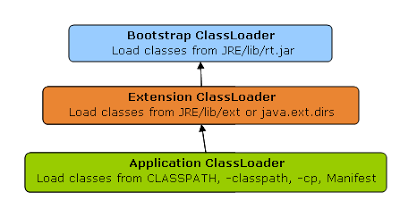

Class Loader in Java BootStrap Extension and Application

## <br>Java heap memory

When a Java program started Java Virtual Machine gets some memory from Operating
System.

whenever we create an object using new operator or by any another means the
object is allocated memory from Heap and When object dies or garbage collected,
memory goes back to Heap space.

**How to increase heap size in Java**

Default size of Heap space in Java is 128MB on most of 32 bit
Sun's [JVM](http://javarevisited.blogspot.sg/2011/12/jre-jvm-jdk-jit-in-java-programming.html) but
its highly varies from JVM to JVM. change size of heap space by using JVM
**options -Xms and -Xmx**. Xms denotes starting size of Heap while -Xmx denotes
maximum size of Heap in Java.

**Java Heap and Garbage Collection**

As we know objects are created inside heap memory and Garbage Collection is a
process which removes dead objects from Java Heap space and returns memory back
to Heap in Java.

For the sake of Garbage collection Heap is divided into three main regions named
as **New Generation, Old Generation, and Perm space**

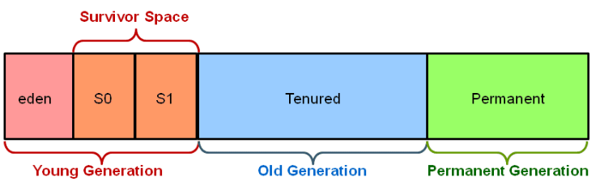

Screen Clipping

-   **New Generation** of Java Heap is part of Java Heap memory where a newly
    created object is stored,

-   **Old Generation** During the course of application many objects created and
    died but those remain live they got moved to Old Generation by Java Garbage
    collector thread

-   **Perm space** of Java Heap is where JVM stores Metadata about classes and
    methods, String pool and Class level details.

-   Perm Gen stands for permanent generation which holds the meta-data
    information about the classes.

-   Suppose if you create a class name A, it's instance variable will be stored
    in heap memory and class A along with static classloaders will be stored in
    permanent generation.

-   Garbage collectors will find it difficult to clear or free the memory space
    stored in permanent generation memory. Hence it is always recommended to
    keep the permgen memory settings to the advisable limit.

-   JAVA8 has introduced the concept called meta-space generation, hence permgen
    is no longer needed when you use jdk 1.8 versions.

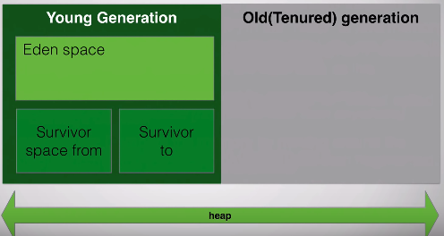

**Eden Space** – New Objects are Created

**Survivor Space –** Once Eden space is full, Minor thread try to clear the
Space, the objects which are survived by GC will be placed in Survivor space.

**Old Gen** – Objects which are survived from a long time, let say 16 Cycles (GC
cycle Threshold) of Minor Garbage Collector, those objects moved to Old Gen. The
Old Gen space finally collected by Main Garbage collector.

Finally, Minor Garbage collector will runs only on Young Gen, Main Garbage
Collector will run on whole heap space

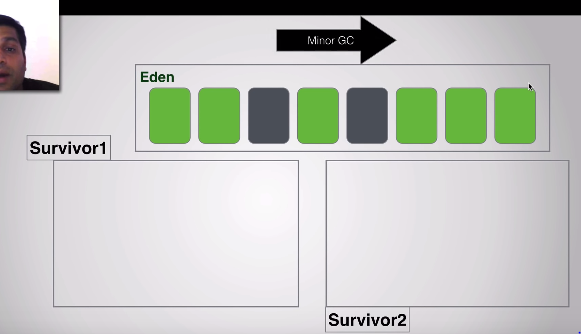

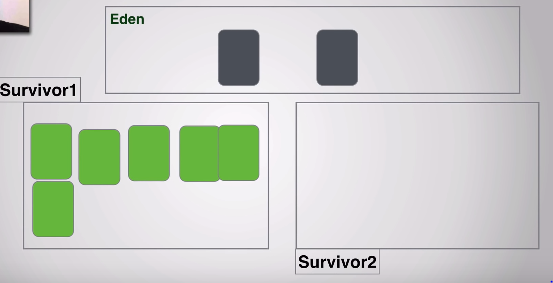

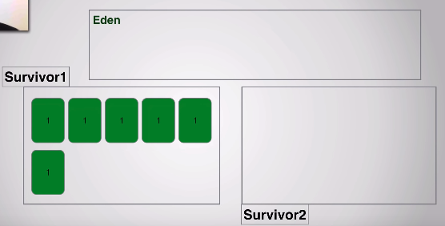

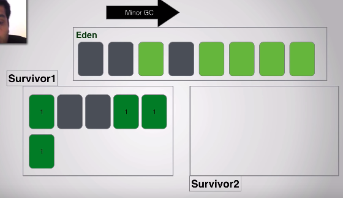

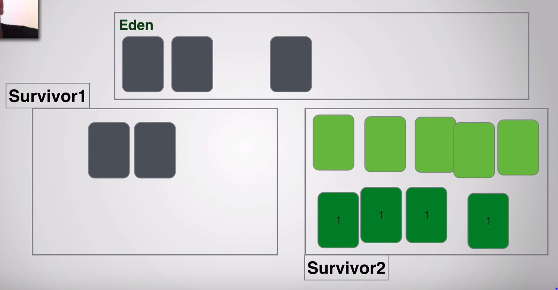

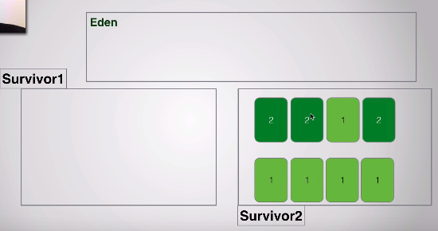

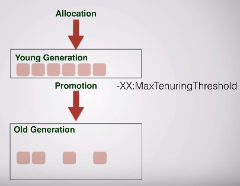

## Does Garbage collection occur in permanent generation space in JVM?

**YES, Garbage Collection occur in PermGen space as well. and if PermGen space
is full or cross a threshold, it can trigger Full GC(Main Thread).** If you look
at output of GC you will find that PermGen space is also garbage collected. This
is why correct sizing of PermGen space is important to avoid frequent full GC.
You can control size of PermGen space by [JVM
options](http://javarevisited.blogspot.sg/2011/11/hotspot-jvm-options-java-examples.html) -XX:PermGenSize and
-XX:MaxPermGenSize.

## Types of Garbage Collectors

When an object is no longer used, the garbage collector reclaims the underlying
memory and reuses it for future object allocation. This means there is no
explicit deletion and no memory is given back to the operating system.

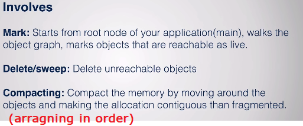

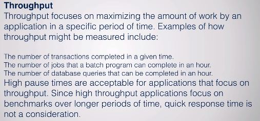

Java has **four types of garbage collectors**,

-   [Serial Garbage
    Collector](https://javapapers.com/java/types-of-java-garbage-collectors/#serial-garbage-collector)

-   [Parallel Garbage
    Collector](https://javapapers.com/java/types-of-java-garbage-collectors/#parallel-garbage-collector)

-   [CMS Garbage
    Collector](https://javapapers.com/java/types-of-java-garbage-collectors/#cms-garbage-collector)

-   [G1 Garbage
    Collector](https://javapapers.com/java/types-of-java-garbage-collectors/#g1-garbage-collector)

Each of these four types has its own advantages and disadvantages. Most
importantly, we the programmers can choose the type of garbage collector to be
used by the JVM. We can choose them by passing the choice as JVM argument

#### 1. Serial Garbage Collector

-   It is designed for **the single-threaded environments**.

-   It **uses just a single thread for garbage collection**.

-   It freezes(stops) all the application threads while performing garbage
    collection.

-   it may not be suitable for a server environment. It is best suited for
    simple command-line programs.

Turn on the **-XX:+UseSerialGC **JVM argument to use the serial garbage
collector.

#### 2. Parallel Garbage Collector

-   It is the **default garbage** collector of the JVM.

-   It uses **multiple threads for garbage collection**.

-   Similar to serial garbage collector this also freezes(siops) all the
    application threads while performing garbage collection.

#### 3. Concurrent Garbage Collector

-   Concurrent Mark Sweep (CMS) garbage collector uses multiple threads to scan
    the heap memory to mark instances for eviction and then sweep the marked
    instances.

-   It runs along with our Application. Uses multiple cores(cpus) to run
    multiple GC’s concurrently.

-   Here your application won’t pass/stop

Turn on the **XX:+USeParNewGC** JVM argument to use the CMS garbage collector.

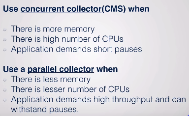

#### 4. G1 Garbage Collector

-   G1 **garbage collector is used for large heap memory areas.**

-   It separates the heap memory into regions and does collection within them in
    parallel.

-   G1 also does compacts the free heap space on the go just after reclaiming
    the memory.

-   G1 collector prioritizes the region based on most garbage first.

Turn on **the –XX:+UseG1GC JVM** argument to use the G1 garbage collector.

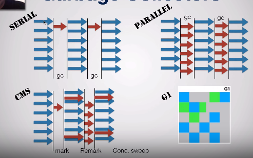

<https://www.youtube.com/watch?v=UnaNQgzw4zY>

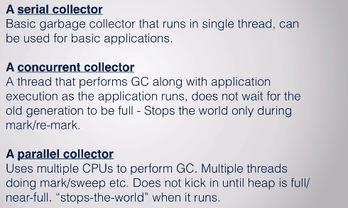

**Java 8 Improvement**

Turn on the **-XX:+UseStringDeduplication **JVM argument while using G1 garbage
collector**. This optimizes the heap memory by removing duplicate String values
to a single char[] array**. This option is introduced in [Java
8](https://javapapers.com/java/java-8-features/) u 20.

Given all the above four types of Java garbage collectors, which one to use
depends on the application scenario, hardware available and the throughput
requirements.

#### Garbage Collection JVM Options

**Type of Garbage Collector to run**

| **Option**                  | **Description**                              |
|-----------------------------|----------------------------------------------|
| **-XX:+UseSerialGC**        | **Serial Garbage Collector**                 |
| **-XX:+UseParallelGC**      | **Parallel Garbage Collector**               |
| **-XX:+UseConcMarkSweepGC** | **CMS Garbage Collector**                    |
| **-XX:ParallelCMSThreads=** | **CMS Collector – number of threads to use** |
| **-XX:+UseG1GC**            | **G1 Gargbage Collector**                    |

**GC Optimization Options**

| **Option**          | **Description**                       |
|---------------------|---------------------------------------|
| **-Xms**            | **Initial heap memory size**          |
| **-Xmx**            | **Maximum heap memory size**          |
| **-Xmn**            | **Size of Young Generation**          |
| **-XX:PermSize**    | **Initial Permanent Generation size** |
| **-XX:MaxPermSize** | **Maximum Permanent Generation size** |

**Garbage collection is performed by a daemon thread called Garbage
Collector(GC). This thread calls the finalize() method before object is garbage
collected.**

**The Garbage collector of JVM collects only those objects that are created by
new keyword. So if you have created any object without new, you can use finalize
method to perform cleanup processing (destroying remaining objects).**

**Neither finalization nor garbage collection is guaranteed.**

## How String Literals Garbage Collected?

Strings created without using the new keyword are **NEVER garbage collected**.
Even if there are no references to them. All such strings go into the String
pool and just sit there till the whole program ends (ie. the JVM).The String
Const. pool cleaned up when the class is unloaded by the JVM.

## How to you monitor garbage collection activities?
just to check whether candidate has ever monitored GC activities or not. You can
monitor garbage collection activities either offline or real-time. You can use
tools like **JConsole** and **VisualVM** VM with its Visual GC plug-in to
monitor real time garbage collection activities and memory status of JVM or you
can redirect Garbage collection output to a log file for offline analysis by
using -XlogGC=&lt;PATH> JVM parameter. Anyway you should always enable GC
options like -XX:PrintGCDetails -X:verboseGCand -XX:PrintGCTimeStamps as it
doesn't impact [application
performance](http://javarevisited.blogspot.sg/2012/01/improve-performance-java-database.html) much
but provide useful states for performance monitoring.

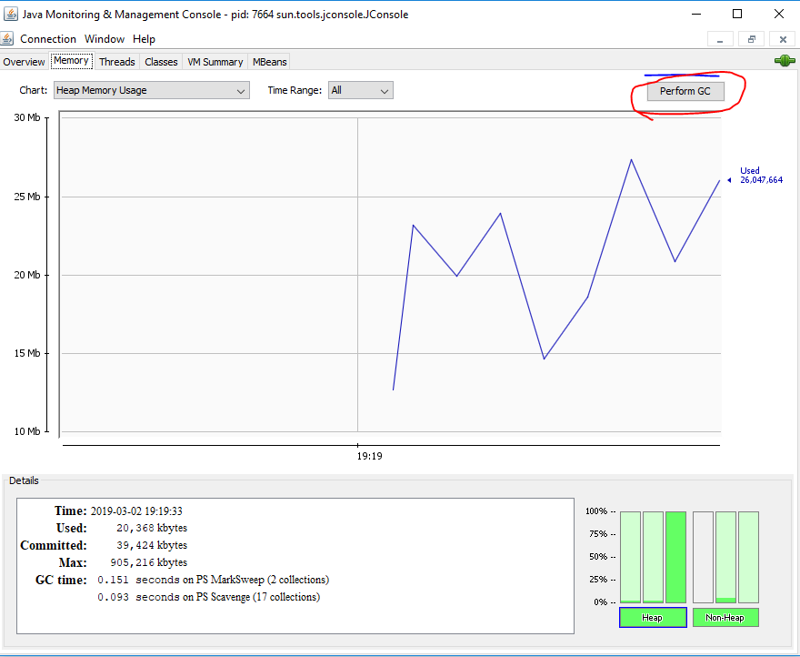

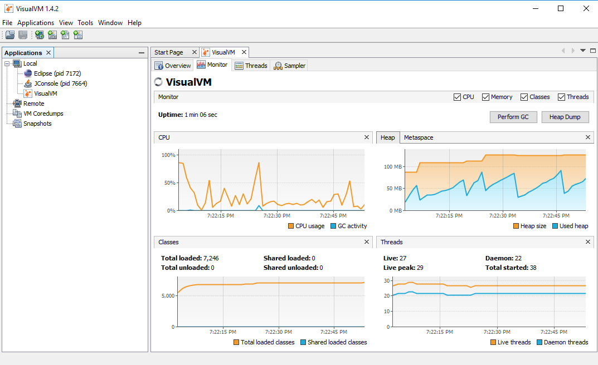

##  How do you identify minor and major garbage collection in Java?

-   Minor collection prints **GC** if garbage
    collection [logging](http://javarevisited.blogspot.sg/2011/05/top-10-tips-on-logging-in-java.html) is
    enable using **–verbose:gc or -XX:PrintGCDetails**

-   Major collection prints **-Full GC".** 

##  How to Generate GC Log File?

In order to understand the GC log, you first need to generate one. Passing the
following system properties to your JVM would generate GC logs

```java
-XX:+PrintGCDetails -XX:+PrintGCDateStamps –Xloggc:D://gc.log
```


Or add visual-gc plugin to visualVM

## What Security model used by Java?

**Sandbox**. The sandbox security model makes it easier to work with software
that comes from sources you don't fully trust. 

## What is -Phontom" memory

**A memory that doesn’t exist in reality.**

A phantom reference lets you do final touch up closing on an object, even after
it has been declared dead — no longer referenced by any live object.

During garbage collection, these reference objects are handled specially; that
is, the referent field is not traced during the marking phase. When marking is
complete, the references are processed in sequence for sweeping phase.

1.  Soft

2.  Weak

3.  Final

4.  Phantom

## How many JVMs can run on a single machine?

**Multiple**, yes You can run as many JVMs as you can fit on your disk and in
memory :)

Whenever you start a Java application, you're first starting the JVM and then
telling it which application to run. The answer to "which JVM" is simply: The
JVM that you loaded the application with! for example, for execution of applets
a separate JVM may exist and another JVM can be started by the User for
execution of Java Byte Code, on a single machine. 

## Difference between Object Oriented and Object Based language

**Object Oriented Languages**

-   Object Oriented Languages supports all the features of Oops Abstraction,
    Encapsulation, Polymorhisum, Inhertance.

-   C#, Java, VB. Net are the examples of object oriented languages.

**Object Based Languages**

-   Object based languages does not support inheritance or, polymorphism or,
    both.

-   Object based languages does not support built-in objects.

-   Javascript, VB are the examples of object bases languages.

## If I don’t provide any arguments on commandline, then String array of main() is Empty or NULL?

It’s Empty, but not Null.

## Is main method compulsory in Java?

The answer to this question depends on version of java you are using. **Prior to
JDK 5, main method was not mandatory in a java program.**

-   You could write your full code under [static
    block](https://www.geeksforgeeks.org/g-fact-79/) and it ran normally.

-   The static block is first executed as soon as the class is loaded before the
    main(); 

Read
more: <https://javarevisited.blogspot.com/2012/10/10-garbage-collection-interview-question-answer.html#ixzz5fwmNzRHE>

Read
more: <https://javarevisited.blogspot.com/2012/10/10-garbage-collection-interview-question-answer.html#ixzz5fwm9nzDa>

# Data Types


## How do you convert bytes to String?

you can convert bytes to the string using string constructor which
accepts byte[], just make sure that right character encoding otherwise
platform's default character encoding will be used which may or may not be same.
```java
String str = new String(bytes, "UTF-8");
```


## **How do you convert bytes to long in Java**  
The byte takes 1 byte of memory and long takes 8 bytes of memory. Assignment 1
byte value to 8 bytes is done implicitly by the JVM.

**byte –> short –> int –> long –> float –> double**

The left-side value can be assigned to any right-side value and is done
implicitly. The reverse requires explicit casting.

```java
byte b1 = 10;  // 1 byte  
long l1 = b1;  //  one byte to 8 bytes, assigned implicitly
```


## Is ++ operator is thread-safe in Java?

No it's not a thread safe operator because its involve multiple instructions
like reading a value, incriminating it and storing it back into memory which can
be overlapped between multiple threads.

## Volatile Vs Atomic variables?

Volatile Example

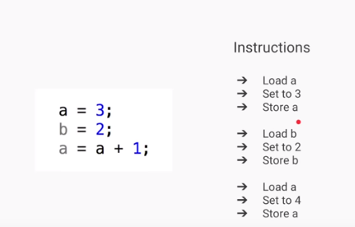

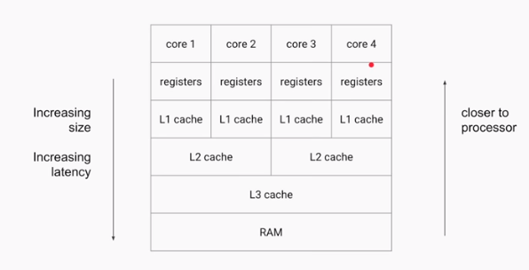

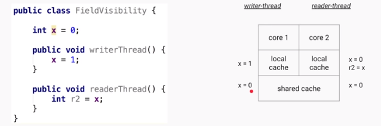

-   If **writerThread()** is executed by one thread & **readerThread()** is
    executed by another thread

-   the ‘x’ value is different for two threads because they are reading value
    from their LocalCache.

-   Here the changes of X value is not **visible** globally (Field Visibility),
    because they are changing in **LocalCache.**

**To avoid this, we need to use ‘volatile’ keyword for fields.**

-   The Java **volatile** keyword is used to mark a Java variable as **"being
    stored in main memory**".

-   that means, every **read** of a volatile variable will **be read from the
    main memory(Shared Memory)**, and not from the CPU cache

-   **every write** to a volatile variable will be **written to main memory**,
    and not just to the CPU cache.


-   In the above diagram two threads t1, t2 are trying to change the value of
    flag.

-   If Thread1 changes value flag=false, then it will flush(push) the changes
    from LocalCache to SharedCache and it will refresh the all Thread
    LocalCaches with updated value.

-   If Thread 2 is trying to read, it will get updated value.

-   Volatile solves the visibility problem, where Only one operation is perform

### Amtomic Problem

 Atomic - forming a single irreducible unit or component in a larger system.

Increment (++) is an **Compound Operation(multiple). AtomicVaribles** makes
compound operations as **Atomic(Single)**


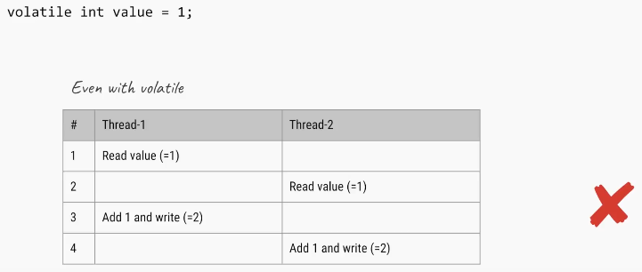

We can solve this problem using Synchronization


Another Way using Atomic Variables


## Atomic Varibles

The [java.util.concurrent.atomic](https://docs.oracle.com/javase/8/docs/api/java/util/concurrent/atomic/package-summary.html) package
defines classes that support atomic operations on single variables. All classes
have **get and set methods** that work like reads and writes
on volatile variables.

We have following Atomic classes

-   AtomicInteger

-   AtomicLong

-   AtomicBoolean

-   AtomicReference

-   AtomicIntegerArray

-   AtomicLongArray

-   AtomicReferenceArray

Common methods

-   **incrementAndGet()**: Atomically increments by one the current value.

-   **decrementAndGet()**: Atomically decrements by one the current value.

-   **addAndGet(int delta)**: Atomically adds the given value to the current
    value.

-   **compareAndSet(int expect, int update):** Atomically sets the value to the
    given updated value if the current value == the expected value.

-   **getAndAdd(int delta):** Atomically adds the given value to the current
    value.

-   **set(int newValue):** Sets to the given value.

## What will this return 3*0.1 == 0.3? true or false?

Both are not equal, because floating point arithmetic has a certain precision.
Check the difference (a-b) it should be really small.

**In computer memory, floats and doubles are stored using** [IEEE
754](https://en.wikipedia.org/wiki/IEEE_754) **standard format.**

-   f1 = (0.1+0.1+0.1….11 times) = 1.0999999999999999
-   f2 = 0.1*11 = 1.1

In [BigDecimal](https://docs.oracle.com/javase/7/docs/api/java/math/BigDecimal.html) class,
**you can specify the rounding mode** and exact precision which you want to use.
**Using the exact precision limit, rounding errors are mostly solved. Best part
is that BigDecimal numbers are immutable** i.e. if you create a BigDecimal BD
with value -1.23", that object will remain -1.23" and can never be changed. You
can use it’s .compareTo() method to compare to BigDecimal numbers
```java
private static void testBdEquality()
{
     BigDecimal a = new BigDecimal("2.00");
     BigDecimal b = new BigDecimal("2.0");
 
     System.out.println(a.equals(b));           // false
 
     System.out.println(a.compareTo(b) == 0);   // true
}
```


## **Which one will take more memory, an int or Integer? (answer)**  
An Integer object will take more memory. an Integer is the an object and it
 store meta data overhead about the object and int is primitive type so its
takes less space.

## Autoboxing and Unboxing?

If a **method(remember only method – not direct)** requires Integer Object
value, we can directly pass primitive value without issue. Autoboxing will take
care about these.

We can also do direct initializations (1.8 V)
```java
Integer i = 10;// it will create Integer value of 10 using Autoboxing
int j = i;// ;// it will convert Integer to int using Autoboxing
```


Previously it shows
```java
Integer i = 10;// it will create Integer value of 10 using Autoboxing
int j = i;//But we cant assign int to Integer Type mismatch: cannot convert from Integer to int
```


## How to convert Primitives to Wrapper & Wrapper to Primitive ??

// 1. using constructor
```java
Integer i =new Integer(10);
```


// 2. using static factory method
```java
Integer i = Integer.valueOf(10);
```


//3.wrapper to primitive
```java
int val = i.intValue();
```


## **How does Autoboxing of Integer works in Java? (**[answer](http://javarevisited.blogspot.sg/2012/07/auto-boxing-and-unboxing-in-java-be.html#axzz59AWpr6cb)**)**

Compiler uses valueOf() method to convert primitive to Object 
uses intValue(), doubleValue() etc to get primitive value from Object.

## what if I make main() private/protected ?

 if you do not make main() method public, there is no compilation error. You
will **runtime error** because matching main() method is not present. Remember
that whole syntax should match to execute main() method.

Error: Main method not found in class Main, please define the main method as:

   public static void main(String[] args)

## What is blank final variable?

A **blank final** variable in Java is
a [final](https://www.geeksforgeeks.org/g-fact-48/) variable that is not
initialized during declaration. Below is a simple example of blank final.

// A simple blank final example
```java
final int i;
```


-   Value must be assigned in constructor/Static(static final) /Instance block
    before using it.

-   If we have more than one constructors or overloaded constructor in class,
    then blank final variable must be initialized in all of them.


## Difference between java.util.Date & java.sql.Date?
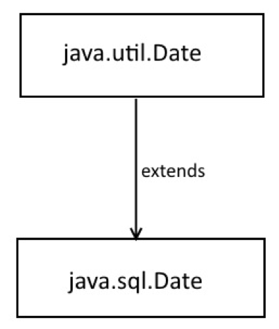

-   **java.util.Date** represent **both Date and Time information**.

-   **java.sql.Date** just represent DATE **without time information**.

-   **java.sql.Time and java.sql.TimeStamp** which represents TIME and TIMESTAMP
    type of SQL database is more close to java.util.Date.

-   java.util.Date is Super class of java.sql.Date

## Why Java does not support Operator Overloading?

The meaning of an operator is always same for variable of basic types like: int,
float, double etc. For example: To add two integers, *+* operator is used. 

However, for user-defined types (like: objects), you can redefine the way
operator works. For example: If there are two objects of a class that contains
string as its data members. You can redefine the meaning of + operator and use
it to concatenate those strings. 

To overload an operator, a special operator function is defined inside the class
as
```java
class className
{
    ... .. ...
    public
       returnType operator symbol (arguments)
       {
           ... .. ...
       } 
    ... .. ...
};
#include <iostream>
using namespace std;

class Test
{
   private:
      int count;

   public:
       Test(): count(5){}

       void operator ++() 
       { 
          count = count+1; 
       }
       void Display() { cout<<"Count: "<<count; }
};

int main()
{
    Test t;
    // this calls "function void operator ++()" function
    ++t;    
    t.Display();
    return 0;
}
```

-   This function is called when *++* operator operates on the object
    of *Test* class (object *t* in this case).

-   In the program, void operator ++ () operator function is defined
    (inside *Test* class).

-   This function increments the value of *count* by 1 for *t* object.

**Why Java Doesn't Support it?** 

**1.Java is Simple, No Confusions Please!!**  
Java does not support operator overloading: Java is relatively a very simple
language to use compared C/C++ with the non-support of complex and confusing
features like **pointers**, **multiple inheritance** and **operator
overloading**. These features are rarely used in practice and at the same time
poorly understood by the language beginners. 

**2.JVM Performance: How many things Should i do?**  
Form JVM perspective supporting operator overloading is more difficult and if
the **same thing can be achieved by using method overloading in more intuitive
and clean way it does make sense to not support operator overloading in java**.
a complex JVM will result in slower JVM

## **Can you store String in an Integer array in Java? compile time error or runtime exception? [**[answer](http://javarevisited.blogspot.co.uk/2013/11/java-array-101-for-programmers-and.html)**]**

-   You cannot store an String in an array of primitive int, it will result in
    compile time error as shown below,

-   but if you create an array of Object and assign String[] to it and then try
    to store Integer object on it. Compiler won't be able to detect that and it
    will throw ArrayStoreExcpetion at runtime

```java
int[] primes = new int[10];
primes[0] = "a"; // compile time error

Object[] names = new String[3]; 
names[0] = new Integer(0);// ArrayStoreException at runtime
```

## **What is difference between ArrayIndexOutfOBounds and ArrayStoreException? [**[answer](http://javarevisited.blogspot.sg/2014/05/exception-in-thread-main-arrayindexoutofboundsexception-java.html)**]**

`ArrayIndexOutOfBoundsException` comes when your code tries to access an invalid
index for a given array e.g. negative index or higher index than length - 1.

`ArrayStoreException` comes when you have stored an element of type other than
type of array, as shown in above example.

## **Is it legal to initialize an array int i[] = {1, 2, 3, 4, 5}; [answer]**

Yes, it’s perfectly legal. You can create and initialize array in same line in
Java.

## **Where does array stored in memory? [answer]**

Array is created in heap space of JVM memory**. Since array is object in Java**,
even if you create array locally inside a method or block, object is always
allocated memory from heap.

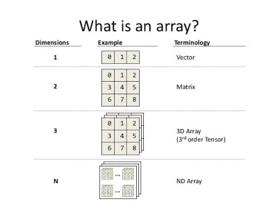

Array concept interview questions and answers in Java

## Reverse Array using Iterative and Recursive approaches

Steps to Solve this

1.initialize array 

2.Choose **start** index

3.Choose **end** index 

4.Swap the elements using **temp** variable

```java
package array;

public class ReverseArry {

	/*
	 * Recursive approach: In recursive approach the function calls itself until
	 * the condition is met. And it is slower than iteration, which means it uses
	 * more memory than iteration. recursion is like a selection structure, and
	 * which makes code smaller and clean. And a function partially defined by
	 * itself. Here tracing the code will be more difficult in the case large
	 * programs
	 */

	public static int[] recursiveArry(int a[], int start, int end) {
 if (start <= end) {
 	int temp;
 	temp = a[start];
 	a[start] = a[end];
 	a[end] = temp;
 	recursiveArry(a, start + 1, end - 1);//calling it again
 }
 return a;
	}

	
	/*
	 *Iterative approach: Iterative approach is a repetition process until the condition fails.here loops are used such as for, while etc. Here code may be longer but it is faster than recursive. And it consumes less memory compared to recursive approach.If the loop condition is always true in such cases it will be an infinite loop.
 */	
	public static int[] iteravtiveArray(int a[], int start, int end) {
 while(start<end)
 {
 	int temp;
 	temp = a[start];
 	a[start]=a[end];
 	a[end]=temp; 	
 	start++;
 	end--;
 } 
 
 return a;
	}
  
	static void printArray(int arr[], int size) {
 int i;
 for (i = 0; i < size; i++)
 	System.out.print(arr[i] + " ");
 System.out.println("");
	}
	 
	public static void main(String[] args) {
 
                // 1. Initialize array
                int arr[] = { 1, 2, 3, 4, 5, 6 };
 System.out.println("Input array is ");
 printArray(arr, 6);
	
 // 2. Choose Starting & ending point
 int b[] = recursiveArry(arr, 0, 5);
 System.out.println("Recursive -Reversed array is ");
 printArray(b, 6);
 
 int c[] = iteravtiveArray(arr, 0, 5);
 System.out.println("IteravtiveArray -Reversed array is ");
 printArray(c, 6);
	}
}
 
Input array is 
1 2 3 4 5 6 
Recursive -Reversed array is 
6 5 4 3 2 1
```


## **How do you reverse an array in Java?**  
org.apache.commons.lang.ArrayUtils class to reverse Array in Java. As discussed
in our last post [How to print array element in
Java](http://javarevisited.blogspot.com/2012/12/3-example-to-print-array-values-in-java.html),
We are using **Arrays.toString()** to print content of array.
```java
int[] iArray = new int[] {101,102,103,104,105};
String[] sArray = new String[] {"one", "two", "three", "four", "five"};

//reverse int array using Apache commons ArrayUtils.reverse() method 
System.out.println("Original int array : " + Arrays.toString(iArray));
ArrayUtils.reverse(iArray);
```


# java.lang Package


We have mainly five classes in java.lang. Which are most commonly used in any
java program

1.  **Object**

2.  **String**

3.  **StringBuffer**

4.  **StringBuilder**

5.  **Wrapper Classes (AutoBoxing / AutoUnboxing)**

## Object Class

The most common general methods which can be applicable on any java object are
defined in object class. Object class is the parent class of any java class,
whether it is predefined or programmer defined, hence all the object class
methods are by default available to any java class.

Object class define the following 11 methods

**1.toString**():Returns a string representation of the object.
```java
public String toString() {
 return getClass.getName() + '@' + Integer.toHexString(HashCode);
	}
```


**2.hashCode**():returns the integer representation of memory location which
used by JVM while saving/adding Objects into Hashsets, Hashtables or Hashmap

**3.equals**(Object): Compares two Objects for equality.

**4.clone**(): Creates a new object of the same class as this object which
implements **Clonable interface.**
```java
Test t1 = new Test();
Test t2 = (Test)t1.clone();
```


**5.finalize**():Called by the garbage collector on an object when garbage
collection determines that there are no more references to the object.

**6.getClass**():Returns the runtime class of an **obj.getClass(),** or the
class-literal (**Foo.class**) return a Class object, which contains some
metadata about the class:

-   name
-   package
-   methods
-   fields
-   constructors
-   annotations

we can create Class object by following ways
```java
Class c = Class.forName(-StudentBO")
Class c = StudentBO.class
Class c = a.getClass();
```

```java
public static void main(String[] args) throws Exception {
 TestApp a = new TestApp();
 Class c1 = a.getClass();
 
  Class c = Class.forName("java.lang.String");
  System.out.print("Class represented by c : " + c.toString());
  
  Object obj = c.newInstance();
	}
```


**7.wait**():Waits to be notified by another thread of a change in this object.

**8.wait**(long):Waits to be notified by another thread of a change in this
object.

**9.wait**(long, int):Waits to be notified by another thread of a change in this
object.

**10.notify**():Wakes up a single thread that is waiting on this object's
monitor.

**11.notifyAll**():Wakes up all threads that are waiting on this object's
monitor.

`equals(Object otherObject)` – As method name suggests, is used to simply verify
the equality of two objects. It’s default implementation simply check the object
references of two objects to verify their equality**. By default, two objects
are equal if and only if they are stored in the same memory address.**

`hashcode()` – Returns a unique integer value for the object in runtime. By
default, integer value is mostly derived from memory address of the object in
heap (but it’s not mandatory always).

If two objects are equal according to the equals(Object) method, then calling
the hashCode method on each of the two objects must produce the same integer
result.

**Whenever we override the equals() method, we should override hashcode()
method**

`In String class(not StringBuilder, StringBuffer) & All Wrapper classes equals()
method is overridden for Content Comparison`

## Compare two employee Objects based on Their Id?

```java
public class Employe {
	int id;
	String name;
//Setters & Getters
	@Override
	public boolean equals(Object obj) { 
 Employe e = (Employe) obj;
 boolean flag = false;
 if (this.getId() == e.getId()) {
 	flag = true;
 }
 return flag;
	}
	public static void main(String[] args) {
 Employe e1 = new Employe();
 Employe e2 = new Employe();
 e1.setId(101);
 e2.setId(101);
 System.out.println(e1.equals(e2));//true
 System.out.println(e1.hashCode());  	  //366712642
 System.out.println(e2.hashCode()); //1829164700 – here different
	}
}
```

So are we done? If two objects are equal according to the `equals(Object)` method,
then calling the `hashCode` method on each of the two objects must produce the
same integer result. **`But here it is not!!`**

Not yet. Lets test again above modified Employee class in different way.

```java
public static void main(String[] args) {
 Employe e1 = new Employe();
 Employe e2 = new Employe();
 e1.setId(101);
 e2.setId(101);
 
 Set<Employe> set = new HashSet<>();
 set.add(e1);
 set.add(e2);
 System.out.println(set); //[basic.Employe@15db9742, basic.Employe@6d06d69c]	
	}
```

Above class prints two objects in the second print statement. If both employee
objects have been equal, in a `Set` which stores only unique objects, there must
be only one instance inside HashSet

We are missing the second important method `hashCode()`. As java docs say, `if you
override equals()method then you must override hashCode() method`

```java
public class Employe {
	int id;
	String name;

	@Override
	public boolean equals(Object obj) { 
 Employe e = (Employe) obj;
 boolean flag = false;
 if (this.getId() == e.getId()) {
 	flag = true;
 }
 return flag;
	}
	
	@Override
	public int hashCode() { 
 return getId();
	}

	public static void main(String[] args) {
 Employe e1 = new Employe();
 Employe e2 = new Employe();
 e1.setId(101);
 e2.setId(101);
 
 Set<Employe> set = new HashSet<>();
 set.add(e1);
 set.add(e2);
 System.out.println(set); //[basic.Employe@65] 
	}
}
```

[Apache commons](https://commons.apache.org/proper/commons-lang/) provide two
excellent utility
classes [EqualsBuilder](https://commons.apache.org/proper/commons-lang/apidocs/org/apache/commons/lang3/builder/EqualsBuilder.html)
**&**
[HashCodeBuilder](https://commons.apache.org/proper/commons-lang/apidocs/org/apache/commons/lang3/builder/HashCodeBuilder.html) 
for generating hash code and equals methods.

## Can a top-level class be private or protected?

Top level classes in java `can’t be private or protected`, but inner classes in
java can. The reason for not making a top-level class as private is very
obvious, because nobody can see a private class and thus they cannot use it

## What Happens if we compile Empty java file?

Compiles but Runtime Error.


## Is it possible to make array volatile in Java?

Yes, you can make an array (both primitive and reference type array e.g. an [int
array](http://www.java67.com/2015/07/array-concepts-interview-questions-answers-java.html) and [String
array](http://www.java67.com/2012/09/java-program-to-convert-string-arraylist-to-string-array.html))
volatile in Java, but only changes to reference pointing to an array will be
visible to all threads, not the whole array.

What this means is that suppose you have a reference variable called **primes**
as shown below:  
**protected volatile int[] primes = new int[10];**

then if you assign a new array to primes variable, change will be visible to all
threads, but changes to individual indices(a[0], a[1]…a[n]) will not be covered
under volatile guarantee i.e.  
**primes = new int[20];**

It will follow the **"happens-before"** rule(*Happens-before relationship is a
guarantee that action performed by one thread is visible to another action in
different thread*.) and cause memory refresh, but following code will not do so

if multiple threads are changing individual array elements e.g. storing updates,
there won’t be any happens-before guarantee provided by the [volatile
modifier](http://javarevisited.blogspot.com/2012/03/difference-between-transient-and.html) for
such modification

**primes[0] = 10;**  
**primes[1] = 20;**  
**primes[2] = 30;**  
**primes[3] = 40;**  
So, if your use-case is to provide memory visibility guarantee for individual
array elements than **volatile is not the right choice**. You must rely on other
synchronization and a thread-safety mechanism to cover this case
e.g. [synchronized](http://www.java67.com/2012/08/5-thread-interview-questions-answers-in.html)** keyword, **[atomic
variables](http://javarevisited.blogspot.com/2011/07/java-multi-threading-interview.html)**,
or **[ReentrantLock](http://javarevisited.blogspot.sg/2013/03/reentrantlock-example-in-java-synchronized-difference-vs-lock.html)**.**

## Is it possible to make ArrayList, Hashset volatile in Java?

On a similar note, sometimes instead of an array, Interviewer put the collection
i.e. they will ask *can you make a collection variable volatile in Java or
not* e.g.
an [ArrayList](http://www.java67.com/2015/06/20-java-arraylist-interview-questions.html) or [HashMap](http://javarevisited.blogspot.sg/2014/11/how-to-loop-hashmap-or-hashtable-in-jsp-example.html).
The answer is same, of course, you can make a reference variable pointing to a
Collection volatile in Java, but the happens-before guarantee will only be
provided if the value of that reference variable is changed e.g. you assign a
new collection to it.

Any modification done on actual collection object e.g. adding or removing
elements from ArrayList will not invoke happens-before guarantee or memory
barrier refresh. 

## What is a.hashCode() used for? How is it related to a.equals(b)?

According to the Java specification, two objects which are identical to each
other using equals() method needs to have the same hash code

## What is a compile time constant in Java? What is the risk of using it?

Answer: **Public static final variables** are also known as the compile time
constant, the public is optional there. They are substituted with actual values
at compile time because compiler recognizes their value up-front, and also
recognize that it cannot be altered during runtime.

One of the issues is that if you choose to use a public static final variable
from in-house or a third party library, and their value changed later, then your
client will still be using the old value even after you deploy a new version of
JARs.

## Explain Liskov Substitution Principle.

According to the Liskov Substitution Principle, **Subtypes must be appropriate
for super type** i.e. methods or functions which use super class type must be
able to work with object of subclass without issues. **Co-Variant return types
are implemented based on this principle.**

## What is double checked locking in Singleton?

**Singleton** means we can create only one instance of that class

**Rules:**

-   Create Singleton class Object make it as PRIVATE

-   Create PRIVATE constructor

-   Every Singleton class contains at least one factory method

```java
class Student {
    private static Student st;
    private Student() {
        System.out.println("OBJECET Created FIRST TIME");
    }
    public static Student getObject() {
        if (st == null) {
            st = new Student();
        } else {
            System.out.println("OBJECET ALREDAY CREATED");
        }
        return st;
    }
}
 
public class Singleton {
    public static void main(String[] args) {
        Student s1 = Student.getObject();
        Student s2 = Student.getObject();
        System.out.println(s1.hashCode());//7855445
        System.out.println(s2.hashCode());//7855445
    }
}
```

**Double checked locking in Singleton means,** at any cost only one instance is
created in multi-threaded environment.

In this case at null checking make Block as Synchronized.

```java
public static Singleton getInstanceDC() {
        if (_instance == null) {                // Single Checked
            synchronized (Singleton.class) {
                if (_instance == null) {        // Double checked
                    _instance = new Singleton();
                }
            }
        }
        return _instance;
}
```

## When to use volatile variable in Java?

-   Volatile keyword is used with only variable in Java

-   it guarantees that value of volatile variable will always be read from main
    memory and not from Thread's local cache.

-   So, we can use volatile to achieve synchronization because its guaranteed
    that all reader thread will see updated value of volatile variable once
    write operation completed

## Difference between Serializable and Externalizable in Java?

**Serialization** is a default process of serializing or persisting any object's
state in Java. It's triggered by implementing Serializable interface which is a
marker interface (an interface without any method). uses default implementation
to handle the object serialization process.

**Externalizable** is used to user defined serialization process and control
default serialization process which is implemented by application.

Externalizable interface extends Serializable interface. It consists of two
methods


```java
// to read object from stream
void readExternal(ObjectInput in) 

// to write object into stream
void writeExternal(ObjectOutput out)
```


## **Difference between static and dynamic binding in Java? (detailed answer)**  
This is usually asked as follow-up of previous question, **static binding is
related to overloaded method and dynamic binding is related to overridden
method**.

**Method like private, final and static are resolved using static binding at
compile time** but virtual methods which can be overridden are resolved using
dynamic binding at runtime.

**Which design pattern have you used in your production code?**

-   **Dependency injection**

-   **Factory pattern**

-   **Adapter Design pattern**

-   **Singleton**

-   **Decorator**[design
    pattern](https://www.journaldev.com/1827/java-design-patterns-example-tutorial) is
    used to modify the functionality of an object at runtime.

## Can you explain Liskov Substitution principle?(Comes under inheritance )

According to Liskov Substitution Principle, Subtypes must be substitutable for
supertype i.e. methods or functions which uses superclass type must be able to
work with
the [object ](http://javarevisited.blogspot.com/2012/12/what-is-object-in-java-or-oops-example.html)of
subclass without any issue

## How to create an instance of any class without using new keyword

```java
*****************************************
1.Using newInstance method of Class class
*****************************************
Class c = Class.forName("StudentBo");
StudentBo bo = (StudentBo) c.newInstance();


*****************************************
2.Using clone() of java.lang.Object
*****************************************
NewClass obj = new NewClass();
NewClass obj2 = (NewClass) obj.clone();
```


## How can we invoke any external process in java?

Using,
```java
Runtime.getRuntime().exec(…)
```


## Static imports rules ?

The static import feature of Java 5 facilitates the java programmer to access
any static member of a class directly. There is no need to qualify it by the
class name.

```java
import static java.lang.System.*;   (or)
import static java.lang.System.out;
 
class StaticImportExample{  
  public static void main(String args[]){  
     
   out.println("Hello");//Now no need of System.out  
   out.println("Java");  
  
 }   
}
```

### **Ambiguity in static import**

```java
// both have MAX_VALUE as static
import static java.lang.Integer.*; 
import static java.lang.Byte.*; 
class Geeks { 
    public static void main(String[] args) 
    { 
        out.println(MAX_VALUE); 
    } 
} 
Error:Reference to MAX_VALUE is ambigious
```


# Java OOPs Concepts 


## **Can we prevent overriding a method without using the final modifier? (answer)**

Yes, you can prevent the method overriding in Java without using the final
modifier. In fact, there are several ways to accomplish it e.g. you can mark the
method **private or static, those cannot be overridden.**

## **Can we override a private method in Java? (**[answer](http://java67.blogspot.sg/2013/08/can-we-override-private-method-in-java-inner-class.html)**)**

No, you cannot. Since the private method is only accessible and visible inside
the class they are declared, it's not possible to override them in subclasses.
But we can re-decalre in sub class , it will trated as a new method, bcoz parent
class private method is not visible to subclass.

```java
class A{
	private void show() {
 System.out.println("Parent");
	}
}
public class Demo extends A{
	private void show() {
 System.out.println("Child");
	}
	public static void main(String[] args) {
 A a = new Demo();
 a.show();
	
	}
}
```

`Exception in thread "main" java.lang.Error: Unresolved compilation problem:`

The method show() from the type A is not visible at Demo.main(Demo.java:12)

Though, you can override them inside the inner class as they are accessible
there.

## **Can we change the return type of method to subclass while overriding? (answer)**

Yes, you can, but only from Java 5 onward. This feature is known as **covariant
method** overriding and it was introduced in JDK 5 release. This is immensely
helpful if original method return super-class e.g. clone() method return
java.lang.Object. By using this, you can directly return the actual type,
preventing client-side type casting of the result.

## **Can we make a class both final and abstract at the same time? (**[answer](http://javarevisited.blogspot.com/2011/12/final-variable-method-class-java.html)**)**

No, you cannot apply both final and abstract keyword at the class same time
because they are exactly opposite of each other. A final class in Java cannot be
extended and you cannot use an abstract class without extending and make it a
concrete class. As per Java specification, the compiler will throw an error if
you try to make a class abstract and final at the same time.

## **Can we overload or override the main method in Java? (answer)**  
No, since main() is a static method, you can only overload it, you cannot
override it because the static method is resolved at compile time without
needing object information hence we cannot override the main method in Java.


# Design Patterns


SOLID design principles and GOF design patterns which take advantage of OOPS
concept discussed here.

## What are SOLID Design principles


Image result for solid design principles

**1. Single Responsibility Principle**

**-One class should have one and only one responsibility"**

In other words, we should write, change and maintain a class for only one
purpose**. If it is model class then it should strictly represent only one
actor/ entity**. This will give we the flexibility to make changes in future
without worrying the impacts of changes for another entity.

**2. Open Closed Principle**

**-Software components should be open for extension, but closed for
modification"**

If we take a look into any good framework like struts or spring, we will see
that **we cannot change their core logic and request processing**, **but we
modify the desired application flow just by extending some classes and plugin
them in configuration files.**

For example, spring framework has class DispatcherServlet. This class acts
as **front controller** for String based web applications. To use this class, we
are not required to modify this class**. All we need is to pass initialization
parameters and we can extend it’s functionality the way we want.**

**3. Liskov’s Substitution Principle**

-Derived types must be completely substitutable for their base types"

**4. Interface Segregation/Separation Principle**

This principle is my favorite one. It is applicable to interfaces as single
responsibility principle holds to classes. ISP says:

-Clients should not be forced to implement unnecessary methods which they will
not use"

Take an example. Developer Alex created an interface Reportable and added two
methods generateExcel() and generatedPdf(). Now client ‘A’ wants to use this
interface but he intend to use reports only in PDF format and not in excel. Will
he be able to use the functionality easily?

NO. He will have to implement both the methods, out of which one is extra burden
put on him by designer of software. Either he will implement another method or
leave it blank. This is not a good design.

**5. Dependency Inversion/Injection Principle**

**Remove dependency from classes**

In spring framework, all modules are provided as separate components which can
work together by simply injected dependencies in other module. This dependency
is managed externally in XML files.

## What are GOF(Gang of Four) design patterns?

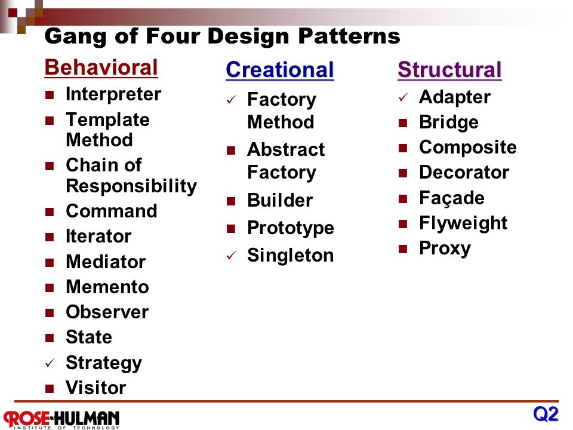

Image result for gof design patterns

**1. Creational Design Patterns (Object Creation)**

Creational patterns often used in place of direct instantiation with
constructors. They make the creation process more adaptable and dynamic. In
particular, they can provide a great deal of flexibility about which objects are
created, **how those objects are created, and how they are initialized**.

| **DESIGN PATTERN NAME**                                                                                      | **PURPOSE**                                                                                                                                                                                      |
|--------------------------------------------------------------------------------------------------------------|--------------------------------------------------------------------------------------------------------------------------------------------------------------------------------------------------|
| [Builder](https://howtodoinjava.com/design-patterns/creational/builder-pattern-in-java/)                     | Builder design pattern is an alternative way to construct complex objects and should be used only when we want to build different types of immutable objects using same object building process. |
| [Prototype](https://howtodoinjava.com/design-patterns/creational/prototype-design-pattern-in-java/)          | Prototype design pattern is used in scenarios where application needs to create a large number of instances of a class, which have almost same state or differ very little.                      |
| [Factory](https://howtodoinjava.com/design-patterns/creational/implementing-factory-design-pattern-in-java/) | Factory design pattern is most suitable when complex object creation steps are involved. To ensure that these steps are centralized and not exposed to composing classes.                        |
| [Abstract factory](https://howtodoinjava.com/design-patterns/creational/abstract-factory-pattern-in-java/)   | Abstract factory pattern is used whenever we need another level of abstraction over a group of factories created using factory pattern.                                                          |
| [Singleton](https://howtodoinjava.com/design-patterns/singleton-design-pattern-in-java/)                     | Singleton enables an application to have one and only one instance of a class per JVM.                                                                                                           |

**2. Structural Design Patterns**

Structural design patterns show us how to glue different pieces of a system
together in a flexible and extensible fashion. These patterns help us guarantee
that **when one of the parts changes, the entire application structure does not
need to change.**

| **DESIGN PATTERN NAME**                                                                     | **PURPOSE**                                                                                                                                                                                                                                                             |
|---------------------------------------------------------------------------------------------|-------------------------------------------------------------------------------------------------------------------------------------------------------------------------------------------------------------------------------------------------------------------------|
| [Adapter](https://howtodoinjava.com/2014/05/10/adapter-design-pattern-in-java/)             | An adapter convert the interface of a class into another interface clients expect. It lets classes work together that couldn’t otherwise because of incompatible interfaces.                                                                                            |
| [Bridge](https://howtodoinjava.com/design-patterns/structural/bridge-design-pattern/)       | Bridge design pattern is used to decouple a class into two parts – *abstraction* and it’s *implementation* – so that both can evolve in future without affecting each other. It increases the loose coupling between class abstraction and it’s implementation.         |
| [Composite](https://howtodoinjava.com/design-patterns/structural/composite-design-pattern/) | Composite design pattern helps to compose the objects into tree structures to represent whole-part hierarchies. Composite lets clients treat individual objects and compositions of objects uniformly.                                                                  |
| [Decorator](https://howtodoinjava.com/design-patterns/structural/decorator-design-pattern/) | Decorator design pattern is used to add additional features or behaviors to a particular instance of a class, while not modifying the other instances of same class.                                                                                                    |
| [Facade](https://howtodoinjava.com/design-patterns/structural/facade-design-pattern/)       | Facade design pattern provide a unified interface to a set of interfaces in a subsystem. Facade defines a higher-level interface that makes the subsystem easier to use.                                                                                                |
| [Flyweight](https://howtodoinjava.com/design-patterns/structural/flyweight-design-pattern/) | Flyweight design pattern enables use sharing of objects to support large numbers of fine-grained objects efficiently. A flyweight is a shared object that can be used in multiple contexts simultaneously. The flyweight acts as an independent object in each context. |
| [Proxy](https://howtodoinjava.com/design-patterns/structural/proxy-design-pattern/)         | In proxy design pattern, a proxy object provide a surrogate or placeholder for another object to control access to it. Proxy is heavily used to implement lazy loading related usecases where we do not want to create full object until it is actually needed.         |

**3. Behavioral Design Patterns**

Behavioral patterns abstract an action **we want to take on the object or class
that takes the action**. By changing the object or class, we can change the
algorithm used, the objects affected, or the behavior, while still retaining the
same basic interface for client classes.

| **DESIGN PATTERN NAME**                                                                                                 | **PURPOSE**                                                                                                                                                                                                                                                                             |
|-------------------------------------------------------------------------------------------------------------------------|-----------------------------------------------------------------------------------------------------------------------------------------------------------------------------------------------------------------------------------------------------------------------------------------|
| [Chain of responsibility](https://howtodoinjava.com/design-patterns/behavioral/chain-of-responsibility-design-pattern/) | Chain of responsibility design pattern gives more than one object an opportunity to handle a request by linking receiving objects together in form of a chain.                                                                                                                          |
| [Command](https://howtodoinjava.com/design-patterns/behavioral/command-pattern/)                                        | Command design pattern is useful to abstract the business logic into discrete actions which we call commands. These command objects help in loose coupling between two classes where one class (invoker) shall call a method on other class (receiver) to perform a business operation. |
| **Interpreter**                                                                                                         | Interpreter pattern specifies how to evaluate sentences in a language, programatically. It helps in building a grammar for a simple language, so that sentences in the language can be interpreted.                                                                                     |
| [Iterator](https://howtodoinjava.com/design-patterns/behavioral/iterator-design-pattern/)                               | Iterator pattern provides a way to access the elements of an aggregate object sequentially without exposing its underlying representation.                                                                                                                                              |
| [Mediator](https://howtodoinjava.com/design-patterns/behavioral/mediator-pattern/)                                      | Mediator pattern defines an object that encapsulates how a set of objects interact. Mediator promotes loose coupling by keeping objects from referring to each other explicitly, and it lets us vary their interaction independently.                                                   |
| [Memento](https://howtodoinjava.com/design-patterns/behavioral/memento-design-pattern/)                                 | Memento pattern is used to restore state of an object to a previous state. It is also known as snapshot pattern.                                                                                                                                                                        |
| [Observer](https://howtodoinjava.com/design-patterns/behavioral/observer-design-pattern/)                               | Observer pattern defines a one-to-many dependency between objects so that when one object changes state, all its dependents are notified and updated automatically. It is also referred to as the publish-subscribe pattern.                                                            |
| [State](https://howtodoinjava.com/design-patterns/behavioral/state-design-pattern/)                                     | In state pattern allows an object to alter its behavior when its internal state changes. The object will appear to change its class. There shall be a separate concrete class per possible state of an object.                                                                          |
| [Strategy](https://howtodoinjava.com/design-patterns/behavioral/strategy-design-pattern/)                               | Strategy pattern is used where we choose a specific implementation of algorithm or task in run time – out of multiple other implementations for same task.                                                                                                                              |
| [Template method](https://howtodoinjava.com/design-patterns/behavioral/template-method-pattern/)                        | Template method pattern defines the sequential steps to execute a multi-step algorithm and optionally can provide a default implementation as well (based on requirements).                                                                                                             |
| [Visitor](https://howtodoinjava.com/design-patterns/behavioral/visitor-design-pattern-example-tutorial/)                | Visitor pattern is used when we want a hierarchy of objects to modify their behavior but without modifying their source code.                                                                                                                                                           |

## **What is Strategy pattern in Java?**

Strategy pattern allows you to **introduce new strategy without changing the
code.**

For example, the **Collections.sort()** method which sorts the list of the
object uses the Strategy pattern to compare object. Since every object uses
different comparison strategy you can compare various object differently without
changing sort method.

## What is Decorator Design Pattern?

Decorator pattern **provides new features without modifying the original
class**. **Inheritance is the example.**

**What is the difference between Decorator, Proxy and Adapter pattern in
Java? (answer)**  
Again they look similar because their structure or class diagram is very similar
but their intent is quite different. Decorator adds additional functionality
without touching the class, Proxy provides access control and Adapter is used to
make two incompatible interfaces work together. 

## What is a strongly typed programming language?

In a strongly typed language compiler ensure type correctness, for example, you
**can not store the number in String or vice-versa**.

Java is a strongly typed language, that's why you have different data types
Ex **int, float, String, char, boolean etc.**

On the other hand, weakly typed language don't enforce type checking at compile
time and they tree values based upon context. **Python and Perl** are two
popular example of weakly typed programming language, where you can store a
numeric string in number type.

## Can you describe three different kinds of testing that might be performed?

**Unit Testing, Integration Testing and Smoke Testing**.

-   **Unit testing** is used to test individual units to verify whether they are
    working as expected

-   **Integration Testing** is done to verify whether individually tested module
    can work together or not

-   **Smoke Testing** is a way to test whether most common functionality of
    software is working properly or not e.g. in a flight booking website, you
    should be able to book, cancel or change flights.

## What is the difference between iteration and recursion? ([detailed answer](http://javarevisited.blogspot.sg/2012/12/recursion-in-java-with-example-programming.html))

-   **Iteration** uses a loop to perform the same step again and again.

-   **Recursion** calls the same method itself to do the repetitive task

## What is test-driven development?

Test driven is one of the popular development methodologies in which tests are
written before writing any function code. In fact, test drives the structure of
your program. Purists never wrote a single line of application code without
writing a test for that. It greatly improve code quality and often attributed as
a quality of rockstar developers.

## How do you find a running Java process on UNIX? 

You can use the combination of **'ps' and 'grep'** command to find any process
running on UNIX machine. ps -e will list every process i.e. process from all
user not just you and  ps -f will give you full details including PID, which
will be required if you want to investigate more or would like to kill this
process using kill command.

ps -ef | grep "java"

## Difference between WeakReference vs SoftReference vs PhantomReference vs Strong reference in Garbage Collection?

there are four kind of reference in Java :

1.  Strong reference

2.  Weak Reference

3.  Soft Reference

4.  Phantom Reference
