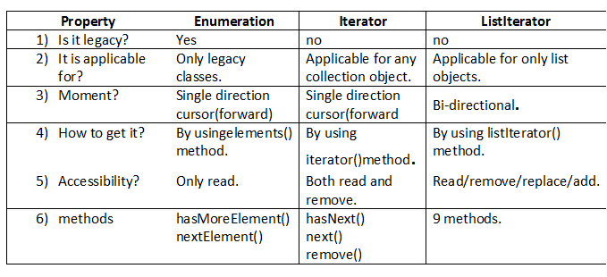
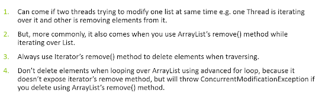
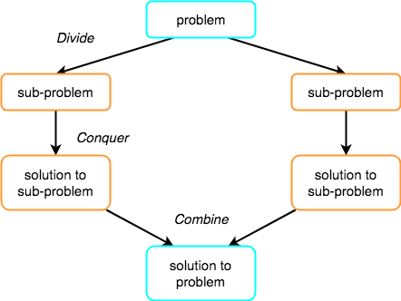
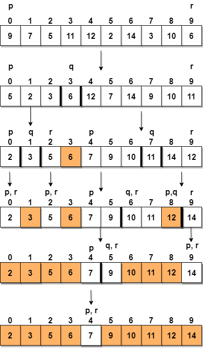
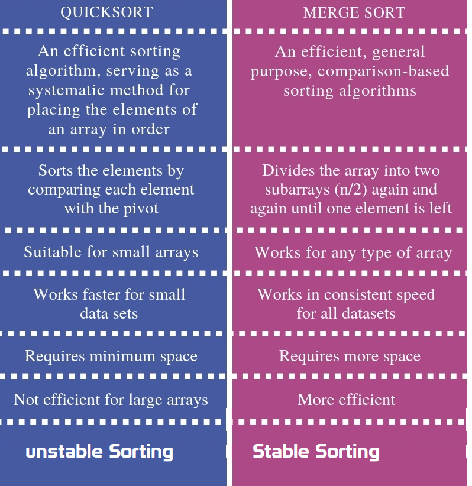

# Collections


## Java Collections class

Java collection class is used exclusively with static methods that operate on or
return collections. It inherits Object class.

**boolean addAll(Collection c, T... elements):** This method adds all of the
provided elements to the specified collection at once. The elements can be
provided as a comma-separated list.
```java
List list = new ArrayList();
Collections.addAll(list, "Apples", "Oranges", "Banana");
list.forEach(System.out::println);
```


**void sort(List list, Comparator c):** This method sorts the provided list
according to the natural ordering. We can also pass in s Comparator, if we want
some custom ordering.
```java
Collections.sort(list);
Collections.sort(list,comparator);
```


**int binarySearch (list,"elemet")** : This method searches the key using binary
search in the specified list. The list should be sorted by natural ordering,
before calling this method, otherwise, the result will be undefined
```java
System.out.println(Collections.binarySearch(fruits, "Banana"));
System.out.println(Collections.binarySearch(fruits, "Grapes"));
```


-   `Collections.copy(list, fruits)`;

-   `Collections.fill(list, "filled with dummy data");` : replaces all of the
    elements of the specified list with the specified element.

-   `Collections.max(fruits)`: returns the maximum element in collection according
    to the natural ordering of elements.

-   `Collections.reverse(list);`

-   `Collections.unmodifiableList(band)`

-   `Collections.synchronizedCollection(fruits)`

    -   synchronizedSet

    -   synchronizedSortedSet

    -   synchronizedMap

    -   synchronizedSortedMap

## **Java9 Collection Static Factory Methods**

```java
List<String> list= List.of("apple","bat");
List<String> list= List.of();

Set<String> set= Set.of("apple","bat");
Set<String> set= Set.of()

Map<Integer,String> emptyMap = Map.of()
Map<Integer,String> map = Map.of(1, "Apple", 2, "Bat", 3, "Cat")

Map<Integer,String> emptyEntry = Map.ofEntries()
Map.Entry<Integer,String> mapEntry1 = Map.entry(1,"Apple")
Map.Entry<Integer,String> mapEntry2 = Map.entry(2,"Bat")
Map.Entry<Integer,String> mapEntry3 = Map.entry(3,"Cat")
Map<Integer,String> mapEntry = Map.ofEntries(mapEntry1,mapEntry2,mapEntry3)
```

## Arrays Class

```java
public static <T> List<T> asList(T… a)
public static void sort(int[] a)
public static int binarySearch(int[] a, int k)
public static boolean equals(int[] a, int[] a2)

Arrays.toString(ar);
static int[] copyOf(int[] original, int newLength);
public static void fill(int[] a, int val)
```

## Comparable and Comparator

**Comparator and comparable** in Java are two interfaces which is used to
implement sorting in Java.

**Comparable** object is capable of comparing itself(this) with another object.
The class itself must implements the **java.lang.Comparable** interface to
compare its instances

**Comparator** is external to the element type we are comparing. It’s a separate
class. We create multiple separate classes (that implement Comparator) to
compare by different members.

### Comparable interface

 It provide single sorting sequence only i.e. you can sort the elements on based
on single data member only. For example it may be rollno, name, age or any one
of them, not all else.

We use **public int compareTo(Object obj):** is used to compare the current
object with the specified object.

-   **String class and Wrapper classes implements Comparable interface by
    default. So if you store the objects of string or wrapper or Date classes in
    list, set or map, it will be Comparable by default.**

`Collection.sort(EmpBo)`: if we pass employee list Objects to the
Collections.sort() method it will throws

`Exception in thread "main" java.lang.Error: Unresolved compilation problem: 
	The method sort(List<T>) in the type Collections is not applicable for the arguments (List<Employee>)`

Comparable is an interface defining a strategy of comparing an object with other
objects of the same type. This is called the class’s “natural ordering".so we
need to define CompareTo() method

```java
public class Employee implements Comparable<Employee> {

	private int id;
	private String name;
	private double salary;
//Setters/getters

	public Employee(int id, String name, double salary) {
 super();
 this.id = id;
 this.name = name;
 this.salary = salary;
	}

	
	@Override
	public int compareTo(Employee o) {
 if (this.id < o.id) {
 	return -1;
 } else if (this.id > o.id) {
 	return 1;
 } else {
 	return 0;
 }
	}

	@Override
	public String toString() {
 return "Employee [id=" + id + ", name=" + name + ", salary=" + salary + "]";
	}

	public static void main(String[] args) {

 List<Employee> employees = new ArrayList<Employee>();
 employees.add(new Employee(105, "Satya", 3000));
 employees.add(new Employee(102, "RAJ", 2000));
 employees.add(new Employee(104, "Madhu", 5000));
 employees.add(new Employee(101, "Srini", 1000));
 employees.add(new Employee(103, "Vinod", 4000));

 System.out.println("Before : " + employees);
 Collections.sort(employees);
 System.out.println("After : " + employees);
	}
}
Before : [Employee [id=105, name=Satya, salary=3000.0], Employee [id=102, name=RAJ, salary=2000.0], Employee [id=104, name=Madhu, salary=5000.0], Employee [id=101, name=Srini, salary=1000.0], Employee [id=103, name=Vinod, salary=4000.0]]

//See, here we don’t have TreeSet(Comparable) to pass implemented Comparable, so that is not sorted. So need to use collections.sort(). 

//If use Comparator, no need to call the collections.sort(),because it will accept TreeSet(Comparrtor)

After : [Employee [id=101, name=Srini, salary=1000.0], Employee [id=102, name=RAJ, salary=2000.0], Employee [id=103, name=Vinod, salary=4000.0], Employee [id=104, name=Madhu, salary=5000.0], Employee [id=105, name=Satya, salary=3000.0]]
```

Now, suppose we want sort Employees by their salary and names & also Default
comparable method also Should there. In this case using comparable we get only
one chance to implement the compareTo() method. The solution is
using [Comparator](https://www.geeksforgeeks.org/comparator-interface-java/)

### Comparator Interface

Comparator interface `compare(Object o1, Object o2)` method need to be
implemented that takes two Object argument

```java
class EmpName implements Comparator<Employee> {
	public int compare(Employee o1, Employee o2) {
 return o1.getName().compareTo(o2.getName());
	};
}

class EmpSalary implements Comparator<Employee> {
	public int compare(Employee o1, Employee o2) {
 if (o1.getSalary() < o2.getSalary()) {
 	return -1;
 } else if (o1.getSalary() > o2.getSalary()) {
 	return 1;
 }
 return 0;
	}
}

public class Employee implements Comparable<Employee> {
	private int id;
	private String name;
	private double salary;
//Setters & Getters
	public Employee(int id, String name, double salary) {
 super();
 this.id = id;
 this.name = name;
 this.salary = salary;
	}
	
	@Override
	public int compareTo(Employee o) {
 if (this.id < o.id) {
 	return -1;
 } else if (this.id > o.id) {
 	return 1;
 } else {
 	return 0;
 }
	}

	@Override
	public String toString() {
 return "Employee [id=" + id + ", name=" + name + ", salary=" + salary + "]";
	}

	public static void main(String[] args) {

 List<Employee> employees = new ArrayList<Employee>();
 employees.add(new Employee(105, "AAA", 3000));
 employees.add(new Employee(102, "ZZZ", 2000));
 employees.add(new Employee(104, "BBB", 5000));
 employees.add(new Employee(101, "DDD", 1000));
 employees.add(new Employee(103, "CCC", 4000));

 System.out.println("Before : " + employees);
 Collections.sort(employees);
 System.out.println("ByID :\n " + employees);
 
 //Now we can Sort our Emplyees based on Multiple Sorting(EmpName, EmpSaltry)
 Collections.sort(employees, new EmpName());
 System.out.println("EmpName : \n "+employees);
 
 Collections.sort(employees, new EmpSalary());
 System.out.println("EmpSalary : \n "+employees);

	}

}
------------------------------------------
Before : [Employee [id=105, name=AAA, salary=3000.0], Employee [id=102, name=ZZZ, salary=2000.0], Employee [id=104, name=BBB, salary=5000.0], Employee [id=101, name=DDD, salary=1000.0], Employee [id=103, name=CCC, salary=4000.0]]
ByID :
[Employee[id=101, name=DDD, salary=1000.0], Employee [id=102, name=ZZZ, salary=2000.0], Employee [id=103, name=CCC, salary=4000.0], Employee [id=104, name=BBB, salary=5000.0], Employee [id=105, name=AAA, salary=3000.0]]
EmpName : 
[Employee[id=105, name=AAA, salary=3000.0], Employee [id=104, name=BBB, salary=5000.0], Employee [id=103, name=CCC, salary=4000.0], Employee [id=101, name=DDD, salary=1000.0], Employee [id=102, name=ZZZ, salary=2000.0]]
EmpSalary : 
[Employee[id=101, name=DDD, salary=1000.0], Employee [id=102, name=ZZZ, salary=2000.0], Employee [id=105, name=AAA, salary=3000.0], Employee [id=103, name=CCC, salary=4000.0], Employee [id=104, name=BBB, salary=5000.0]]
```


-   **Comparable** interface can be used to provide **single way of sorting**
    whereas **Comparator** interface is used to provide **different ways of
    sorting**.

-   For using Comparable, Class needs to implement it whereas for using
    Comparator we don’t need to make any change in the class, **we can implement
    it in outside**.

-   **Comparable** interface is in **java.lang** package whereas **Comparator**
    interface is present in **java.util** package.

-   We don’t need to make any code changes at client side for using Comparable, 
    Arrays.sort() or Collection.sort() methods automatically uses
    the compareTo() method of the class. For Comparator, client needs to provide
    the Comparator class to use in compare() method.

## PriorityQueue : 
https://www.callicoder.com/java-priority-queue/

A Queue in Java is just an interface. We need a concrete implementation of the
Queue interface to work with, in our programs. LinkedList class implements the
Queue interface and therefore it can be used as a Queue.

The process of adding an element at the end of the Queue is called **Enqueue**,
and the process of removing an element from the front of the Queue is called
**Dequeue**.

A priority queue in Java is a special type
of [queue](https://www.callicoder.com/java-queue/) wherein all the elements
are **ordered** 

-   as per their **natural ordering** using Comparable or

-   based on a **custom Comparator** supplied at the time of creation.

The *front* of the priority queue contains the least element according to the
specified ordering, and the *rear* of the priority queue contains the greatest
element.


Priority Queue Data Structure Example in Java

So when you **remove** an element from the priority queue, **the least element
according to the specified ordering is removed first.**

```java
public class Demo {
public static void main(String[] args) {
Queue<Integer> q = new PriorityQueue<>();
q.offer(400);
q.add(200);
q.add(700);
q.add(100);
q.add(500);
 while (!q.isEmpty()) {
	System.out.println(q.remove());
 }
}
}
100
200
400
500
700
```

Let’s say that we need to **create a priority queue of String** elements in
which the **String with the smallest length is processed first.**

We can create such a priority queue by passing a custom Comparator that compares
two Strings by their length

Since a priority queue needs to compare its elements and order them accordingly,
the user defined class must implement the Comparable interface, or you must
provide a Comparator while creating the priority queue. **Otherwise, the
priority queue will throw a ClassCastException when you add new objects to it.**

## **Difference between poll() and remove() method?**  
Both poll() and remove() take out the object from the Queue but if **poll()
fails then it returns null** but if **remove() fails it throws Exception**.

## **Ways that you could sort a collection?**
use the Sorted collection like **TreeSet** or **TreeMap** or you can sort using
the ordered collection like a list and using **`Collections.sort()`** method

## How do you print Array in Java?
**array doesn't implement toString() by itself,** just passing an array to
System.out.println() will not print its contents but **Arrays.toString()** will
print each element

```java
public class Test {
	public static void main(String args[]) {

 String a[] = { "a", "b", "c" };
 System.out.println(a.toString());

 // 1. Using Arrays.toString(a)
 System.out.println(Arrays.toString(a));

 // 2. Using Arrays.asList(a)
 System.out.println(Arrays.asList(a).toString());

	}
}
[Ljava.lang.String;@15db9742
[a, b, c]
[a, b, c]
```

## What is the difference between ArrayList and Vector ?

**Synchronization and Thread-Safe**  
Vector is  synchronized while ArrayList is not synchronized 

**Performance**  
Vector is slow as it is thread safe . In comparison ArrayList is fast

**Automatic Increase in Capacity**  
A Vector defaults to **doubling size** ,ArrayList ,it increases its Array size
by `(curr.capcity*3)/2  + 1` 

## **Enumeration & iterator**

**Vector** is the only other class which uses **both Enumeration and Iterator**.
While ArrayList can only use Iterator for traversing an ArrayList

## **Difference between Hashtable and ConcurrentHashMap in Java?**  
Answer : Both Hashtable and ConcurrentHashMap is used in multi-threaded
environment because both are therad-safe but main difference is on performance
Hashtable's performance become poor if the size of Hashtable become large
because it will be locked for long time during iteration.

but in case of **ConcurrentHaspMap  only specific part is locked** because
concurrent HaspMap works on segmentation and other thread can access the element
without iteration to complete. To learn more about how ConcurrentHashMap
achieves it's thread-safety, scalability using lock stripping and non blocking
algorithm

Read
more: <http://www.java67.com/2014/07/21-frequently-asked-java-interview-questions-answers.html#ixzz5fofpCIHh>

## Is it possible for two unequal objects to have the same hashcode?

**Yes**, two unequal objects can have the same hashcode. This is why collision
can occur in hashmap. The equal hashcode contract only says **that two equal
objects must have the identical hashcode**, but there is no indication to say
anything about the unequal object.

## **Differences between HashMap and HashTable in Java.**

-   HashMap is **non synchronized**. It is not-thread safe and can’t be shared
    between many threads without proper synchronization code whereas Hashtable
    is **synchronized**.

-   **HashMap allows one null key and multiple null values** whereas **Hashtable
    doesn’t allow any null key or value.**

## Which two method you need to implement for key Object in HashMap ?

In order to use any object as Key in HashMap, it must implement equals and
hashcode method in Java.

##  What will happen if we put a key object in a HashMap which is already there ?

if you put the same key again than it will replace the old mapping because
HashMap doesn't allow duplicate keys

## difference between Iterator and Enumeration in Java?



Image result for difference between iterator list iterator and enumeration in
java

## **What is the difference between fail-fast and fail-safe Iterators?**



.**The Collection specific remove() method throws Exception, but not Iterator
based remove() method**

Collection interface defines **remove(Object obj)** method to remove objects
from Collection. List interface adds another method **remove(int index),** which
is used to remove object at specific index. You can use any of these method to
remove an entry from Collection, while not iterating.

If we traversing a if we use Iterator's remove() method, it will removes current
element from Iterator's perspective. If you use Collection's or
List's remove() method during iteration then will
throw **ConcurrentModificationException**.

```java
public class FailFastExample {
	public static void main(String args[]){
        List<String> myList = new ArrayList<String>();
 
        myList.add("1");
        myList.add("2");
        myList.add("3");
         
        Iterator<String> it = myList.iterator();
        while(it.hasNext()){
            String value = it.next();
            System.out.println("List Value:"+value);
            if(value.equals("2")) 
            	myList.remove(value); // ThrowsException
	     //it.remove(value);	// Not Throws Exception

        } 
    }
}
----
List Value:1
List Value:2
Exception in thread "main" java.util.ConcurrentModificationException
	at java.util.ArrayList$Itr.checkForComodification(ArrayList.java:901)
	at java.util.ArrayList$Itr.next(ArrayList.java:851)
	at theads.FailFastExample.main(FailFastExample.java:21)
```

**Avoid ConcurrentModificationException in multi-threaded environment**

-   You can lock the list while iterating by putting it in a synchronized block.

-   you can use **ConcurrentHashMap** and **CopyOnWriteArrayList**classes 

in single-threaded environment, You can use the iterator **remove()** function
to remove the object from underlying collection object.

## How do you Sort objects on the collection? ([solution](http://java67.blogspot.com/2012/07/sort-list-ascending-descending-order-set-arraylist.html))

Sorting is implemented using Comparable and Comparator in Java and when you call
Collections.sort() it gets sorted based on the natural order specified
in compareTo() method while Collections.sort(Comparator) will sort objects based
on compare() method of Comparator. 

## Can we replace Hashtable with ConcurrentHashMap? ([answer](http://java67.blogspot.com/2014/07/21-frequently-asked-java-interview-questions-answers.html))

Yes, we can replace Hashtable with ConcurrentHashMap and that's what suggested
in Java documentation of ConcurrentHashMap. but you need to be careful with code
which relies on locking behavior of Hashtable.

Since **Hashtable locks whole Map** instead of a portion of Map, compound
operations like if(Hashtable.get(key) == null) put(key, value) works in
Hashtable but not in concurrentHashMap. instead of this use **putIfAbsent()**
method of ConcurrentHashMap

## What is CopyOnWriteArrayList, how it is different than ArrayList and Vector? ([answer](http://java67.blogspot.com/2015/06/difference-between-synchronized-arraylist-and-copyOnWriteArrayList-java.html))

Answer: 

Two things,

-   CopyOnWriteArrayList performs operation on **creating cloned copy of
    Arraylist**.

-   CopyOnWriteArrayList **doesn't throw any ConcurrentModification,** because
    its acts on cloned copy of Object

CopyOnWriteArrayList is new List implementation introduced in Java 1.5 which
provides better concurrent access than Synchronized List. better concurrency is
achieved by Copying ArrayList over each write and replace with original instead
of locking.

Also CopyOnWriteArrayList doesn't throw any ConcurrentModification Exception.
Its different than ArrayList because its thread-safe and ArrayList is not
thread-safe and it's different than Vector in terms of Concurrency.

## Difference between Stable and Unstable Sorting Algorithm - MergeSort vs QuickSort

Merge Sort Algorithm

Merge Sort follows the rule of **Divide and Conquer** to sort a given set of
numbers/elements, recursively, hence consuming less time.



Divide and Conquer

If we can break a single big problem into smaller sub-problems, solve the
smaller sub-problems and combine their solutions to find the solution for the
original big problem, it becomes easier to solve the whole problem.


Working of Merge Sort algorithm

**Algorithm**

Merge sort keeps on dividing the list into equal halves until it can no more be
divided. By definition, if it is only one element in the list, it is sorted.
Then, merge sort combines the smaller sorted lists keeping the new list sorted
too.

**Step 1** − if it is only one element in the list it is already sorted, return.

**Step 2** − divide the list recursively into two halves until it can no more be
divided.

**Step 3** − merge the smaller lists into new list in sorted order.

Quick Sort

Quick sort is based on the divide-and-conquer approach based on the idea of
**choosing one element as a pivot element(normally height index value)** and
partitioning the array around it such that:

-   Left side of pivot contains all the elements that are less than the pivot
    element

-   Right side contains all elements greater than the pivot

**For example:** In the array {52, 37, 63, 14, 17, 8, 6, 25}, we
take 25 as **pivot**. So after the first pass, the list will be changed like
this.

{6 8 17 14 **25** 63 37 52}

Hence after the first pass, pivot will be set at its position, with all the
elements **smaller** to it on its left and all the elements **larger** than to
its right. Now 6 8 17 14 and 63 37 52 are considered as two separate subarrays,
and same recursive logic will be applied on them, and we will keep doing this
until the complete array is sorted.



How Quick Sort algorithm works

**Step 1** − Choose the highest index value has pivot

**Step 2** − Take two variables to point left and right of the list excluding
pivot

**Step 3** − left points to the low index

**Step 4** − right points to the high

**Step 5** − while value at left is less than pivot move right

**Step 6** − while value at right is greater than pivot move left

**Step 7** − if both step 5 and step 6 does not match swap left and right

**Step 8** − if left ≥ right, the point where they met is new pivot



Stable vs Unstable Algorithm

Suppose you need to sort following key-value pairs in the increasing order of
keys:

INPUT: (4,5), (3, 2) (4, 3) (5,4) (6,4)

Now, there is two possible solution for the two pairs where the key is the same
i.e. (4,5) and (4,3) as shown below:

OUTPUT1: (3, 2),  (4, 5),  (4,3),  (5,4),  (6,4)  
OUTPUT2: (3, 2),  (4, 3),  (4,5),  (5,4),  (6,4)

The sorting algorithm which will produce the first output will be known
as stable sorting algorithm because the original order of equal keys are
maintained, you can see that (4, 5) comes before (4,3) in the sorted order,
which was the original order i.e. in the given input, (4, 5) comes before (4,3)
.

On the other hand, the algorithm which produces second output will know as an
unstable sorting algorithm because the order of objects with the same key is not
maintained in the sorted order. You can see that in the second output, the (4,3)
comes before (4,5) which was not the case in the original input.

Some examples of

-   **stable algorithms are Merge Sort, **[Insertion
    Sort](http://www.java67.com/2014/09/insertion-sort-in-java-with-example.html)**, **[Bubble
    Sort](http://javarevisited.blogspot.com/2014/08/bubble-sort-algorithm-in-java-with.html)**,
    and Binary Tree Sort**.

-   **unstable algorithms** are
     [QuickSort](http://javarevisited.blogspot.com/2014/08/quicksort-sorting-algorithm-in-java-in-place-example.html)**,
    Heap Sort, and Selection sort**

If you remember, **Collections.sort()** method from Java Collection framework
uses iterative merge sort which is a stable algorithm.

## How much time does it take to retrieve an element if stored in HashMap, Binary tree, and a Linked list? how it change if you have millions of records?

-   **HashMap** it takes** O(1)** time,because it uses hashing to get element
    location.

-   **Binary tree** it takes **O(logN)** where N is a number of nodes in the
    tree

-   **LinkedList** it takes **O(n)** time where n is a number of element in the
    list. 

Millions of records don't affect the performance if the data structure is
working as expected e.g. HashMap has no or relatively less number of collision
or binary tree is balanced. If that's not the case then their performance
degrades as a number of records grows.

## can we insert elements in middle of LinkedList?

## ListIterator add, remove is possible ?

-   Can iterate over an Collection

-   Remove operation allowed

-   Add operation allowed

-   Backward direction allowed


```java
Public ListIterator listIterator()
boolean hasPrevious()
boolean hasNext()

Operations
---------------------
add(E e)
nextIndex()
previous()
previousIndex()
remove()
next()
set(E e)
```


```java
public class Test {
	

	public static void main(String[] args) throws InterruptedException {
 LinkedList l = new LinkedList<>();
 for (int i = 0; i < 10; i++) {
 	l.add(i); 	
 }
 
 System.out.println(l);
 ListIterator iterator = l.listIterator();
 while(iterator.hasNext())
 {
 	int next = (int) iterator.next();
 	System.out.println(next);
 	if(next>5)
  l.add(10);
 }
 System.out.println(l);

}

}
[0, 1, 2, 3, 4, 5, 6, 7, 8, 9]
0
1
2
3
4
5
6
Exception in thread "main" java.util.ConcurrentModificationException
	at java.util.LinkedList$ListItr.checkForComodification(LinkedList.java:966)
	at java.util.LinkedList$ListItr.next(LinkedList.java:888)
	at Test.main(Test.java:27)
```


# Java Coding Interview Questions


## How to Remove Duplicates from Array?

1.Conver Array to List

2.Add List to Set(HashSet/TreeSet) allows Unique values only

```java
public class ArrayDuplicates {

	public static void main(String[] args) {
  String arr[] = {"B","C","D","A","B","C","D","A","E","E"};
	        List list = Arrays.asList(arr);
	        
	        HashSet h = new HashSet(list);
	        System.out.println("Hashset : "+h);
	        
	         TreeSet t = new TreeSet(list);
	        System.out.println("TreeSet : "+t);
	}
}
Hashset: [A, B, C, D, E]
TreeSet: [A, B, C, D, E]
```

## How do you get the last digit of an integer?

By using **modulus operator(%), number % 10** returns the last digit of the
number, for example, 

-   2345%10 will return 5

-   567%10 will return 7.  

Similarly, **division operator(/ )** can be used to get rid of the last digit of
 a number e.g.

-   2345/10 will give 234

-   567/10 will return 56.

This is an important technique to know and useful to solve problems like
**number palindrome or reversing numbers**

```java
public static int reverse(int number){ //say 12345
	    int reverse = 0;
	    int remainder = 0;
	    int i=1;
	    do{
	        remainder = number%10; //To Get last Number
	        reverse   = reverse*10 + remainder; //To add places, 10, 100, 1000
	        number    = number/10; // To remove Last Number 
	        /*reverse   = reverse*10 + remainder;
	         *    5      = 0*10+5
	         *    54     = 5*10  = 50+4 = 54, 
	         * 	  543	 = 54*10 = 540+3 = 543	
	         * */
	       
	        
 System.out.println(i+"---> remainder: "+remainder+", reverse: "+reverse+", number: "+number);
	      i++;
	    }while(number > 0);
	  
	    return reverse;
	}
```


## How to Find Missing Number on Integer Array of 1 to 100

METHOD 1(Use sum formula)
Algorithm:
1. Get the sum of numbers 
       total = n*(n+1)/2
2  Subtract all the numbers from sum and
   you will get the missing number.
```java
class Main 
{ 
    // Function to ind missing number 
    static int getMissingNo (int a[], int n) 
    { 
        int i, total; 
        total  = (n+1)*(n+2)/2;    
        for ( i = 0; i< n; i++) 
           total -= a[i]; 
        return total; 
    } 
       
    /* program to test above function */
    public static void main(String args[]) 
    { 
        int a[] = {1,2,4,5,6}; 
        int miss = getMissingNo(a,5); 
        System.out.println(miss);    
    } 
}
```


## Write code to check a String is palindrome or not? ([solution](http://www.java67.com/2015/06/how-to-check-is-string-is-palindrome-in.html))

A palindrome is those String whose reverse is equal to the original. This can be
done by using **either StringBuffer reverse()** method or by technique
demonstrated in the solution here.

## Write a method which will remove any given character from a String? ([solution](http://javarevisited.blogspot.sg/2015/04/how-to-remove-given-character-from.html))

you can remove a given character from String by converting it into a **char[]**
array and comapare give char with each char of array, remove that & append
remaiiing.

```java
public class Test {

	public static String remove(String word, char unwanted) {
 StringBuilder sb = new StringBuilder();
 char[] letters = word.toCharArray();

 for (char c : letters) {
 	if (c != unwanted) {
  sb.append(c);
 	}
 }

 return sb.toString();
	}

	public static void main(String[] args) throws InterruptedException {

 System.out.println(remove("satya kaveti", 'a'));
	}

}
sty kveti
```

## Print all permutation of String? ([solution](https://javarevisited.blogspot.com/2015/08/how-to-find-all-permutations-of-string-java-example.html))

for a String of 3 characters like "xyz" has 6 possible permutations, xyz, xzy,
yxz, yzx, zxy, zyx

```java
public class Permutation { 
	
	public static void permutation(String str) { 
	    permutation("", str); 
	}

	private static void permutation(String prefix, String str) {
	    int n = str.length();
	    if (n == 0) System.out.println(prefix);
	    else {
	        for (int i = 0; i < n; i++)
	     permutation(prefix + str.charAt(i), str.substring(0, i) + str.substring(i+1, n));
	    }
	}
	
	public static void main(String args[]) {
        permutation("XYZ");
    }
}
XYZ
XZY
YXZ
YZX
ZXY
ZYX
```

## How to check if two String Are Anagram? ([solution](http://javarevisited.blogspot.sg/2013/03/Anagram-how-to-check-if-two-string-are-anagrams-example-tutorial.html))

two String are called anagram, if they contain same characters but on different
order e.g. **army** and **mary**, **stop** and **pots** etc

```java
public class Anagram {
	public static boolean Check(String word1, String word2) {
 char[] charFromword1 = word1.toCharArray();
 char[] charFromword2 = word2.toCharArray();
 Arrays.sort(charFromword1);
 Arrays.sort(charFromword2);

 return Arrays.equals(charFromword1, charFromword2);
	}

	public static void main(String args[]) {
 System.out.println(Check("stop", "pots"));
 System.out.println(Check("army", "mary"));
	}
}
true
true
```

## Java Program to print Fibonacci Series

Fibonacci number is sum of previous two Fibonacci numbers **fn= fn-1+ fn-2**.
first 10 Fibonacci numbers are 1, 1, 2, 3, 5, 8, 13, 21, 34, 55.

```java
public class Permutation {

	public static void main(String args[]) {

 // input to print Fibonacci series upto how many numbers
 int number = 10;

 System.out.println("Fibonacci series upto " + number + " numbers : ");
 // printing Fibonacci series upto number
 for (int i = 1; i <= number; i++) {
 	System.out.print(fibonacci(i) + " ");
 }
	}

	public static int fibonacci(int number) {
 if (number == 1 || number == 2) {
 	return 1;
 }

 return fibonacci(number - 1) + fibonacci(number - 2); // tail recursion
	}
}
Fibonacci series upto 10 numbers : 
1 1 2 3 5 8 13 21 34 55
```


## How to find the factorial of a number in Java

 the factorial of a number is calculated by formula **number\*(number -1**) till
zero and since the **value of factorial zero is 1**.

```java
public class Permutation {
	 public static int fact(int number){
	        int result = 1;
	        while(number != 0){
	            result = result*number;
	             number--;
	        }
	      
	        return result;
	    }

	public static void main(String args[]) {
	int res = fact(5);	
	System.out.println("Fianl Factoril is : "+res);
	}
}
Fianl Factoril is : 120
```

## Java program Armstrong numbers in the range of 0 and 9999.

An Armstrong number is a number such that the sum of its digits raised to the
third power is equal to the number itself. For example, 153 is an Armstrong
number, since `1**3 + 5**3 + 3**3 = 153.`

```java
public class Permutation {
	 
	public static void main(String args[]) {
  
       
        int count = 999;
        int index = 0;
        for (int i = 0; i < count; i++) {
            if (isArmstrongNumber(i)) {
                System.out.printf("Armstrong number %d: %d %n", index, i);
                index++;
            }
 
        }
       }
 
    /**
     * Java Method to check if given number is Armstrong Number or not
     *
     * @param number
     * @return true, if Armstrong number, false otherwise.
     */
    public static boolean isArmstrongNumber(int number) {
        int sum = 0;
        int copyOfInput = number;
        while (copyOfInput != 0) {
            int lastDigit = copyOfInput % 10;
            sum += (lastDigit * lastDigit * lastDigit);
            copyOfInput /= 10;
        }
 
        if (sum == number) {
            return true;
        }
        return false;
    }
}
Armstrong number 0: 0 
Armstrong number 1: 1 
Armstrong number 2: 153 
Armstrong number 3: 370 
Armstrong number 4: 371 
Armstrong number 5: 407
```

## Java Program to print 1 to 100 without using loop

```java
public class Permutation {
	 
	public static void usingRecursion(int number){
        if(number > 1){
            usingRecursion(number-1);
        }
        System.out.println(number);
    }
	public static void main(String args[]) {
 usingRecursion(20);
      
    }
}
```

## Links

<https://javarevisited.blogspot.com/2011/06/top-programming-interview-questions.html>

<https://javarevisited.blogspot.com/2017/07/top-50-java-programs-from-coding-Interviews.html>

<https://javarevisited.blogspot.com/search/label/Coding%20Interview%20Question?max-results=100>
