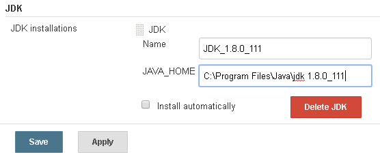
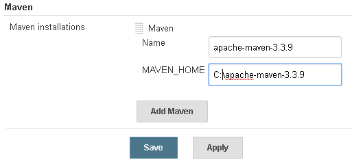
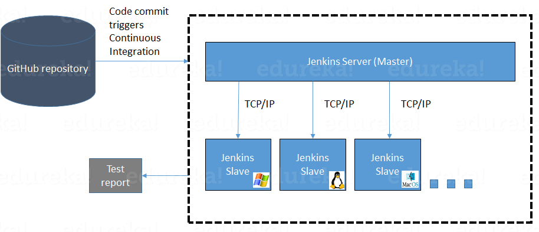
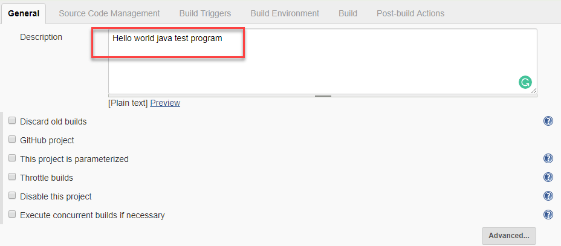
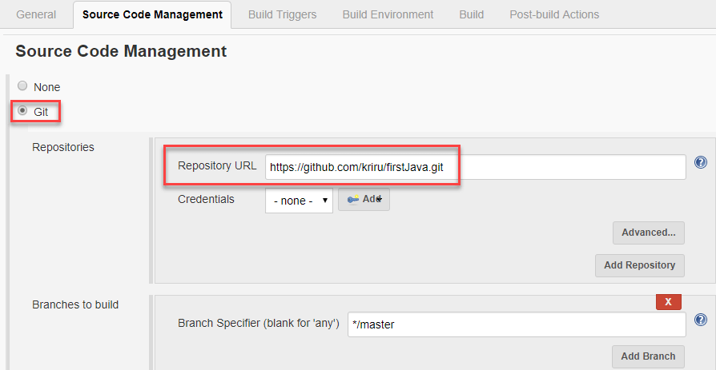
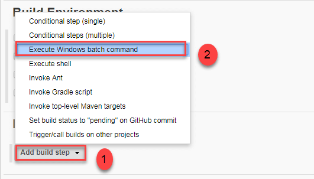
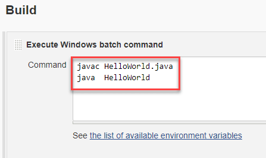
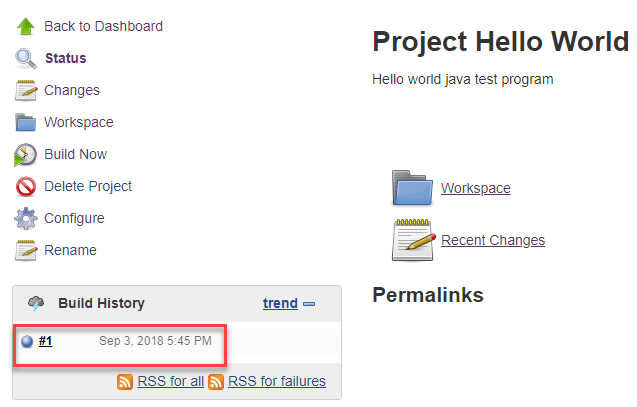
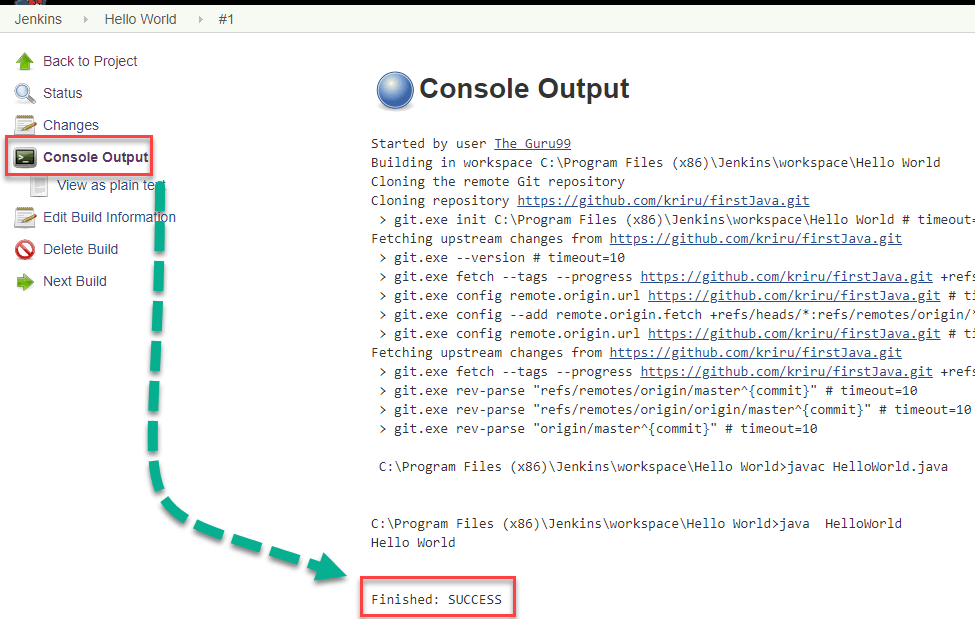
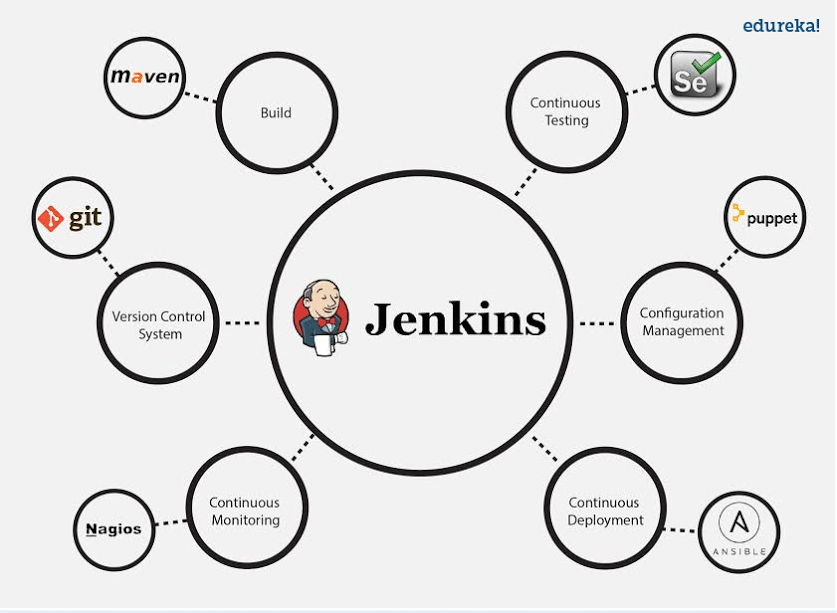

Jenkins
-------

.It it is Jenkins.war Installation, Start Jenkins from cmd line using :

**java -jar jenkins.war --httpPort=8081**

## Manage Jenkins – Java , 

**1.Navigate to Manage Jenkins → Global Tool Configuration→JDK Installations
→Add JDK**

2.Set JDK Name. For Ex: JDK_1.8.0_111 (uncheck Install automatically)

**3.Set JAVA_HOME directory path. For Ex:** C:\\Program Files\\Java\\jdk
1.8.0_111



**4.Apply & Save.**

## Maven

**Manage Jenkinks→  Global Tool Configuration→  Maven Installations→  Add
Maven**



## Jenkins Architecture


## Jenkins Distributed Architecture(Master - Slave)

Jenkins uses a Master-Slave architecture to manage distributed builds. In this
architecture, Master and Slave communicate through TCP/IP protocol.

**Jenkins Master**

Your main Jenkins server is the Master. The Master’s job is to handle:

-   Scheduling build jobs.

-   Dispatching builds to the slaves for the actual execution.

-   Monitor the slaves (possibly taking them online and offline as required).

-   Recording and presenting the build results.

-   A Master instance of Jenkins can also execute build jobs directly.

**Jenkins Slave**

A Slave is a Java executable that runs on a remote machine. Following are the
characteristics of Jenkins Slaves:

-   It hears requests from the Jenkins Master instance.

-   Slaves can run on a variety of operating systems.

-   The job of a Slave is to do as they are told to, which involves executing
    build jobs dispatched by the Master.

-   You can configure a project to always run on a particular Slave machine, or
    a particular type of Slave machine, or simply let Jenkins pick the next
    available Slave.

The diagram below is self-explanatory. It consists of a Jenkins Master which is
managing three Jenkins Slave.


Now let us look at an example in which Jenkins is used for testing in different
environments like: Ubuntu, MAC, Windows etc.The diagram below represents the
same:



The following functions are performed in the above image:

-   Jenkins checks the Git repository at periodic intervals for any changes made
    in the source code.

-   Each builds requires a different testing environment which is not possible
    for a single Jenkins server. In order to perform testing in different
    environments Jenkins uses various Slaves as shown in the diagram.

-   Jenkins Master requests these Slaves to perform testing and to generate test
    reports.

## Jenkins Pipleline Steps

1.Login

2.Click on "**New Item**" at the top left-hand side of your dashboard.

3) Select Freestyle project


** Step 4)** Enter the details of the project you want to test.



**Step 5)** Under Source Code Management, Enter your repository URL. We have a
test repository located at <https://github.com/kriru/firstJava.git>



**Step 6)** Under **build**, Click on "**Add build step**", "**Execute Windows
batch command**" and add the commands you want to execute during the build
process.





**Step 7)**  Click the **Build Now** button on the left-hand side to build the
source code.


**Step 9)** After clicking on **Build now, **you can see the status of the build
you run under **Build History**.



**Step 10)** Click on the  build number and then Click on console
output  to see the status of the build you run. It should show you a success
message, provided you have followed the setup properly.



In sum, we have executed a HelloWorld program hosted on GitHub. Jenkin pulls the
code from the remote repository and builds continuously at a frequency you
define.

## Mention some of the useful plugins in Jenkins?

Below I have mentioned some important Plugins:

-   Maven 2 project

-   Git

-   Amazon EC2

-   HTML publisher

-   Copy artifact

-   Join

-   Green Balls



## Mention what are the commands you can use to start Jenkins manually?

To start Jenkins manually open Console/Command line, then go to your Jenkins
installation directory. Over there you can use the below commands:

To start Jenkins: **jenkins.exe start**  
To stop Jenkins: **jenkins.exe stop**  
To restart Jenkins: **jenkins.exe restart**

## Explain how you can set up Jenkins job?

Go to Jenkins top page, select “New Job", then choose “Build a free-style
software project".

Now you can tell the elements of this freestyle job:

-   Optional SCM, such as CVS or Subversion where your source code resides.

-   Optional triggers to control when Jenkins will perform builds.

-   Some sort of build script that performs the build (ant, maven, shell script,
    batch file, etc.) where the real work happens.

-   Optional steps to collect information out of the build, such as archiving
    the artifacts and/or recording javadoc and test results.

-   Optional steps to notify other people/systems with the build result, such as
    sending e-mails, IMs, updating issue tracker, etc..

**Explain how to create a backup and copy files in Jenkins?**

To create a backup all you need to do is to **periodically back up your
JENKINS_HOME directory**. This contains all of your build jobs configurations,
your slave node configurations, and your build history. To create a back-up of
your Jenkins setup, just copy this directory. You can also copy a job directory
to clone or replicate a job or rename the directory.

## Explain how you can move or copy Jenkins from one server to another?

I will approach this task by copying the jobs directory from the old server to
the new one. There are multiple ways to do that, I have mentioned it below:

You can:

-   Move a job from one installation of Jenkins to another by simply copying the
    corresponding job directory.

-   Make a copy of an existing job by making a clone of a job directory by a
    different name.

-   Rename an existing job by renaming a directory. Note that if you change a
    job name you will need to change any other job that tries to call the
    renamed job.

**What are the various ways in which build can be scheduled in Jenkins?**

You can schedule a build in Jenkins in the following ways:

-   By source code management commits

-   After completion of other builds

-   Can be scheduled to run at specified time ( crons )

-   Manual Build Requests

**What is the syntax Jenkins uses to schedule items such as build jobs and SVN
polling?**

Jenkins uses the cron syntax to schedule various items within the tool.

The cron syntax is represented by **five asterisks(\* \* \* \* \*)**, with each
one separated by a space.

-   The first asterisk represents *minutes*,

-   the second represents *hours*,

-   the third the *day of the month*,

-   the fourth the *month itself*

-   fifth the *day of the week*.

>   For example, to schedule a build job to pull from GitHub every Friday at
>   5:30 p.m., the syntax would be: 30 17 \* \* 4.

**What is Jenkinsfile and what it does?**

The Jenkins pipeline details are stored in a file that is named as the Jenkins
file and it is further connected to the source code repository in general.

Jenkinsfile (Declarative Pipeline)
```python
Jenkinsfile (Declarative Pipeline)
pipeline {
    agent any

    stages {
        stage('Build') {
            steps {
                echo 'Building..'
            }
        }
        stage('Test') {
            steps {
                echo 'Testing..'
            }
        }
        stage('Deploy') {
            steps {
                echo 'Deploying....'
            }
        }
    }
}
```

