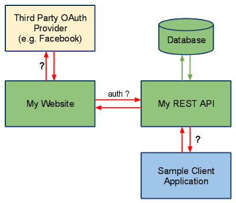

Spring MVC
==========

 ## Do you need spring-mvc.jar in your classpath or is it part of spring-core? (answer)

The **spring-mvc.jar** is not part of spring-core, which means if you want to
use Spring MVC framework in your Java project, you must include
**spring-mvc.jar** in your application's classpath. In Java web
application, spring-mvc.jar is usually placed inside WEB-INF/lib folder.

 ## What is the DispatcherServlet and what is it used for? ([answer](http://www.java67.com/2017/06/what-is-use-of-dispatcherservlet-in-spring-mvc.html))

The DispatcherServlet is an implementation of Front Controller design pattern
which handles all incoming web request to a Spring MVC application. A Front
Controller pattern is a common pattern in web applications whose job is to
receive all request and route it to different components of application for
actual processing.  
  
In case of Spring MVC, DispatcherServlet route web requests to Spring MVC
controllers.  
  
In Spring MVC, DispatcherServlet is used for finding the correct Controler to
process a request, which it does with the help of handler mapping
e.g. @RequestMapping annotation.  
  
It is also responsible for delegating logical view name to ViewResolver and then
sending the rendered response to the client.

 ## Is the DispatcherServlet instantiated via an application context? ([answer](http://javarevisited.blogspot.sg/2017/09/dispatcherservlet-of-spring-mvc-10-points-to-remember.html))
 No, DispatcherServlet is instantiated by Servlet containers like Tomcat or Jetty. You must define DispatcherServlet into the web.xml file

 ## What is the root application context in Spring MVC? How is it loaded? ([answer](https://javarevisited.blogspot.com/2012/11/difference-between-beanfactory-vs-applicationcontext-spring-framework.html#axzz5N1cdCqrn))

In Spring MVC, the context loaded using ContextLoaderListener is called the
"root" application context which belongs to the whole application while the one
initialized using DispatcherServlet is actually specific to that servlet.  
  
Technically, Spring MVC allows multiple DispatcherServlet in a Spring MVC web
application and so multiple such contexts each specific for respective servlet
but having same root context may exist.

The ContextLoaderListener is configured in web.xml as listener and you put that
inside a tag as shwon below:  
**<listener>**  
**<listener-class>**  
**org.springframework.web.context.ContextLoaderListener**  
**</listener-class>**  
**</listener>**  
  
When the Spring MVC web application is deployed, Servlet container created an
instance of ContextLoaderListener class which loads the Spring's
WebApplicationContext

 ## **What is the @Controller annotation used for? How can you create a controller without an annotation? (**[answer](https://javarevisited.blogspot.com/2017/08/difference-between-restcontroller-and-controller-annotations-spring-mvc-rest.html)**)**

The @Controller is a Spring MVC annotation to define Controller but in reality,
it's just a stereotype annotation.

You can even create a controller without @Controller by annotating the Spring
MVC Controller classes using @Component annotation.

The real job of request mapping to handler method is done
using @RequestMapping annotation.

 ## How is an incoming request mapped to a controller and mapped to a method? ([answer](http://javarevisited.blogspot.com/2017/06/how-spring-mvc-framework-works-web-flow.html))

Sometimes this question is also asked How does DispatcherServlet knows which
Controller should process the request? Well, the answer lies in something called
handler mappings.  
  
Spring uses handler mappings to associate controllers with requests, two of the
commonly used handler mappings
are BeanNameUrlHandlerMapping and SimpleUrlHandlerMapping.  
  
In BeanNameUrlHandlerMapping, when the request url matches the name of the bean,
the class in the bean definition is the controller that will handle the request.  
  
On the other hand, In SimpleUrlHandlerMapping, the mapping is more explicit. You
can specify the number of URLs and each URL can be explicitly associated with a
controller.  
  
Btw, if you are using annotations to configure Spring MVC, which you should
then @RequestMapping annotations is used to map an incoming request to a
controller and a handler method.

 ## What are some of the valid return types of a controller method? (answer)

There are many return types are available for a controller method in Spring MVC
which is annotated by @RequestMapping inside the controller. Some of the
popular ones are:

1.  **String**

2.  **void**

3.  **View**

4.  **ModelAndView (Class)**

5.  **Model (Interface)**

6.  **Map**

7.  **HttpEntity<?> or ResponseEntity<?>**

8.  **HttpHeaders**

 ## What is the Model? (answer)

Model is a reference to encapsulate data or output for rendering. Model is
always created and passed to the view in Spring MVC. If a mapped controller
method has Model as a method parameter, then a model instance is automatically
injected by Spring framework to that method.  
  
Any attributes set on the injected model are preserved and passed to the View.
Here is an example of using Model in Spring MVC:
```java
public String personDetail(Model model) {
...

model.addAttribute("name", "Joe");

...
}
```


 ## What is the purpose of the session scope? ([answer](https://javarevisited.blogspot.com/2012/05/what-is-bean-scope-in-spring-mvc.html#axzz5IZi1jCsQ))

The purpose of the session scope is to create an instance of the bean for an
HTTP Session. This means the same bean can serve multiple requests if it is
scoped in session.

You can define the scope of a Spring bean using scope attribute
or **@Scope** annotation in Spring MVC application.

 ## What is the default scope in the web context? ([answer](http://javarevisited.blogspot.sg/2012/05/what-is-bean-scope-in-spring-mvc.html))

The **singleton** scope is the default scope for a Spring bean even in the web
context.

The other three Web context-aware scopes are a **request, session, and
global-session,** which are only available in a web application
aware ApplicationContext object.

 ## What are safe REST operations? (answer)

REST API uses HTTP methods to perform operations. Some of the HTTP operations
which doesn't modify the resource at the server is known as safe operations
e.g**. GET and HEAD**.

On the other
hand, [PUT](http://javarevisited.blogspot.sg/2016/10/difference-between-put-and-post-in-restful-web-service.html)**,
POST, and DELETE are unsafe** because they modify the resource on the server

 ## What are the advantages of the RestTemplate? ([answer](http://javarevisited.blogspot.sg/2017/02/how-to-consume-json-from-restful-web-services-Spring-RESTTemplate-Example.html))

The **RestTemplate** class is an implementation of Template method pattern in
Spring framework. Similar to other popular template classes
e.g. **JdbcTemplate** or **JmsTempalte**, it also simplifies the interaction
with RESTful Web Services on the client side.i mean we can create client class
to test webservice manulay using java.

You can use it to consume a RESTful Web Servicer very easily as shown in this
example.

```java
public class App implements CommandLineRunner {
	private static final Logger log = LoggerFactory.getLogger(App.class);

	public static void main(String args[]) {
 SpringApplication.run(App.class);
	}

	public void run(String... args) throws Exception {
 RestTemplate restTemplate = new RestTemplate();
 Response response = restTemplate.getForObject("localhost:9090/student/getall",
  Response.class);
 log.info("==== RESTful API Response using Spring RESTTemplate START =======");
 log.info(response.toString());
 log.info("==== RESTful API Response using Spring RESTTemplate END =======");
	}
}
```


 ## What is an HttpMessageConverter in Spring REST? (answer)

An HttpMessageConverter is a [Strategy
interface](http://www.java67.com/2014/12/strategy-pattern-in-java-with-example.html) that
specifies a converter, **that can convert from and to HTTP requests and
responses.**

Spring REST uses this interface to convert HTTP response to various formats e.g.
**JSON or XML.**  
  
Each **HttpMessageConverter** implementation has one or several MIME Types
associated with it. Spring uses the "**Accept**" header to determine the content
type client is expecting.  
  
It will then try to find a registered **HTTPMessageConverter** that is capable
of handling that specific content-type and use it to convert the response into
that format before sending to the client.

**to create a custom implementation of HttpMessageConverter to support a new
type of request/responses,**  
You just need to create an implementation
of **AbstractHttpMessageConverter** and register it using
the WebMvcConfigurerAdapter\#extendMessageConverters() method with the classes
which generate a new type of request/response.

 ## Is @Controller a stereotype? Is @RestController a stereotype? ([answer](http://javarevisited.blogspot.sg/2017/08/difference-between-restcontroller-and-controller-annotations-spring-mvc-rest.html))

**Yes, both @Controller and @RestController are stereotypes.**

The @Controller is actually a specialization of Spring's @Component stereotype
annotation. This means that class annotated with @Controller will also be
automatically be detected by Spring container as part of container's component
scanning process.  
  
And, @RestController is a specialization of @Controller for RESTful web
service. It not only combines @ResponseBody and @Controller annotation but
also gives more meaning to your controller class to clearly indicate **that it
deals with RESTful requests.**  
  
Spring Framework may also use this annotation to provide some more useful
features related to REST API development in future.

 ## Where do you need @EnableWebMVC? (answer)

The @EnableWebMvc annotation is required to enable Spring MVC when Java
configuration is used to configure Spring MVC instead of XML. It is equivalent
to <mvc: annotation-driven>  in XML configuration.  
  
It enables support for @Controller-annotated classes that
use @RequestMapping to map incoming requests to handler methods.

 ## When do you need @ResponseStatus annotation in Spring MVC? ([answer](http://javarevisited.blogspot.sg/2018/01/7-reasons-for-using-spring-to-develop-RESTful-web-service.html#axzz55a8rTeu7))

A good questions for 3 to 5 years experienced spring developers.
The @ResponseStatus annotation is required during error handling in Spring MVC
and REST. Normally when an error or exception is thrown at server side, web
server return a blanket HTTP status code 500 - Internal server error.  
  
This may work for a human user but not for REST clients. You need to send them
proper status code e.g. 404 if the resource is not found. That's where you can
use @ResponseStatus annotation, which allows you to send custom HTTP status
code along with proper error message in case of Exception.

For example, if you are writing a RESTful Web Service for a library which
provides book information then you can use @ResponseStatus to create Exception
which returns HTTP response code 404 when a book is not found instead of
Internal Server Error (500), as shown below:

```java
@ResponseStatus(value=HttpStatus.NOT_FOUND, reason="No such Book")  // 404
 public class BookNotFoundException extends RuntimeException {
     // ...
 }
```


If this Exception is thrown from any handler method then HTTP error code 404
with reason "No such Book" will be returned to the client.

 ## Is REST secure? What can you do to secure it?

REST is normally not secure but you can secure it by using Spring security.  
  
At the very least you can enable HTTP basic authentication by using HTTP in your
Spring security configuration file. Similarly, you can expose your REST API
using[ HTTPS](http://javarevisited.blogspot.sg/2013/07/how-ssl-https-and-certificates-works-in-java-web-application.html) if
the underlying server supports HTTPS.


