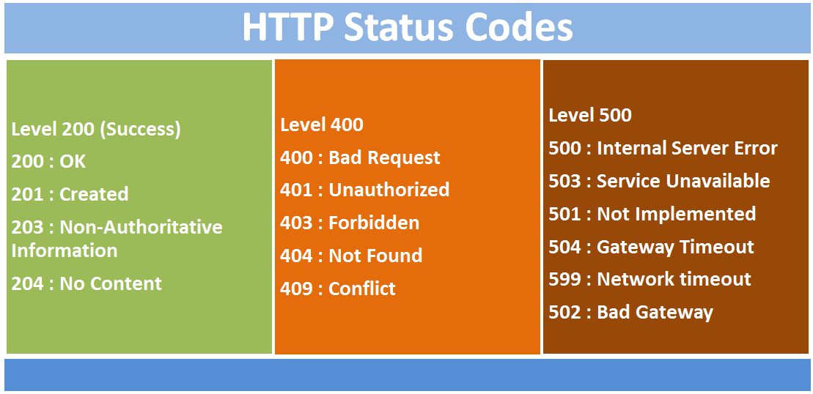
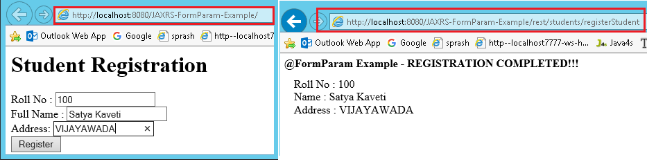

Web services
============

## How to access SOAP web service?

There are two ways to access web service

**1. If Service provider knows client**

**If Service provider knows client,** then it will provide its wsdl to client
and client will be able to access web service.


**2. If Service provider register its WSDL to UDDI and client can access it from
UDDI**

**UDDI**:UDDI stands for Universal Description, Discovery and Integration. It is
a directory service. Web services can register with a UDDI and make themselves
available through it for discovery.So following steps are involved.

*1. Service provider registers with UDDI.*

*2. Client searches for service in UDDI.*

*3. UDDI returns all service providers offering that service.*

*4. Client chooses service provider*

*5. UDDI returns WSDL of chosen service provider.*

*6. Using WSDL of service provider, client accesses web service*


## What are Rest components

It consists of two components

1. **REST server:** which provides access to the resources

2. **REST client** : which accesses and modify the REST resources.


## What is Idempotent?

Idempotent means result of multiple successful request will not change state of
resource after initial application

**For example:**

**GET is idempotent.** If Delete() is idempotent method because when you first
time use delete, it will delete the resource (initial application) but after
that, all other request will have no result because resource is already deleted.

**Post is not idempotent** method because when you use post to create resource,
it will keep creating resource for each new request, so result of multiple
successful request will not be same.

## Webservices API in java?


## JAX-WS Encoding Styles?

There are two encoding use models that are used to translate a WSDL binding to a
SOAP message. They are: **literal, and encoded.**

The combination of the different style and use models give us four different
ways to translate a WSDL binding to a SOAP message.

Document/literal

Document/encoded

RPC/literal

RPC/encoded

**When using a literal use model**, the body contents should conform to a
user-defined **XML-schema (XSD) structure**. The advantage is two-fold.

-   one, you can validate the message body with the user-defined XML-schema.

-   Two, you can also transform the message using a transformation language like
    XSLT.

**With a (SOAP) encoded use model**, the message has to use XSD datatypes, but
the structure of the message need not conform to any user-defined XML schema.
This makes it difficult to validate the message body or use XSLT based
transformations on the message body.

## Diffrence between RPC-Style and Document Style 

The way of generating SOAP message format is main difference between them.

**1. RPC Stlye**:

SOAP Body must conform to a structure that indicates the **method name &
Parameters name**

```xml
<soap:envelope> 
<soap:body> 
<myMethod> 
<x xsi:type="xsd:int">5</x> 
<y xsi:type="xsd:float">5.0</y> 
</myMethod> 
</soap:body> 
</soap:envelope>
```


**2. Document Style**

SOAP Body can be structured in any way you like. There is no TYPE attribute here
```xml
<soap:envelope> 
<soap:body> 
<xElement>5</xElement> 
<yElement>5.0</yElement> 
</soap:body> 
</soap:envelope>
```


## Steps to create JAX-WS Webservice

**1. JAX-WS Web Service End Point files**

1.  Create a Web Service Endpoint Interface with **@SOAPBinding(style =
    Style.RPC)**

2.  Create a Web Service Endpoint Implementation

3.  Create an Endpoint Publisher

4.  Test generated WSDL. Ex: **http://localhost:8080/ws/hello?wsdl**

**2. Web Service Client files**

<u>1.Java Web Service Client</u>

```java
1. Create a Web Service Endpoint Interface
package endpoint;
import javax.jws.WebMethod;  
import javax.jws.WebService;  
import javax.jws.soap.SOAPBinding;  
import javax.jws.soap.SOAPBinding.Style;  
//Service Endpoint Interface  
@WebService  
@SOAPBinding(style = Style.RPC)  
public interface HelloWorld{  
 @WebMethod 
 String getHelloWorldMsg(String msg);  
}  

2. Create a Web Service Endpoint Implementation
package endpoint;
import javax.jws.WebService;  
//Service Implementation  
@WebService(endpointInterface = "endpoint.HelloWorld")  
public class HelloWorldImpl implements HelloWorld{
	@Override
	public String getHelloWorldMsg(String msg) {
 // TODO Auto-generated method stub
 return "Your Message from WebService is : "+msg;
	}     
}  

3. Create an Endpoint Publisher
package endpoint;
import javax.xml.ws.Endpoint;  
//Endpoint publisher  
public class HelloWorldPublisher{  
    public static void main(String[] args) {  
       Endpoint.publish("http://localhost:7777/ws/hello", new HelloWorldImpl());  
       System.out.println("WSDL Published !!");
        }  
}
```

**4. Test generated WSDL**

Run HelloWorldPublisher as Java Application & access url:
<http://localhost:7777/ws/hello?wsdl>


<http://endpoint/>" uses package name of Service endpoint publisher

## wsimport tool VS wsgen

**1.wsimport –(WSDL Import)** tool is will import WSDL file and generates JAX-WS
Web Service End Point files.
```javascript
> wsimport -keep http://localhost:7777/ws/hello?wsdl
```


**2.wsGen –(WSDL Generator)**

It will read the JAX-WS Web Service End Point files & Generates WSDL Document &
Webservice client for Testing . This wsgen tool is available in $JDK/bin folder
```java
>wsgen -verbose -keep -cp . endpoint.RandomNumber
```


## Difference between JAX-RS & RESTful

-   RESTFul is a Generalized Web service Standard given by W3.ORG.

-   JAX-RS is a specification for RESTful Web Services with Java and it is given
    by Sun.

-   *Jersey* from Oracle, *Resteasy *from Jboss are the implementations of
    JAX-RS

## majorly used annotations in RESTFul webservices

-   **@Path(‘Path‘)**

-   **@GET**

-   **@POST**

-   **@PUT**

-   **@DELETE**

-   **@Produces(MediaType.TEXT_PLAIN [, more-types]) – Only for @GET**

-   **@Consumes(type[, more-types]) - Only for @POST**

-   **@PathParam()**

-   **@QueryParam()**

-   **@MatrixParam()**

-   **@FormParam()**

## Steps to creates to RestFul web-service in java?
```java
1 Add Jersey jar files in pom.xml
2. Create RESTFul webservice at Server End.
@Path("/hellojersey")  
public class HelloWorldWebService {  
  // This method is called if HTML and XML is not requested  
  @GET  
  @Produces(MediaType.TEXT_PLAIN)  
  public String sayPlainTextHello() {  
    return "Hello Jersey Plain";  
  }  

  // This method is called if HTML is requested  
  @GET  
  @Produces(MediaType.TEXT_HTML)  
  public String sayHtmlHello() {  
    return "<h1>" + "Hello Jersey HTML" + "</h1>";  
  }  
} 

3.Configure web.xml
In web.xml, register -com.sun.jersey.spi.container.servlet.ServletContainer-, and puts your Jersey service folder under -init-param-, -com.sun.jersey.config.property.packages

<web-app>
	<servlet>
 <servlet-name>jersey-serlvet</servlet-name>
 <servlet-class>
                     com.sun.jersey.spi.container.servlet.ServletContainer
                </servlet-class>
 <init-param>
      <param-name>com.sun.jersey.config.property.packages</param-name>
      <param-value>service</param-value>
 </init-param>
 <load-on-startup>1</load-on-startup>
	</servlet>

	<servlet-mapping>
 <servlet-name>jersey-serlvet</servlet-name>
 <url-pattern>/rest/*</url-pattern>
	</servlet-mapping>

</web-app>


4.Test Service
http://localhost:8080/JAXRS-Jersey-HelloWorld/rest/hellojersey

or
System.out.println(target.path("rest").path("hellojersey").request().accept(MediaType.TEXT_PLAIN).get(String.class));
  System.out.println(target.path("rest").path("hellojersey").request().accept(MediaType.TEXT_HTML).get(String.class));
	}
```

## Response Class in JAX-RS

**javax.ws.rs.core.Response** contains static methods to create a Response
instance using a **ResponseBuilder**.

**http://localhost:8080/App/rest/students/101/Satya/Vijayawada**

```java
@Path("/students")
public class PathParamService {
	
	@GET
	@Path("{rollno}/{name}/{address}")
	@Produces("text/html")
	public Response getResultByPassingValue(
 	               @PathParam("rollno") String rollno,
  	@PathParam("name") String name,
  	@PathParam("address") String address) { 
 String output = "<h1>PathParamService Example</h1>";
 output = output+"<br>Roll No : "+rollno;
 output = output+"<br>Name : "+name;
 output = output+"<br>Address : "+address;  
 return Response.status(200).entity(output).build(); 
	}
}
```


## How to set different status code in HTTP response?

For setting HTTP status code other than 200, we have to
use javax.ws.rs.core.Response class for response. Below are some of the sample
return statements showing it’s usage.
```java
return Response.status(422).entity(exception).build();
return Response.ok(response).build(); //200
```




**http://localhost:8080/App/rest/students?rollno=1218&name=SATYA
&address=VIJAYAWADA**

```java
@Path("/students")
public class QueryParamwithDefaultvalueService {
	@GET
	@Produces("text/html")
	public Response getResultByPassingValue(
                      @DefaultValue("1000") @QueryParam("rollno") String rollno,
 	@DefaultValue("XXXX") @QueryParam("name") String name,
 	@DefaultValue("XXXX") @QueryParam("address") String address) {
 String output = "<h1>QueryParamwithDefaultvalueService Example</h1>";
 output = output + "<br>Roll No : " + rollno;
 output = output + "<br>Name : " + name;
 output = output + "<br>Address : " + address;
 return Response.status(200).entity(output).build();
	}
}
http://localhost:8080/App/rest/students;rollno=1118;name=SATYA;address=VIJAYAWADA
@Path("/students")
public class MatrixParamService{	
	@GET
	@Produces("text/html")
	public Response getResultByPassingValue(
 	@MatrixParam("rollno") String rollno,
 	@MatrixParam("name") String name,
 	@MatrixParam("address") String address) {
 
 String output = "<h1>@MatrixParam Example</h1>";
 output = output+"<br>Roll No : "+rollno;
 output = output+"<br>Name : "+name;
 output = output+"<br>Address : "+address;  
 return Response.status(200).entity(output).build(); 
	}
}
```



```java
@Path("/students")
public class FormParamService {
	
	@POST
	@Path("/registerStudent")
	@Produces("text/html")
	public Response getResultByPassingValue(
 	@FormParam("rollno") String rollno,
 	@FormParam("name") String name,
 	@FormParam("address") String address) {
 
 String output = "<h1>@FormParam Example - REGISTRATION COMPLETED!!!</h1>";
 output = output+"<br>Roll No : "+rollno;
 output = output+"<br>Name : "+name;
 output = output+"<br>Address : "+address;  
 return Response.status(200).entity(output).build();
	}
}
```


## JAX-RS Download files (text/image/pdf/execel) Example

We can download any type of files from the RESTful web services, **@produces**
annotation

We should annotate our method with
 - `@Produces(-text/plain-)` If you are expecting Text file as response
 - `@Produces(-image/your image type[.jpg/.png/.gif]")` for downloading any Image files
 - `@Produces(-application/pdf-)` for downloading PDF files
 - `@Produces(MediaType.APPLICATION_JSON)`	-JSON
 - `@Produces(MediaType.APPLICATION_XML)`.	-XML


## How to Test (JAX-RS) RESTful Web Services

in real time projects we will use different tools to test RESTful web services

**1.Browser Addons**

-   Postman [ Chrome Extension ]

-   REST Client [ Chrome Extension ]

-   Advanced REST Client [ Chrome Extension ]

-   Rest Client [ Firefox Add-On ]

**2.JAX-RS Local System Tools**

-   [RESTClient UI](https://code.google.com/archive/p/rest-client/downloads)

-   [SoupUi](https://www.soapui.org/)

## What are advantages of SOAP Web Services?

SOAP web services have all the advantages that web services has, some of the
additional advantages are:

-   WSDL document provides contract and technical details of the web services
    for client applications without exposing the underlying implementation
    technologies.

-   SOAP uses XML data for payload as well as contract, so it can be easily read
    by any technology.

-   SOAP protocol is universally accepted, so it’s an industry standard approach
    with many easily available open source implementations.

## What are different components of WSDL?

Some of the different tags in WSDL xml are:

-   xsd:import namespace and schemaLocation: provides WSDL URL and unique
    namespace for web service.

-   message: for method arguments

-   part: for method argument name and type

-   portType: service name, there can be multiple services in a wsdl document.

-   operation: contains method name

-   soap:address for endpoint URL.

## What is difference between Top Down and Bottom Up approach in SOAP Web Services?

**In Top Down approach first WSDL document is created to establish the contract
between web service** and client and then code is written, it’s also termed as
contract first approach. This is hard to implement because classes need to be
written to confirm the contract established in WSDL. Benefit of this approach is
that both client and server code can be written in parallel.

**In Bottom Up approach, first web service code is written and then WSDL is
generated**. It’s also termed as contract last approach. This approach is easy
to implement because WSDL is generated based on code. In this approach client
code have to wait for WSDL from server side to start their work.

## Can we maintain user session in web services?

Web services are stateless so we can’t maintain user sessions in web services.

## What is difference between SOA and Web Services?

Service Oriented Architecture (SOA) is an architectural pattern where
applications are designed in terms of services that can be accessed through
communication protocol over network. SOA is a [design
pattern](https://www.journaldev.com/1827/java-design-patterns-example-tutorial) and
doesn’t go into implementation.

Web Services can be thought of as Services in SOAP architecture and providing
means to implement SOA pattern.

## Name some frameworks in Java to implement SOAP web services?

We can create SOAP web services using JAX-WS API, however some of the other
frameworks that can be used are Apache Axis and Apache CXF. 

## What is use of javax.xml.ws.Endpoint class?

Endpoint class provides useful methods to create endpoint and publish existing
implementation as web service. This comes handy in testing web services before
making further changes to deploy it on actual server.

## What is sun-jaxws.xml file?

This file is used to provide endpoints details when JAX-WS web services are
deployed in servlet container such as Tomcat. This file is present in WEB-INF
directory and contains endpoint name, implementation class and URL pattern. For
example;

**sun-jaxws.xml**
```java
//sun-jaxws.xml
<?xml version="1.0" encoding="UTF-8"?>
<endpoints xmlns="http://java.sun.com/xml/ns/jax-ws/ri/runtime" version="2.0">
  <endpoint
     name="PersonServiceImpl"
     implementation="com.journaldev.jaxws.service.PersonServiceImpl"
     url-pattern="/personWS"/>
</endpoints>
```

## Name important annotations used in JAX-RS API?

Some of the important JAX-RS annotations are:

-   **@Path:** used to specify the relative path of class and methods. We can
    get the URI of a webservice by scanning the Path annotation value.

-   **@GET, @PUT, @POST, @DELETE and @HEAD**: used to specify the HTTP
    request type for a method.

-   **@Produces, @Consumes:** used to specify the request and response types.

-   **@PathParam:** used to bind the method parameter to path value by parsing
    it.

## What is purpose of different HTTP Request Types in RESTful Web Service?

-   **GET** request on /employee/101, you can retrieve details of that user.

-   **POST** on employe/102 would create a new user with employee id 102,

-   **PUT** request type on /employee/101 can be used to update details of
    employee with id 101.

-   **DELETE** method on /employee/101 can be used to remove data for that id.

By the way, in the case of PUT and POST method representation would be in the
**request body**
