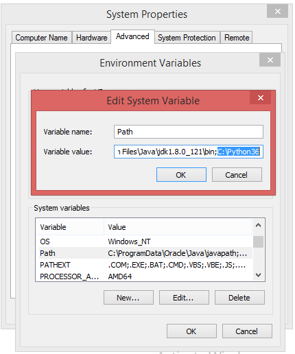
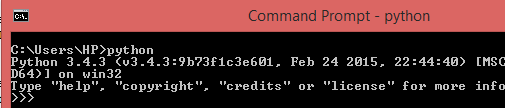

Python -Set Python Path in Windows
=============================================

```python
C:\Python27
```


My Computer > Properties > Advanced System Settings > Environment Variables > Edit

-   Right-click 'My Computer'.

-   Select 'Properties' at the bottom of the Context Menu.

-   Select 'Advanced system settings'

-   Click 'Environment Variables...' in the Advanced Tab

-   Under 'System Variables': Click Edit



Just type "python" on the **command line**


