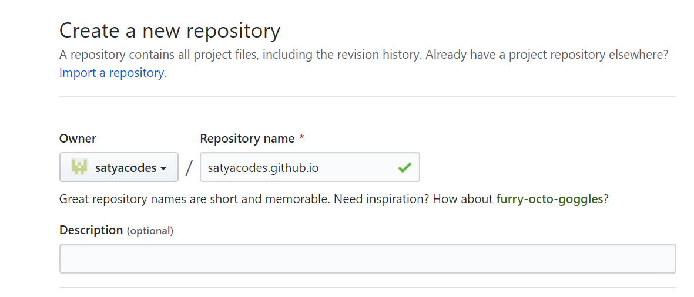
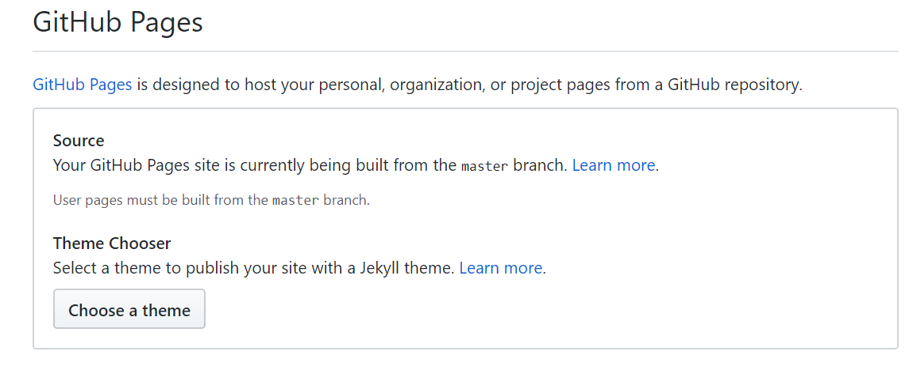
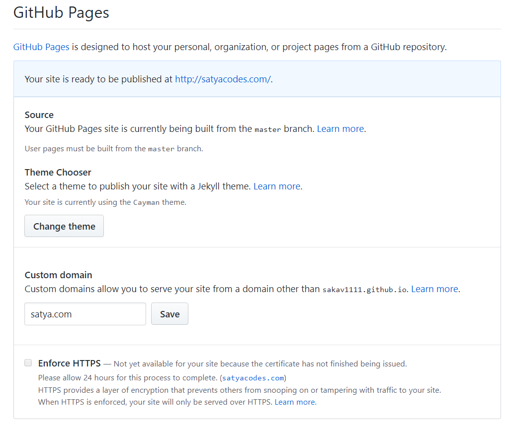
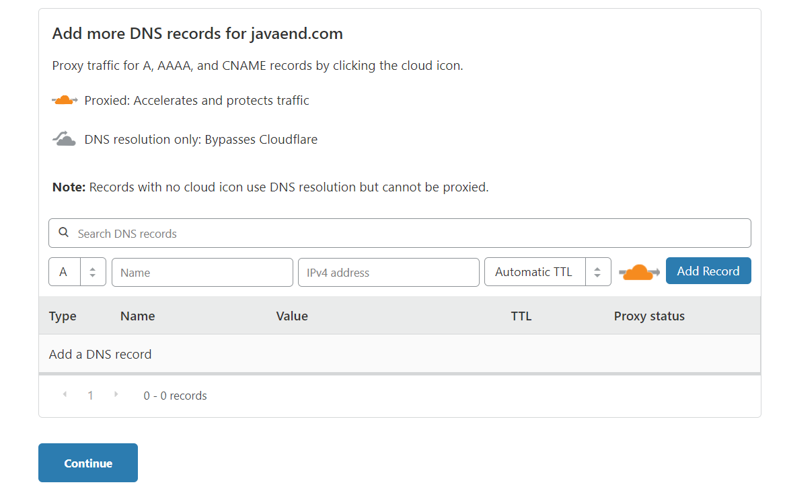
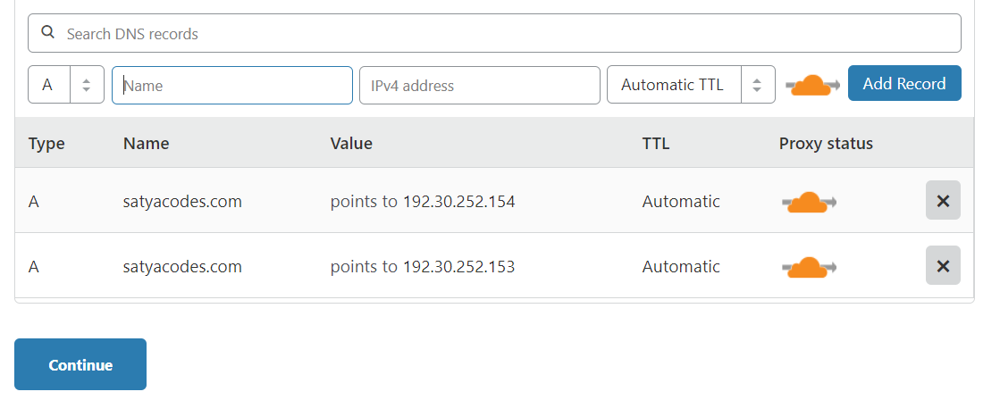
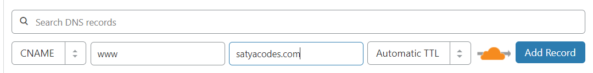
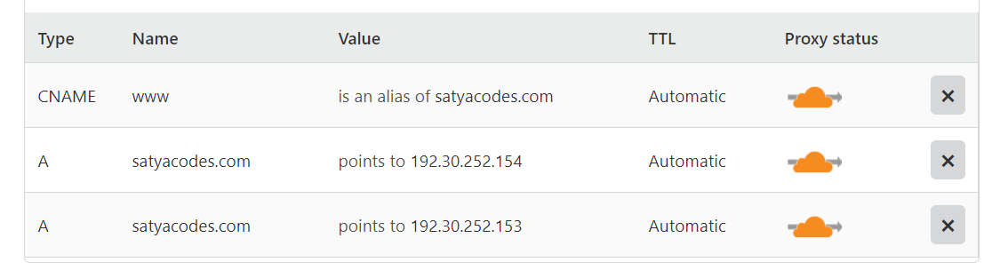
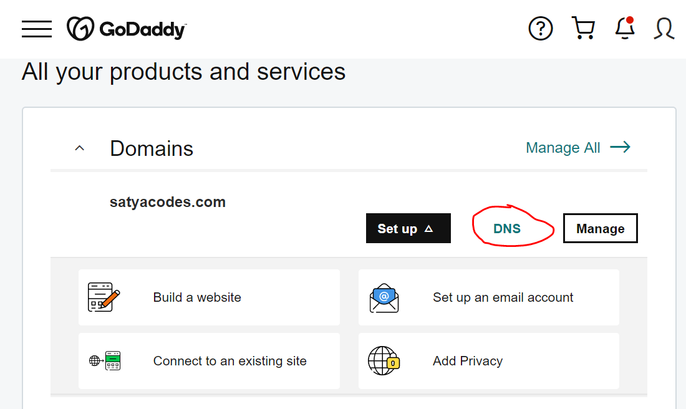
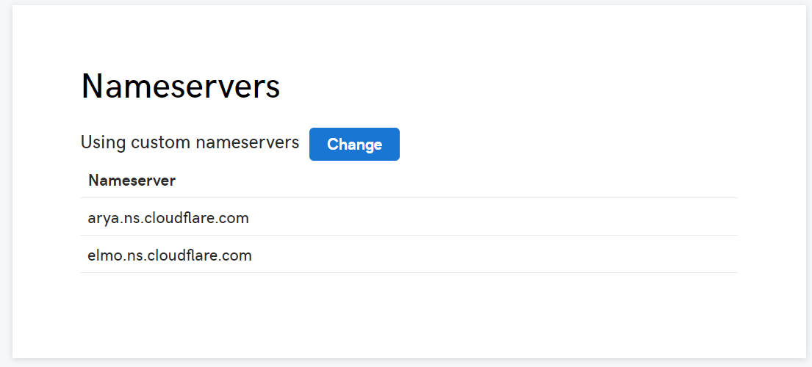

GitHub - Custom Domain Configuration
====================================

GitHub Pages Configuration
--------------------------

**Create Your Website**  
Once you’ve [signed in](https://github.com/login), you’ll create a new
repository to get started.

**Provide Repository Name**,  
it must be a proper GitHub domain:
```bash
Syntax
<username>.github.io

Example
satyacodes.github.io

#must be Public Repository
```


**To Change Username**  
-   In the upper-right corner > **click your profile photo** > then click
    **Settings**.

-   In the left sidebar, click **Account settings**.

-   In the "**Change username**" section, click Change username.




**Configure Theme**  
Repository > Settings > GitHub Pages Section > Choose a theme



Commit Changes.

GitHub Custom Domain Configuration
----------------------------------

**Add custom domain**  
`Go to Repository > Setting > GitHub pages Section > Custom Domain : Enter
Domain (Tick : Enforce HTTPS)`



GitHub Cloudflare Configuration
-------------------------------

GitHub Cloudflare GoDaddy

### GitHub to Cloudflare

Login to Cloudflare > Add Site : satya.com > Select Plan : It will scan the
DNS records.

It will Navigate to DNS Entries Page



**DNS – A Records Entry**

In this step, we inform Cloudflare to point "our domain to the Github Pages
server" using two A Record DNS entry:

**A** name Records : GitHub DNS Servers
```bash
192.30.252.153

192.30.252.154
```




**CNAME record DNS entry:**  
which will point your subdomain(www) to your apex domain(\@).



Finally, DNS records for Your domain looks like



<br>

### Cloudflare to GoDaddy

**Get Cloudflare Name Servers**

To use Cloudflare, ensure your authoritative DNS servers, or nameservers have
been changed. These are your assigned Cloudflare nameservers.

```bash
#Type Value
NS arya.ns.cloudflare.com
NS elmo.ns.cloudflare.com
```


**Update in GoDaddy Name Servers**   
`Login to GoDaddy > Product > Domain Tab : DNS`



Update Cloudflare nameservers



That’s it. Access Website Now

Ref.
----

<https://guides.github.com/features/pages/>

<https://www.freecodecamp.org/news/an-illustrated-guide-for-setting-up-your-website-using-github-cloudflare-5a7a11ca9465/>

