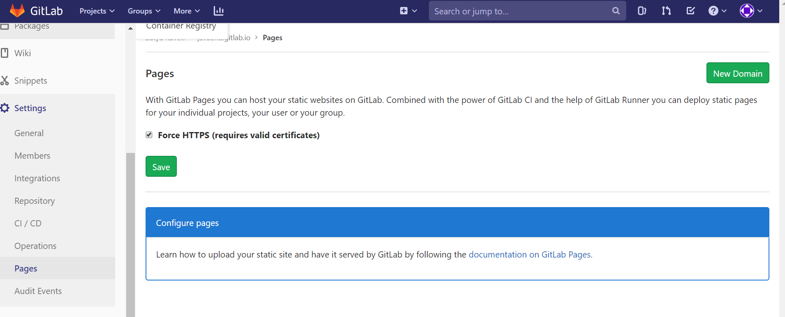
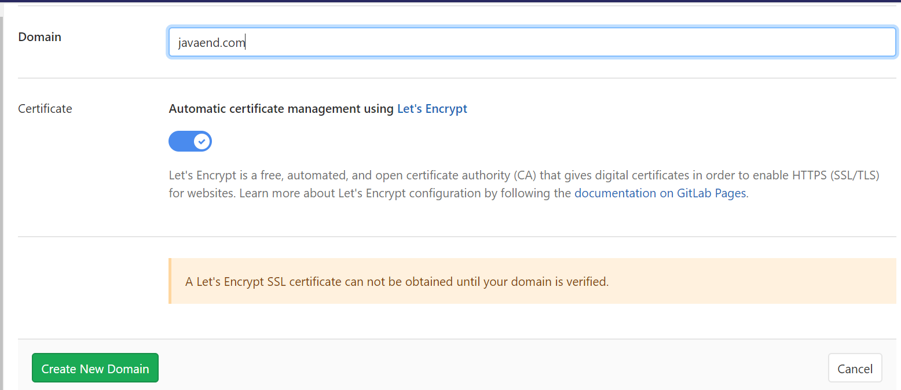
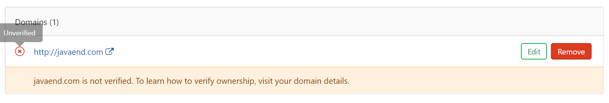
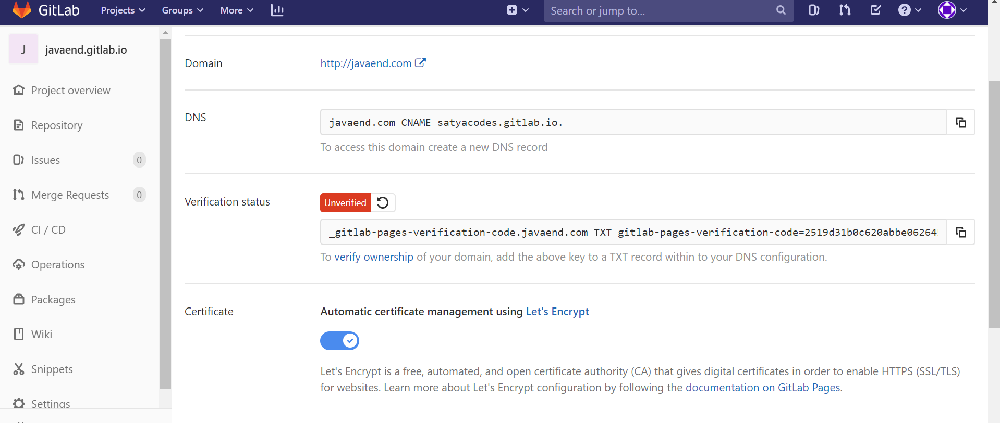
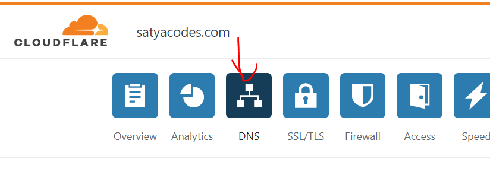

GitLab – Custom Domain Configuration
====================================

GitLab Pages Configuration
--------------------------

**Create Project**  
Project name must be : <username>.gitlab.io

**Create Pages & domain**   
Navigate to your project’s **Setting > Pages** and click **+ New domain** to
add your custom domain to GitLab






<br>

GitLab Cloudflare Configuration
-------------------------------

Login to Cloudflare > Add Site : satya.com > Select Plan : It will scan the
DNS records. It will Navigate to DNS Entries Page

Please configure DNS Records as mentioned in GitLab. You can get those details
by:

**Javaend.gitlab.io > Settings > Pages > Domains (1): EDIT**





Root domains (example.com) require:  
- A DNS A record pointing your domain to the Pages server.
satyacodes.com CNAME satyacodes.gitlab.io.

- A TXT record to verify your domain’s ownership.
_gitlab-pages-verification-code.satyacodes.com TXT gitlab-pages-verification-code=18226802e19b611120e034aca755362c



<br>

To Build Jekyll we bust configure CICD, use below code for example
```yaml
#.gitlab-ci.yml
image: ruby:2.6.5

# add bundle cache to 'vendor' for speeding up builds
cache:
  paths:
   - vendor/
before_script:
         - bundle install path vendor
# the 'pages' job will deploy and build your site to the 'public' path
pages:
  stage: deploy
  script:
   - bundle exec jekyll build -d public/
  artifacts:
     paths:
       - public
  only:
   - master # this job will affect only the 'master' branch
```
