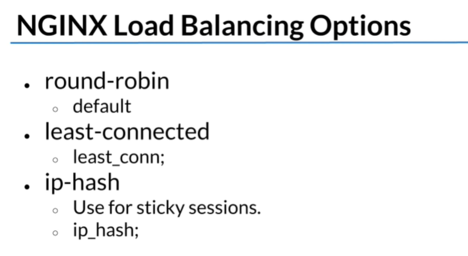
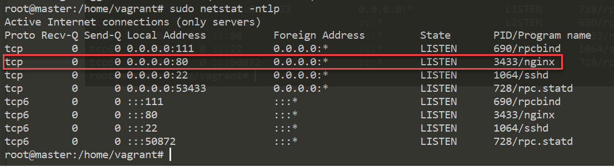
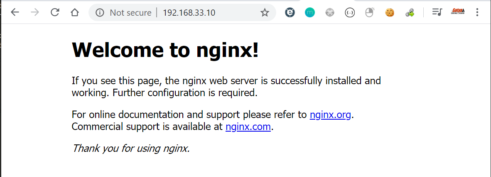
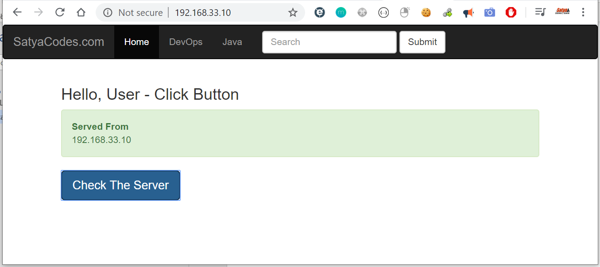
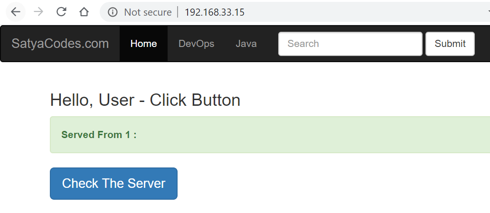
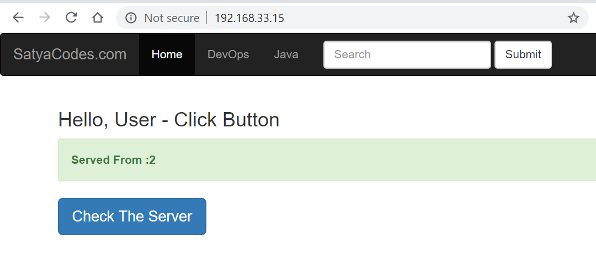

Nginx Load Balancing Example
============================

We have one load balancer & two web servers

1.  **Lb - 192.168.33.15**

2.  **Web1 - 192.168.33.10**

3.  **Web2 - 192.168.33.11**

Nginix has below loadbalncing options



Install Nginx
-------------
```python
sudo apt-get install nginx
```


**Check status**
```python
sudo netstat -ntlp
```


Access with IP : <http://192.168.33.10/>




<br>

### Change index.html with own content 

**/usr/share/nginx/html/index.html**
```html
<!DOCTYPE html>
<html lang="en">
<head>
  <title>Bootstrap Example</title>
  <meta charset="utf-8">
  <meta name="viewport" content="width=device-width, initial-scale=1">
  <link rel="stylesheet" href="https://maxcdn.bootstrapcdn.com/bootstrap/3.4.1/css/bootstrap.min.css">
  <script src="https://ajax.googleapis.com/ajax/libs/jquery/3.4.1/jquery.min.js"></script>
  <script src="https://maxcdn.bootstrapcdn.com/bootstrap/3.4.1/js/bootstrap.min.js"></script>
</head>
<body>

<nav class="navbar navbar-inverse">
  <div class="container-fluid">
    <div class="navbar-header">
      <a class="navbar-brand" href="#">SatyaCodes.com</a>
    </div>
    <ul class="nav navbar-nav">
      <li class="active"><a href="#">Home</a></li>
      <li><a href="#">DevOps</a></li>
      <li><a href="#">Java</a></li>
    </ul>
    <form class="navbar-form navbar-left" action="/action_page.php">
      <div class="form-group">
        <input type="text" class="form-control" placeholder="Search" name="search">
      </div>
      <button type="submit" class="btn btn-default">Submit</button>
    </form>
  </div>
</nav>

<div class="container">
  <h3>Hello, User - Click Button </h3>
	<div class="alert alert-success">
  <strong>Served From </strong> <p id="demo"></p>
</div> 
 

<button onclick="myFunction()" type="button" class="btn btn-primary btn-lg">Check The Server</button>
</div>
</body>


<script>
function myFunction() {
  var x = location.hostname;
  document.getElementById("demo").innerHTML= x;
}
</script>

</html>
```




Follow the same process & install them in **192.168.33.11** as well

<br>

Load Balancer configuration
---------------------------

**Install Nginx here as well**
```dos
sudo apt-get install nginx
```
  
  

**edit configuration file**
```dos
/etc/nginx/sites-available/default
```

```yaml
upstream web_backend {

  # Uncomment for the IP Hashing load balancing method:
  # ip_hash;
  # Uncomment for the Least Connected load balancing method:
  # least_conn;
  # Replace the IP addresses with the IP addresses
  # (or host names) of your back end web servers.
  # Examples:
  # server www1.example.com:8080;
  # server 192.168.1.100;

  server 192.168.33.10;
  server 192.168.33.11;

}

server {

  listen 80;
  location / {

    proxy_set_header X-Forwarded-For \$proxy_add_x_forwarded_for;
    proxy_pass http://web_backend;
  }
}
```

You can format code : <https://nginxbeautifier.com/>
  
**Reload Nginx service**
```powershell
sudo service nginx reload
```
  


Now if you open Nginx sever it will point to other web nodes based on load
balancer algorithm it is using

<http://192.168.33.15/>





Ref
===
<https://www.youtube.com/watch?v=SpL_hJNUNEI>

<https://www.linuxtrainingacademy.com/wp-content/uploads/2015/01/load-balancing-with-nginx-cheat-sheet.pdf>
