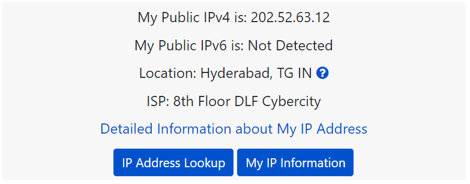

# How To access localhost application via internet

You go into your router configuration and forward port 80 to the LAN IP of the
computer running the web server.

Then anyone outside your network (but not you inside the network) can access
your site using your WAN IP address
([whatismyipcom](http://www.whatismyip.com/)).

<https://managewp.com/blog/how-to-access-a-local-website-from-internet-with-port-forwarding>

Step 1 – Find Your Local IP Address
-----------------------------------

First Go to <https://www.whatismyip.com/> check your public IP

By Ubuntu

Run ifconfig command
