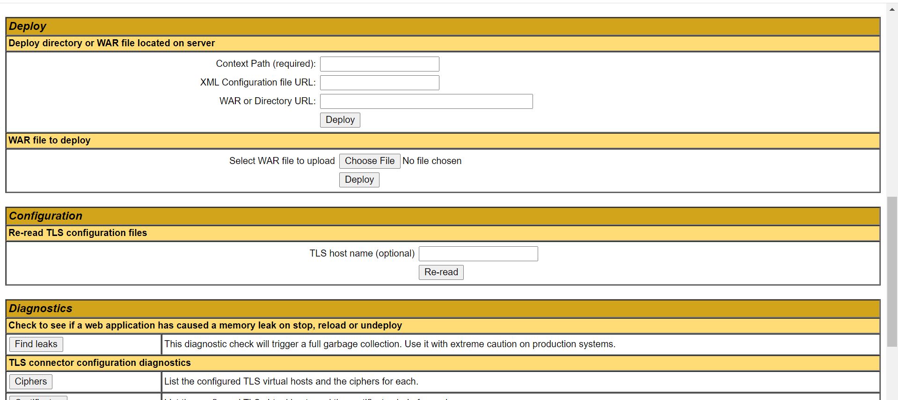

## Ways to Deploy Application in Apache Tomcat

While working with deployment of Java web applications on Tomcat, you should prepare yourself with a strong grasp about the following stuff:

-  `$CATALINA_HOME`: is an environment variable points to the directory where you installed Tomcat. For example, `c:\Program Files\Apache Software Foundation\Tomcat 7.0` on Windows.

-  `$CATALINA_BASE:` is an environment variable points to the directory of a particular instance of Tomcat (if you configure multiple instances of Tomcat).

-  Web applications are put under `$CATALINA_HOME\webapps` directory.

-  `Document root:` is the top-level directory of a web application, where all the resources (JSP pages, HTLM pages, Java classes, images…) that constitute that application are placed.

-  `Context path:` is the name which is relative to the server’s address (i.e http://localhost) and represents the name of the web application. For example, if your web application is put under $CATALINA_HOME\webapps\MyWeb directory, it will be accessed by the URL http://localhost/MyWeb, and its context path is /MyWeb.  

-  JAR libraries which are shared among web applications are put under `$CATALINA_HOME\lib` directory.

-  Application-specific JAR libraries are put under web application’s `WEB-INF\lib` directory.

### Deploy method #1: copying Java web application archive file (.war)
Copy the WAR file into `$CATALINA_HOME\webapps` directory.

Restart the server. Whenever Tomcat is started, it will unpack the WAR file it found in the webapps directory and launch the application in that manner.

### Deploy method #2: copying unpacked Java web application directory
Copy the application’s directory from its location into `$CATALINA_HOME\webapps` directory.

Restart the server, the application is deployed with the context path is name of the directory you copied.

### Deploy method #3: using Tomcat’s manager application
Access - <a href="http://localhost:8080/manager/html" target="_blank">http://localhost:8080/manager/html</a>

Upload WAR

