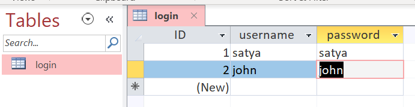
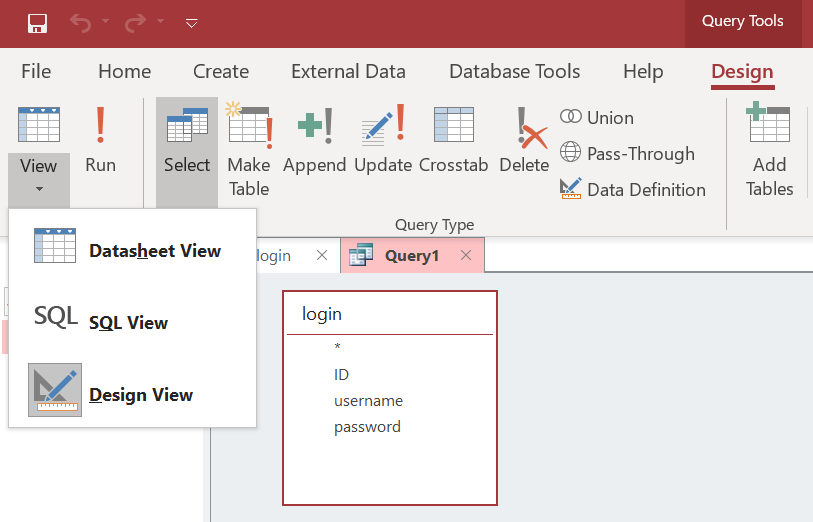
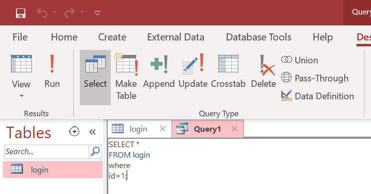

Java - Connect MS-Access Database In Java 8
-------------------------------------------


Create MS-Access DB
-------------------

-   Create MS-Access DB, should with extension **“.mdb”**

-   For this Example, we are using **“swingdb.mdb”** .

-   Create Table **login** with below data



Test / Build SQL Quires in MS-Access
------------------------------------

-   Open DB, Top menu \> Create \> Query Design \> Select Table : Finish

-   Home \> View \> SQL View



You can Run Queries here.




  


## Example to Connect Ms Access Database In Java 8

**download required JARS:**

-   [ucanaccess-4.0.1](https://mvnrepository.com/artifact/net.sf.ucanaccess/ucanaccess/4.0.1)

-   [hsqldb-2.3.1](https://mvnrepository.com/artifact/org.hsqldb/hsqldb/2.3.1)

-   [jackcess-2.1.6](https://mvnrepository.com/artifact/com.healthmarketscience.jackcess/jackcess/2.1.6)

-   [commons-logging-1.1.1](https://mvnrepository.com/artifact/commons-logging/commons-logging/1.1.1)

-   [commons-lang-2.6](https://mvnrepository.com/artifact/commons-lang/commons-lang/2.6)


**Java Program**

```java
import java.sql.Connection;
import java.sql.DriverManager;
import java.sql.ResultSet;
import java.sql.Statement;

public class Test {

    public static void main(String[] args) throws Exception {

        Class.forName("net.ucanaccess.jdbc.UcanaccessDriver");
        Connection con = DriverManager.getConnection("jdbc:ucanaccess://swingdb.mdb");
        Statement st = con.createStatement();

        ResultSet rs = st.executeQuery("select * from login");
        System.out.println("ID \t | Name \t |  PASSWD");
        System.out.println("----------------------------------");
        while (rs.next()) {
            System.out.println(rs.getString(1) + "\t | " + rs.getString(2) + " \t |  " + rs.getString(3) + "");
        }
    }
}
```

**Output**

```powershell
ID 	 | Name 	 |  PASSWD
----------------------------------
1	 | satya 	 |  satya
2	 | john 	 |  john
----------------------------------
```
