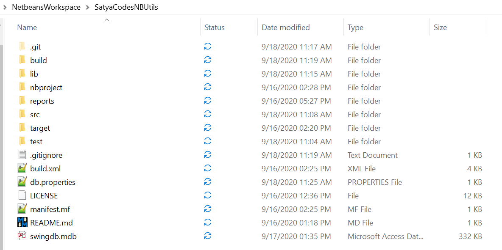

Java - JDBC Connection using Properties file in Java
-------------------------------------------

#### Create Properties file on Project Root Folder



```powershell
#db.properties

mysql.driver=com.mysql.cj.jdbc.Driver
mysql.url=jdbc:mysql://localhost:3306/swingdb?serverTimezone=UTC
mysql.username=root
mysql.password=root

msaccess.driver=net.ucanaccess.jdbc.UcanaccessDriver
msaccess.url=jdbc:ucanaccess://swingdb.mdb
```


#### Read Properties file
```java
public static Properties loadPropertiesFile() throws Exception {

    Properties prop = new Properties();
    InputStream in = new FileInputStream("db.properties");
    prop.load(in);
    in.close();
    return prop;
}

public static Connection getMySQLConnection() throws Exception {

    Properties prop = loadPropertiesFile();
    String driverClass = prop.getProperty("mysql.driver");
    String url = prop.getProperty("mysql.url");
    String username = prop.getProperty("mysql.username");
    String password = prop.getProperty("mysql.password");

    Class.forName(driverClass);
    Connection con = DriverManager.getConnection(url, username, password);

    if (con != null) {
        System.out.println("Connection SUccess " + con);
    } else {
        System.out.println("Connection Failed " + con);
    }

    return con;

}
```


## Complete Example

```java
import java.io.FileInputStream;
import java.io.InputStream;
import java.sql.Connection;
import java.sql.DriverManager;
import java.sql.ResultSet;
import java.sql.Statement;
import java.util.Properties;

 
public class DBConnection {

    public static Properties loadPropertiesFile() throws Exception {
        Properties prop = new Properties();
        InputStream in = new FileInputStream("db.properties");
        prop.load(in);
        in.close();
        return prop;
    }

    public static Connection getMySQLConnection() throws Exception {
        Properties prop = loadPropertiesFile();
        String driverClass = prop.getProperty("mysql.driver");
        String url = prop.getProperty("mysql.url");
        String username = prop.getProperty("mysql.username");
        String password = prop.getProperty("mysql.password");

        Class.forName(driverClass);
        Connection con = DriverManager.getConnection(url, username, password);

        if (con != null) {
            System.out.println("Connection SUccess " + con);
        } else {
            System.out.println("Connection Failed " + con);
        }
        return con;
    }

    public static Connection getMSAccessConnection() throws Exception {

        Properties prop = loadPropertiesFile();
        String driverClass = prop.getProperty("msaccess.driver");
        String url = prop.getProperty("msaccess.url");
        Class.forName(driverClass);
        Connection con = DriverManager.getConnection(url);
        if (con != null) {
            System.out.println("Connection SUccess " + con);
        } else {
            System.out.println("Connection Failed " + con);
        }
        return con;
    }

    public static void MSAccessDBTest() throws Exception {
        Connection con = getMSAccessConnection();
        Statement st = con.createStatement();
        ResultSet rs = st.executeQuery("select * from login");
        System.out.println("ID \t | Name \t |  PASSWD");
        System.out.println("----------------------------------");
        while (rs.next()) {
            System.out.println(rs.getString(1) + "\t | " + rs.getString(2) + " \t |  " + rs.getString(3) + "");
        }
    }

    public static void MySQLDBTest() throws Exception {
        Connection con = getMySQLConnection();
        Statement st = con.createStatement();
        ResultSet rs = st.executeQuery("select * from user");
        System.out.println("ID \t | Name \t |  PASSWD");
        System.out.println("----------------------------------");
        while (rs.next()) {
            System.out.println(rs.getString(1) + "\t | " + rs.getString(2) + " \t |  " + rs.getString(3) + "");
        }
    }

    public static void main(String[] args) throws Exception {
        MSAccessDBTest();
        MySQLDBTest();
    }
}
```


Output

```java
Connection SUccess net.ucanaccess.jdbc.UcanaccessConnection@588df31b[swingdb.mdb]
ID 	 | Name 	 |  PASSWD
----------------------------------
1	 | satya 	 |  satya
2	 | john 	 |  john


Connection SUccess com.mysql.cj.jdbc.ConnectionImpl@20deea7f
ID 	 | Name 	 |  PASSWD
----------------------------------
1	 | satya 	|  satya
2	 | 22 	     |  33
3	 | 72812781  |  jhjhjqwhjw
4	 | a 	     |  a
5	 | abc 	     |  abc
```
