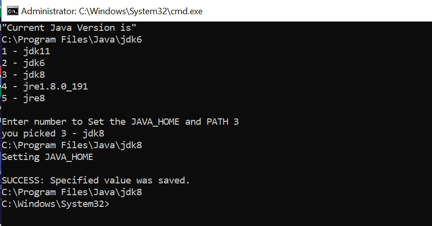

Java - Switch between multiple java versions
-------------------------------------------

#### Create .bat file with Following Content

```java
@echo off
echo "Current Java Version is"
echo %JAVA_HOME%
setlocal enableDelayedExpansion
SET PT="C:\Program Files\Java"
cd %PT%
::build "array" of folders
set folderCnt=0
for /f "eol=: delims=" %%F in ('dir /b /ad *') do (
  set /a folderCnt+=1
  set "folder!folderCnt!=%%F"
)

::print menu
for /l %%N in (1 1 %folderCnt%) do echo %%N - !folder%%N!
echo(
 
:get selection
set selection=
set /p "selection=Enter number to Set the JAVA_HOME and PATH "
echo you picked %selection% - !folder%selection%!
cd %PT%\!folder%selection%!
echo %cd%
( endlocal & rem return
   Set jdk=%cd%
 
)
echo Setting JAVA_HOME
SETX /M JAVA_HOME "%jdk%"
SET JAVA_HOME=%jdk%
echo %JAVA_HOME%
REM echo setting PATH
REM setx PATH %JAVA_HOME%\bin;%PATH% -m
REM echo Display java version
REM java -version


cmd /k
```


#### 2. Save it as "jdk.bat"

#### 3. Right click on file, Run as Administrator

#### 4. Select Appropriate version
