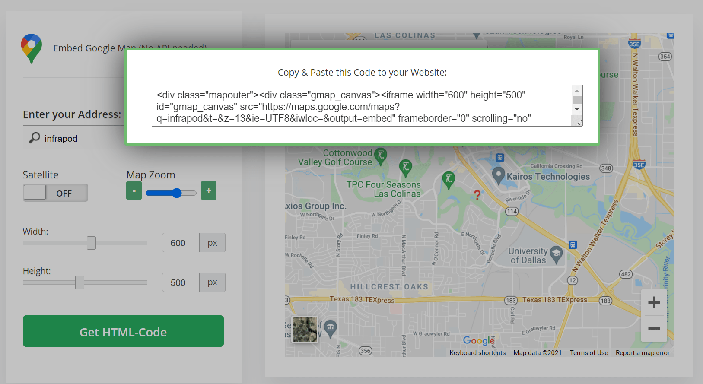

# How to add Google Map without using API key

## #1- Using Google Maps

Go to the google maps and search your desired location


Now, you will see share option, click on it. Now, a dialog box will
appear go to **embed a map**
option

Select the **Size** of the Map & **Copy HTML**. Place copied code in
your HTML page.
```javascript
<div class="col-12 mb-7">
    <iframe src="https://www.google.com/maps/embed?pb=!1m18!1m12!1m3!1d3350.9008078773454!2d-96.99278248481548!3d32.874343780942716!2m3!1f0!2f0!3f0!3m2!1i1024!2i768!4f13.1!3m3!1m2!1s0x864e820dd855ee95%3A0x2f43f2239c0faf80!2s4322%20N%20Belt%20Line%20Rd%20b113%2C%20Irving%2C%20TX%2075038%2C%20USA!5e0!3m2!1sen!2sin!4v1626678935693!5m2!1sen!2sin" width="600" height="450" style="border:0;" allowfullscreen="" loading="lazy">
    </iframe> 
</div>
```


## #2- Using 3rd party API Generator

1. Go to this Website: <https://www.embedgooglemap.net/>

2. Enter Address & Generate HTML Code


That's It.
