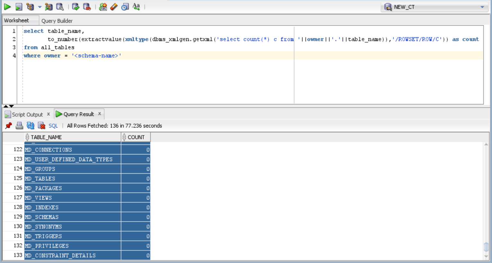

# Query to get record count of all tables in a schema oracle
```sql
select table_name, 
       to_number(extractvalue(xmltype(dbms_xmlgen.getxml('select count(*) c from '||owner||'.'||table_name)),'/ROWSET/ROW/C')) as count
from all_tables
where owner = '<SCHEMA_NAME>'
```

