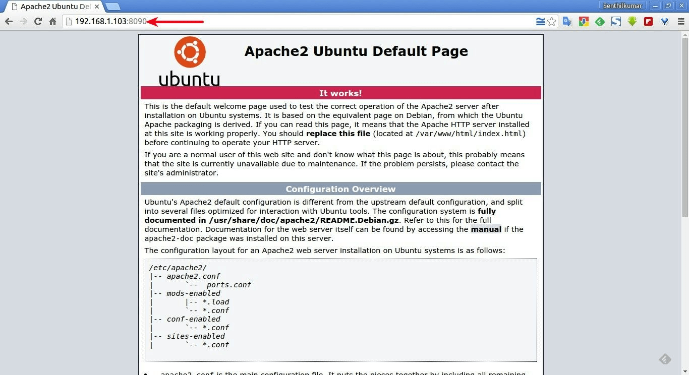

#### 1. Change Apache port on Debian/Ubuntu

Edit **/etc/apache2/ports.conf** file,

\$ sudo vi /etc/apache2/ports.conf

Find the following line:

Listen 80

And change it to a random number of your choice, for example **8090**.

Listen 8090

This entry make the server to accept connections on port 8090 on all interfaces.

To make the server accept connections on port 8090 for a specific interface,
just include the corresponding network interface’s IP address as shown below.

Listen 192.168.1.101:8090

This will be helpful if your server has multiple IP addresses or network
interfaces.

Save and close the file.

Additionally, in Ubuntu and Debian, you also have to change the port number
in **/etc/apache2/sites-enabled/000-default.conf** file too.

\$ sudo vi /etc/apache2/sites-enabled/000-default.conf

Find the following line and change the port number.

\<VirtualHost \*:8090\>

Save and close the file.

Then, restart Apache service to take effect the changes.

\$ sudo systemctl restart apache2

sudo service apache2 restart

Now let us verify the port settings:

\$ sudo netstat -tulpn \| grep :8090

Sample output:

tcp6       0      0 :::**8090**                 :::\*                    LISTEN
     4066/apache2

Then, open your web browser and navigate to URL: **http://IP-address:8090**.

You should see the following screen:

