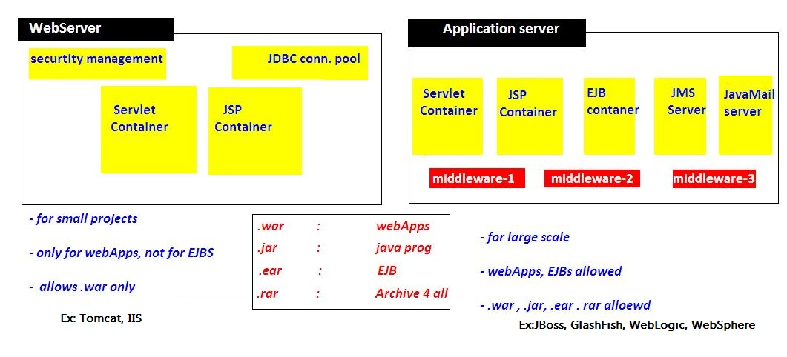

## Web Server VS Application Server?



## Servlet Lifecycle & execution flow?

-   When ever we deploys the application, container loads the application &
    creates **ServletContext** Object & waits for the Request

-   if we give `<load-on-startup>1</load-on-startup>` container will
    create ServletConfig Object when the time of Deploying application

-   when we give the url : <http://localhost:8080/Servlets/hello>, request
    goes to container, and it searches for **/hello**url pattern in web.xml

-   xml searches for **/hello** , in **\<servlet-mapping\>** and
    gets **Servelt-name**

-   container loads HelloServlet class and creates
    creates **ServletConfig** Object and calls inti() method

-   for every request it will calls **service(req,res)** method, for 100
    requests it will execute 100 times

-   **destroy()** method will be called before servlet is removed from the
    container, and finally it will be garbage collected as usual.

## HttpServlet flow of execution?

-   Container first calls **public Service(req,res)** method

-   Public Service() method internally calls **protected
    Service(req,res)** method

-   Protected Service() method will internally calling **doGet() or doPost() or
    doXXX()** depends on the type of http method used by the client

-   If the client is **not specifying the type of Http** method then Http
    protocol by **default consider GET method**,

-   so **finally** the client request is processed at **doGet() method**

## ServletRequest ?

ServletRequest is send to Server to process particular request. It can send
following details to servlet by submitting FORM or by URL.we can get these
details at server side

-   public String **getParameter(“paramname”);**

-   public Enumeration **getParameterNames();**

-   public String[] **getParamterValues(“paramname”);**

## How can we create deadlock condition on our servlet? ([detailed answer](http://javarevisited.blogspot.com/2010/10/what-is-deadlock-in-java-how-to-fix-it.html))

Ans: one simple way to call doPost() method inside doGet() and doGet()method
inside doPost() it will create deadlock situation for a servlet.

**Difference between DOM and SAX parser in Java? (answer)**  
DOM loads whole XML File in memory while SAX doesn't.

-   **SAX** is an event based parser and can be used to **parse a large file**,

-   **DOM** is fast and should be preferred for **small files**.  
      
    Read
    more: <http://www.java67.com/2018/03/top-50-core-java-interview-questions.html#ixzz5fuXtTqen>

## What is JSESSIONID in J2EE Web application - JSP Servlet?

HTTP protocol and Web Servers are stateless, what it means is that for web
server every request is a new request to process and they can’t identify if it’s
coming from client that has been sending request previously.

**Session** is a conversional state between client and server and it can consist
of multiple request and response between client and server.

Since HTTP and Web Server both are stateless, the only way to maintain a session
is when some unique information about the session (session id) is passed between
server and client in every request and response.

When we use HttpServletRequest getSession() method and it creates a new request,
it creates the new HttpSession object and also add a Cookie to the response
object with name JSESSIONID and value as session id.

This cookie is used to identify the HttpSession object in further requests from
client. If the cookies are disabled at client side and we are using URL
rewriting then this method uses the jsessionid value from the request URL to
find the corresponding session.

JSESSIONID cookie is used for session tracking, so we should not use it for our
application purposes to avoid any session related issues.

## How servlet session will work, if Cookies disabled?

In a web app, when user logs in, a HttpSession is created using HttpSession s =
request.getSession(true); This creates a cookie with jsessionid on the browser.
But if cookies are disabled on browser, How can i proceed with login?

If Cookies are disabled. You should be using URL Rewriting mechanism for Session
tracking

## Can you describe the difference between valid and well-formed XML?

A well-formed XML is the one which has **root element and all tags are closed
properly**, attributes are defined properly, their value is also quoted
properly.

On another hand, a valid XML is the one which **can be validated against an XSD
file or schema**. So it's possible for an XML to be well-formed but not valid
because they contain tags which may not be allowed by their schema.

## Maven& Ant build for diffrenrt enviroments using properties

### Ant

Ant’s build file, called **build.xml** should reside in the base directory of
the project. However *there is no restriction on the file name or its location*.
You are free to use other file names or save the build file in some other
location

```xml
<?xml version = "1.0"?>
<project name = "Hello World Project" default = "info">
   <target name = "info">
      <echo>Hello World - Welcome to Apache Ant!</echo>
   </target>
</project>

<project name="Sample Build Script" default="init" basedir=".">

            <property environment="env" /> 
            <!-- ***** COMMAND LINE ARGUMENTS DEMOED HERE -->
            <property name="build_type" value= "${env.build_type}"/>
            <property name="version" value="${env.version}"/> 
            <!-- ***** END OF COMMAND LINE ARG **** -->                 

            <property name="src.dir" value="${basedir}/source"/> 
            <property name="build.classes.dir" value="${basedir}/classes"/>
            <property name="project.name" value="myproject"/>

               <target name="make-war" depends="compile-servlet">
                   <delete file="${build.classes.dir}/war/${project.name}.war"/>    
                   <war destfile="${build.classes.dir}/war/${project.name}.war" webxml="${src.dir}/WEB-INF/web.xml">    
                   <webinf dir="${src.dir}/WEB-INF" />    

                   <fileset dir="${src.dir}/html">    
                     <include name="*.html" />
                  </fileset>

                  <classes dir="${build.classes.dir}">    
                    <include name="/my/package/*.*"/>
                  </classes>   

                  <lib dir="/some/lib/loc">
                    <include name="some-lib.jar"/>
                       </lib>
                 </war>    
            </target>   

            <target name="init" > 
               <echo message="Using Source directory=${src.dir}" />  
               <echo message="Using  Build-Classes directory=${build.classes.dir}" />  
               <!-- **** VERIFY COMMAND LINE ARGS HERE ***** -->
               <echo message="Build Type=${build_type}" />  
               <echo message="Build Version =${version}" />  
               <!-- *** END VERIFY COMMAND LINE ARGUMENTS -->
            </target>
       </project>
```


### Maven – pom.xml

I have a web app in Maven, with the default directory structure. No problem
there. The default directory structure has some property files that point to my
localhost database.

Currently I create an Ant script to create different war files - one for
production and one for development, using these commands:

```xml
ant deploy-dev
ant deploy-prod
ant deploy-sit
ant deploy-uat
```


I prefer use maven profiles for this situation. For example we have directory
structure:
```xml
src/main/resources
|
+- local
|  |
|  `- specific.properties
+- dev
   |
   `- specific.properties
```

In pom.xml define two profiles:

```xml
<profiles>
    <profile>
        <id>local</id>
        <activation>
            <activeByDefault>true</activeByDefault>
        </activation>
        <build>
            <resources>
                <resource>
                    <directory>src/main/resources/local</directory>
                </resource>
            </resources>
        </build>
    </profile>
    <profile>
        <id>dev</id>
        <build>
            <resources>
                <resource>
                    <directory>src/main/resources/dev</directory>
                </resource>
            </resources>
        </build>
    </profile>
</profiles>
```

To activate this you would type this on the command line:  
`mvn groupId:artifactId:goal -Denvironment=local`
