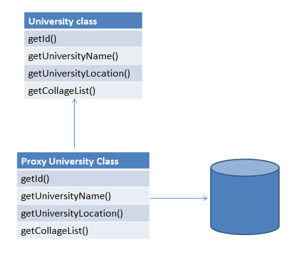
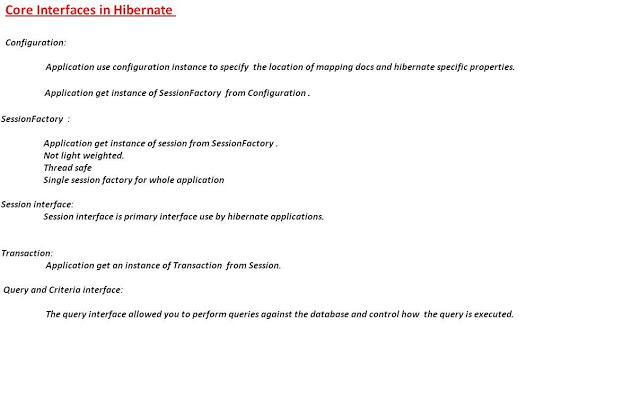
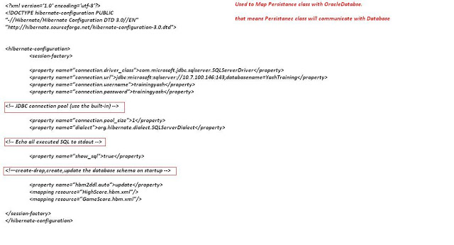
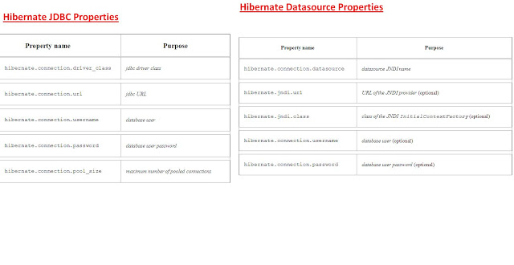
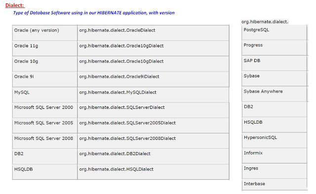
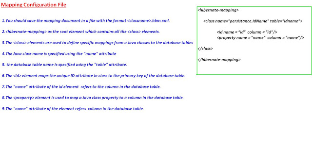

Hibernate Interview Questions
=============================

###### 1.2What are advantages of Hibernate?

-   Lazy Loading

-   Caching

-   You do not need to maintain JDBC code , Hibernate takes care of it.

-   You need to write less code

-   It provides high level object oriented API

######  2 What is caching?

Anything you can do to minimize traffic between a database and an application
server is probably a good thing. In theory, an application ought to be able to
maintain a cache containing data already loaded from the database, and only hit
the database when information has to be updated. When the database is hit, the
changes may invalidate the cache

###### 3 What are some core interfaces of hibernate?

-   Configuration

-   SessionFactory

-   Session

-   Transaction

-   Query and Criteria interface

###### **4 Difference between get() vs load() method in Hibernate? (**[detailed answer](http://javarevisited.blogspot.com/2012/07/hibernate-get-and-load-difference-interview-question.html)**)** The key difference between get() and load() method is that 

-   **load() will throw an exception** if an object with id passed to them is
    not found

-   **get() will
    return **[null](http://javarevisited.blogspot.com/2014/12/9-things-about-null-in-java.html)**.**

Another important difference is that load can return proxy without hitting the
database unless required (when you access any attribute other than id) but get()
always go to the database, so sometimes using load() can be faster than
the get() method. It makes sense to use the load() method if you know the object
exists but get() method if you are not sure about object's existence.

| **Parameter**      | **get**                                                              | **load**                                                             |
|--------------------|----------------------------------------------------------------------|----------------------------------------------------------------------|
| Database retrieval | It always hits the database                                          | It does not hit database                                             |
| If null            | If it does not get the object with id, it returns null               | If it does get the object with id, it throws ObjectNotFoundException |
| Proxy              | It returns real object                                               | It returns proxy object                                              |
| Use                | If you are not sure if object with id exists or not, you can use get | If you are sure about existence of object, you can use load          |

**5 What is the difference between save() and persist() method in Hibernate?**

-   **Serializable  Object save()** returns a Serializable object

-   **void persist()** method is void, so it doesn't return anything.

###### 6 What is the difference between and merge and update?

Use update() if you are sure that the session does not contain an already
persistent instance with the same identifier, and merge() if you want to merge
your modifications at any time without consideration of the state of the
session.

###### 7 Different between cascade and inverse

Many Hibernate developers are confuse about the cascade option and inverse
keyword. In some ways..they really look quite similar at the beginning, both are
related with relationship.

However, there is no relationship between cascade and inverse, both are totally
different notions.

1. inverse

This is used to decide which side is the relationship owner to manage the
relationship (insert or update of the foreign key column).

Example

In this example, the relationship owner is belong to stockDailyRecords
(inverse=true).

\<!-- Stock.hbm.xml --\>

\<hibernate-mapping\>

\<class name="com.mkyong.common.Stock" table="stock" ...\>

...

\<set name="stockDailyRecords" table="stock_daily_record" inverse="true"\>

\<key\>

\<column name="STOCK_ID" not-null="true" /\>

\</key\>

\<one-to-many class="com.mkyong.common.StockDailyRecord" /\>

\</set\>

...

Copy

When you save or update the stock object

session.save(stock);

session.update(stock);

Copy

Hibernate will only insert or update the STOCK table, no update on the foreign
key column. [More detail example
here…](http://www.mkyong.com/hibernate/inverse-true-example-and-explanation/)

2. cascade

In cascade, after one operation (save, update and delete) is done, it decide
whether it need to call other operations (save, update and delete) on another
entities which has relationship with each other.

Example

In this example, the cascade=”save-update” is declare on stockDailyRecords.

\<!-- Stock.hbm.xml --\>

\<hibernate-mapping\>

\<class name="com.mkyong.common.Stock" table="stock" ...\>

...

\<set name="stockDailyRecords" table="stock_daily_record"

cascade="save-update" inverse="true"\>

\<key\>

\<column name="STOCK_ID" not-null="true" /\>

\</key\>

\<one-to-many class="com.mkyong.common.StockDailyRecord" /\>

\</set\>

...

Copy

When you save or update the stock object

session.save(stock);

session.update(stock);

Copy

It will inserted or updated the record into STOCK table and call another insert
or update statement (cascade=”save-update”) on StockDailyRecord. [More detail
example
here…](http://www.mkyong.com/hibernate/hibernate-cascade-example-save-update-delete-and-delete-orphan/)

Conclusion

In short, the “inverse” is decide which side will update the foreign key, while
“cascade” is decide what’s the follow by operation should execute. Both are look
quite similar in relationship, but it’s totally two different things. Hibernate
developers are worth to spend time to research on it, because misunderstand the
concept or misuse it will bring serious performance or data integrity issue in
your application.

**8 Does SessionFactory is thread-safe in Hibernate? (detailed answer)**  
**SessionFactory is both Immutable and thread-safe** and it has just one single
instance in Hibernate application. It is used to create Session object and it
also provide caching by storing SQL queries stored by multiple session. The
second level cache is maintained at SessionFactory level.

**9 Does Hibernate Session interface is thread-safe in Java? (detailed answer)**  
No, Session object is not thread-safe in Hibernate and intended to be used
with-in single thread in the application.

**What is difference between getCurrentSession() and openSession() in
Hibernate?**

**openSession()** When you call SessionFactory.openSession, it always create new
Session object afresh and give it to you. As session objects are not thread
safe, you need to create one session object per request in multithreaded
environment and one session per request in web applications too.

**getCurrentSession()** When you call SessionFactory. getCurrentSession , it
creates a new Session if not exists , else use same session which is in current
hibernate context. It automatically flush and close session when transaction
ends, so you do not need to do externally.If you are using hibernate in single
threaded environment , you can use getCurrentSession, as it is faster in
performance as compare to creating  new session each time.

You need to add following property to hibernate.cfg.xml to use getCurrentSession
method

\<session-factory\>

\<!--  Put other elements here --\>

\<property name="hibernate.current_session_context_class"\>\</property\>

\</session-factory\>

If you do not configure above property, you will get error as below.

Exception in thread "main" org.hibernate.HibernateException: No
CurrentSessionContext configured!

######  Can you declare Entity(Bean) class as final in hibernate?

Yes, you can declare entity class as final but it is not considered as a good
practice because hibernate uses proxy pattern for lazy initialization, If you
declare it as final then hibernate won’t be able to create sub class and won’t
be able to use proxy pattern, so it will limit performance and improvement
options.

###### Does entity class (Bean) in hibernate require no arg constructor?

Yes, Entity class in hibernate requires no arg constructor because Hibernate use
reflection to create instance of entity class and it mandates no arg constructor
in Entity class

###### How do you log SQL queries issued by the Hibernate framework in Java application?

You can procedure the **show_sql** property to log [SQL
queries](https://www.janbasktraining.com/blog/sql-union-all-operators/) delivered
by the Hibernate framework

###### What is named SQL query in Hibernate?

Named queries are SQL queries which are defined in mapping document
using **\<sql-query\>** tag and called using **Session.getNamedQuery()** method.

\<sql-query name="findStudentByRollNumber"\>

\<!--[CDATA[

select \* from Student student where student.rollNumber = :rollNumber

]]--\>

\</sql-query\>

you can define named query in hibernate either by using annotations or XML
mapping file, as I said above. **\@NameQuery** is used to define single named
query and **\@NameQueries** is used to define multiple named query in hibernate.

\@NamedQueries({

\@NamedQuery(

**name = "findStockByStockCode",**

**query = "from Stock s where s.stockCode = :stockCode"**

)

})

Query query = session.getNamedQuery("findStockByStockCode")

.setString("stockCode", "7277");

###### Explain Criteria API

Criteria is a simplified API for retrieving entities by composing Criterion
objects. This is a very convenient approach for functionality like “search”
screens where there is a variable number of conditions to be placed upon the
result set.

**Example:**

List employees = session.createCriteria(Employee.class)

.add(Restrictions.like(“name”, “a%”) )

.add(Restrictions.like(“address”, “Boston”))

.addOrder(Order.asc(“name”) )

.list();

###### How do you switch between relational databases without code changes?

Using Hibernate SQL Dialects, we can switch databases. Hibernate will generate
appropriate hql queries based on the dialect defined.

###### What is Hibernate proxy?

The proxy attribute enables lazy initialization of persistent instances of the
class. Hibernate will initially return CGLIB proxies which implement the named
interface. The actual persistent object will be loaded when a method of the
proxy is invoked.

###### What is automatic dirty checking?

Automatic dirty checking is a feature that saves us the effort of explicitly
asking Hibernate to update the database when we modify the state of an object
inside a transaction.

If Dirty-checking is enabled, if we forget to call save() before the commit,
dirty-checking automatically saves the data into the database.

Consider the below code which loads a simple Entity from the database and
updates it.

**public static** void testUpdate() {

Session session = sessionFactory.openSession();

Transaction transaction = session.beginTransaction();

Entity entity = (Entity) session.load(Entity.class, 1);

entity.setData("Updating the data");

transaction.commit();

session.close();

}

Although we haven't made any session.update(entity) call, the logs indicate that
the database record was updated successful

###### What is query cache in Hibernate?

.Query cache can be used along with second level cache for improved performance.
QueryCache actually stores the result of SQL query for future calls. Hibernate
support various open source caching solution to implement Query cache e.g.
EhCache

###### What are two types of Collections in hibernate?

-   Sorted Collection

-   Ordered Collection

| **Parameter** | **Sorted Collection**                                             | **Ordered Collection**                                              |
|---------------|-------------------------------------------------------------------|---------------------------------------------------------------------|
| Sorting       | Sorted collection uses java’s sorting API to sort the collection. | Ordered Collections uses order by clause while retrieval of objects |
| Default       | It is enabled by default                                          | It is not enabled by default, you need to enable it explicitly      |

###### What is lazy loading in hibernate?

Sometimes you have two entities and there's a relationship between them. For
example, you might have an entity called University and another entity called
Student

public class University {

private String id;

private String name;

private String address;

private List\<Student\> students;

// setters and getters

}

Now when you load a University from the database, JPA loads its id, name, and
address fields for you. But you have two options for students: to load it
together with the rest of the fields (i.e. eagerly) or to load it on-demand
(i.e. lazily) when you call the university's getStudents() method.

\@OneToMany(cascade=CascadeType.ALL, fetch=FetchType.EAGER)

\@JoinColumn(name="countryId")

private List\<Student\> students;

*FetchType.LAZY*: It fetches the child entities lazily, that is, at the time of
fetching parent entity it just fetches proxy (created by cglib or any other
utility) of the child entities and when you access any property of child entity
then it is actually fetched by hibernate.

*FetchType.EAGER*: it fetches the child entities along with parent.

Lazy initialization improves performance by avoiding unnecessary computation and
reduce memory requirements.

Eager initialization takes more memory consumption and processing speed is slow.

lazy="true/false in xml

