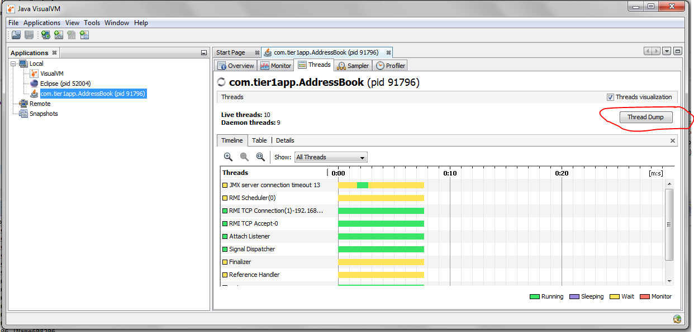

Java Interview Questions-2
==========================

Strings
-------

###### 1.What is immutable object? Can you write immutable object?

**Class –Final, Private Variables –Final, Public params Constructor, Only
getters**

Immutable classes are Java classes whose objects cannot be modified once
created. 

1.  Declare **the class as final** so it can’t be extended.

2.  Make all **fields private & final** so that direct access is not allowed &
    it’s values can be assigned only once.

3.  **Initialize** all the fields via a **constructor**

4.  Write **getters only, not setters**.

*/*/ An immutable class

public final class *Student* {

final String name;

final int regNo;

public Student(String name, int regNo) {

this.name = name;

this.regNo = regNo;

}

public String getName() {

return name;

}

public int getRegNo() {

return regNo;

}

}

// Driver class

class Test {

public static void main(String args[]) {

Student s = new Student("ABC", 101);

System.*out*.println(s.name);

System.*out*.println(s.regNo);

// *Uncommenting* below line causes error

// s.regNo = 102;

Exception in thread "main" java.lang.Error: Unresolved compilation problem:

The final field Student.regNo cannot be assigned

}

}

###### 2.What is Singleton? Can you write critical section code for singleton?

**A Singleton class is one which allows us to create only one object for JVM.**

**Private Constructor, Private Object, Public Static Factory Method**

**Rules:**

-   Create Singleton class **Object make it as PRIVATE**

-   Create **PRIVATE constructor**

-   Every Singleton class contains **at least one factory method**

*c*lass Student {

private static Student *st*;

private Student() {

System.*out*.println("OBJECET Created FIRST TIME");

}

public static Student getObject() {

if (*st* == null) {

*st* = new Student();

} else {

System.*out*.println("OBJECET ALREDAY CREATED");

}

return *st*;

}

}

public class *Singleton* {

public static void main(String[] args) {

Student s1 = Student.*getObject*();

Student s2 = Student.*getObject*();

System.*out*.println(s1.hashCode());

System.*out*.println(s2.hashCode());

}

}

In above code, it will create multiple instances of Singleton class if called by
more than one thread parallel

*Double checked locking of Singleton* is a way to ensure only one instance of
Singleton class is created through application life cycle.

This will bring us to **double checked locking pattern**, where only critical
section of code is locked. Programmer call it double checked locking because
**there are two checks**

-   **for \_instance == null, one without locking and**

-   **other with locking (inside synchronized) block.**

Here is how double checked locking looks like in Java

public static Singleton getInstanceDC() {

if (_instance == null) { // Single Checked

synchronized (Singleton.class) {

if (_instance == null) { // Double checked

\_instance = new Singleton();

}

}

}

return \_instance;

}

-   **For Cloning** – we need to Ovveride **clone()** method & Should throw
    **CloneNotSupportException**

-   **For Reflection** - we need to throw **RuntimeException(unchekd)** in
    **private Constructor**

###### Clone() will create new Object of Singleton Class?

[Cloning](https://www.geeksforgeeks.org/clone-method-in-java-2/) is a concept to
create duplicate objects. **Using clone we can create copy of object**. Suppose,
we ceate clone of a singleton object, then it wil create a copy that is there
are two instances of a singleton class, **hence the class is no more
singleton.**

public static void main(String args[]) throws CloneNotSupportedException {

Student s1 = Student.*getObject*();

Student *s2* = Student.*getObject*();

Student s3 = (Student) s1.clone();

System.*out*.println(s1);

System.*out*.println(s1);

System.*out*.println(s3);

}

Student\@15db9742

Student\@15db9742

Student\@6d06d69c // Creates new Object, our singleton failed.

To overcome this, we should override clone() method, it should throw Exception,
anyone tries to do clone

class Student implements Cloneable{

……….

\@Override

protected Object clone() throws CloneNotSupportedException {

throw new CloneNotSupportedException();

}

public static void main(String args[]) throws CloneNotSupportedException {

Student s1 = Student.*getObject*();

Student *s2* = Student.*getObject*();

Student s3 = (Student) s1.clone();

System.*out*.println(s1);

System.*out*.println(s1);

System.*out*.println(s3);

}

}

Exception in thread "main" java.lang.CloneNotSupportedException //We are GOOD
now

at Student.clone(Student.java:25)

at Student.main(Student.java:33)

**Reflection:** You can make the new instance of the Singleton class by changing
the **constructor visibility as public** in run-time and create new instance
using that constructor .

public static void main(String args[]) throws InstantiationException,
IllegalAccessException, IllegalArgumentException, InvocationTargetException {

Student s1 = Student.*getObject*();

Student s2 = null;

//1.Making Construtor visible

Constructor\<Student\>[] constructors = (Constructor\<Student\>[])
Student.class.getDeclaredConstructors();

for (Constructor constructor : constructors)

{

// Below code will destroy the singleton pattern

constructor.setAccessible(true);

s2 = (Student) constructor.newInstance();

}

System.*out*.println(s1);

System.*out*.println(s2);

//Using Class of newInstance()

Class c = Student.class;

Student s1 = Student.*getObject*();

Student s2 = (Student) c.newInstance();

System.*out*.println(s1); // Student\@15db9742

System.*out*.println(s2); // Student\@6d06d69c -Failed again

}

Student\@15db9742

Student\@6d06d69c //Failed again

To prevent Singleton failure while due to reflection you have to **throw a
run-time exception in constructor**, if the constructor is already initialized .

class Student implements Cloneable{

private static Student *st*;

private Student() {

if(*st*!=null)

throw new RuntimeException("Go Fucker.....");

}

Exception in thread "main" *java.lang.RuntimeException*: Go Fucker.....

at Student.\<init\>(*Student.java:15*)

at sun.reflect.NativeConstructorAccessor

###### How do you reverse a String in Java without using StringBuffer?

The Java library provides String Buffer and StringBuilder class with
**reverse()** method, which can be used to reverse String in Java.

String reverse = "";

String source= "My Name is Khan";

for(int i = source.length() -1; i\>=0; i--){

reverse = reverse + source.charAt(i);

}

###### How to Print duplicate characters from String?

public class RepreatedChar {

public static void main(String[] args) {

String a = "success";

// 1.convert into char array

char[] c = a.toCharArray();

// 2.create *Hashmap* store key as character, count as value

*HashMap* map = new HashMap\<\>();

for (char ch : c) {

// 3.Check if Map contains given Char as \<key\> or not

if (map.containsKey(ch)) {

// if their, get the value & increment it

int i = (int) map.get(ch);

i++;

// add updated value to it

*map.put(ch, i)*;

} else {

// if not their , add key & value as 1

*map.put(ch, 1)*;

}

}

*Set* set = map.entrySet();

*Iterator* iterator = set.iterator() ;

while (iterator.hasNext()) {

*Map.Entry* entry = (*Entry*) iterator.next();

System.*out*.println(entry.getKey()+" : "+entry.getValue());

}

}

}

s : 3

c : 2

u : 1

e : 1

###### Reverse String in Java

1.  Get String length

2.  Iterate by using charAt() in reverse & append to new String

public class ReverseString {

public static void main(String[] args) {

String s = "satyam";

String rev="";

int len = s.length();

for(int i=(len-1);i\>=0;i--){

rev = rev+s.charAt(i);

}

System.*out*.println(rev);

}

}

###### Is String contains Number or not

public class RegEx {

public static void main(String[] args) {

// Regular expression in Java to check if String is number or not

Pattern pattern = Pattern.*compile*(".\*[\^0-9].\*");

String[] inputs = { "123", "-123", "123.12", "abcd123" };

/\* Matches m = pattern.match(input);

\* boolean *ch* = m.match(); \*/

for (String input : inputs) {

System.*out*.println("does " + input + " is number : " +
!pattern.matcher(input).matches());

}

// Regular expression in java to check if String is 6 digit number or not

String[] numbers = { "123", "1234", "123.12", "abcd123", "123456" };

Pattern digitPattern = Pattern.*compile*("\\\\d{6}");

// Pattern digitPattern = Pattern.compile("\\\\d\\\\d\\\\d\\\\d\\\\d\\\\d");

for (String number : numbers) {

System.*out*.println("does " + number + " is 6 digit number : " +
digitPattern.matcher(number).matches());

}

}

}

###### Java StringTokenizer With Multiple De-limiters?

The **java.util.StringTokenizer** class allows an application to break a string
into tokens. 

**StringTokenizer(String str)**

This constructor a string tokenizer for the specified string. 

**StringTokenizer(String str, String delim)**

This constructor constructs string tokenizer for the specified string.

 The 6 useful methods of StringTokenizer class are as follows:

| **Public method**              | **Description**                                         |
|--------------------------------|---------------------------------------------------------|
| boolean hasMoreTokens()        | checks if there is more tokens available.               |
| String nextToken()             | returns the next token from the StringTokenizer object. |
| String nextToken(String delim) | returns the next token based on the delimeter.          |
| boolean hasMoreElements()      | same as hasMoreTokens() method.                         |
| Object nextElement()           | same as nextToken() but its return type is Object.      |
| int countTokens()              | returns the total number of tokens.                     |

 

**Normal Example**

public class Simple{

public static void main(String args[]){

StringTokenizer st = new StringTokenizer("my name is khan"," "); //space

while (st.hasMoreTokens()) {

System.out.println(st.nextToken());

}

}

}

==============================

Output:my

name

is

khan

 

**Java StringTokenizer with Multiple De-limiters**

for this we have to specify the Delimiters , separated by //. for Example

StringTokenizer tokenizer = new StringTokenizer(s, "//
//!//,//?//.//_//'//\@)");

public class Singleton {

public static void main(String[] args) {

String s = "He is a very very good boy, isn't he?";

StringTokenizer tokenizer = new StringTokenizer(s, "//
//!//,//?//.//_//'//\@)");

System.out.println(tokenizer.countTokens());

while (tokenizer.hasMoreTokens()) {

System.out.println(tokenizer.nextToken());

}

}

}

====================

10

He

is

a

very

very

good

boy

isn

t

he

 

###### Reverse Words in a String

public class RevWords {

public static void main(String[] args) {

// using s.split("\\\\s");

String s = "My name is Satya";

String words[] = s.split("\\\\s");

String rev = "";

int len = words.length;

for (int i = (len - 1); i \>= 0; i--) {

rev = rev + words[i];

}

System.*out*.println(rev);

// using Collections.reverse(*str*)

List\<String\> word = Arrays.*asList*(s.split("\\\\s"));

Collections.*reverse*(word);

System.*out*.println(word);

}

}

**Using String Tokenizer**

public class Test {

public static void main(String args[]) {

System.*out*.println("Using Constructor 1 -By Space ");

StringTokenizer st1 = new StringTokenizer("Hello Geeks How are you", " ");

System.*out*.println("Get TokensCount in case of revers: "+st1.countTokens());

while (st1.hasMoreTokens())

System.*out*.println(st1.nextToken());

System.*out*.println("Using Constructor 2 - By Given Symol");

StringTokenizer st2 = new StringTokenizer("JAVA : Code : String", " :");

while (st2.hasMoreTokens())

System.*out*.println(st2.nextToken());

System.*out*.println("Using Constructor 3 - Using Flag");

/\*

\* If the flag is false, delimiter characters serve to separate tokens. For

\* example, if string is "hello *geeks*" and delimiter is " ", then tokens are

\* "hello" and "*geeks*".

\*

\* If the flag is true, delimiter characters are considered to be tokens. For

\* example, if string is "hello *geeks*" and delimiter is "

\* ", then tokens are "hello", " " and "*geeks*".

\*/

StringTokenizer st3 = new StringTokenizer("JAVA : Code : String", " :", true);

while (st3.hasMoreTokens())

System.*out*.println(st3.nextToken());

}

}

###### **What does the intern() method of String class do? (**[answer](http://javarevisited.blogspot.sg/2015/12/when-to-use-intern-method-of-string-in-java.html)**)**

The **intern()** method of String class put the String on which it has called
into String pool e.g.** str.intern() **will put the String str into the pool.
Once the String is the pool it can be reused and improve performance.

**public class** Demo {

**public static void** main(String[] args) {

String s = **new** String("Satya");

String intern = s.intern();

System.*out*.println(intern);

}

}

Output

\---------

Satya

###### \#\# How to convert String to Date in Java? ([answer](http://www.java67.com/2014/12/string-to-date-example-in-java-multithreading.html))

**Prior to Java 8**, you can use **DateFormat** or **SimpleDateFormat** class to
convert a String to Date In Java or vice-versa.

**From Java 8 onwards**, when you use the new Date and Time API, you can also
use the **DateTimeFormatter** class to convert String to LocalDate, LocalTime,
or LocalDateTime class in Java.

String string = "February 6, 2014";

*date* = new *SimpleDateFormat*("MM/dd/yyyy").parse(string);

###### Formatted output in Java

Sometimes we need to print the output in a given specified format. For doing
that we have printf() method.

**printf()** can take **multiple arguments**, but System.out.print() and
System.out.println() take a single argument.

public class Demo {

public static void main(String[] args) {

int x = 100;

System.*out*.printf("Printing simple integer: x = %d\\n", x);

// this will print it *upto* 2 decimal places

System.*out*.printf("Formatted with precison: PI = %.2f\\n", Math.*PI*);

float n = 5.2f;

// automatically appends zero to the rightmost part of decimal

System.*out*.printf("Formatted to specific width: n = %.4f\\n", n);

n = 2324435.3f;

// here number is formatted from right margin and occupies a width of 20
characters

System.*out*.printf("Formatted to right margin: n = %20.4f\\n", n);

}

}

Printing simple integer: x = 100

Formatted with precison: PI = 3.14

Formatted to specific width: n = 5.2000

Formatted to right margin: n = 2324435.2500

We have The **java.lang.String.format(String format, Object... args) **method
returns a formatted string using the specified format string and arguments.

public class Demo {

public static void main(String[] args) {

double pi = Math.*PI*;

// returns a formatted string using the specified format string, and arguments

System.*out*.format("%f\\n", pi);

float f = 246.83278387f;

String s = String.*format*("%.2f\\n",f);

System.*out*.println(s);

}

}

3.141593

246.83

###### Difference between format() and printf() method in Java? ([answer](http://javarevisited.blogspot.sg/2014/02/how-to-format-and-display-number-to.html#axzz5F18OIWfY))

Even though both methods can be used to format String and they have same rules
the key difference is that 

-   format() method **returns a formatted String**

-   printf() method **print formatted String to console**.

So, if you need a formatted String, use format method and if you want to print,
then use the printf() method.

###### How do you append leading zero to a numeric String? ([answer](http://www.java67.com/2014/10/how-to-pad-numbers-with-leading-zeroes-in-Java-example.html))

You can use the **format()** method of String to append leading zeros to a
numeric String in Java.

String str = String.*format*("%04d", 9); // 0009

System.*out*.printf("original number %d, numeric string with padding : %s", 9,
str);

original number 9, numeric string with padding : 0009

we can also use **DecimalFormat** class with passing format

DecimalFormat df = new DecimalFormat("0000");

String a = df.format(9); // 0009

String b = df.format(99); // 0099

String c = df.format(999); // 0999

System.*out*.println("\\n"+a+" \\n"+b+" \\n"+c+" \\n");

0009

0099

0999

Enum
----

**Enumeration in Java** is supported by keyword enum. enums are a special type
of class that always
extends [java.lang.Enum](https://docs.oracle.com/javase/10/docs/api/java/lang/Enum.html).enums
are **Compile time Constants, because they are “public static final**

Logically, **each enum is an instance of enum type** itself. So given enum can
be seen as below declaration. **JVM internally adds ordinal and value
methods** to this class which we can call while working with enum.

public enum Direction

{

   EAST, WEST, NORTH, SOUTH;

}

final class Direction extends Enum\<Direction\>

{

    public final static Direction EAST = new Direction();

    public final static Direction WEST = new Direction();

    public final static Direction NORTH = new Direction();

    public final static Direction SOUTH = new Direction();

}

The ordinal() method returns the order of an enum instance. It represents
the sequence in the enum declaration, where the initial constant is assigned an
ordinal of '0'. It is very much like array indexes.

Direction.EAST.ordinal();     //0 

Direction.NORTH.ordinal();    //2

The **enum values()** method returns all the enum values in an **enum array**.

Direction[] directions = Direction.values();

By default, **enums don’t require constructor** definitions and their default
values are always the string used in the declaration. you can give define your
own values by constructors to initialize.

public enum Direction

{

    // enum fields

    EAST(0), WEST(180), NORTH(90), SOUTH(270);

    // internal state

    private int angle;

 

    // constructor

    private Direction(final int angle) {

        this.angle = angle;

    } 

 

    public int getAngle() {

        return angle;

    }

Public Static void Main(){

Direction north = Direction.NORTH;

System.out.println( north );                      //NORTH

 

System.out.println( north.getAngle() );           //90 

System.out.println( Direction.NORTH.getAngle() ); //90

}

}

**Remember that enum is basically a special class type, and it can have methods
and fields just like any other class**. You can add methods which
are **abstract** as well as **concrete methods** as well. Both methods are
allowed in enum.

Two classes have been added to java.util package in support of enums
– [EnumSet](https://docs.oracle.com/javase/7/docs/api/java/util/EnumSet.html) and [EnumMap](https://docs.oracle.com/javase/7/docs/api/java/util/EnumMap.html) 

*p*ublic class *Test*

{

public static void main(String[] args)

{

*Set* enumSet = *EnumSet*.of( *Direction*.EAST,

*Direction*.WEST,

*Direction*.NORTH,

*Direction*.SOUTH

);

Map enumMap = new EnumMap(Direction.class);

//Populate the Map

enumMap.put(Direction.EAST, Direction.EAST.getAngle());

enumMap.put(Direction.WEST, Direction.WEST.getAngle());

enumMap.put(Direction.NORTH, Direction.NORTH.getAngle());

enumMap.put(Direction.SOUTH, Direction.SOUTH.getAngle());

}

}

###### 1) Can Enum implement interface in Java?

**Yes, Enum can implement interface in Java**. Since enum is a type, similar
to class and interface, it can implement interface. This gives a lot of
flexibility to use Enum as specialized implementation in some cases

###### Can Enum extends class in Java?

**No, Enum can not extend class in Java**. Because all Enum by **default extend
abstract base class java.lang.Enum**, obviously they cannot extend another
class, because [Java doesn't support multiple inheritance for
classes](http://javarevisited.blogspot.com/2011/07/why-multiple-inheritances-are-not.html).
Because of extending java.lang.Enum class, all enum gets methods
like **ordinal(), values() or valueOf().**

######  Can we create instance of Enum outside of Enum itself? If Not, Why?

No, you cannot create enum instances outside of Enum boundary, because **Enum
doesn't have any **[public
constructor](http://java67.blogspot.sg/2012/12/how-constructor-chaining-works-in-java.html)**,
and compiler doesn't allow you to provide any public constructor in Enum. But we
can write private/protected Constructor.**

Since compiler generates lot of code in response to enum type declaration, it
doesn’t allow public constructors inside Enum, which enforces declaring enum
instances inside Enum itself.

###### Can we declare Constructor inside Enum in Java?

**Yes**, you can, but remember you **can only declare either private or
package-private constructor** inside enum. public and protected constructors are
not permitted inside enum.
See [here](http://java67.blogspot.sg/2012/11/java-enum-example-with-constructor.html) for
a code example.

Exception Handling
------------------

**1.Checked Exceptions:** They Checked by Compiler, the given resource is
existed or not, They are usually occur interacting with outside resources/
network resources e.g. database problems, network connection errors, missing
files etc. **Java forces you to handle these error scenarios in some manner in
your application code**

**2.Unchecked Exceptions:** occurrences of which are not checked by the compiler
like **coding, initialization, Primitive data errors. They usually result of bad
code in your system.**

**3.Error** : JVM +Memory+ OS level issues . OutofMemory, StatckOverFlow

###### What will happen if you put System.exit(0) on try or catch block? 

In normal Finally block will always execute. The only case finally block is not
executed is **System.exit(0).** In advanced case it will execute in following
case.

By Calling System.exit(0) in try or catch block, its stops execution & throws
**SecurityException few times only**.

-   If System.exit(0) **NOT throws security exception, then finally block Won’t
    be executed**

public class Demo {

public static void main(String[] args) {

try {

System.*out*.println("try");

System.*exit*(0);

}catch (Exception e) {

System.*out*.println("catch");

} finally {

System.*out*.println("finally");

}

}

}

try - (Security Exception not thrown)

-   But, if **System.exit(0) throws security exception then finally block will
    be executed**.

**java.lang.System.exit()** will terminates the currently executing program by
JVM.

-   **exit(0)** : Generally used to indicate successful termination.

-   **exit(1) or exit(-1) or any other non-zero value** –indicates unsuccessful
    termination.

###### What happens if we put return statement on try/catch? Will finally block execute?

Yes, finally block will execute even if you put a return statement in the try
block or catch block.

try {

//try block

...

return success;

}

catch (Exception ex) {

//catch block

.....

return failure;

}

finally {

System.out.println("Inside finally");

}

The answer is yes. **finally** block will execute. The only case where it will
not execute is when it encounters **System.exit().**

###### What happens when a finally block has a return statement?

Finally block overrides the value returned by try and catch blocks.

public static int myTestingFuncn(){

try{

....

return 5;

}

finally {

....

return 19;

}

}

This program would return value 19 since the value returned by try has
been overridden by finally.

Remember, if a method return any thing in try, we must place return in catch as
well.

public class Test {

public int number() {

try {

int *c* = 10 / 0;

return 100;

} catch (Exception e) {

return 200;

} finally {

return 300;

}

}

public static void main(String args[]) {

System.*out*.println(new Test().number());

}

}

0/p: 300

**Why do you think Checked Exception exists in Java, since we can also convey
error using RuntimeException?**  
**Most of checked exceptions are in java.io package**, which make sense because
if you request any system resource and its not available, than a robust program
must be able to handle that situation gracefully.

By declaring **IOException** as checked Exception, Java ensures that yours
provide that gracefully exception handling. Another possible reason could be to
ensuring that system resources like file descriptors, which are limited in
numbers, should be released as soon as you are done with that using catch or
finally block

**Have you faced OutOfMemoryError in Java? How did you solved that?**  
**OutOfMemoryError in** Java is a subclass of java.lang.VirtualMachineError and
JVM throws java.lang.OutOfMemoryError when it **ran out of memory in the heap.**

An easy way to solve OutOfMemoryError in java is to [increase the maximum heap
size](http://javarevisited.blogspot.com/2011/08/increase-heap-size-maven-ant.html) by
using JVM options "-Xmx512M", this will immediately solve your OutOfMemoryError.  

java –Xmx512m myprogram

\-Xms512m -Xmx1152m -XX:MaxPermSize=256m -XX:MaxNewSize=256m

I/O Streams
-----------

**1.ByteStreams(1 byte at a time)** : read image, audio, video etc

FileOutputStream outputStream = new FileOutputStream(*"c:\\a.txt"*);

for (int i = 0; i \< 10; i++) {

outputStream.write(i);

}

FileInputStream inputStream = new FileInputStream("c:\\a.txt");

int i;

while ((i = inputStream.read()) != -1) {

System.*out*.println("I : " + i);

}

**2.CharacterStreams(2 Bytes at a time**) : Character file data

char[] ch ={ 'a', 'b', 'c', 'd', 'e' };

FileWriter w = new FileWriter(filepath);

w.write(ch);

w.close();

FileReader r = new FileReader(filepath);

int i;

while ((i = r.read()) != -1) {

System.*out*.println(i + ":" + (char) i);

}

**3.Buffered Streams(1024 bytes at a time):** Rather than read one byte at a
time, it reads a larger block at a time into an internal buffer

// 1.Create Stream Object

FileOutputStream fos = new FileOutputStream(filepath);

// 2.pass Stream object to BufferStream constructor

BufferedOutputStream bos = new BufferedOutputStream(fos);

String s = "SmlCodes.com -Programmimg Simplified";

byte[] b = s.getBytes();

bos.write(b);

bos.flush();

// 1.Create Stream Object

FileInputStream fis = new FileInputStream(filepath);

// 2.pass Stream object to BufferStream constructor

BufferedInputStream bis = new BufferedInputStream(fis);

int i;

while((i=bis.read())!=-1){

System.out.println((char)i);

}

**4.Data streams**: above we have only Char & Byte types. I/O of primitive data
type values (*int*, long, float, and double)

DataOutputStream dos = new DataOutputStream(new FileOutputStream("sml.bin"));

dos.writeInt(10);

dos.writeUTF("Satya");

DataInputStream dis = new DataInputStream(new FileInputStream("sml.bin"));

System.out.println("Int : " + dis.readInt());

System.out.println("String : " + dis.readUTF());

5.**Object Streams** : object streams support I/O of objects. Serialization.

-   Choose the appropriate class name whose object is participating in
    serialization.

-   This class must implement java.io.Serializable interface

class Student implements *Serializable* {

// Exception in thread "main" java.io.NotSerializableException: io.Student

private int sno;

private String name;

private String addr;

}

public class *Serialization* {

public static void *main(String[] args) throws Exception* {

Student student = new Student();

student.setSno(101);

student.setName("Satya Kaveti");

student.setAddr("VIJAYAWADA");

FileOutputStream fos = new FileOutputStream("student.txt");

ObjectOutputStream oos = new ObjectOutputStream(fos);

oos.writeObject(student);

FileInputStream fis = new FileInputStream("student.txt");

ObjectInputStream ois = new ObjectInputStream(fis);

Student st = (Student)ois.readObject();

System.out.println(st.getSno());

System.out.println(st.getName());

System.out.println(st.getAddr());

}

}

>   **Can a Serializable class contain a non-serializable field in Java?
>   (answer)**  
>   Yes, but you need to make it either **static or transient**.  
>     
>   **A static variable cannot be serialized.**

>   **Static** variables belong to a class and not to any individual instance.
>   The concept of **serialization** is concerned with the object's current
>   state. Only data associated with a specific instance of a class
>   is **serialized**, therefore **static** member fields are ignored
>   during **serialization**

class *Student* implements Serializable {

// Exception in thread "main" java.io.NotSerializableException: io.Student

private int sno;

private static String *name*;

//Setters & Getters

}

public class Demo {

public static void main(String[] args) throws Exception {

Student student = new Student();

student.setSno(101);

*student.setName("Satya Kaveti")*;

FileOutputStream fos = new FileOutputStream("student.txt");

ObjectOutputStream *oos* = new ObjectOutputStream(fos);

oos.writeObject(student);

FileInputStream fis = new FileInputStream("student.txt");

ObjectInputStream *ois* = new ObjectInputStream(fis);

Student st = (Student)ois.readObject();

System.*out*.println(st.getSno());

System.*out*.println(*st.getName()*);

}

}

101

Satya Kaveti (Static serliaze ?)

Confused? Let’s stop the program, and remove writing part & re-run it!

public class Demo {

public static void main(String[] args) throws Exception {

FileInputStream fis = new FileInputStream("student.txt");

ObjectInputStream *ois* = new ObjectInputStream(fis);

Student st = (Student)ois.readObject();

System.*out*.println(st.getSno());

System.*out*.println(*st.getName()*);

}

}

101

null

This clearly indicates that static variable is not stored in the file, but the
value of the static variable that is currently loaded into memory is being
picked up, when you use *st.getName()*);

Threads
-------

###### What happens if we starts same Thread(ob) Twice?

public class ThreadDemo extends Thread {

    \@Override

    public void run() {

        System.out.println("Iam Running");

    }

    public static void main(String[] args) {

        ThreadDemo ob = new ThreadDemo();

        ob.start();

        ob.start();

    }

}

Exception in thread "main" java.lang.IllegalThreadStateException

at java.lang.Thread.start(Thread.java:705)

at threads.ThreadDemo.main(ThreadDemo.java:11)

Iam Running

###### What guarantee volatile variable provides?

volatile provides the guarantee, changes made in one thread is visible to
others.

######  [What is busy spin?](https://netjs.blogspot.com/2016/06/busy-spinning-in-multi-threading.html)

We have T1, T2, T3 tasks which are executed by the threads t1,t2,t3. But T2, T3
Should execute after T1 completes its execution. for that they must communicate
via signaling.

We can achieve this singling process in following ways

**1.Busy Wait**

**1.**here we have FLAG variable which in initialized to NO. t2, t3 threads will
check for FLAG = Yes or not for every 30 seconds via loop, util FLAG = yes.

This is called Busy Spin / Busy wait.

2.After some time, t1 changes status to YES, so that t2, t3 can proceed its
execution.

Busy spinning or busy wait in a multi-threaded environment is a technique where
other threads loop continuously waiting for a thread to complete its task and
signal them to start.

while(spinningFlag){

System.out.println("Waiting busy spinning");

}

import org.omg.Messaging.SyncScopeHelper;

public class BusySpin {

private static boolean *flag* =false;

public synchronized boolean checkFlag() {

return *flag*;

}

public synchronized boolean changeFlag() {

*flag*=true;

return *flag*;

}

public static void main(String[] args) throws Exception {

BusySpin ob = new BusySpin();

Thread t1 = new Thread() {

\@Override

public void run() {

System.*out*.println("T1 Running");

try {

Thread.*sleep*(5000);

System.*out*.println("============ SET FLAG TRUE===");

ob.changeFlag();

} catch (InterruptedException e) {

// TODO Auto-generated catch block

e.printStackTrace();

}

}

};

t1.start();

Thread t2 = new Thread() {

\@Override

public void run() {

System.*out*.println("T2 Checking ........");

while (ob.checkFlag()) {

System.*out*.println("T2 Running.....");

}

try {

wait(300);

} catch (InterruptedException e) {

// TODO Auto-generated catch block

e.printStackTrace();

}

}

};

t2.start();

Thread t3 = new Thread() {

\@Override

public void run() {

System.*out*.println("T3 Checking ........");

while (ob.checkFlag()) {

System.*out*.println("T3 Running.....");

}

try {

wait(300);

} catch (InterruptedException e) {

// TODO Auto-generated catch block

e.printStackTrace();

}

}

};

t3.start();

}

}

###### **\*\*\*\*\* What is race condition in Java? Given one example?  (answer)** “Race condition occurs when two or more threads try to read & write a shared variable at the same time”

Because the thread scheduling algorithm can swap between threads at any time,
**you don't know the order in which the threads will attempt to access the
shared data**. Therefore, the result of the change in data is dependent on the
thread scheduling algorithm, i.e. both threads are "racing" to access/change the
data.

class Counter implements Runnable {

private int count;

\@Override

public void run() {

for (int i = 1; i \<= 100; i++) {

try {

Thread.*sleep*(100);

} catch (InterruptedException e) {

// TODO Auto-generated catch block

e.printStackTrace();

}

count++;

}

}

public int getCount() {

return this.count;

}

}

public class RaceCondition{

public static void main(String[] args) throws InterruptedException {

Counter c = new Counter();

Thread t1 = new Thread(c);

t1.start();

Thread t2 = new Thread(c);

t2.start();

// wait for threads to finish processing

t1.join();

t2.join();

System.*out*.println("Excepting =200, Actual is =" + c.getCount());

}

}

Excepting =200, Actual is =141 -1st Run

**Excepting =200, Actual is =157 -2nd Run**

**What is Thread Dump? How do you take thread dump in Java?**  
Process has multiple Threads. **Thread dump** is a summary of the state of
all **threads** of the process

-   ‘**jstack’** is an effective command line tool to capture thread dumps

-   **Java VisualVM** is a GUI tool that provides detailed information about the
    applications

    

###### Why Swing is not thread-safe in Java?

Since GUI screens are mostly updated in response of user action e.g. when user
click a button, and since events are handled in the same Event dispatcher
thread, it's easy to update GUI on that thread.

###### What is a ThreadLocal variable in Java?

Thread-local variables are variables restricted to a thread, it’s like thread's
own copy which is not shared between multiple threads. Java provides
a **ThreadLocal** class to support thread-local variables, It extends Object
class.

-   Basically it is an another way to achieve thread safety apart from writing
    immutable classes.

-   Since Object is no more shared there is no requirement of Synchronization
    which can improve scalability and performance of application.

-   ThreadLocal provides thread restriction which is extension of local
    variable. ThreadLocal are visible only in single thread. No two thread can
    see each other’s thread local variable.

-   These variable are generally **private static** field in classes and
    maintain its state inside thread.

-   **void set(Object value), Object get(), void remove()** methods are
    available

public class ThreadLocalExample {

public static class MyRunnable implements Runnable {

private ThreadLocal\<Integer\> threadLocal = new ThreadLocal\<Integer\>();

public void run() {

threadLocal.set((int) (Math.*random*() \* 100D));

System.*out*.println(threadLocal.get());

}

}

public static void main(String[] args) throws InterruptedException {

MyRunnable sharedRunnableInstance = new MyRunnable();

Thread thread1 = new Thread(sharedRunnableInstance);

Thread thread2 = new Thread(sharedRunnableInstance);

thread1.start();

thread2.start();

thread1.join(); // wait for thread 1 to terminate

thread2.join(); // wait for thread 2 to terminate

}

}

\-----------

36

16

This example creates a single MyRunnable instance which is passed to two
different threads. Both threads execute the run() method, and thus sets
different values on the ThreadLocal instance. If the access to the set() call
had been synchronized, and it had not been a ThreadLocal object, the second
thread would have overridden the value set by the first thread

**Write code for thread-safe Singleton in Java?**

When we say thread-safe, which means Singleton should remain singleton even if
initialization occurs in the case of multiple threads. 

public class DoubleCheckedLockingSingleton {

private volatile DoubleCheckedLockingSingleton INSTANCE;

private DoubleCheckedLockingSingleton() {

}

public DoubleCheckedLockingSingleton getInstance(){

if(INSTANCE == null){

synchronized(DoubleCheckedLockingSingleton.class){

//double checking Singleton instance

if(INSTANCE == null){

INSTANCE = new DoubleCheckedLockingSingleton();

}

}

}

return INSTANCE;

}

}

**When to use Runnable vs Thread in Java? (Think Inheritance)**  
it's better to implement Runnable then extends Thread if you **also want to
extend another class**  

###### Difference between Runnable and Callable in Java?  

Callable was added on JDK 1.5. Main difference between these two is that
Callable's **call()** method can return value and throw Exception, which was not
possible with Runnable's run() method. Callable return **Future** object, which
can hold the result of computation.

class SumTask implements Callable\<Integer\> {

private int num = 0;

public SumTask(int num){

this.num = num;

}

\@Override

public Integer call() throws Exception {

int result = 0;

for(int i=1;i\<=num;i++){

result+=i;

}

return result;

}

}

public class CallableDemo {

public static void main(String[] args) throws Exception {

ExecutorService service = Executors.newSingleThreadExecutor();

SumTask sumTask = new SumTask(20);

Future\<Integer\> future = service.submit(sumTask);

Integer result = future.get();

System.out.println(result);

}

}

###### How to stop a thread in Java?

There was some control methods in JDK 1.0
e.g**. stop(), suspend() and resume()** which are deprecated.

We can do it in Two ways

*1.Using interrupt()*

public class Demo {

public static void main(String[] args) throws Exception {

Runnable runnable = ()-\>{

System.*out*.println("Running...");

try {

Thread.*sleep*(5000);

} catch (InterruptedException e) {

// TODO Auto-generated catch block

e.printStackTrace();

}

System.*out*.println("I have Completed ...");

};

Thread t1 = new Thread(runnable);

t1.start();

t1.interrupt();

}

}

Running...

I have Completed ...

*java.lang.InterruptedException*: sleep interrupted

at java.lang.Thread.sleep(*Native Method*)

at Demo.lambda\$0(*Demo.java:16*)

at java.lang.Thread.run(*Thread.java:748*)

**In this case we can only stop Sleeping thread.**

2. **volatile boolean variable**

In this case we need to use **volatile boolean variable**, & we need to change
value to TRUE if we want to stop a thread.

I have a server; I need it to Stop

class Server implements Runnable {

private volatile boolean stop = false;

public void run() {

while (!stop) {

System.*out*.println("Server is running.....");

}

System.*out*.println("Server is stopped....");

}

public void stop() {

stop = true;

}

}

public class Demo {

public static void main(String[] args) throws Exception {

Server myServer = new Server();

Thread t1 = new Thread(myServer, "T1");

t1.start();

// Now, let's stop our Server thread

System.*out*.println(Thread.*currentThread*().getName() + " is stopping Server
thread");

TimeUnit.*MILLISECONDS*.sleep(8);

myServer.stop();

// Let's wait to see server thread stopped

System.*out*.println(Thread.*currentThread*().getName() + " is finished now");

}

}

Actually we are not stoping the Thread, we just coming out of the run().

**Why wait, notify and notifyAll are not inside thread class?**  
Java provides lock at object level not at thread level. Every object has lock,
which is acquired by thread. Now if thread needs to wait for certain lock it
make sense to call wait() on that object rather than on that thread.

Had wait() method declared on Thread class, it was not clear that for which lock
thread was waiting. In short, since wait, notify and notifyAll operate at lock
level, it make sense to defined it on object class because lock belongs to
object.

###### **What is the difference between Deadlock, Starvation, and Livelock?**

**Deadlock**: is a situation where two more threads are blocked because of
waiting for each other forever.one of the possible situation is **nested
Synchronized blocks.**

To create simple deadlock situation for a servlet, just place doPost() method
inside doGet() and doGet()method inside doPost().

public class Business {

 

    private Object lock1 = new Object();

    private Object lock2 = new Object();

 

    public void foo() {

        synchronized (lock1) {

            synchronized (lock2) {

                System.out.println("foo");

            }

        }

    }

 

    public void bar() {

        synchronized (lock2) {

            synchronized (lock1) {

                System.out.println("bar");

            }

        }

    }

public static void main(String[] args) {

        Business business = new Business();

 

        Thread t1 = new Thread(new Runnable() {

            public void run() {

                business.foo();

            }

        });

 

        t1.start();

 

        Thread t2 = new Thread(new Runnable() {

            public void run() {

                business.bar();

            }

        });

 

        t2.start();

    }

}

**how to avoid deadlock**

-   Avoid acquiring more than one lock at a time.

-   If not, make sure that you acquire multiple locks in consistent order.

In the above example, you can avoid deadlock by synchronize two locks in the
same order in both methods.

public void foo() {

    synchronized (lock1) {

        synchronized (lock2) {

            System.out.println("foo");

        }

    }

}

 

public void bar() {

    synchronized (lock1) {

        synchronized (lock2) {

            System.out.println("bar");

        }

    }

}

**2.LiveLock** :A real-world example of livelock occurs when two people meet in
a narrow corridor**(తాడిమట్ట),** and each tries to be polite by moving aside to let
the other pass, but they end up swaying from side to side without making any
progress because they both repeatedly move the same way at the same time.

Livelock occurs when two or more processes continually repeat the same
interaction in response to changes in the other processes without doing any
useful work. These processes are not in the waiting state, and they are running
concurrently. This is different from a deadlock because in a deadlock all
processes are in the waiting state.

public class Test {

boolean selected=false;

public boolean isSelected() {

return selected;

}

public void setSelected(boolean selected) {

this.selected = selected;

}

public static void main(String args[]) {

Test itemOne = new Test();

Test itemTwo = new Test();

Thread tOne = new Thread(new Runnable() {

\@Override

public void run() {

while(!itemOne.isSelected()) {

try {

Thread.*sleep*(10);

} catch (InterruptedException e) {

e.printStackTrace();

}

}

itemTwo.setSelected(true);

}

});

Thread tTwo = new Thread(new Runnable() {

\@Override

public void run() {

while(!itemTwo.isSelected()) {

try {

Thread.*sleep*(10);

} catch (InterruptedException e) {

e.printStackTrace();

}

}

itemOne.setSelected(true);

}

});

tOne.start();

tTwo.start();

}

}

**3. Starvation:** describes a situation where a thread holds a resource for a
long time so other threads are blocked forever. The blocked threads are waiting
to acquire the resource but they never get a chance. Thus they starve to
death.BTW, Starvation *means suffering or death caused by lack of food*.

Starvation can occur due to the following reasons:

\- Threads are blocked infinitely because a **thread takes long time to
execute** some synchronized code (e.g. heavy I/O operations or infinite loop).

\- A **thread doesn’t get CPU’s time for execution because it has low priority
as compared to other threads which have higher priority**.

\- Threads are waiting on a resource forever but they remain waiting forever
because other threads are constantly notified instead of the hungry ones.

When a starvation situation occurs, the program is still running but doesn’t run
to completion because some threads are not executed.

public class *Worker* {

public synchronized void work() {

String name = Thread.*currentThread*().getName();

String fileName = name + ".txt";

try (

*BufferedWriter* writer = new *BufferedWriter*(new *FileWriter*(fileName));

) {

writer.write("Thread " + name + " wrote this mesasge");

} catch (*IOException* ex) {

ex.printStackTrace();

}

while (true) {

System.*out*.println(name + " is working");

}

}

public static void main(String[] args) {

Worker worker = new Worker();

for (int i = 0; i \< 10; i++) {

new Thread(new Runnable() {

public void run() {

worker.work();

}

}).start();

}

}

}

//we created 10 threads but, 1st threads run continuously in infinite loop,
remaining will die because they won’t get any chance to execute.

Finally,

\- **Deadlock**:  All threads are blocked, the program hangs forever.

\- **Livelock**: No threads blocked but they run into infinite loops. The
program is still running but unable to make further progress.

\- **Starvation**: Only one thread is running, and other threads are waiting
forever

<https://www.codejava.net/java-core/concurrency/understanding-deadlock-livelock-and-starvation-with-code-examples-in-java>

**How do you check if a Thread holds a lock or not?**  
There is a method called **holdsLock()** on java.lang.Thread, it returns true if
and only if the current thread holds the monitor lock on the specified object. 

Thread t = Thread.*currentThread*();

System.*out*.println(Thread.*holdsLock*(t));//true or flase -checked

**What is Semaphore in Java?**  
Semaphore in Java is a new kind of synchronizer. It's a counting semaphore.
Conceptually, a semaphore maintains a set of permits. Each **acquire()** blocks
if necessary until a permit is available, and then takes it. Each **release()**
adds a permit, potentially releasing a blocking acquirer. However, no actual
permit objects are used; the Semaphore just keeps a count of the number
available and acts accordingly. Semaphore is used to protect an expensive
resource which is available in fixed number e.g. database connection in the
pool.

**What is the difference between the submit() and execute() method thread pool
in Java?**

-   **execute(Runnable command)** is defined in Executor interface and executes
    given task in future, but more importantly, it does not return anything. 

-   **submit()** is an overloaded method, it can take
    either **Runnable or Callable** task and can return Future object which can
    hold the pending result of computation. This method is defined
    on **ExecutorService** interface, which extends Executor interface, and
    every other thread pool class
    e.g. ThreadPoolExecutor or ScheduledThreadPoolExecutor gets these methods.

**Which method of Swing API are thread-safe in Java?**  
I know about **repaint(),** and revalidate() being thread-safe but there are
other methods on different swing components e.g. **setText() method
of JTextComponent, insert() and append()** method of JTextArea class.

**What is the difference between the volatile and atomic variable in Java?**  
For example count++ operation will not become atomic just by declaring count
variable as volatile. On the other hand AtomicInteger class provides atomic
method to perform such compound operation atomically e.g. getAndIncrement() is
atomic replacement of increment operator. It can be used to atomically increment
current value by one. Similarly, you have atomic version for other data type and
reference variable as well.

**What happens if a thread throws an Exception inside synchronized block?**  
To answer this question, no matter how you exist synchronized block, either
normally by finishing execution or abruptly by throwing exception**, thread
releases the lock it acquired** while entering that synchronized block.

###### How do you ensure that N thread can access N resources without deadlock?

**Key point here is order**, if you acquire resources in a particular order and
release resources in reverse order you can prevent deadlock. 

###### What’s the difference between Callable and Runnable?

Both of these are interfaces used to carry out task to be executed by a thread.
The main difference between the two interfaces is that

-   Callable can **return a value**, while Runnable cannot.

-   Callable can throw a checked exception, while Runnable cannot.

-   Runnable has been around since Java 1.0, while Callable was introduced as
    part of Java 1.5.

The *Callable* interface is a generic interface containing a
single *call()* method – which returns a generic value *V*:

public interface *Callable*\<V\> {

V call() throws Exception;

}

class CallableExample implements *Callable*

{

public Object call() throws Exception

{

*Random* generator = new *Random*();

Integer randomNumber = generator.nextInt(5);

Thread.*sleep*(randomNumber \* 1000);

return randomNumber;

}

}

###### What is false sharing in the context of multi-threading? 

false sharing is one of the well-known performance issues on multi-core systems,
where each process has its local cache.

False sharing is very hard to detect because the thread may be accessing
completely different global variables that happen to be relatively close
together in memory. Like many concurrency issues, the primary way to avoid false
sharing is careful code review and aligning your data structure with the size of
a cache line

###### Object level and Class level locks in Java

**Object level lock : **Every object in java has a unique lock. Whenever we are
using **synchronized keyword on instance methods**, then only lock concept will
come in the picture.

If a thread wants to execute synchronized method on the given object. First, it
has to get lock of that object. Once thread got the lock then it is allowed to
execute any synchronized method on that object.

Once method execution completes automatically thread releases the lock.
Acquiring and release lock internally is taken care by JVM and programmer is not
responsible for these activities. Lets have a look on the below program to
understand the object level lock:

| class Geek implements Runnable {     public void run()     {         Lock();     }     public void Lock()     {         System.out.println(Thread.currentThread().getName());         synchronized(this)         {             System.out.println("in block "                 + Thread.currentThread().getName());             System.out.println("in block " +                 Thread.currentThread().getName() + " end");         }     }      public static void main(String[] args)     {         Geek g = new Geek();         Thread t1 = new Thread(g);         Thread t2 = new Thread(g);         Geek g1 = new Geek();         Thread t3 = new Thread(g1);         t1.setName("t1");         t2.setName("t2");         t3.setName("t3");         t1.start();         t2.start();         t3.start();     } } |
|----------------------------------------------------------------------------------------------------------------------------------------------------------------------------------------------------------------------------------------------------------------------------------------------------------------------------------------------------------------------------------------------------------------------------------------------------------------------------------------------------------------------------------------------------------------------------------------------------------------------------------------------------------------------------------------------------------------------------------------------------------------------------------------------------------------------|

Run on IDE

Output:

t1

in block t1

in block t1 end

t2

in block t2

in block t2 end

t3

in block t3

in block t3 end

//only one thread is running

**Class level lock : **Every class in java has a unique lock which is nothing
but class level lock. If a thread wants to execute a **static synchronized
method**, then thread requires class level lock.

Once a thread got the class level lock, then it is allowed to execute any static
synchronized method of that class.

Once method execution completes automatically thread releases the lock. Lets
look on the below program for better understanding:

| // Java program to illustrate class level lock class Geek implements Runnable {     public void run()     {         Lock();     }      public void Lock()     {         System.out.println(Thread.currentThread().getName());         synchronized(Geek.class)         {             System.out.println("in block "                 + Thread.currentThread().getName());             System.out.println("in block "                 + Thread.currentThread().getName() + " end");         }     }      public static void main(String[] args)     {         Geek g1 = new Geek();         Thread t1 = new Thread(g1);         Thread t2 = new Thread(g1);         Geek g2 = new Geek();         Thread t3 = new Thread(g2);         t1.setName("t1");         t2.setName("t2");         t3.setName("t3");         t1.start();         t2.start();         t3.start();     } } |
|-------------------------------------------------------------------------------------------------------------------------------------------------------------------------------------------------------------------------------------------------------------------------------------------------------------------------------------------------------------------------------------------------------------------------------------------------------------------------------------------------------------------------------------------------------------------------------------------------------------------------------------------------------------------------------------------------------------------------------------------------------------------------------------------------------------------------------------------------------------------------------|

###### Producer-Consumer solution using threads in Java

-   The producer’s job is to generate data, put it into the buffer, and start
    again.

-   same time, the consumer is consuming the data (i.e. removing it from the
    buffer), one piece at a time.

-   producer won’t try to add data into the buffer if it’s full & consumer won’t
    try to remove data from an empty buffer

class Producer extends Thread {

*List* buffer;

int maxsize;

public Producer(*List* buffer, int maxsize) {

this.buffer = buffer;

this.maxsize = maxsize;

}

\@Override

public void run() {

int i = 1;

while (true) {

synchronized (buffer) {

try {

if (buffer.size() == maxsize) {

System.*out*.println("Maximum Size Reached, wait until consume");

buffer.wait();

} else {

*buffer.add(i++)*;

System.*out*.println(i + " : Produced, notify wating COnsumer Thread");

buffer.notifyAll();

}

} catch (InterruptedException e) {

// TODO Auto-generated catch block

e.printStackTrace();

}

}

}

}

}

class Consumer extends Thread {

*List* buffer;

int maxsize;

public Consumer(*List* buffer, int maxsize) {

this.buffer = buffer;

this.maxsize = maxsize;

}

\@Override

public void run() {

while (true) {

try {

synchronized (buffer) {

if (buffer.isEmpty()) {

System.*out*.println("Consumer : Buffer Empty, wait untill produce");

buffer.wait();

} else {

Object ob = buffer.remove(0);

System.*out*.println(ob + " : Removed, notify Producer waiting for Removing for
maxsize");

buffer.notifyAll();

}

}

} catch (Exception e) {

// TODO: handle exception

}

}

}

}

public class ProducerConsumer {

public static void main(String[] args) {

*List* buffer = new LinkedList\<\>();

Producer producer = new Producer(buffer, 10);

Consumer consumer = new Consumer(buffer, 10);

producer.start();

consumer.start();

}

}

28054 : Produced, notify wating COnsumer Thread

28055 : Produced, notify wating COnsumer Thread

28056 : Produced, notify wating COnsumer Thread

28057 : Produced, notify wating COnsumer Thread

28058 : Produced, notify wating COnsumer Thread

28059 : Produced, notify wating COnsumer Thread

28060 : Produced, notify wating COnsumer Thread

Maximum Size Reached, wait until consume

28050 : Removed, notify Producer waiting for Removing for maxsize

28051 : Removed, notify Producer waiting for Removing for maxsize

28052 : Removed, notify Producer waiting for Removing for maxsize

28053 : Removed, notify Producer waiting for Removing for maxsize

28054 : Removed, notify Producer waiting for Removing for maxsize

28055 : Removed, notify Producer waiting for Removing for maxsize

28056 : Removed, notify Producer waiting for Removing for maxsize

28057 : Removed, notify Producer waiting for Removing for maxsize

28058 : Removed, notify Producer waiting for Removing for maxsize

28059 : Removed, notify Producer waiting for Removing for maxsize

Consumer : Buffer Empty, wait untill produce

###### What is BlockingQueue? implement Producer-Consumer using Blocking Queue?

A **BlockingQueue** is typically used when one thread will produce objects,
another thread consumes those Objects.

>   A BlockingQueue with one thread putting into it, and another thread taking
>   from it.

|             | **Throws Exception** | **Special Value** | **Blocks** | **Times Out**               |
|-------------|----------------------|-------------------|------------|-----------------------------|
| **Insert**  | add(o)               | offer(o)          | put(o)     | offer(o, timeout, timeunit) |
| **Remove**  | remove(o)            | poll()            | take()     | poll(timeout, timeunit)     |
| **Examine** | element()            | peek()            |            |                             |

-   **BlockingQueue** in **Java doesn't allow null elements**, various
    implementations like ArrayBlockingQueue, LinkedBlockingQueue throws
    NullPointerException when you try to add null on queue

-   **two types of BlockingQueue:**

    1.  **Bounded queue** – with maximal capacity defined

>   BlockingQueue\<String\> blockingQueue = new LinkedBlockingDeque\<\>(10);

1.  **UnBounded queue** –no maximum capacity, can grow almost indefinitely

>   BlockingQueue\<String\> blockingQueue = new LinkedBlockingDeque\<\>();

Producer-Consumer Example

BlockingQueue provides a **put()** method to store the element
and **take()** method to retrieve the element. Both are blocking method, which
means **put()** will block if the queue has reached its capacity and there is no
place to add a new element.

Similarly**, take()** method will block if blocking queue is empty. So, you can
see that critical requirement of the producer-consumer pattern is met right
there, you don't need to put any thread synchronization code.

class Producer extends Thread {

private BlockingQueue\<Integer\> sharedQueue;

public Producer(BlockingQueue\<Integer\> aQueue) {

super("PRODUCER");

this.sharedQueue = aQueue;

}

public void run() { // no synchronization needed

for (int i = 0; i \< 10; i++) {

try {

System.*out*.println(getName() + " produced " + i);

sharedQueue.put(i);

Thread.*sleep*(200);

// if we remove sleep, put will execute 10 times, then take will execute

} catch (InterruptedException e) {

e.printStackTrace();

}

}

}

}

class Consumer extends Thread {

private BlockingQueue\<Integer\> sharedQueue;

public Consumer(BlockingQueue\<Integer\> aQueue) {

super("CONSUMER");

this.sharedQueue = aQueue;

}

public void run() {

try {

while (true) {

Integer item = sharedQueue.take();

System.*out*.println(getName() + " consumed " + item);

}

} catch (InterruptedException e) {

e.printStackTrace();

}

}

}

public class BlockingQueueDemo {

public static void main(String[] args) {

BlockingQueue\<Integer\> sharedQ = new LinkedBlockingQueue\<Integer\>();

Producer p = new Producer(sharedQ);

Consumer c = new Consumer(sharedQ);

p.start();

c.start();

}

}

-   [ArrayBlockingQueue](https://javapapers.com/java/java-arrayblockingqueue/) –
    a blocking queue class based on bounded Java Array. Once instantiated,
    cannot be resized.

-   **PriorityBlockingQueue** – a priority queue based blocking queue. It is an
    unbounded concurrent collection.

-   **LinkedBlockingQueue** – an optionally bounded Java concurrent collection.
    Orders elements based on FIFO order.

###### Thread. yield () 

**yield() method:** Theoretically, **to ‘yield’ means to let go, to give up, to
surrender**. A yielding thread tells the virtual machine that it’s willing to
let other threads be scheduled in its place.

This indicates that it’s not doing something too critical. **Note that it’s only
a hint, though, and not guaranteed to have any effect at all.**

-   Yield is a Static method and Native too.

-   Yield tells the currently executing thread to give a chance to the threads
    that have equal priority in the [Thread
    Pool](https://howtodoinjava.com/java-5/java-executor-framework-tutorial-and-best-practices/).

-   **There is no guarantee** that **Yield will make the currently executing
    thread to runnable state immediately**.

-   It can only make a **thread from Running State to Runnable State**, not in
    wait or blocked state.

###### What do you understand about Thread Priority?

Every thread has a priority; usually higher priority thread gets precedence in
execution but it depends on Thread Scheduler implementation that is OS
dependent. We can specify the priority of thread but it doesn’t guarantee that
higher priority thread will get executed before lower priority thread.

###### How can we make sure main() is the last thread to finish in Java Program?

We can use Thread join() method to make sure all the threads created by the
program is dead before finishing the main function.

###### Why wait(), notify() and notifyAll() methods have to be called from synchronized method or block?

When a Thread calls wait() on any Object, it must have the monitor on the Object
that it will leave and goes in wait state until any other thread call notify()
on this Object. Similarly when a thread calls notify() on any Object, it leaves
the monitor on the Object and other waiting threads can get the monitor on the
Object. Since all these methods require Thread to have the Object monitor, that
can be achieved only by synchronization, they need to be called from
synchronized method or block.

###### How can we achieve thread safety in Java?

There are several ways to achieve thread safety in java – **synchronization,
atomic concurrent classes, implementing concurrent Lock interface, using
volatile keyword**, using immutable classes and Thread safe classes.

###### What is volatile keyword in Java

When we use volatile keyword with a variable, all the threads read it’s value
directly from the memory and don’t cache it. This makes sure that the value read
is the same as in the memory.

###### What is ThreadLocal?

Java ThreadLocal is used to create thread-local variables. We know that all
threads of an Object share it’s variables, so if the variable is not thread
safe, we can use synchronization but if we want to avoid synchronization, we can
use ThreadLocal variables.  
Every thread has it’s own ThreadLocal variable and they can use it’s get() and
set() methods to get the default value or change it’s value local to Thread.
ThreadLocal instances are typically private static fields in classes that wish
to associate state with a thread

###### What is Java Thread Dump, How can we get Java Thread dump of a Program?

Thread dump is list of all the threads active in the JVM, thread dumps are very
helpful in analyzing bottlenecks in the application and analyzing deadlock
situations.

There are many ways using which we can generate Thread dump – Using Profiler,
Kill -3 command, **jstack tool etc**. I prefer jstack tool to generate thread
dump of a program because it’s easy to use and comes with JDK installation

###### What is atomic operation? What are atomic classes in Java Concurrency API?

Atomic operations are performed in a single unit of task .int++ is not an atomic
operation. So by the time one threads read it’s value and increment it by one,
other thread has read the older value leading to wrong result.

To solve this issue, we will have to make sure that increment operation on count
is atomic, we can do that using Synchronization but Java 5
java.util.concurrent.atomic provides wrapper classes for int and long that can
be used to achieve this atomically without usage of Synchronization

###### What is Executors Class?

Executors class provide utility methods for **Executor, ExecutorService,
ScheduledExecutorService,** ThreadFactory, and Callable classes.

Executors class can be used to easily create Thread Pool in java, also this is
the only class supporting execution of Callable implementations.

**What happens when an Exception occurs in a thread?**   
**Thread.UncaughtExceptionHandler** is an interface, defined as nested interface
for handlers invoked when a Thread abruptly terminates due to an uncaught
exception.

When a thread is about to terminate due to an uncaught exception the Java
Virtual Machine will query the thread for
its UncaughtExceptionHandler using Thread.getUncaughtExceptionHandler() and will
invoke the handler's uncaughtException() method, passing the thread and the
exception as arguments.

**Why wait, notify and notifyAll are not inside thread class?**   
One reason which is obvious is that Java provides lock at object level not at
thread level.

**How do you check if a Thread holds a lock or not?**  
Boolean Thread.*holdsLock*(Obj)

**What is FutureTask in Java? (answer)**  
This class provides a base implementation of Future, it retrieve the result of
the computation. It will get the results from Feature Object.

**What is the concurrency level of ConcurrentHashMap in Java? (answer)**  
ConcurrentHashMap achieves it's scalability and thread-safety by partitioning
actual map into a number of sections. This partitioning is achieved using
concurrency level.

Its optional parameter of **ConcurrentHashMap constructor and it's default value
is 16.** The table is internally partitioned to try to permit the indicated
number of concurrent updates without contention. To learn more about concurrency
level and internal resizing

**What happens if a thread throws an Exception inside synchronized block?**   
To answer this question, no matter how you exist synchronized block, either
normally by finishing execution or abruptly by throwing exception, thread
releases the lock it acquired while entering that synchronized block. This is
actually one of the reasons I like synchronized block over lock interface, which
requires explicit attention to release lock, generally this is achieved by
releasing the lock in a [finally
block](http://javarevisited.blogspot.com/2012/11/difference-between-final-finally-and-finalize-java.html).
