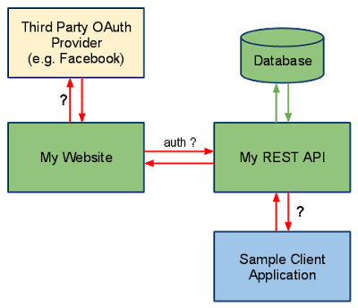

Servlets
========

###### What is JSESSIONID in J2EE Web application - JSP Servlet?

HTTP protocol and Web Servers are stateless, what it means is that for web
server every request is a new request to process and they can’t identify if it’s
coming from client that has been sending request previously.

**Session** is a conversional state between client and server and it can consist
of multiple request and response between client and server. Since HTTP and Web
Server both are stateless, the only way to maintain a session is when some
unique information about the session (session id) is passed between server and
client in every request and response.

When we use HttpServletRequest getSession() method and it creates a new request,
it creates the new HttpSession object and also add a Cookie to the response
object with name JSESSIONID and value as session id. This cookie is used to
identify the HttpSession object in further requests from client. If the cookies
are disabled at client side and we are using URL rewriting then this method uses
the jsessionid value from the request URL to find the corresponding session.
JSESSIONID cookie is used for session tracking, so we should not use it for our
application purposes to avoid any session related issues.

###### How servlet session will work, if Cookies disabled?

In a web app, when user logs in, a HttpSession is created using HttpSession s =
request.getSession(true); This creates a cookie with jsessionid on the browser.
But if cookies are disabled on browser, How can i proceed with login?

If Cookies are disabled. You should be using URL Rewriting mechanism for Session
tracking

###### Can you describe the difference between valid and well-formed XML?

A well-formed XML is the one which has **root element and all tags are closed
properly**, attributes are defined properly, their value is also quoted
properly.

On another hand, a valid XML is the one which **can be validated against an XSD
file or schema**. So it's possible for an XML to be well-formed but not valid
because they contain tags which may not be allowed by their schema.

###### Maven& Ant build for diffrenrt enviroments using properties

Ant

Ant’s build file, called **build.xml** should reside in the base directory of
the project. However *there is no restriction on the file name or its location*.
You are free to use other file names or save the build file in some other
location

\<?xml version = "1.0"?\>

\<project name = "Hello World Project" default = "info"\>

\<target name = "info"\>

\<echo\>Hello World - Welcome to Apache Ant!\</echo\>

\</target\>

\</project\>

\<project name="Sample Build Script" default="init" basedir="."\>

\<property environment="env" /\>

\<!-- \*\*\*\*\* COMMAND LINE ARGUMENTS DEMOED HERE --\>

\<property name="build_type" value= "\${env.build_type}"/\>

\<property name="version" value="\${env.version}"/\>

\<!-- \*\*\*\*\* END OF COMMAND LINE ARG \*\*\*\* --\>

\<property name="src.dir" value="\${basedir}/source"/\>

\<property name="build.classes.dir" value="\${basedir}/classes"/\>

\<property name="project.name" value="myproject"/\>

\<target name="make-war" depends="compile-servlet"\>

\<delete file="\${build.classes.dir}/war/\${project.name}.war"/\>

\<war destfile="\${build.classes.dir}/war/\${project.name}.war"
webxml="\${src.dir}/WEB-INF/web.xml"\>

\<webinf dir="\${src.dir}/WEB-INF" /\>

\<fileset dir="\${src.dir}/html"\>

\<include name="\*.html" /\>

\</fileset\>

\<classes dir="\${build.classes.dir}"\>

\<include name="/my/package/\*.\*"/\>

\</classes\>

\<lib dir="/some/lib/loc"\>

\<include name="some-lib.jar"/\>

\</lib\>

\</war\>

\</target\>

\<target name="init" \>

\<echo message="Using Source directory=\${src.dir}" /\>

\<echo message="Using Build-Classes directory=\${build.classes.dir}" /\>

\<!-- \*\*\*\* VERIFY COMMAND LINE ARGS HERE \*\*\*\*\* --\>

\<echo message="Build Type=\${build_type}" /\>

\<echo message="Build Version =\${version}" /\>

\<!-- \*\*\* END VERIFY COMMAND LINE ARGUMENTS --\>

\</target\>

\</project\>

Maven – pom.xml

I have a web app in Maven, with the default directory structure. No problem
there. The default directory structure has some property files that point to my
localhost database.

Currently I create an Ant script to create different war files - one for
production and one for development, using these commands:

ant deploy-dev

ant deploy-prod

ant deploy-sit

ant deploy-uat

I prefer use maven profiles for this situation. For example we have directory
structure:

src/main/resources

\|

\+- local

\| \|

\| \`- specific.properties

\+- dev

\|

\`- specific.properties

In pom.xml define two profiles:

\<profiles\>

\<profile\>

\<id\>local\</id\>

\<activation\>

\<activeByDefault\>true\</activeByDefault\>

\</activation\>

\<build\>

\<resources\>

\<resource\>

\<directory\>src/main/resources/local\</directory\>

\</resource\>

\</resources\>

\</build\>

\</profile\>

\<profile\>

\<id\>dev\</id\>

\<build\>

\<resources\>

\<resource\>

\<directory\>src/main/resources/dev\</directory\>

\</resource\>

\</resources\>

\</build\>

\</profile\>

\</profiles\>

>   To activate this you would type this on the command line:

1.  mvn groupId:artifactId:goal -Denvironment=local

Web Services
============

###### What is purpose of different HTTP Request Types in RESTful Web Service?

-   **GET** request on /employee/101, you can retrieve details of that user.

-   **POST** on employe/102 would create a new user with employee id 102,

-   **PUT** request type on /employee/101 can be used to update details of
    employee with id 101.

-   **DELETE** method on /employee/101 can be used to remove data for that id.

By the way, in the case of PUT and POST method representation would be in the
**request body**

Spring MVC
==========

###### Do you need spring-mvc.jar in your classpath or is it part of spring-core? (answer)

The **spring-mvc.jar** is not part of spring-core, which means if you want to
use Spring MVC framework in your Java project, you must include
**spring-mvc.jar** in your application's classpath. In Java web
application, spring-mvc.jar is usually placed inside** /WEB-INF/lib **folder.

###### What is the DispatcherServlet and what is it used for? ([answer](http://www.java67.com/2017/06/what-is-use-of-dispatcherservlet-in-spring-mvc.html))

The DispatcherServlet is an implementation of Front Controller design pattern
which handles all incoming web request to a Spring MVC application. A Front
Controller pattern is a common pattern in web applications whose job is to
receive all request and route it to different components of application for
actual processing.  
  
In case of Spring MVC, DispatcherServlet route web requests to Spring MVC
controllers.  
  
In Spring MVC, DispatcherServlet is used for finding the correct Controler to
process a request, which it does with the help of handler mapping
e.g. \@RequestMapping annotation.  
  
It is also responsible for delegating logical view name to ViewResolver and then
sending the rendered response to the client.

###### Is the DispatcherServlet instantiated via an application context? ([answer](http://javarevisited.blogspot.sg/2017/09/dispatcherservlet-of-spring-mvc-10-points-to-remember.html)) No, DispatcherServlet is instantiated by Servlet containers like Tomcat or Jetty. You must define DispatcherServlet into the web.xml file

###### What is the root application context in Spring MVC? How is it loaded? ([answer](https://javarevisited.blogspot.com/2012/11/difference-between-beanfactory-vs-applicationcontext-spring-framework.html#axzz5N1cdCqrn))

In Spring MVC, the context loaded using ContextLoaderListener is called the
"root" application context which belongs to the whole application while the one
initialized using DispatcherServlet is actually specific to that servlet.  
  
Technically, Spring MVC allows multiple DispatcherServlet in a Spring MVC web
application and so multiple such contexts each specific for respective servlet
but having same root context may exist.

The ContextLoaderListener is configured in web.xml as listener and you put that
inside a tag as shwon below:  
**\<listener\>**  
**\<listener-class\>**  
**org.springframework.web.context.ContextLoaderListener**  
**\</listener-class\>**  
**\</listener\>**  
  
When the Spring MVC web application is deployed, Servlet container created an
instance of ContextLoaderListener class which loads the Spring's
WebApplicationContext

###### **What is the \@Controller annotation used for? How can you create a controller without an annotation? (**[answer](https://javarevisited.blogspot.com/2017/08/difference-between-restcontroller-and-controller-annotations-spring-mvc-rest.html)**)**

The \@Controller is a Spring MVC annotation to define Controller but in reality,
it's just a stereotype annotation. You can even create a controller
without \@Controller by annotating the Spring MVC Controller classes
using \@Component annotation. The real job of request mapping to handler method
is done using \@RequestMapping annotation.

###### How is an incoming request mapped to a controller and mapped to a method? ([answer](http://javarevisited.blogspot.com/2017/06/how-spring-mvc-framework-works-web-flow.html))

Sometimes this question is also asked How does DispatcherServlet knows which
Controller should process the request? Well, the answer lies in something called
handler mappings.  
  
Spring uses handler mappings to associate controllers with requests, two of the
commonly used handler mappings
are BeanNameUrlHandlerMapping and SimpleUrlHandlerMapping.  
  
In BeanNameUrlHandlerMapping, when the request url matches the name of the bean,
the class in the bean definition is the controller that will handle the request.  
  
On the other hand, In SimpleUrlHandlerMapping, the mapping is more explicit. You
can specify the number of URLs and each URL can be explicitly associated with a
controller.  
  
Btw, if you are using annotations to configure Spring MVC, which you should
then \@RequestMapping annotations is used to map an incoming request to a
controller and a handler method.

###### What are some of the valid return types of a controller method? (answer)

There are many return types are available for a controller method in Spring MVC
which is annotated by \@RequestMapping inside the controller. Some of the
popular ones are:

1.  **String**

2.  **void**

3.  **View**

4.  **ModelAndView (Class)**

5.  **Model (Interface)**

6.  **Map**

7.  **HttpEntity\<?\> or ResponseEntity\<?\>**

8.  **HttpHeaders**

###### What is the Model? (answer)

Model is a reference to encapsulate data or output for rendering. Model is
always created and passed to the view in Spring MVC. If a mapped controller
method has Model as a method parameter, then a model instance is automatically
injected by Spring framework to that method.  
  
Any attributes set on the injected model are preserved and passed to the View.
Here is an example of using Model in Spring MVC:

public String personDetail(Model model) {

...

model.addAttribute("name", "Joe");

...

}

###### What is the purpose of the session scope? ([answer](https://javarevisited.blogspot.com/2012/05/what-is-bean-scope-in-spring-mvc.html#axzz5IZi1jCsQ))

The purpose of the session scope is to create an instance of the bean for an
HTTP Session. This means the same bean can serve multiple requests if it is
scoped in session.

You can define the scope of a Spring bean using scope attribute
or **\@Scope** annotation in Spring MVC application.

###### What is the default scope in the web context? ([answer](http://javarevisited.blogspot.sg/2012/05/what-is-bean-scope-in-spring-mvc.html))

The **singleton** scope is the default scope for a Spring bean even in the web
context.

The other three Web context-aware scopes are a **request, session, and
global-session,** which are only available in a web application
aware ApplicationContext object.

###### What are safe REST operations? (answer)

REST API uses HTTP methods to perform operations. Some of the HTTP operations
which doesn't modify the resource at the server is known as safe operations
e.g**. GET and HEAD**.

On the other
hand, [PUT](http://javarevisited.blogspot.sg/2016/10/difference-between-put-and-post-in-restful-web-service.html)**,
POST, and DELETE are unsafe** because they modify the resource on the server

###### What are the advantages of the RestTemplate? ([answer](http://javarevisited.blogspot.sg/2017/02/how-to-consume-json-from-restful-web-services-Spring-RESTTemplate-Example.html))

The **RestTemplate** class is an implementation of Template method pattern in
Spring framework. Similar to other popular template classes
e.g. **JdbcTemplate** or **JmsTempalte**, it also simplifies the interaction
with RESTful Web Services on the client side.i mean we can create client class
to test webservice manulay using java.

You can use it to consume a RESTful Web Servicer very easily as shown in this
example.

public class *App* implements *CommandLineRunner* {

private static final *Logger log* = *LoggerFactory*.getLogger(App.class);

public static void main(String args[]) {

*SpringApplication*.run(App.class);

}

public void run(String... args) throws Exception {

*RestTemplate* restTemplate = new *RestTemplate*();

*Response* response = restTemplate.getForObject("localhost:9090/student/getall",

*Response*.class);

*log*.info("==== RESTful API Response using Spring RESTTemplate START =======");

*log*.info(response.toString());

*log*.info("==== RESTful API Response using Spring RESTTemplate END =======");

}

}

###### What is an HttpMessageConverter in Spring REST? (answer)

An HttpMessageConverter is a [Strategy
interface](http://www.java67.com/2014/12/strategy-pattern-in-java-with-example.html) that
specifies a converter that can convert from and to HTTP requests and responses.
Spring REST uses this interface to convert HTTP response to various formats e.g.
**JSON or XML.**  
  
Each **HttpMessageConverter** implementation has one or several MIME Types
associated with it. Spring uses the "**Accept**" header to determine the content
type client is expecting.  
  
It will then try to find a registered **HTTPMessageConverter** that is capable
of handling that specific content-type and use it to convert the response into
that format before sending to the client.

**to create a custom implementation of HttpMessageConverter to support a new
type of request/responses,**  
You just need to create an implementation
of **AbstractHttpMessageConverter** and register it using
the WebMvcConfigurerAdapter\#extendMessageConverters() method with the classes
which generate a new type of request/response.

###### Is \@Controller a stereotype? Is \@RestController a stereotype? ([answer](http://javarevisited.blogspot.sg/2017/08/difference-between-restcontroller-and-controller-annotations-spring-mvc-rest.html))

Yes, both \@Controller and \@RestController are stereotypes. The \@Controller is
actually a specialization of Spring's \@Component stereotype annotation. This
means that class annotated with \@Controller will also be automatically be
detected by Spring container as part of container's component scanning process.  
  
And, \@RestController is a specialization of \@Controller for RESTful web
service. It not only combines \@ResponseBody and \@Controller annotation but
also gives more meaning to your controller class to clearly indicate **that it
deals with RESTful requests.**  
  
Spring Framework may also use this annotation to provide some more useful
features related to REST API development in future.

###### Where do you need \@EnableWebMVC? (answer)

The \@EnableWebMvc annotation is required to enable Spring MVC when Java
configuration is used to configure Spring MVC instead of XML. It is equivalent
to \<mvc: annotation-driven\>  in XML configuration.  
  
It enables support for \@Controller-annotated classes that
use \@RequestMapping to map incoming requests to handler methods.

**When do you need \@ResponseStatus annotation in Spring
MVC? **([answer](http://javarevisited.blogspot.sg/2018/01/7-reasons-for-using-spring-to-develop-RESTful-web-service.html#axzz55a8rTeu7))

A good questions for 3 to 5 years experienced spring developers.
The \@ResponseStatus annotation is required during error handling in Spring MVC
and REST. Normally when an error or exception is thrown at server side, web
server return a blanket HTTP status code 500 - Internal server error.  
  
This may work for a human user but not for REST clients. You need to send them
proper status code e.g. 404 if the resource is not found. That's where you can
use \@ResponseStatus annotation, which allows you to send custom HTTP status
code along with proper error message in case of Exception.

For example, if you are writing a RESTful Web Service for a library which
provides book information then you can use \@ResponseStatus to create Exception
which returns HTTP response code 404 when a book is not found instead of
Internal Server Error (500), as shown below:

\@*ResponseStatus*(value=*HttpStatus*.NOT_FOUND, reason="No such Book") // 404

public class *BookNotFoundException* extends RuntimeException {

// ...

}

If this Exception is thrown from any handler method then HTTP error code 404
with reason "No such Book" will be returned to the client.

###### Is REST secure? What can you do to secure it?

REST is normally not secure but you can secure it by using Spring security.  
  
At the very least you can enable HTTP basic authentication by using HTTP in your
Spring security configuration file. Similarly, you can expose your REST API
using[ HTTPS](http://javarevisited.blogspot.sg/2013/07/how-ssl-https-and-certificates-works-in-java-web-application.html) if
the underlying server supports HTTPS.

SQL
===

###### Write SQL query to find second highest salary in employee table?

SELECT MAX(Salary) FROM Employee WHERE Salary NOT IN (SELECT MAX(Salary) FROM
Employee)

This query first finds maximum salary and then exclude that from the list and
again finds maximum salary. Obviously second time, it would be second highest
salary.

###### Difference between WHERE vs HAVING clause in SQL - GROUP BY Comparison with Example

*main difference between WHERE and HAVING clause in SQL* is that, condition
specified in WHERE clause is used while fetching data (rows) from table, on the
other hand HAVING clause is later used to filter summarized data or grouped
data.

**SELECT** \* **FROM** Employee;

| **EMP_ID** | **EMP_NAME** | **EMP_AGE** | **EMP_SALARY** | **DEPT_ID** |
|------------|--------------|-------------|----------------|-------------|
| 1          | Virat        | 23          | 10000          | 1           |
| 2          | Rohit        | 24          | 7000           | 2           |
| 3          | Suresh       | 25          | 8000           | 3           |
| 4          | Shikhar      | 27          | 6000           | 1           |
| **5**      | **Vijay**    | **28**      | **5000**       | **2**       |

**SELECT** \* **FROM** Department;

| **DEPT_ID** | **DEPT_NAME** |
|-------------|---------------|
| 1           | Accounting    |
| 2           | Marketing     |
| 3           | Sales         |

SELECT d.DEPT_NAME, count(e.EMP_NAME) as NUM_EMPLOYEE, avg(e.EMP_SALARY) as
AVG_SALARY 

FROM Employee e,Department d 

WHERE e.DEPT_ID=d.DEPT_ID 

AND EMP_SALARY \> 5000 

GROUP BY d.DEPT_NAME;

| **DEPT_NAME** | **NUM_EMPLOYEE** | **AVG_SALARY** |
|---------------|------------------|----------------|
| Accounting    | 1                | 8000           |
| Marketing     | 1                | 7000           |
| Sales         | 2                | 8000           |

From the number of employee (NUM_EMPLOYEE) column you can see that only Vijay
who work for Marketing department is not included in result set because his
earning 5000. This example shows that, condition in WHERE clause is used to
filter rows before you aggregate them.

SELECT d.DEPT_NAME, count(e.EMP_NAME) as NUM_EMPLOYEE, avg(e.EMP_SALARY) asAVG_SALARY 

FROM Employee e,Department d 

WHERE e.DEPT_ID=d.DEPT_ID 

AND EMP_SALARY \> 5000 

GROUP BY d.DEPT_NAME

HAVING AVG_SALARY \> 7000;

| **DEPT_NAME** | **NUM_EMPLOYEE** | **AVG_SALARY** |
|---------------|------------------|----------------|
| Accounting    | 1                | 8000           |
| Sales         | 2                | 8000           |

then HAVING clause comes in picture for final filtering, which is clear from
following query, now Marketing department is excluded because it doesn't pass
condition in HAVING clause i.e AVG_SALARY \> 7000

Coding
======

###### How to Remove Duplicates from Array?

1.Conver Array to List

2.Add List to Set(HashSet/TreeSet) allows Unique values only

public class ArrayDuplicates {

public static void main(String[] args) {

String arr[] = {"B","C","D","A","B","C","D","A","E","E"};

List list = Arrays.*asList*(arr);

HashSet h = new HashSet(list);

System.*out*.println("Hashset : "+h);

TreeSet t = new TreeSet(list);

System.*out*.println("TreeSet : "+t);

}

}

Hashset: [A, B, C, D, E]

TreeSet: [A, B, C, D, E]

###### How do you get the last digit of an integer?

By using **modulus operator(%), number % 10** returns the last digit of the
number, for example, 

-   2345%10 will return 5

-   567%10 will return 7.  

Similarly, **division operator(/ )** can be used to get rid of the last digit of
 a number e.g.

-   2345/10 will give 234

-   567/10 will return 56.

This is an important technique to know and useful to solve problems like
**number palindrome or reversing numbers**

public static int reverse(int number){ //say 12345

int reverse = 0;

int remainder = 0;

int i=1;

do{

remainder = number%10; //To Get last Number

reverse = reverse\*10 + remainder; //To add places, 10, 100, 1000

number = number/10; // To remove Last Number

/\*reverse = reverse\*10 + remainder;

\* 5 = 0\*10+5

\* 54 = 5\*10 = 50+4 = 54,

\* 543 = 54\*10 = 540+3 = 543

\* \*/

System.*out*.println(i+"---\> remainder: "+remainder+", reverse: "+reverse+",
number: "+number);

i++;

}while(number \> 0);

return reverse;

}

How to Find Missing Number on Integer Array of 1 to 100

METHOD 1(Use sum formula)  
Algorithm:

1. Get the sum of numbers

total = n\*(n+1)/2

2 Subtract all the numbers from sum and

you will get the missing number.

*c*lass Main

{

// Function to *ind* missing number

static int getMissingNo (int a[], int n)

{

int i, total;

total = (n+1)\*(n+2)/2;

for ( i = 0; i\< n; i++)

total -= a[i];

return total;

}

/\* program to test above function \*/

public static void main(String args[])

{

int a[] = {1,2,4,5,6};

int miss = *getMissingNo*(a,5);

System.*out*.println(miss);

}

}

###### Write code to check a String is palindrome or not? ([solution](http://www.java67.com/2015/06/how-to-check-is-string-is-palindrome-in.html))

A palindrome is those String whose reverse is equal to the original. This can be
done by using **either StringBuffer reverse() **method or by technique
demonstrated in the solution here.

###### Write a method which will remove any given character from a String? ([solution](http://javarevisited.blogspot.sg/2015/04/how-to-remove-given-character-from.html))

you can remove a given character from String by converting it into a **char[]**
array and comapare give char with each char of array, remove that & append
remaiiing.

public class Test {

public static String remove(String word, char unwanted) {

StringBuilder sb = new StringBuilder();

char[] letters = word.toCharArray();

for (char c : letters) {

if (c != unwanted) {

sb.append(c);

}

}

return sb.toString();

}

public static void main(String[] args) throws InterruptedException {

System.*out*.println(*remove*("satya kaveti", 'a'));

}

*}*

sty kveti

######  Print all permutation of String? ([solution](https://javarevisited.blogspot.com/2015/08/how-to-find-all-permutations-of-string-java-example.html))

for a String of 3 characters like "xyz" has 6 possible permutations, xyz, xzy,
yxz, yzx, zxy, zyx

public class Permutation {

public static void permutation(String str) {

*permutation*("", str);

}

private static void permutation(String prefix, String str) {

int n = str.length();

if (n == 0) System.*out*.println(prefix);

else {

for (int i = 0; i \< n; i++)

*permutation*(prefix + str.charAt(i), str.substring(0, i) + str.substring(i+1,
n));

}

}

public static void main(String args[]) {

*permutation*("XYZ");

}

}

XYZ

XZY

YXZ

YZX

ZXY

ZYX

###### How to check if two String Are Anagram? ([solution](http://javarevisited.blogspot.sg/2013/03/Anagram-how-to-check-if-two-string-are-anagrams-example-tutorial.html))

two String are called anagram, if they contain same characters but on different
order e.g. **army** and **mary**, **stop** and **pots** etc

public class Anagram {

public static boolean Check(String word1, String word2) {

char[] charFromword1 = word1.toCharArray();

char[] charFromword2 = word2.toCharArray();

Arrays.*sort*(charFromword1);

Arrays.*sort*(charFromword2);

return Arrays.*equals*(charFromword1, charFromword2);

}

public static void main(String args[]) {

System.*out*.println(*Check*("stop", "pots"));

System.*out*.println(*Check*("army", "mary"));

}

}

true

true

###### Java Program to print Fibonacci Series

Fibonacci number is sum of previous two Fibonacci numbers **fn= fn-1+ fn-2**.
first 10 Fibonacci numbers are 1, 1, 2, 3, 5, 8, 13, 21, 34, 55.

public class Permutation {

public static void main(String args[]) {

// input to print *Fibonacci* series *upto* how many numbers

int number = 10;

System.*out*.println("Fibonacci series upto " + number + " numbers : ");

// printing *Fibonacci* series *upto* number

for (int i = 1; i \<= number; i++) {

System.*out*.print(*fibonacci*(i) + " ");

}

}

public static int fibonacci(int number) {

if (number == 1 \|\| number == 2) {

return 1;

}

return *fibonacci*(number - 1) + *fibonacci*(number - 2); // tail recursion

}

}

Fibonacci series upto 10 numbers :

1 1 2 3 5 8 13 21 34 55

###### How to find the factorial of a number in Java

 the factorial of a number is calculated by formula **number\*(number -1**) till
zero and since the **value of factorial zero is 1**.

public class Permutation {

public static int fact(int number){

int result = 1;

while(number != 0){

result = result\*number;

number--;

}

return result;

}

public static void main(String args[]) {

int res = *fact*(5);

System.*out*.println("Fianl Factoril is : "+res);

}

}

Fianl Factoril is : 120

###### Java program Armstrong numbers in the range of 0 and 9999. 

An Armstrong number is a number such that the sum of its digits raised to the
third power is equal to the number itself. For example, 153 is an Armstrong
number, since 1\*\*3 + 5\*\*3 + 3\*\*3 = 153.

public class Permutation {

public static void main(String args[]) {

int count = 999;

int index = 0;

for (int i = 0; i \< count; i++) {

if (*isArmstrongNumber*(i)) {

System.*out*.printf("Armstrong number %d: %d %n", index, i);

index++;

}

}

}

/\*\*

\* Java Method to check if given number is Armstrong Number or not

\*

\* \@param number

\* \@return true, if Armstrong number, false otherwise.

\*/

public static boolean isArmstrongNumber(int number) {

int sum = 0;

int copyOfInput = number;

while (copyOfInput != 0) {

int lastDigit = copyOfInput % 10;

sum += (lastDigit \* lastDigit \* lastDigit);

copyOfInput /= 10;

}

if (sum == number) {

return true;

}

return false;

}

}

Armstrong number 0: 0

Armstrong number 1: 1

Armstrong number 2: 153

Armstrong number 3: 370

Armstrong number 4: 371

Armstrong number 5: 407

###### Java Program to print 1 to 100 without using loop

public class Permutation {

public static void usingRecursion(int number){

if(number \> 1){

*usingRecursion*(number-1);

}

System.*out*.println(number);

}

public static void main(String args[]) {

*usingRecursion*(20);

}

}

###### Links

<https://javarevisited.blogspot.com/2011/06/top-programming-interview-questions.html>

<https://javarevisited.blogspot.com/2017/07/top-50-java-programs-from-coding-Interviews.html>

<https://javarevisited.blogspot.com/search/label/Coding%20Interview%20Question?max-results=100>

H R Mapping
===========

###### Reason for Job Change"

I am looking for better opportunities! Both Technically & Finacially. I want to
the part of Product based things, innovating / implementing some thing new
instead of working with existing code.

I think this job would be a great opportunity in my career.

**Keep in Mind:**

-   Tell the truth, yes! because big shots like google or microsoft sees honesty
    in employees.

-   Be positive. Tell them what's your work there and how it's affecting you
    blah blah

-   Tell them, I'm good at 'x' but I"m doing 'y' there.

-   Put your points in polite manner.

Reference
=========

###### Interview Questions

<https://javarevisited.blogspot.com/search/label/interview%20questions?max-results=100>

###### Coding

<https://javarevisited.blogspot.com/2017/07/top-50-java-programs-from-coding-Interviews.html>

<https://javarevisited.blogspot.com/search/label/Coding%20Interview%20Question?max-results=100>
