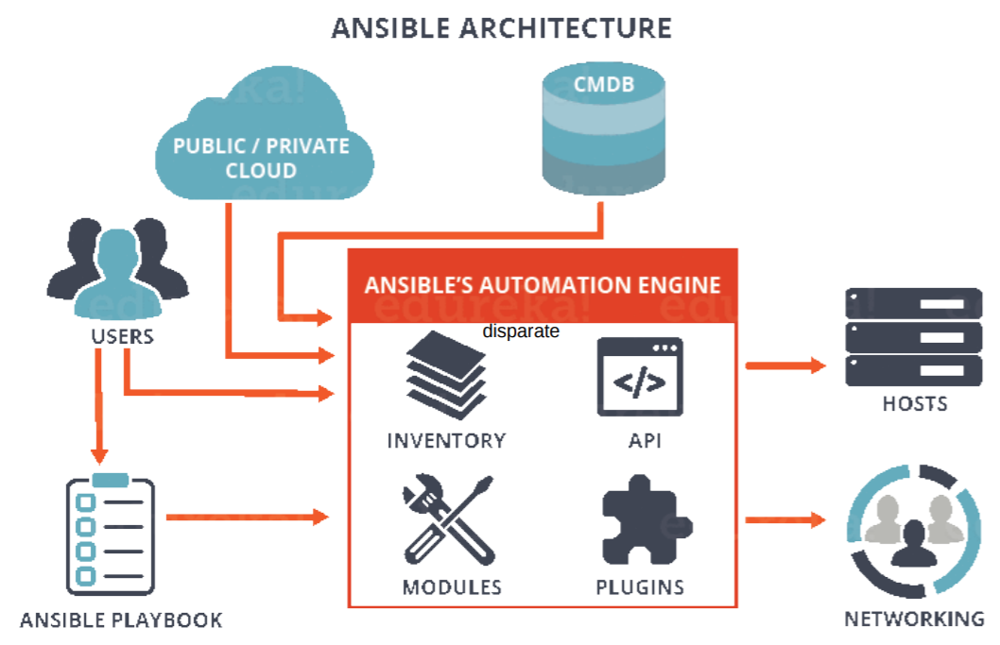
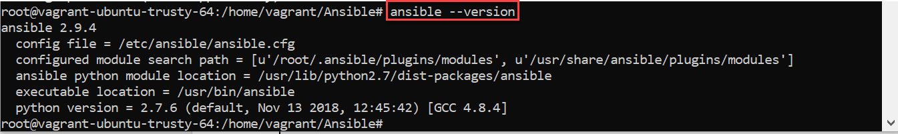
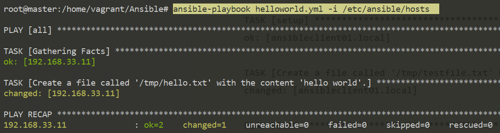

Ansible – Introduction
======================

-   Ansible is an open-source **configuration management** and provisioning
    tool, similar to **Chef, Puppet or Salt.**

-   It uses **SSH** to connect to servers and run the configured Tasks. Ansible
    lets you control and configure nodes from a single machine.

-   What makes it different from other management software is that Ansible uses
    SSH infrastructure. The project was founded in 2013 and bought by Red Hat in
    2015

Architecture
------------

Ansible is entirely agentless, which means Ansible works by connecting your
nodes through **SSH** (by default).

Ansible pushes small programs after connecting to your nodes which are known as
"**Ansible Modules**". Ansible runs that module on your nodes and removes them
when finished.



#### Control node  
-   Any machine with Ansible installed.

-   You can run commands and playbooks,
    invoking /usr/bin/ansible or /usr/bin/ansible-playbook, from any control
    node.

-   You can use any computer that has Python installed on it as a control node -
    laptops, shared desktops, and servers can all run Ansible.

-   However, you cannot use a Windows machine as a control node. You can have
    multiple control nodes.

#### Managed nodes  
The network devices (and/or servers) you manage with Ansible. Managed nodes are
also sometimes called -hosts”. Ansible is not installed on managed nodes.

#### Inventory  
-   A list of managed nodes.

-   An inventory file is also sometimes called a -**hostfile**”. default
    location is in./etc/ansible/hosts

-   Your inventory can specify information like IP address for each managed
    node.

-   Every host is assigned to a group such as web servers, db servers etc.

-   The inventory file can be in one of many formats such as yaml, INI etc

Example of an Inventory file
```yaml
# Example of an Inventory file
mail.example.com

[webservers]
foo.example.com
bar.example.com

[dbservers]
one.example.com
two.example.com
three.example.com
```

#### Modules

-   The units of code Ansible executes.

-   You can invoke a single module with a task, or invoke several different
    modules in a playbook

-   There are over 1000 modules(kind of jars) provided by Ansible to perform
    specific task.

-   Modules are like plugins; they are what gets executed in each playbook task.

-   Each module is mostly standalone and can be written in a standard scripting
    language (such as Python, Perl, Ruby, Bash, etc.).

```yaml
# Example of Modules
There are lots of modules such as :
Service, file, copy, iptables etc.

Any Module can be used as :
ansible 127.0.0.1 -m service -a "name=httpd state=started"
ansible localhost -m ping
```


#### Tasks  
The units of action in Ansible. You can execute a single task once with an
ad-hoc command.  


#### Playbook  

-   Playbooks are simple YAML files.

-   Playbooks make your installations, upgrades and day-to-day management
    repeatable things.

-   Playbooks are simple to write and maintain.
```yaml
Playbook contains Plays.
		|
	Plays contain tasks.
			|
		tasks call modules.
```
  
```yaml
#Example of an ansible playbook
---
- hosts: webservers
 remote_user: root
 tasks:
 - name: ensure apache is at the latest version
   yum: name=httpd state=latest
 - name: ensure apache is running
   service: name=httpd state=started enabled=yes
```


#### Roles

-   In Ansible, the role is the primary mechanism for breaking a playbook into
    multiple files. This simplifies writing complex playbooks, and it makes them
    easier to reuse

-   Playbook is a collection of Roles

-   Each Role will have a Specific functionality

-   Ansible Roles are Independent on each other.

```yaml
- hosts: all
 roles:
 - role_1
 - role_2
```


Workflow
--------

Ansible works by connecting to your nodes and pushing out a small program
called **Ansible modules** to them. Then Ansible executed these modules and
removed them after finished.


-   In the above image, the **Management Node** is the controlling node that
    controls the entire execution of the playbook.

-   The **inventory** file provides the list of hosts where the Ansible modules
    need to be run.

-   The **Management Node** makes an **SSH** connection and executes the small
    modules on the host's machine and install the software.

**Ansible has three main files that you need to consider:**

-   **Host/inventory file:** Contains the entry of the nodes that need to be
    managed

-   **Ansible.cfg file:** Located by default at **/etc/ansible/ansible.cfg**, it
    has the necessary privilege escalation options and the location of the
    inventory file

-   **Main file:** A playbook that has modules that perform various tasks on a
    host listed in an inventory or host file

Installation
------------

## Ubuntu

\#1:First perform an update to the packages  
`sudo apt update`

\#2:Then install the software properties common package.  
`sudo apt install software-properties-common`

\#3:Install the Ansible personal package archive.  
`sudo apt-add-repository ppa:ansible/ansible`

\#4:Install the Ansible.  
`sudo apt update`
`sudo apt install ansible`

## CentOS
```yaml
#Install the EPEL repo
sudo yum install epel-release

#Install the Ansible package.
sudo yum install -y ansible  

# Check the installation
ansible --version
```



YAML Basics
-----------

YAML starts with `---` and end with `---` This indicates the start and end of a YAML
document.

**YAML List**  
Nearly every YAML file starts with a list. Each item in the list is a list of
key/value pairs
```yaml
---
# A list of tasty fruits
- Apple
- Orange
- Strawberry
- Mango
...
```


**Dictionary**  
A dictionary is represented in a simple \`key: value\` form (the colon must be
followed by a space):
```yaml
# An employee records
martin:
    name: Martin D'vloper
    job: Developer
    skill: Elite
```


**Boolean**  
We can specify Boolean value (true/false) in several forms:
```yaml
create_key: yes
needs_agent: no
knows_oop: True
likes_emacs: TRUE
uses_cvs: false
```

```
Large Values can span multiple lines using | or >. 
include_newlines: |
            exactly as you see
            will appear these three
            lines of poetry

fold_newlines: >
            this is really a
            single line of text
            despite appearances
```

Let’s combine what we learned so far in an arbitrary YAML example.
```
# An employee records
---
name: Martin D'vloper
job: Developer
skill: Elite
employed: True
foods:
    - Apple
    - Orange
    - Strawberry
    - Mango
languages:
    perl: Elite
    python: Elite
    pascal: Lame
education: |
    4 GCSEs
    3 A-Levels
    BSc in the Internet of Things
```


**Variables**

uses `-{{ var }}”` for variables. If we want to use previously declared variable,
we must place between "{{ var }}"
```yaml
foo: "{{ variable }}"
```


-   A colon followed by a space (or newline) ": " is an indicator for a mapping.

-   A space followed by the pound sign " \#" starts a comment.

<https://docs.ansible.com/ansible/latest/reference_appendices/YAMLSyntax.html>

Ansible First Example
---------------------

For any ansible configuration , we need two files

1.  Inventory File – contains list of hosts

2.  Playbook - Contains tasks to be executed on inventory hosts

**1.Inventory file**

Here we are using default inventory host file located in **/etc/ansible/hosts**,
contains single node
```yaml
192.168.33.11 ansible_user=vagrant

# Test Connection
ansible all -m ping -k -b
```


**2.Playbook**  
We are creating **helloworld.yml** with below content
```yaml
---
- name: This is a hello-world example
  hosts: all
  tasks:
    - name: Create a file called '/tmp/testfile.txt' with the content 'hello world'.
      copy:
        content: hello world
        dest: /tmp/testfile.txt
```

**3.Run playbook**  
`ansible-playbook helloworld.yml -i /etc/ansible/hosts`


Here we are using default hosts file, so we are not requited to specify
inventory file manullay, above playbook will work with below command as well.
```yaml
ansible-playbook helloworld.yml
```
