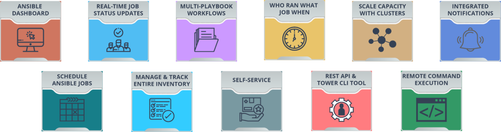
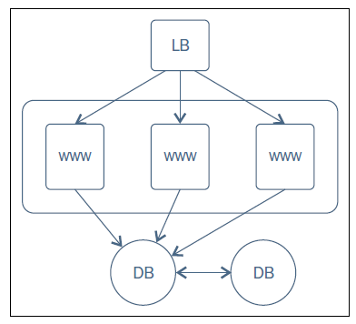
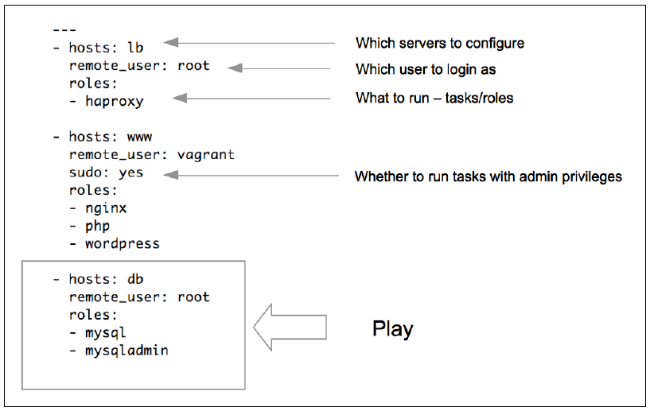
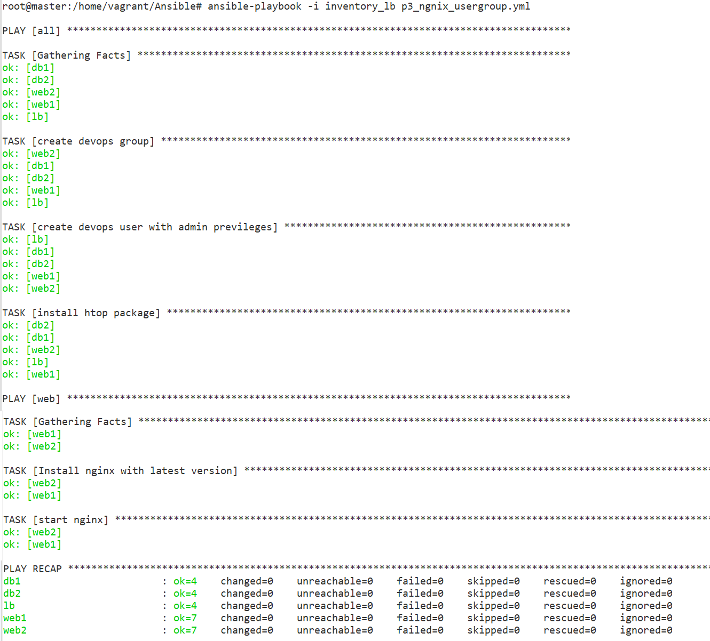
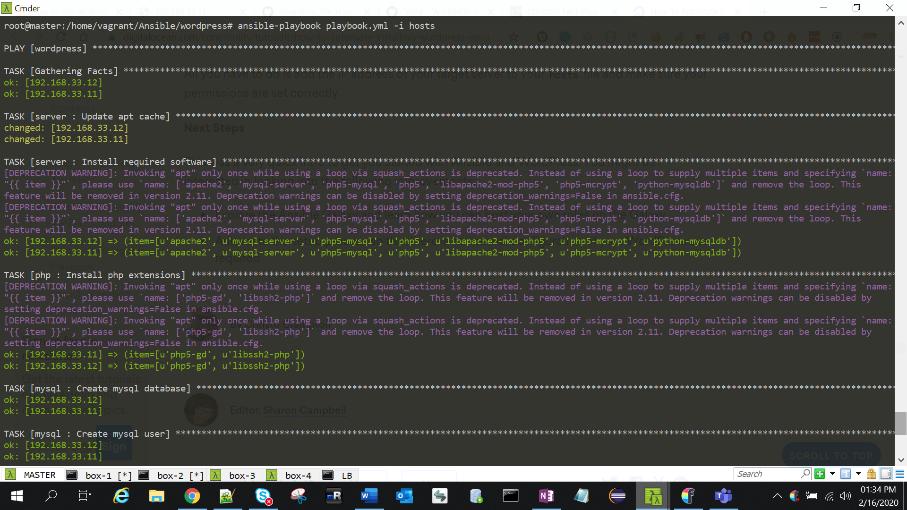
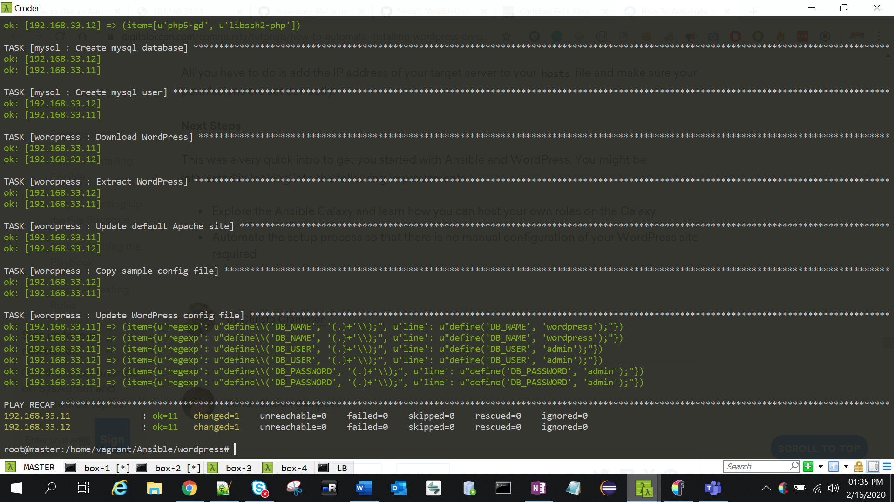

Ansible – Tower 
================



Ansible Tower is web-based edition of Terminal based Ansible. Below are its
features

Read More : <https://www.edureka.co/blog/ansible-tower/>

Ansible Tower – Jenkins Configure

<https://www.ansible.com/blog/ansible-tower-jenkins-in-under-5-minutes>

Ansible – Lab
=============

Our company have complex multitier applications. Each of these applications
contains many servers, like - load balancers(LB), web servers(WWW), database
servers(DB), caching applications, and middleware queues etc.

Example policies and the sequence in which those are to be applied is shown in
the following steps:

**1.Database servers(DB)**

-   Install & configure MySQL

**2.Web Servers(WWW)**

-   Install & configure Nginx with PHP bindings.

-   Deploy a WordPress application in Webservers and add respective
    configurations to Nginx.

**3.Load Balancers(LB)**

-   Install & configure **HaProxy** service on the load balancer hosts

-   Update **haproxy** configurations with the hostnames of all the web servers
    created earlier.

The following is a sample playbook that translates the infrastructure blueprint
into policies enforceable by Ansible.

Task 1: Create a user, install htop & nginx on all hosts.
---------------------------------------------------------

-   Create a 'devops' user under 'DevOps' group on all hosts.

-   Install the "htop" utility(upgrade alternative to top command).

-   Install Nginx on all web servers and start it as a service.

**p3_ngnix_usergroup.yml**

\---

\- hosts: all

remote_user: vagrant

become: yes

become_method: sudo

tasks:

\- name: create devops group

group: name=devops state=present

\- name: create devops user with admin previleges

user: name=devops comment="Devops User" uid=2001 group=devops

\- name: install htop package

action: apt name=htop state=present update_cache=yes

\- hosts: web

user: vagrant

become: yes

become_method: sudo

tasks:

\- name: Install nginx with latest version

apt: name=nginx state=present update_cache=true force=yes

\- name: start nginx

service:

name: nginx

state: started

**inventory1_lb**

[all]

web1 ansible_ssh_host=web1.satyacodes.vm ansible_user=vagrant

web2 ansible_ssh_host=web2.satyacodes.vm ansible_user=vagrant

db1 ansible_ssh_host=db1.satyacodes.vm ansible_user=vagrant

db2 ansible_ssh_host=db2.satyacodes.vm ansible_user=vagrant

lb ansible_ssh_host=lb.satyacodes.vm ansible_user=vagrant

[web]

web1

web2

[db]

db1

db2

[backup]

db2

[lbs]

lb

Run Playbook

ansible-playbook -i inventory_lb p3_ngnix_usergroup.yml

Task 2 – WordPress Install 
---------------------------

### Step 1 — Installing Ansible

In this section we’ll install Ansible on your build-server. SSH into your
build-server and run this command to install Ansible:

sudo apt-get install ansible -y

You can make sure that Ansible is installed by running:

ansible --version

### Step 2 - Create Roles

Create a directory for our playbook.

mkdir wordpress

Create two files: playbook.yml, hosts

touch playbook.yml

touch hosts

split our playbooks up into roles. For this project we’ll create four roles.

-   **server**

-   **php**

-   **mysql**

-   **wordpress**

From the project root folder (\~/wordpress), create a directory called roles and
cd into it:

mkdir roles && cd roles

we will create above roles inside roles
directory(/home/vagrant/Ansible/wordpress/roles). For each role that we want to
create, we will run **ansible-galaxy init:**

ansible-galaxy init server

ansible-galaxy init php

ansible-galaxy init mysql

ansible-galaxy init wordpress

At this point we should have the following file structure:

[.]

\|\_ playbook.yml

\|\_ hosts

\|\_ [roles]

\|\_ [server]

\|\_ ...

\|\_ [php]

\|\_ ...

\|\_ [mysql]

\|\_ ...

\|\_ [wordpress]

\|\_ ...

#### a. server Role

**1.Write server's yml file, which does the following:**

-   Update the **apt-cache (**apt-get update)

-   **apt-get** install Apache, MySQL, PHP, and related software

\# roles/server/tasks/main.yml

\---

\- name: Update apt cache

apt: update_cache=yes cache_valid_time=3600

become: yes

become_method: sudo

\- name: Install required software

apt: name={{ item }} state=present

become: yes

become_method: sudo

with_items:

\- apache2

\- mysql-server

\- php5-mysql

\- php5

\- libapache2-mod-php5

\- php5-mcrypt

\- python-mysqldb

#### b.PHP role

will install the required PHP extensions.

**roles/php/tasks/main.yml**

\---

\- name: Install php extensions

apt: name={{ item }} state=present

become: yes

become_method: sudo

with_items:

\- php5-gd

\- libssh2-php

#### c.MySQL Role

We also need to set up a MySQL database for our WordPress site. We’ll do this in
the mysql role.

This role does the following:

-   Create a MySQL database

-   Create a MySQL user

-   Give that user access to our database

**roles/mysql/tasks/main.yml**

\# roles/mysql/tasks/main.yml

\---

\- name: Create mysql database

mysql_db: name={{ wp_mysql_db }} state=present

\- name: Create mysql user

mysql_user:

name={{ wp_mysql_user }}

password={{ wp_mysql_password }}

priv=\*.\*:ALL

We’re going to need a few variables for this one. For a role, you can specify
default values for any variables in the defaults/main.yml file.

nano roles/mysql/defaults/main.yml

Add your database name, database username, and database password (that you want
to create), in that order. Make sure you pick a secure wp_db_password.

**roles/mysql/defaults/main.yml**

\---

\# defaults file for mysql

wp_mysql_db: wordpress

wp_mysql_user: admin

wp_mysql_password: admin

#### d.WordPress

We’re adding a few different tasks to the **roles/wordpress/tasks/main.yml**
file

-   First we need to download WordPress to the /tmp

-   extract the gzip file to **/var/www**, the location that Apache uses for
    storing web content

-   update Apache’s default site document root to point to our WordPress site:

-   Update constants in this file to match our database information:

\# roles/wordpress/tasks/main.yml

\---

\- name: Download WordPress

get_url:

url=https://wordpress.org/latest.tar.gz

dest=/tmp/wordpress.tar.gz

validate_certs=no

\- name: Extract WordPress

unarchive: src=/tmp/wordpress.tar.gz dest=/var/www/ copy=no

become: yes

become_method: sudo

\- name: Update default Apache site

become: yes

become_method: sudo

lineinfile:

dest=/etc/apache2/sites-enabled/000-default.conf

regexp="(.)+DocumentRoot /var/www/html"

line="DocumentRoot /var/www/wordpress"

notify:

\- restart apache

\- name: Copy sample config file

command: mv /var/www/wordpress/wp-config-sample.php
/var/www/wordpress/wp-config.php creates=/var/www/wordpress/wp-config.php

become: yes

become_method: sudo

\- name: Update WordPress config file

lineinfile:

dest=/var/www/wordpress/wp-config.php

regexp="{{ item.regexp }}"

line="{{ item.line }}"

with_items:

\- {'regexp': "define\\\\('DB_NAME', '(.)+'\\\\);", 'line': "define('DB_NAME',
'wordpress');"}

\- {'regexp': "define\\\\('DB_USER', '(.)+'\\\\);", 'line': "define('DB_USER',
'admin');"}

\- {'regexp': "define\\\\('DB_PASSWORD', '(.)+'\\\\);", 'line':
"define('DB_PASSWORD', 'admin');"}

become: yes

become_method: sudo

we can replace with Variables as well

with_items:

\- {'regexp': "define\\\\('DB_NAME', '(.)+'\\\\);", 'line': "define('DB_NAME',
'{{wp_mysql_db}}');"}

\- {'regexp': "define\\\\('DB_USER', '(.)+'\\\\);", 'line': "define('DB_USER',
'{{wp_mysql_user}}');"}

\- {'regexp': "define\\\\('DB_PASSWORD', '(.)+'\\\\);", 'line':
"define('DB_PASSWORD', '{{wp_mysql_password}}');"}

become: yes

become_method: sudo

We need to add our handler for restart apache. Save what you have so far, and
open **roles/wordpress/handlers/main.yml** for editing:

**roles/wordpress/handlers/main.yml**

\---

\- name: Restart Apache for Wordpress

service: name=apache2 state=restarted

become: yes

become_method: sudo

### Inventory (hosts file)

Edit hosts& Add the line for [wordpress], and below it, the IP address of your
wordpress-server:

**hosts**

[wordpress]

192.168.33.11 ansible_user=vagrant

192.168.33.12 ansible_user=vagrant

### playbook.yml

root\@master:/home/vagrant/Ansible/wordpress\# cat playbook.yml

\---

\- hosts: wordpress

remote_user: vagrant

become: yes

become_method: sudo

roles:

\- server

\- php

\- mysql

\- wordpress

### Test

We’re done! Run the playbook to install and configure WordPress:

ansible-playbook playbook.yml -i hosts

sudo /etc/init.d/apache2 stop

sudo /etc/init.d/apache2 start

sudo service apache2 restart

Errors
======

#### 1."Failed to lock apt for exclusive operation"

Put:

become: yes

Now everything works as intended

\---

\- hosts: all

remote_user: vagrant

become: yes

become_method: sudo

#### 2. /usr/bin/apt-get -y -o Dpkg::Options::=--force-confdef -o Dpkg::Options::=--force-confold install 'nginx'' failed:

Use \`force=yes\` Option while doing apt:

apt: pkg=nginx state=installed update_cache=true force=yes

Ref : <https://docs.ansible.com/ansible/latest/modules/apt_module.html>

#### 3 .To display OUTPUT in readable format

ANSIBLE_STDOUT_CALLBACK=debug

or

ansible-playbook ... \| sed 's/\\\\n/\\n/g'

**use plugin**

To use it, edit your ansible.cfg file (either global, in
/etc/ansible/ansible.cfg, or a local one in your playbook/project), and add the
following lines under the [defaults] section:

\# Use the YAML callback plugin.

stdout_callback = yaml

\# Use the stdout_callback when running ad-hoc commands.

bin_ansible_callbacks = True

#### 4.fatal: [192.168.33.11]: FAILED! =\> msg: '''wp_mysql_db'' is undefined'

fatal: [192.168.33.12]: FAILED! =\>

msg: '''wp_mysql_db'' is undefined'

Remove {{ }} varibles from scipt & provide statsic values

#### 5.Your VM has become "inaccessible." Unfortunately, this is a critical error

Open VirtualBox \> Find the VM \> Remove

And hit vagrant up again



Ref.
====

<https://docs.ansible.com/ansible/latest/user_guide/playbooks_intro.html>

<https://www.youtube.com/watch?v=cyylA0Yfn2o&list=PL8cE5Nxf6M6YUaKyuon-AWRDNr31ANuo2&index=9>

<https://www.digitalocean.com/community/tutorials/how-to-use-ansible-roles-to-abstract-your-infrastructure-environment>

<https://dotlayer.com/how-to-use-an-ansible-playbook-to-install-wordpress/>

<https://www.infinitypp.com/ansible/>

<https://www.digitalocean.com/community/tutorials/how-to-automate-installing-wordpress-on-ubuntu-14-04-using-ansible>
