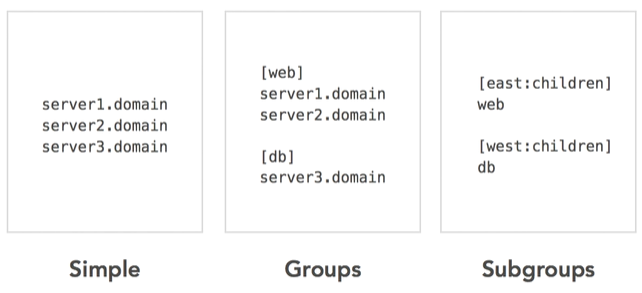
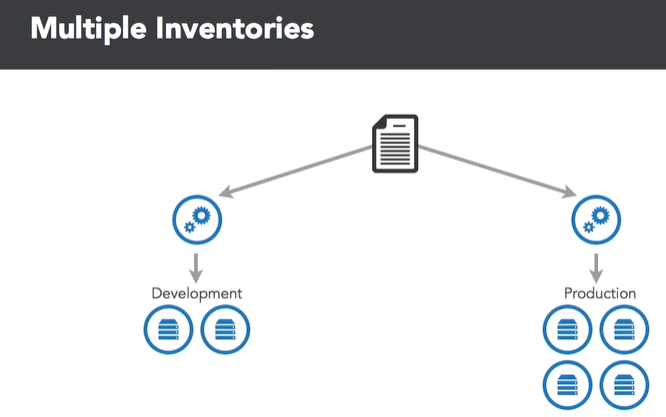
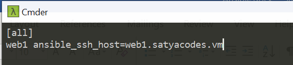
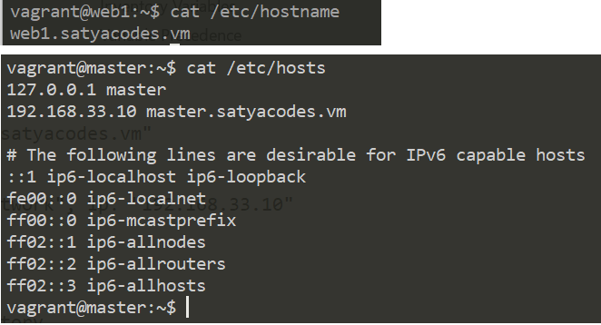
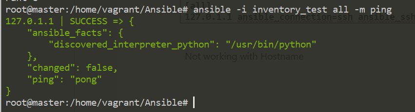

Ansible – Inventory 
====================

Ansible works against multiple managed nodes or “hosts” in your infrastructure
at the same time, using a list or group of lists know as inventory.

-   Inventory file contains list of Nodes & their IP/Hostnames

-   The default location for inventory is a file called **/etc/ansible/host**.

-   You can also specify a different inventory file at the command line using
    the **-i \<path\>** option.

    



### Inventory Hosts Example
```yaml
# /home/vagrant/Ansible/inventory

[all]
web1 ansible_ssh_host=web1.satyacodes.vm
web2 ansible_ssh_host=web2.satyacodes.vm
db1 ansible_ssh_host=db1.satyacodes.vm
db2 ansible_ssh_host=db2.satyacodes.vm

[web]
web1
web2

[db]
db1
db2

[backup]
db2
```
Here we have [Groups], each group have hosts.

<br>

Ansible – Master & Nodes/Hosts Configuration
--------------------------------------------

I have placed a host inside **/home/vagrant/Ansible/inventory_test**



#### Hosts - Changing Hostnames in Ubuntu

If you want to change hostname to - web1.satyacodes.vm then you follow below
steps

Open below files in editor & place hostname inside that.
```powershell
sudo vi /etc/hostname
sudo reboot
```



#### Change Hostname in Vagrant
If you are using Vagrant, Edit vagrant file with
```powershell
config.vm.hostname = "master.satyacodes.vm"

#To chane IP
config.vm.network "private_network", ip: "192.168.33.10"
```


#### Master – configure Hosts IP address with Hostnames

We need to tell our master, while resolving hostname, given
host`(web1.satyacodes.vm)` is pointed to this IP `(192.168.33.11)`. for that
we need to specify IPAddress \<Hostname\> mappings in `/etc/hosts` file
```powershell
#sudo vi /etc/hosts
192.168.33.10 master.satyacodes.vm
192.168.33.11 web1.satyacodes.vm
192.168.33.12 web2.satyacodes.vm
192.168.33.13 db1.satyacodes.vm
192.168.33.14 db2.satyacodes.vm
```


### Test Connection 

So, I have an inventory_test with a single host, which is grouped under **[all]** with a key **web1**
```powershell
# home/vagrant/Ansible/inventory_test
[all]
web1 ansible_ssh_host=web1.satyacodes.vm
```


**Test connection using ping**  
Here Iam trying to connect to machines and run a ping command on nodes using
ansible.
```powershell
ansible -i inventory_test all -m ping

#Output
root@master:/home/vagrant/Ansible# ansible -i inventory_test all -m ping
web1 | UNREACHABLE! => {
    "changed": false,
    "msg": "Failed to connect to the host via ssh: ssh: Could not resolve hostname web1.satyacodes.vm: Name or service not known",
    "unreachable": true
}
```
If you Got above error, means master unable to connect with hosts, because we
haven’t configured SSH / Usernames:password to connect with Hosts.

To connect with Hosts from Ansible Master node, we must configure the Login
mechanism.

we can do this by in two ways

1.  **Username/pwd Authentication**
2.  **SSH Authentication**

#### 1.Username/pwd Authentication
```powershell
# home/vagrant/Ansible/inventory_test
[all]
127.0.1.1 ansible_connection=ssh ansible_ssh_user=vagrant ansible_ssh_pass=vagrant
#Or

# home/vagrant/Ansible/inventory_test
[all]
web1.satyacodes.vm ansible_connection=ssh 
ansible_ssh_user=vagrant ansible_ssh_pass=vagrant
```

`ansible -i inventory_test all -m ping`



Sometimes we get below error.  
`using a ssh password instead of a key is not possible because host key checking
is enabled and sshpass does not s upport this. please add this host's
fingerprint to your known_hosts file to manage this host`

To Resolve this Run,  
`export ANSIBLE_HOST_KEY_CHECKING=False`

Because, this is typically done by setting the following value in
**ansible.cfg**:
```powershell
[defaults]
host_key_checking = False
```


If you don't want to modify **ansible.cfg** you can set an environment variable
like so:  
`export ANSIBLE_HOST_KEY_CHECKING=False`


<br>


#### 2.SSH key Authentication

Generate ssh key in the ansible master, which we have to copy to all the remote
hosts for doing deployments or configurations on them.

To Generate SSH key, run `ssh-keygen`
```powershell
root@master:/home/vagrant/Ansible# ssh-keygen
Generating public/private rsa key pair.
Enter file in which to save the key (/root/.ssh/id_rsa):
/root/.ssh/id_rsa already exists.
Overwrite (y/n)? y
Your identification has been saved in /root/.ssh/id_rsa.
Your public key has been saved in /root/.ssh/id_rsa.pub.
The key fingerprint is:
15:95:ba:2a:3f:d6:92:af:b6:61:a7:f8:ff:76:43:57 root@master
The key's randomart image is:
The key's randomart image is:
+--[ RSA 2048]----+
|         ..     E|
|      .**Boo.. . |
+-----------------+
```

-   Your identification has been saved in /root/.ssh/id_rsa.

-   Your public key has been saved in /root/.ssh/id_rsa.pub.

Now we need copy public key of Ansible Master to its nodes/hosts. Here my host ip is : 192.168.33.11
```powershell
ssh-copy-id -i <user>@<ip address of your node machine>
ssh-copy-id -i vagrant@192.168.33.11
```


If you got Error : **Permission denied
(publickey,gssapi-keyex,gssapi-with-mic).**

-   Go to **/etc/ssh/sshd_config**

-   uncomment **'PasswordAuthentication yes'**

-   re-start the service 'sudo systemctl restart sshd'

Similarly copy MASTER public SSH Key to all the hosts(if you have many hosts )
```powershell
ssh-copy-id -i vagrant@192.168.33.12
ssh-copy-id -i vagrant@192.168.33.13
ssh-copy-id -i vagrant@192.168.33.14
```


To Test, now write an Inventory file & Don’t write Credentials to It.
```powershell
# /home/vagrant/Ansible/inventory_ssh
[all]
web1 ansible_ssh_host=web1.satyacodes.vm
```

Ping above Inventory hosts Using Ansible  
```powershell
ansible -i inventory_ssh all -m ping
```


**Error:Failed to connect to the host via ssh: Permission denied
(publickey,password).**

We must include username  
```powershell
web1 ansible_ssh_host=web1.satyacodes.vm ansible_user=vagrant
```

```powershell
web1 ansible_ssh_host=web1.satyacodes.vm ansible_user=vagrant

> ansible -i inventory_ssh all -m ping
web1 | SUCCESS => {
    "ansible_facts": {
        "discovered_interpreter_python": "/usr/bin/python"
    }, 
    "changed": false, 
    "ping": "pong"
}
```


Once, that is done, you can restart the sshd service on your target server by
running:
`$ service sshd restart`

The next task is to test whether the ssh connection works. From build-server
run:
```powershell
$ ssh username@ip.address.of.host
```


More on Inventory 
------------------

#### Adding variables to inventory

you may add variables directly to the hosts and groups in your main inventory
file.
```powershell
[atlanta]
host1 http_port=80 maxRequestsPerChild=808
host2 http_port=303 maxRequestsPerChild=909
```

Mostly we will use variables, to provide connection details like port, ssh ,username, pwd etc
```
[targets]
localhost              ansible_connection=local
other1.example.com     ansible_connection=ssh        ansible_user=myuser
other2.example.com     ansible_connection=ssh        ansible_user=myotheruser
```

If all hosts in a group share a variable value, you can apply that variable to an entire group at once.
```
[atlanta]
host1
host2

[atlanta:vars]
ntp_server=ntp.atlanta.example.com
proxy=proxy.atlanta.example.com
```


<br>

#### Inventory aliases

You can also define aliases in your inventory
```powershell
web ansible_port=5555 ansible_host=192.0.2.50
```
In the above example, running Ansible against the host alias “web” will connect to 192.0.2.50 on port 5555


<br>

#### Adding ranges of hosts

If you have a lot of hosts with a similar pattern, you can add them as a range,
separated by \` : \`
```powershell
[webservers]
www[01:50].example.com
```


You can also define alphabetic ranges:
```powershell
[databases]
db-[a:f].example.com
```

<br>

#### Using multiple inventory sources

You can target multiple inventory sources at the same time by giving multiple
inventory parameters separated by **-i**.

This can be useful when you want to target separate environments, like staging
and production, at the same time for a specific action. Target two sources from
the command line like this:

```powershell
ansible-playbook get_logs.yml -i staging -i production
```
