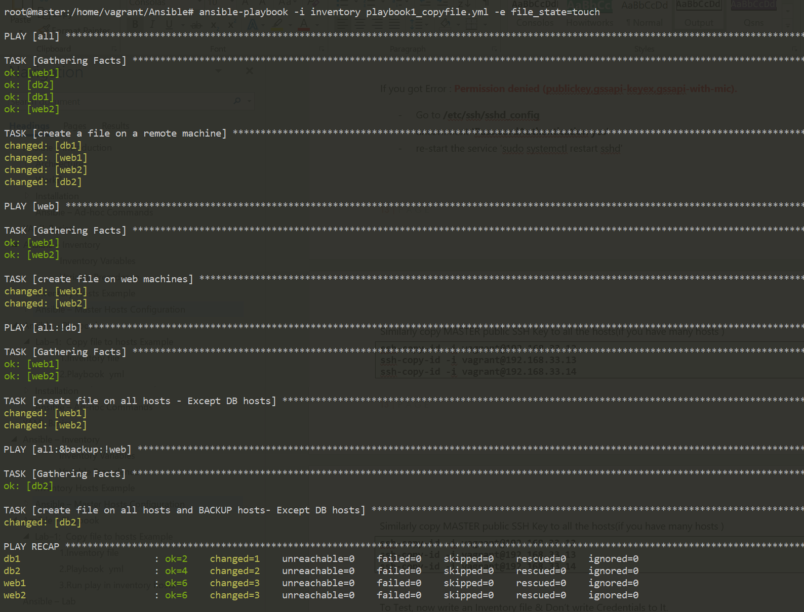
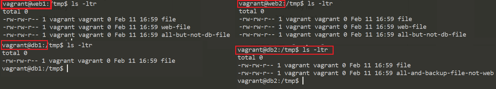

Ansible – Playbook 
===================

Playbooks are Ansible’s configuration, deployment, and orchestration language.
Playbooks can be used to manage configurations of and deployments to remote
machines.

### Playbook Language Example

-   Playbooks are expressed in YAML format.

-   Each playbook is composed of one or more ‘plays’ in a list.

-   Playbooks can contain multiple plays. You may have a playbook that targets
    first the web servers, and then the database servers. 
For example:  

```
---
- hosts: webservers
  remote_user: root

  tasks:
  - name: ensure apache is at the latest version
    yum:
      name: httpd
      state: latest
  - name: write the apache config file
    template:
      src: /srv/httpd.j2
      dest: /etc/httpd.conf

- hosts: databases
  remote_user: root

  tasks:
  - name: ensure postgresql is at the latest version
    yum:
      name: postgresql
      state: latest
  - name: ensure that postgresql is started
    service:
      name: postgresql
      state: started
```


# Playbook Explanation

## Hosts and Users

For each play in a playbook, you get to choose which machines in your
infrastructure to target and what remote user to complete the tasks.
```yaml
---
- hosts: webservers
  remote_user: root
```


Remote users can also be defined per task:
```yaml
---
- hosts: webservers
  remote_user: root
  tasks:
    - name: test connection
      ping:
      remote_user: yourname
```


Ansible Supports for running things as another user is also available, using **become:yes** variable
```yaml
---
- hosts: webservers
  remote_user: yourname
  become: yes
```


You can also login as you, and then become a user different than root:
```yaml
---
- hosts: webservers
  remote_user: yourname
  become: yes
  become_user: postgresql
```


## Tasks

Each play contains a list of tasks. Tasks are executed in order, one at a time,
against all machines matched by the host pattern, before moving on to the next
task.
```yaml
tasks:
  - name: make sure apache is running
    service:
      name: httpd
      state: started
```


-   Every task should have a **name**, which is included in the output from
    running the playbook.

-   The goal of each task is to **execute a module**(in above - its
    \`*service*\`), with very specific arguments. Variables can be used in
    arguments to modules.

-   Tasks can be declared using the legacy **\`action: module options\`**
    format, but it is recommended to use **\`module: options\`** format.

-   Each module may **\`key=value\`** arguments

The command and shell modules are the only modules that just take a list of
arguments.
```yaml
tasks:
  - name: enable selinux
    command: /sbin/setenforce 1

tasks:
  - name: run this command and ignore the result
    shell: /usr/bin/somecommand || /bin/true
```


## Playbook Variables

**Playbook** variables are Similar to YAML dictionaries. To define a variable in
a playbook, simply use the keyword **vars** before writing your variables with
indentation.

To access the value of the variable `{{ variable }}`

Here’s a simple playbook example:
```yaml
- hosts: all
  vars:
    greeting: Hello world! 

  tasks:
  - name: Ansible Basic Variable Example
    debug:
      msg: "{{ greeting }}"
```


# Example: Copy file to hosts Example

-   create a file called tmp/file in all hosts \`-- hosts: all\`

-   create a file only in [web] hosts \`-- hosts: web\`

-   create a file in all hosts, except [db] hosts

-   create a file in all hosts & [backup] hosts, except [web] hosts

-   **Touch** – will create the file if doesn’t exist

-   **Absent** – will remove specified files

#### 1.Inventory file

I have following hosts, which are placed in an Inventory file in this location
**(/home/vagrant/Ansible/inventory**)
```yaml
# /home/vagrant/Ansible/inventory
[all]
web1 ansible_ssh_host=192.168.33.11
web2 ansible_ssh_host=192.168.33.12
db1 ansible_ssh_host=192.168.33.13
db2 ansible_ssh_host=192.168.33.14

[web]
web1
web2

[db]
db1
db2

[backup]
db2
```
Here we have [Groups], each group have hosts


**Test the Connection , by ping**  
Here I’m trying to connect to machines and run a ping command on nodes using
ansible.
```perl
ansible -i inventory all -m ping
```


#### 2.Playbook yml

Remember – all playbooks start with ---(there dashs) because its YAML file. Save
playbook in .yml extension(playbook1_copyfile.yml)
```yaml
---
- hosts: all
  tasks:
  - name: create a file on a remote machine
    file:
      dest: /tmp/file
      state: '{{file_state}}'

- hosts: web
  tasks:
  - name: create file on web machines
    file:
      dest: /tmp/web-file
      state: '{{file_state}}'

- hosts: all:!db
  tasks:
  - name: create file on all hosts - Except DB hosts
    file:
      dest: /tmp/all-but-not-db-file
      state: '{{file_state}}'

- hosts: all:&backup:!web
  tasks:
  - name: create file on all hosts and BACKUP hosts- Except DB hosts
    file:
      dest: /tmp/all-and-backup-file-not-web
      state: '{{file_state}}'
```

**{{file_state}}** - we are passing `{{file_state}}` variable at RUNTIME


#### 3.Run play in inventory hosts

Syntax:
```yaml
ansible-playbook -i <inventory_file> <playbook_yml_file>.yml -e <envi_varible>=<value>
```


`ansible-playbook -i inventory playbook1_copyfile.yml -e file_state=touch`




Login to each node, check files created under /tmp/ folder



Reusable Playbooks
------------------

In Ansible, we have three ways to reuse playbooks

1.  includes

2.  imports

3.  roles

**Includes and imports** allow users to break up large playbooks into smaller
files, which can be used across multiple parent playbooks or even multiple times
within the same Playbook.

**Roles** allow more than just tasks to be packaged together and can include
variables, handlers, or even modules and other plugins. Unlike includes and
imports, roles can also be uploaded and shared via Ansible Galaxy.

You can then use **import_tasks** or **include_tasks** to execute the tasks in a
file in the main task list:
```yaml
tasks:
- import_tasks: common_tasks.yml
# or
- include_tasks: common_tasks.yml
```


**Importing Playbooks**   
It is possible to include playbooks inside a master
playbook. For example:
```yaml
- import_playbook: webservers.yml
- import_playbook: databases.yml
```


**Roles** are ways of automatically loading certain vars_files, tasks, and
handlers based on a known file structure. Grouping content by roles also allows
easy sharing of roles with other users.

Role Directory Structure
```
## Example project structure:

site.yml
webservers.yml
fooservers.yml
roles/
    common/
        tasks/
        handlers/
        files/
        templates/
        vars/
        defaults/
        meta/
    webservers/
        tasks/
        defaults/
        meta/
```

Roles expect files to be in certain directory names. Roles must include at least
one of these directories, however it is perfectly fine to exclude any which are
not being used. When in use, each directory must contain a **main.yml** file,
which contains the relevant content:
