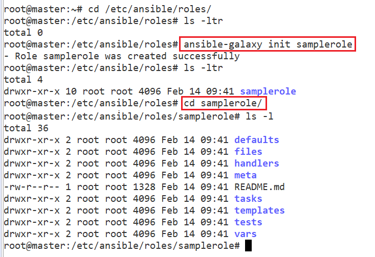
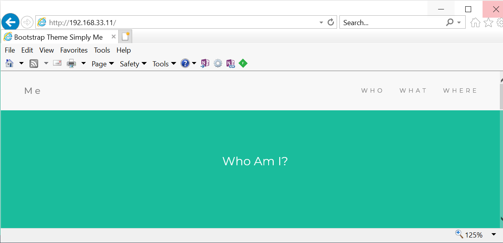

Ansible – Roles 
================

-   In Ansible, the role is the primary mechanism for breaking a playbook into
    multiple files. This simplifies writing complex playbooks, and it makes them
    easier to reuse.

-   If you need to perform 10 different tasks on 5 different systems. creating
    single playbook with 10 lengthy tasks, will make reading playbook confuse.
    To avoid this Create 10 different Roles , call them in Playbook

-   Roles are not playbooks. Roles are small functionality which can be
    independently used but must be used within playbooks.

-   There is no way to directly execute a role. Roles have no explicit setting
    for which host the role will apply to.

-   Playbook is a collection of Roles

-   Each Role will have a Specific functionality

-   Ansible Roles are Independent on each other.

## Create Ansible Role

To create role, we have **ansible-galaxy** which is comes inbuilt with ansible.
We have to place roles inside **/etc/ansible/roles folder**

Syntax  
`ansible-galaxy init <rolename>`


### Directory Structure of Ansible Role

If you create a sample role , you will see following directory structure inside
it.

`ansible-galaxy init samplerole`



Here is a description of what each directory represents:

-   **defaults**: This directory lets you set default variables for included or
    dependent roles. Any defaults set here can be overridden in playbooks or
    inventory files.

-   **files**: This directory contains static files and script files that might
    be copied to or executed on a remote server.

-   **handlers**: All handlers that were in your playbook previously can now be
    added into this directory.

-   **meta**: This directory is reserved for role metadata, typically used for
    dependency management. For example, you can define a list of roles that must
    be applied before the current role is invoked.

-   **templates**: This directory is reserved for templates that will generate
    files on remote hosts. Templates typically use variables defined on files
    located in the vars directory, and on host information that is collected at
    runtime.

-   **tasks**: This directory contains one or more files with tasks that would
    normally be defined in the tasks section of a regular Ansible playbook.
    These tasks can directly reference files and templates contained in their
    respective directories within the role, without the need to provide a full
    path to the file.

-   **vars**: Variables for a role can be specified in files inside this
    directory and then referenced elsewhere in a role.

## Example : Install MEAN stack with Ansible Roles

We need to create

**1. Four Roles**

-   Role for Installing pre-requisites

-   Role for Installing Node.js

-   Role for Installing MongoDB

-   Role for Installing nginx & Deploying index.html

**2. One Playbook**

<br>


## 1.Creating Roles

All roles will be created under : `/etc/ansible/roles/`

<u>a)Role for Installing pre-requisites</u>

**create \`prereq\` role**  
`ansible-galaxy init prereq`


**create \`main.yml\` - tasks to install GIT**  
Once Role is created go to role folder & then task folder & create tasks inside
an yaml file(ex: main.yml)

```yaml
# /etc/ansible/roles/prereq/tasks/main.yml
---
- name: Install git
  apt:
    name: git
    state: present
    update_cache: yes
```


<u>b) Role for Installing Node.js</u>  

**create \`nodejs\` role**  
`ansible-galaxy init nodejs`


**create \`main.yml\` - tasks to install Node.js**
```yaml
# /etc/ansible/roles/nodejs/tasks/main.yml
---
# tasks file for nodejs
- name: Node.js - Get script
  get_url:
    url: "http://deb.nodesource.com/setup_6.x"
    dest: "{{ var_node }}/nodejs.sh"

- name: Node.js - Set execution permission to script
  file:
    path: "{{ var_node }}/nodejs.sh"
    mode: "u+x"

- name: Node.js - Execute installation script
  shell: "{{ var_node }}/nodejs.sh"

- name: Node.js - Remove installation script
  file:
    path: "{{ var_node}}/nodejs.sh"
    state: absent

- name: Node.js - Install Node.js
  apt: name={{ item }} state=present update_cache=yes
  with_items:
    - build-essential
    - nodejs

- name: Node.js - Install bower and gulp globally
  npm: name={{ item }} state=present global=yes
  with_items:
    - bower
    - gulp
```


<u>c) Role for Installing MongoDB</u>

**create \`mongodb\` role**
```yaml
ansible-galaxy init mongodb
```

**create \`main.yml\` - tasks to install MongoDB**  
To setup the mongodb playbook we will do the following inside the playbook:

-   Import the mongodb public key

-   Add mongodb repository

-   Install mongodb

-   mongodb running status

```yaml
---
# tasks file for mongodb
- name: MongoDB - Import public key
  apt_key:
    keyserver: hkp://keyserver.ubuntu.com:80
    id: EA312927

- name: MongoDB - Add repository
  apt_repository:
    filename: '/etc/apt/sources.list.d/mongodb-org-3.2.list'
    repo: 'deb http://repo.mongodb.org/apt/ubuntu trusty/mongodb-org/3.2 multiverse'
    state: present
    update_cache: yes

- name: MongoDB - Install MongoDB
  apt:
    name: mongodb-org
    state: present
    update_cache: yes
    force: yes

- name: Start mongod
  shell: "mongod &"
```


<u>d)Role for Installing Nginx & index.html</u>  

**create \`nginx\` role**  
`ansible-galaxy init nginx`


create \`main.yml\` - tasks to install nginx
```yaml
create `main.yml` - tasks to install nginx
---
# tasks file for nginx
- name: Install nginx with latest version
  apt: name=nginx state=present update_cache=true force=yes
- name: Insert Index Page
  template:
      src: /tmp/index.html
      dest: /usr/share/nginx/html/index.html
- name: start nginx
  service:
      name: nginx
      state: started
```


## Main Playbook Creation

```yaml
#cd /etc/ansible/meanply.yml

---
- hosts: all
  remote_user: vagrant
  become: yes
  become_method: sudo
  vars:
    #variable needed during node installation
    var_node: /tmp
  roles:
      - prereq
      - nodejs
      - mongodb
      - nginx
```

## Update Hosts Inventory
we have placed single node in default host file.
```yaml
#/etc/ansible/hosts
192.168.33.11
```


## Run The playbook
```yaml
sudo ansible-playbook /etc/ansible/meanply.yml -K
```

```powershell
PLAY [all] *********************************************************************************

TASK [Gathering Facts] ****************************************************************************
ok: [192.168.33.11]

TASK [prereq : Install git] ***********************************************************************
ok: [192.168.33.11]

TASK [nodejs : Node.js - Get script] **************************************************************
changed: [192.168.33.11]

TASK [nodejs : Node.js - Set execution permission to script] **************************************
changed: [192.168.33.11]

TASK [nodejs : Node.js - Execute installation script] *********************************************
changed: [192.168.33.11]

TASK [nodejs : Node.js - Remove installation script] **********************************************
changed: [192.168.33.11]

TASK [nodejs : Node.js - Install Node.js] *********************************************************
ok: [192.168.33.11] => (item=[u'build-essential', u'nodejs'])

TASK [nodejs : Node.js - Install bower and gulp globally] *****************************************
ok: [192.168.33.11] => (item=bower)
ok: [192.168.33.11] => (item=gulp)

TASK [mongodb : MongoDB - Import public key] ******************************************************
ok: [192.168.33.11]

TASK [mongodb : MongoDB - Add repository] *********************************************************
ok: [192.168.33.11]

TASK [mongodb : MongoDB - Install MongoDB] ********************************************************
ok: [192.168.33.11]

TASK [mongodb : Start mongod] *********************************************************************
changed: [192.168.33.11]

TASK [nginx : Install nginx with latest version] **************************************************
ok: [192.168.33.11]

TASK [nginx : Insert Index Page] ******************************************************************
ok: [192.168.33.11]

TASK [nginx : start nginx] ************************************************************************
ok: [192.168.33.11]

PLAY RECAP ****************************************************************************
192.168.33.11 : ok=15   changed=5    unreachable=0    failed=0    skipped=0
```

Check Nginx Server


