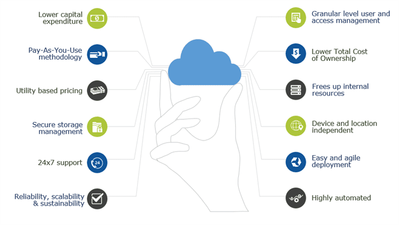
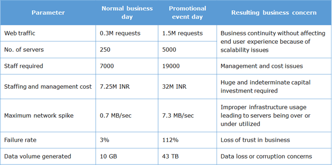
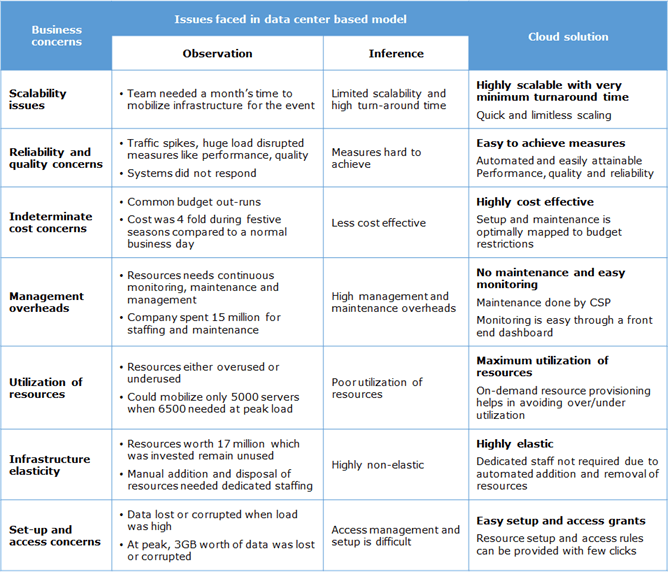
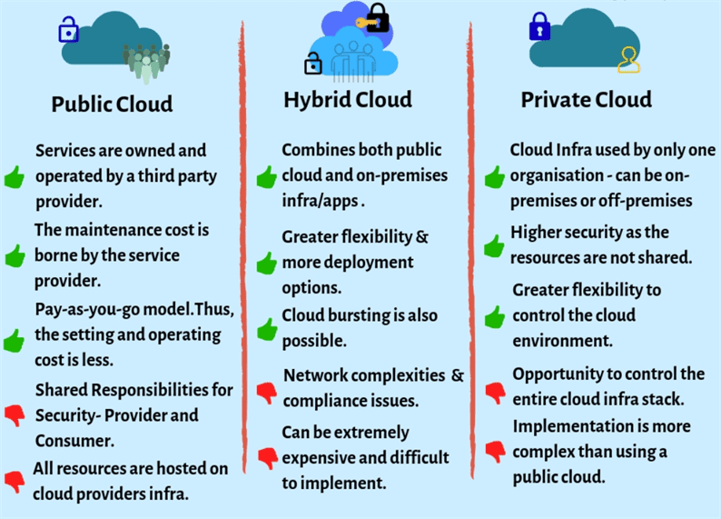
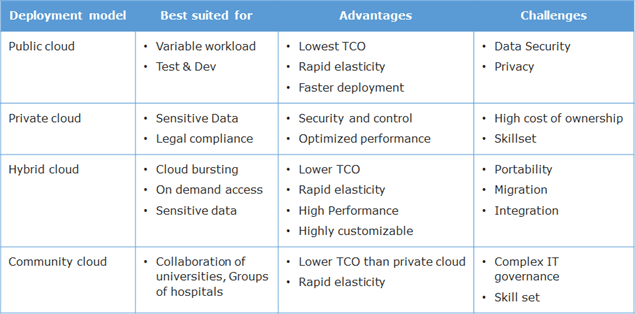
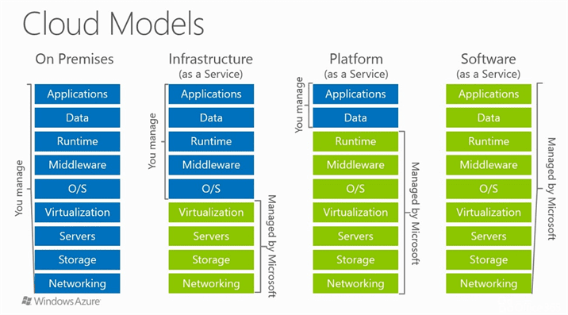
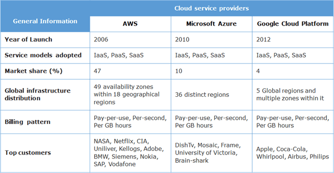
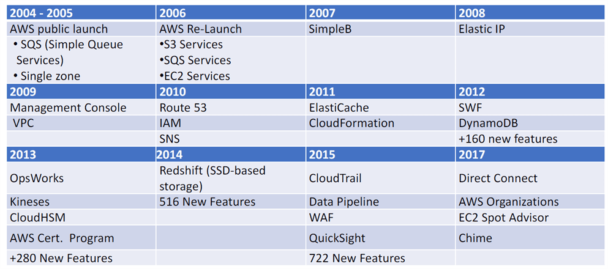
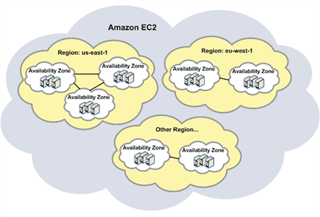
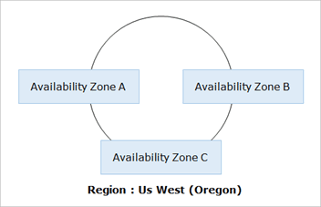

Amazon Web Services
===================

Cloud computing offers dynamic provisioning of resources based on demand, on a
**pay-as-you-use** pricing. Instead of physical servers, cloud computing helps
to spin out virtual servers. With dynamic scaling and load balancing features of
cloud, long term planning is not necessary.

Why Cloud?
----------

Amazon.com's Great Indian Festival or Flipkart's Big Billion Day, they also
declare intermittent offer days.

Types of Cloud Infrastructure
-----------------------------

Types of Cloud Services
-----------------------

AWS History
-----------

**Amazon Web Services**(AWS) is a low-cost cloud service platform from Amazon,
which provides services such as compute, storage, networking, CDN services etc
to users. All AWS services are exposed as web services accessible from anywhere,
any time, on a pay per use pricing model.

AWS services can be managed through a web-based management console, command line
interface (CLI) or software development kits (SDK). With AWS, you can provision
resources in seconds and build applications without upfront capital investment.

### Global Infrastructure

**Region**

-   is a physical location spread across globe to host your data 

-   In each region, there will be at least two availability zones for fault
    tolerance

-   Regions are separate from one another

-   Enterprises can choose to have their data in a specific region

**Availability zones**

-   Availability zones are analogous to clusters of datacenters

-   Availability zones are connected through redundant low-latency links

-   These AZs offer scalable, fault tolerant and highly-available architecture

    

Most of the AWS services are region dependent and only a few are region
independent. Few services may not be available in all the regions. So, while
determining a region to push the workloads, the following parameters to be
considered.

-   Availability of required services

-   Cost

-   Latency

-   Security & Compliance

-   Service Level Agreements(SLAs)
