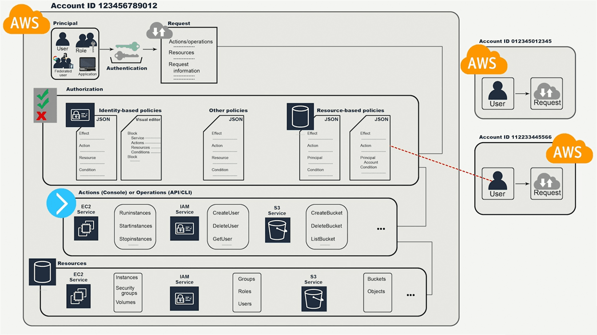

AWS - Identity and Access Management (IAM)
==========================================

**AWS Identity and Access Management (IAM)** is a web service that enables
Amazon Web Services (AWS) customers to manage users and user permissions in
AWS. 

**AWS Identity and Access Management (IAM) can be used to:**

-   **Manage IAM Users and their access:** You can create Users and assign them
    individual security credentials (access keys, passwords, and multi-factor
    authentication devices). You can manage permissions to control which
    operations a User can perform.

-   **Manage IAM Roles and their permissions:** An IAM Role is similar to a
    User, in that it is an AWS identity with permission policies that determine
    what the identity can and cannot do in AWS. However, instead of being
    uniquely associated with one person, a Role is intended to be *assumable* by
    anyone who needs it.

-   **Manage federated users and their permissions:** You can enable *identity
    federation* to allow existing users in your enterprise to access the AWS
    Management Console, to call AWS APIs and to access resources, without the
    need to create an IAM User for each identity.

### Authentication

-   authentication is really the validation of credentials

-   Authentication in AWS done below ways

    -   WEBUI - User name and password

    -   API, CLI - Access key and secret key

When connecting to AWS programmatically with APIs, an access key and secret key
are used. Additionally, these keys can be used for CLI access.
