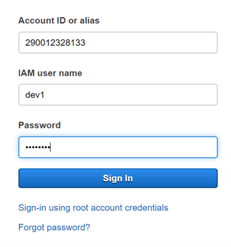
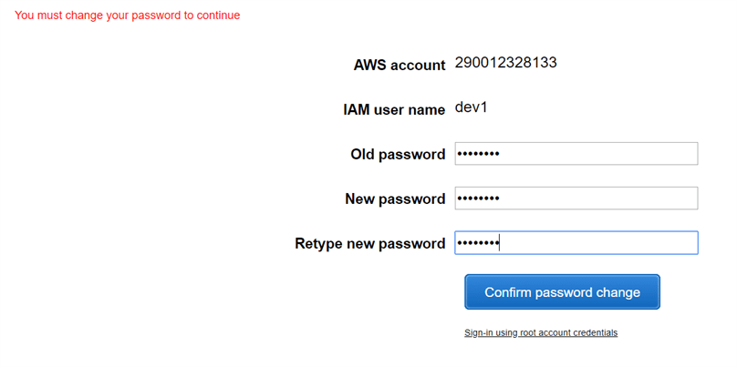
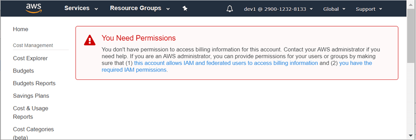
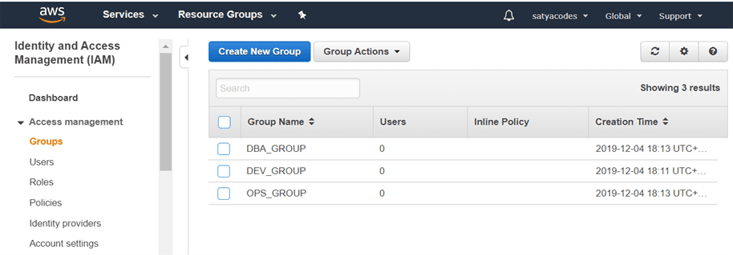
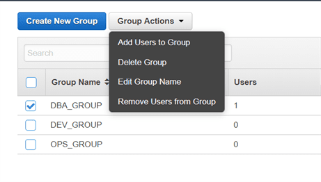
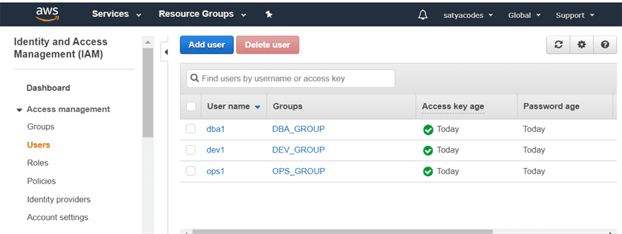
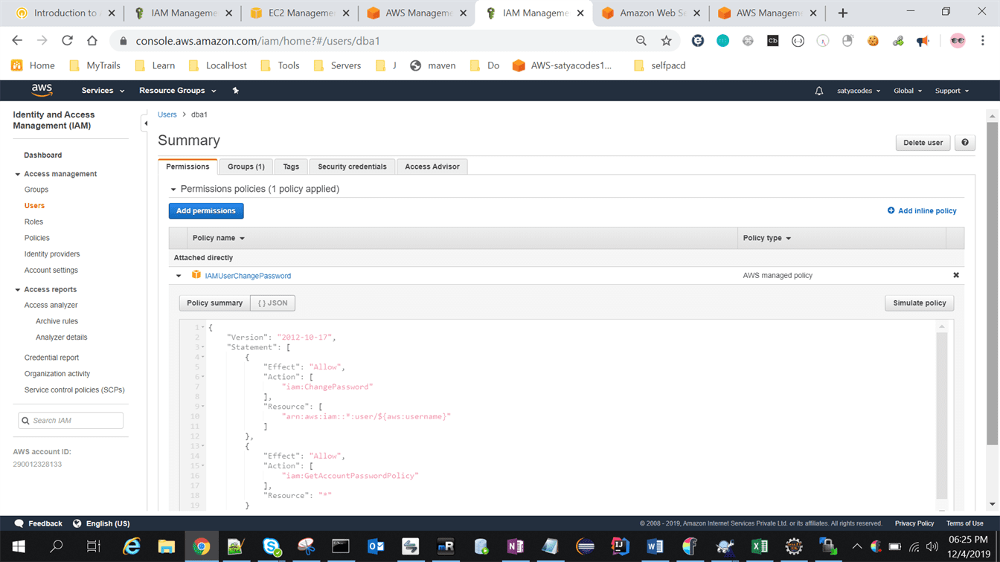

Lab 2 – Create Users & Groups and apply policies
================================================

Scenario : I have newly Started an IT Company called "SatyaCodes", newly
recruited below Users  
**Users - [dev1, dev2, dev3], [dba1, dba2], [ops1, ops2]**

Create All above users  
**Groups - [DEV_GROUP, DBA_GROUP, OPS_GROUP]**

- Each User should be part of their respective Groups

- Each Group/User should have respective Policy

| **Policies** | **S3** | **DynamoDB** | **VPC** |
|--------------|--------|--------------|---------|
| DEV_Policy   | Full   | Read         | NO      |
| DBA_Policy   | READ   | FULL         | NO      |
| OPS_Policy   | READ   | READ         | FULL    |

# Users Creation

**Users - [dev1, dev2, dev3], [dba1, dba2], [ops1, ops2]**

1.  In the **AWS Management Console**, on the **Services** menu, click **IAM**.

2.  on the left, click **Users**.

3.  Add user – - [dev1, dev2, dev3], & it will gives access keys as well

4.  Login with created users

1.  It will redirect to change password page

1.  It will show the newly created User dashboard & if we try to access anything
    it will show error message , because you were not part of any Group/Policy

    

# Groups Creation

Click On Groups from left > Add Group ([DEV_GROUP, DBA_GROUP, OPS_GROUP]) >
Skip policy for Now

Select Each group & add Users to It

Now Click on Users Tab – Groups will be updated.

# Policies

Policies nothing but permissions – what type of permissions user have for the
particular service.

Each Group/User should have respective Policy

| **Policies** | **S3** | **DynamoDB** | **VPC** |
|--------------|--------|--------------|---------|
| DEV_Policy   | Full   | Read         | NO      |
| DBA_Policy   | READ   | FULL         | NO      |
| OPS_Policy   | READ   | READ         | FULL    |

By default all Users have **IAMUserChangePassword** policy, that’s why users are
navigating to change password page after first login.

