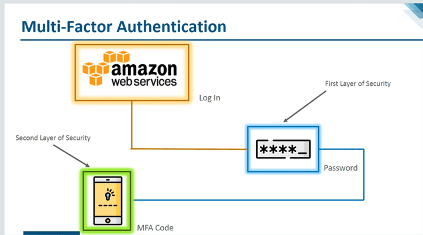
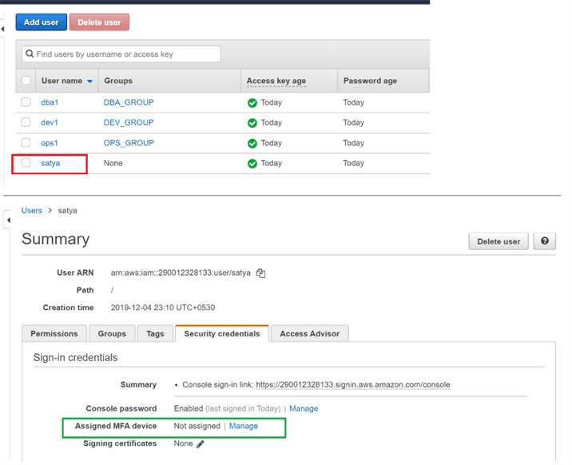
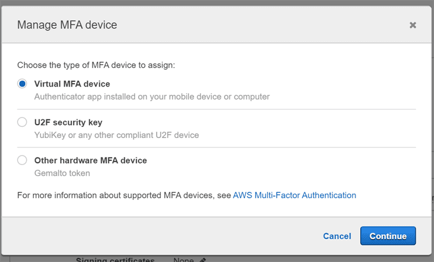
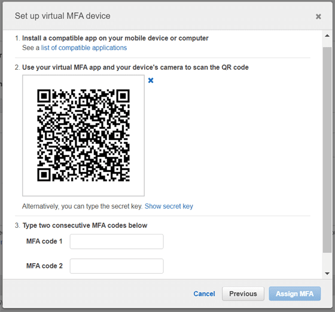
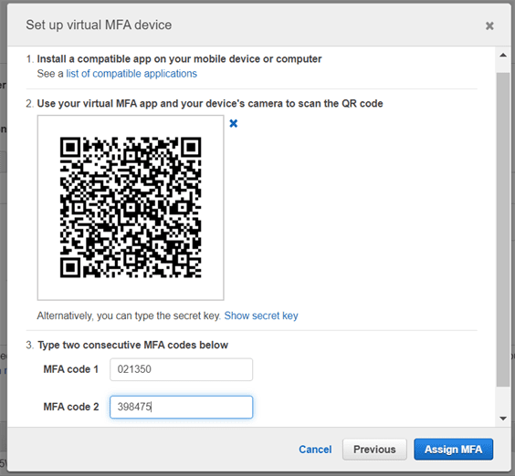
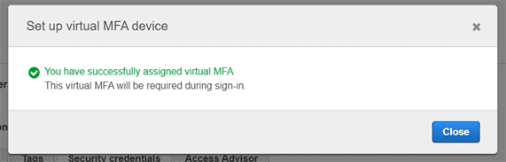
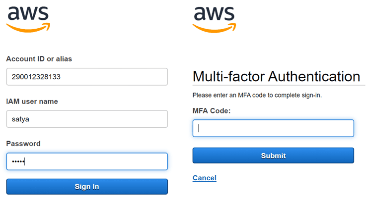
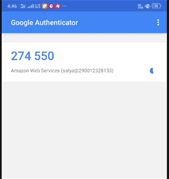

Lab 4 – MFA : Multifactor Authentication
========================================

I want to assign Multifactor authentication to user “satya”

Install [Google
Authenticator](https://play.google.com/store/apps/details?id=com.google.android.apps.authenticator2)
on your mobile.

1.Go to Users : Select User> Security > Assign MFA – Manage

2.Select Virtual MFA Device

3.Select – Show QR code

4.open Google Authenticator App > Scan a bar Code > Scan AWS bar code > Enter
Codes 1,2

5.Now Logout, and try to Login again

6.it will ask for MFA & enter code from Google Authenticator app

7.Now it will navigate to your dashboard.
