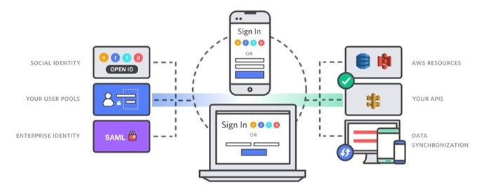

Cognito
=======

Amazon Cognito lets you add user sign-up, sign-in, and access control to your
web and mobile apps quickly and easily. Amazon Cognito scales to millions of
users and supports sign-in with social identity providers, such as Facebook,
Google, and Amazon, and enterprise identity providers via SAML 2.0.

<https://www.youtube.com/watch?v=N-RpYY5o8bI>
