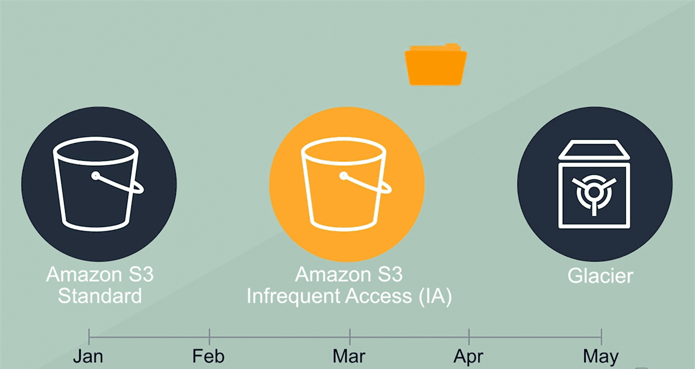

S3 Features
===========

Buckets are a universal namespace, i.e., the bucket names must be unique.

-   If uploading of an object to S3 bucket is successful, we receive a HTTP 200
    code.

-   S3, S3-IA, S3 Reduced Redundancy Storage are the storage classes.

-   Encryption is of two types, i.e., Client-Side Encryption and Server Side
    Encryption

-   Access to the buckets can be controlled by using either ACL (Access Control
    List) or bucket policies.

-   By default buckets are private and all the objects stored in a bucket are
    also private

#### Prefixes and delimiters

-   Making files in S3 is Organized

-   When you create a folder in an S3 bucket, It is actually creates   Prefix(/)"

#### Storage classes

#### Object lifecycle management

Select Bucket > Move to the **Management** tab >lifecycle > Add lifecycle
rule

 Check the **current version** and then click on the **Add transition**

-   First transition: After 50 days, object's storage class is converted to
    Standard Infrequently

-   Second transition: After 90 days, storage class is converted to Glacier
    storage class.

#### Encryption

-   Server-side Encryption

-   Client-Side Encryption

#### versioning 

Versioning automatically keeps up with different versions of the same object.
For example, say that you have an object (object1) currently stored in a bucket.
With default settings, if you upload a new version of object1 to that bucket,
object1 will be replaced by the new version. 

#### Cross region Replication

Cross-region Replication** **enables user to either replicate or transfer data
to some other location securely and at a faster rate.

AWS has 2 ways to provide data transfer securely and at a faster rate:

-   CloudFront Transfer Acceleration

-   Snowball

**CloudFront** is a caching service by AWS, in which the data from client site
gets transferred to the nearest edge location and from there the data is routed
to your AWS S3 bucket over an optimized network path. 

**Snowball** is a way of transferring your data physically. In this Amazon sends
an equipment to your premises, on which you can load the data.

It has a kindle attached to it which has your shipping address when it is
shipped from Amazon. When data transfer is complete on the Snowball, kindle
changes the shipping address back to the AWS headquarters where the Snowball has
to be sent. 

