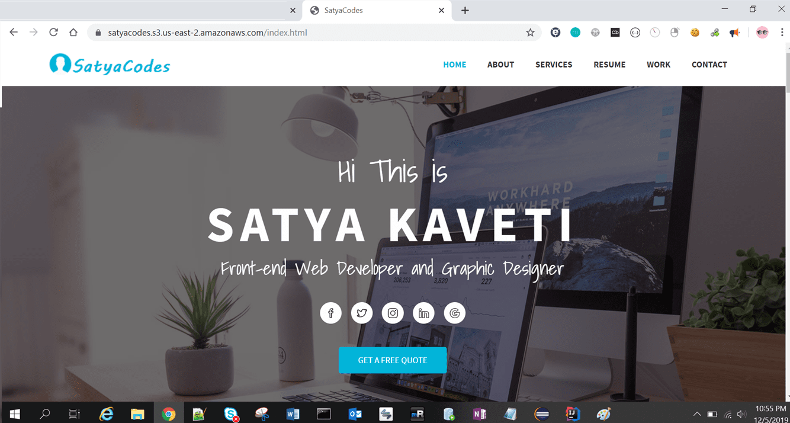

Lab 3 – Hosting a Static Website on Amazon S3
=============================================

1.Create a bucket with domain name recommended.

2. Enable Static Website Hosting from the properties panel on the right.

\- set index.html & save

3. Upload the Files in a Bucket

4. Make the Html File Public – unselect Block public access

Select files \> Actions \> Make files public

5. Now, select index.html in the console and go to the Properties tab

6. Clicking the link will take you to your new homepage

<https://satyacodes.s3.us-east-2.amazonaws.com/index.html>

