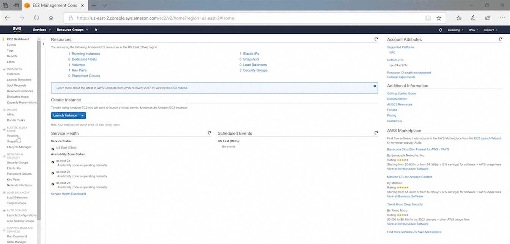
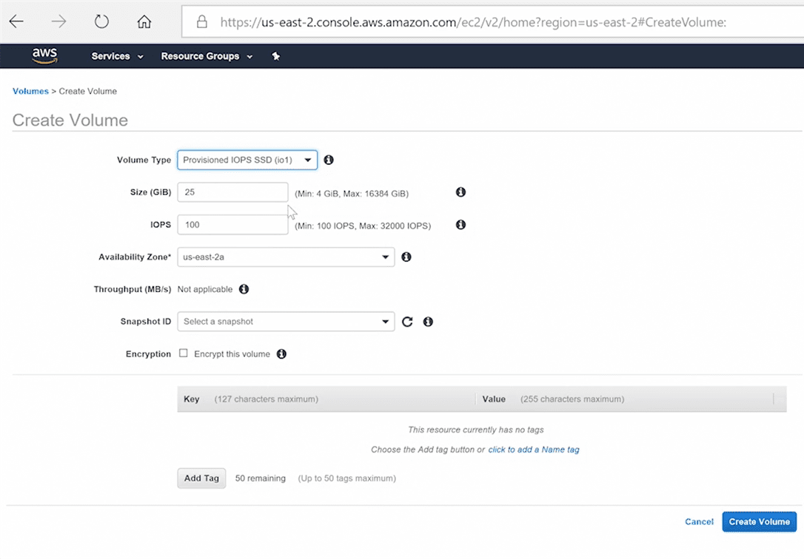
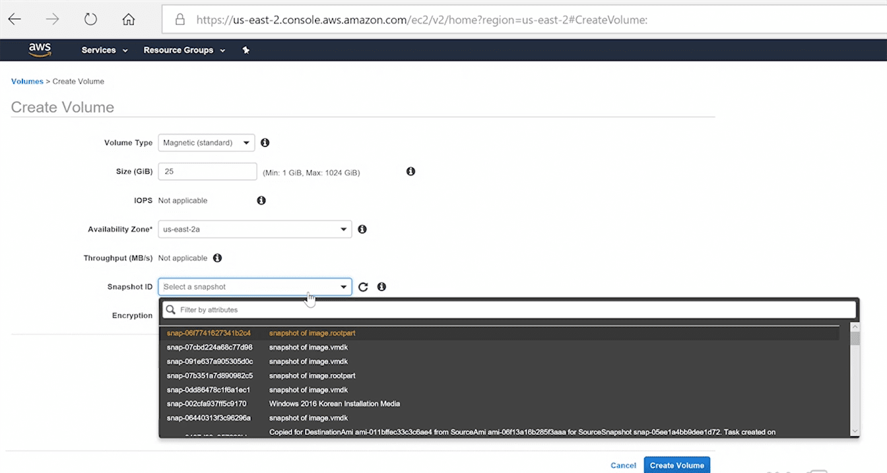
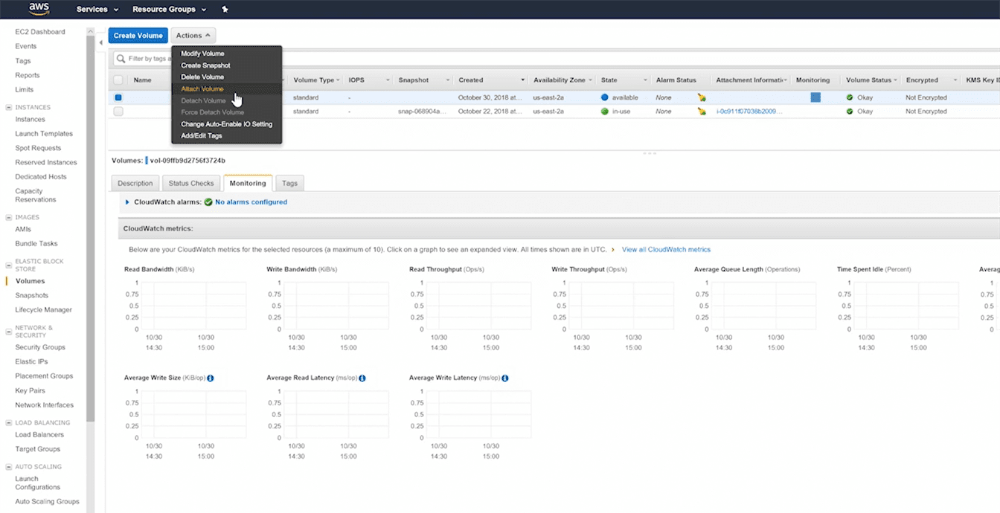

Elastic Block Store (EBS)
=========================

We use USB's, Hard Disks to save/retrieve data in our Laptops& computers.
Similarly, AWS instances uses EBS for that purpose, Block by Block

-   Used for durable(saving state) storage in EC2 instances

-   Block level storage from one AWS service to another

EBS comes under “Compute", because we use along with instances

### EBS Volume Types

-   Magnetic -Lowest cost & slowest

-   SSD (solid state drive) - Fast, below are various types

    -   General purpose

    -   Provisioned IOPS(input/output operations per second )

    -   PIOPS (provisioned input/output operations per second)

### EBS Data Recovery

-   Snapshots - Creating Image with Current State.

-   Volume recovery - Attaching volumes from one instance to another

Lab
---

EBS comes under “Compute", because we use along with instances

